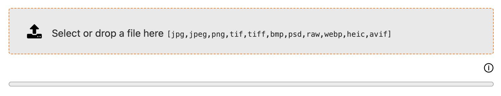

# Service Upload

Manages file upload tasks for Dédalo sections, areas and tools.  

## Use

Upload service is used in different scenarios, it can handle 1 file at a time, the service is file format agnostic, so it is possible to set the extensions allowed, the service can chunk files in scenarios where the size of the uploaded files is controlled (as maximum upload 100MB).

Sample of use:

``` js
// import instances module
import * as instances from '../../../core/common/js/instances.js'

// init
const service_upload = await instances.get_instance({
    model               : 'service_upload',
    allowed_extensions  : ['jpg','jpeg','png','tif','tiff','bmp','psd','raw','webp','heic','avif'],
    mode                : 'edit',
    id_variant          : 'my_service', // optionally set to prevent id collisions
    caller              : self // object mandatory, normally a component, tool or section instance
})

// build
await service_upload.build()

// render
const service_node = await service_upload.render()

// Place it
my_container_node.appendChild(service_node)
```

Preview

{ width="400" align=center }

## Events

### ✅ upload_file_done  

When the upload is finished, 'upload_file_done' event is fired, passing resulting file data information.  
Usually, this response is used on the server to start processing the uploaded file.

!!! note "name: composition of 'upload_file_done_' + caller.id"  
    sample: 'upload_file_done_tool_dev_template_dd1353_dd1324_edit_lg-eng'

sample event response

```json
{
    "file_data": {
        "name": "my_file.zip",
        "type": "application/octet-stream",
        "tmp_dir": "DEDALO_UPLOAD_TMP_DIR",
        "key_dir": "component_geolocation",
        "tmp_name": "tmp_my_file.zip",
        "error": 0,
        "size": 227802,
        "time_sec": "0.002",
        "extension": "zip",
        "thumbnail_url": "/dedalo/media/.../thumbnail/tmp_my_file.jpg",
        "chunked": true,
        "total_chunks": "1",
        "chunk_index": "0"
    }
}
```

### Client side handle

calling server from tool to handle upload file:  
Once file upload is finished, the file is ready in a server side temporal directory. Now you can move it or process it by calling a custom server action (from tool for example).

``` js
// handle upload file to fire a server process from a tool:
    // import the required modules
    import {create_source} from '../../../core/common/js/common.js'
    import {data_manager} from '../../../core/common/js/data_manager.js'

    // subscribe to the service upload file done
    event_manager.subscribe('upload_file_done_' + self.id, fn_upload_done)

    // function to handle the event trigger
    function fn_upload_done(response) {
        // rqo (build request query objet for call API)
        const rqo = {
            dd_api  : 'dd_tools_api',
            action  : 'tool_request',
            source  : create_source(self, 'handle_upload_file'),
            options : {
                component_tipo  : self.main_element.tipo,
                section_id      : self.main_element.section_id,
                section_tipo    : self.main_element.section_tipo,
                config          : self.context.config,
                file_data       : response.file_data
            }
        }

        // exec API call
        const api_response = await data_manager.request({
            body : rqo
        })
    }
```

### Server side handle

re-building the file path in server side:  

``` php
// compound full path of the upload file like: 
// '/dedalo/media/upload/service_upload/tmp' .'/'. '1' . '/' . 'component_geolocation' .'/'. 'tmp_my_file.zip'
$base_path = DEDALO_UPLOAD_TMP_DIR // /dedalo/media/upload/service_upload/tmp (config constant)
$user_id   = get_user_id(); // 1 (current logged user in session)
$key_dir   = $file_data->key_dir; // component_geolocation (normally, caller model from service_upload)
$file_name = $file_data->tmp_name; // tmp_my_file.zip (renamed temporal name)
$full_path = $base_path . '/' . $user_id . '/' . $key_dir . '/' . $file_name;
```
