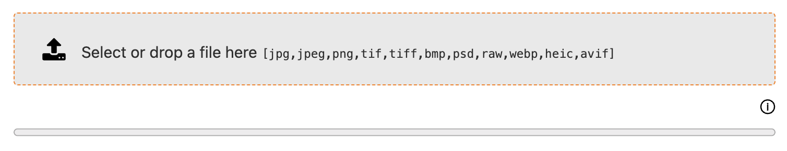

# Service Upload

> See also: [Services](index.md) · [Add a service](../extending/add_a_service.md) · [Media pipeline](../media_pipeline.md)

Manages file-upload tasks for Dédalo sections, areas and tools.

## Use

The upload service is used in several scenarios. It handles one file at a time and is file-format agnostic, so you can set the allowed extensions. It can also chunk files where the upload size must be controlled (the max accepted size is a server config value — `DEDALO_UPLOAD_MAX_SIZE_BYTES`, 2 GB by default — reported to the client via `get_system_info` so it can reject oversize files before transfer).

Sample usage:

``` js
// import instances module
import * as instances from '../../../core/common/js/instances.js'

// init
const service_upload = await instances.get_instance({
    model               : 'service_upload',
    allowed_extensions  : ['jpg','jpeg','png','tif','tiff','bmp','psd','raw','webp','heic','avif'],
    mode                : 'edit',
    id_variant          : 'my_service', // optionally set to prevent id collisions
    caller              : self // object mandatory, normally a component, tool or section instance
})

// build
await service_upload.build()

// render
const service_node = await service_upload.render()

// Place it
my_container_node.appendChild(service_node)
```

Preview

{ width="400" align=center }

## Events

### ✅ upload_file_done  

When the upload is finished, 'upload_file_done' event is fired, passing resulting file data information.  
Usually, this response is used on the server to start processing the uploaded file.

!!! note "name: composition of 'upload_file_done_' + caller.id"  
    sample: 'upload_file_done_tool_dev_template_dd1353_dd1324_edit_lg-eng'

sample event response (as returned by the multipart upload endpoint, `src/core/media/ingest/upload_endpoint.ts` → `handleMediaUpload`)

```json
{
    "file_data": {
        "key_dir": "component_geolocation",
        "tmp_name": "my_file.zip",
        "extension": "zip",
        "chunked": true,
        "chunk_index": 0,
        "total_chunks": 1,
        "complete": true
    }
}
```

`chunk_index`/`total_chunks` are echoed back on every chunk so the client's own counter (`files_chunked[chunk_index] = tmp_name`) knows when to fire `join_chunked_files_uploaded`; the join re-assembles the parts and re-sniffs the whole file's magic bytes (SEC-066) before it is usable server-side.

### Client side handle

calling server from tool to handle upload file:  
Once file upload is finished, the file is ready in a server side temporal directory. Now you can move it or process it by calling a custom server action (from tool for example — `tool_upload`'s own `process_uploaded_file_controller` does exactly this).

``` js
// handle upload file to fire a server process from a tool:
    // import the required modules
    import {create_source} from '../../../core/common/js/common.js'
    import {data_manager} from '../../../core/common/js/data_manager.js'

    // subscribe to the service upload file done
    event_manager.subscribe('upload_file_done_' + self.id, fn_upload_done)

    // function to handle the event trigger
    function fn_upload_done(response) {
        // rqo (build request query objet for call API)
        const rqo = {
            dd_api  : 'dd_tools_api',
            action  : 'tool_request',
            source  : create_source(self, 'process_uploaded_file'),
            options : {
                component_tipo  : self.main_element.tipo,
                section_id      : self.main_element.section_id,
                section_tipo    : self.main_element.section_tipo,
                config          : self.context.config,
                file_data       : response.file_data
            }
        }

        // exec API call
        const api_response = await data_manager.request({
            body : rqo
        })
    }
```

### Server side handle

The `dd_tools_api` `tool_request` dispatch routes `process_uploaded_file` to `tools/tool_upload/server/index.ts`, whose handler calls `processUploadedFile()` (`src/core/media/ingest/process_uploaded_file.ts`). That in turn calls `addFile()` (`src/core/media/ingest/add_file.ts`), which **rebuilds the staged path server-side** and never trusts a client-supplied path:

``` ts
// stagingDir() in src/core/media/ingest/add_file.ts — the staging root for a
// user + key_dir. Compounds to something like:
// '<media_root>/upload/service_upload/tmp/1/component_geolocation/my_file.zip'
const root    = requireMediaRoot(mediaRoot)              // media root (config.media.rootPath)
const safeKey = sanitizeSegment(keyDir)                  // 'component_geolocation' — rejects '..', '/', NUL, etc.
const dir     = resolve(root, config.media.upload.tmpSubdir, String(userId), safeKey)
// dir is then confined (realpath-style) to the staging subtree before any file op.

// addFile() resolves the staged source under `dir`, re-validates the extension
// against the component's type allowlist, backs up any existing target
// (rename_old_files), and moves the file into the original-quality dir.
```

Every path segment (`key_dir`, `tmp_name`, the user id) is sanitized and the final path is confined inside the staging root — a client can never smuggle a traversal or an absolute path through `file_data` (SEC-063).
