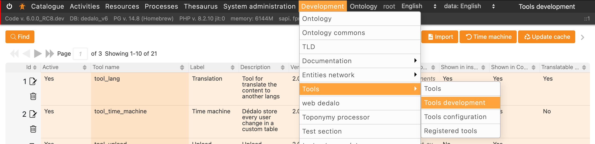
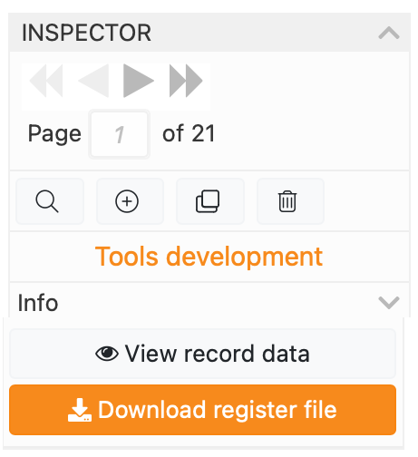
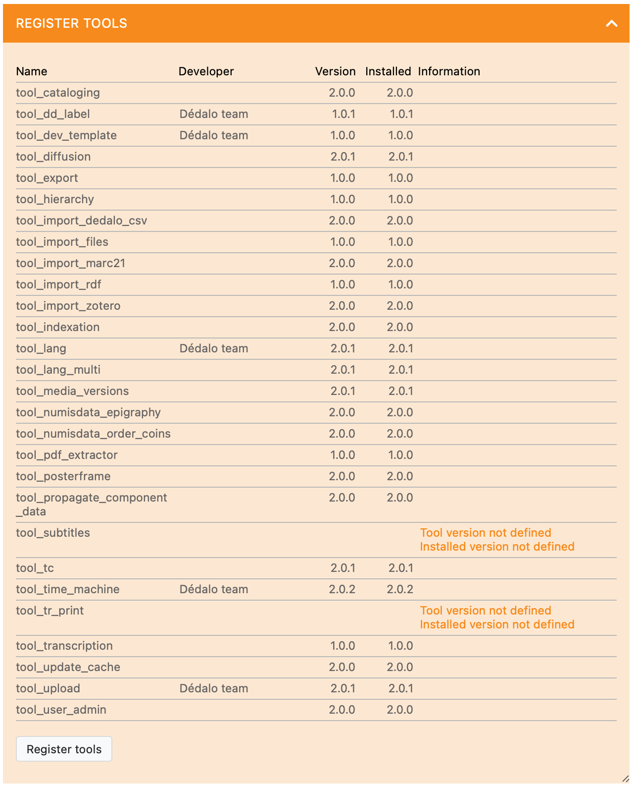

# Creating new tools

## Introduction

Dédalo tools are isolated blocks of code that allow to expand components, sections and areas features.
Usually, a tool consist of a server class file and some client JS/CSS files. Tools can add their own specific user interface to create a complex interaction and data analysis.

## Directory and file structure

All tools are located in the `/tools` directory

Every tool has his own directory named correctly and it will has:

- a css directory
- a js directory
- a PHP class
- a register.json file
- a img directory

``` shell
├── tool_numisdata_import
    ├── class.tool_numisdata_import.php
    ├── css
    │   └── tool_numisdata_import.css
    ├── img
    │   └── icon.svg
    ├── js
    │   ├── index.js
    │   ├── render_tool_numisdata_import.js
    │   └── tool_numisdata_import.js
    └── register.json
```

### Mandatory files

Tool system use a register method to add the tool functionality. The register process will read the `register.json` file of every tool.

JavaScript directory need a `index.js` file. This file will be import as module by Dédalo processes.

`icon.svg` inside `img` directory is a graph file of the tool logo a square svg (vector format only). Usually a 1024x1024px art board.

## Naming the tool

All tools has a unique name that follow this rules:

- The name use a snake_case format.

- All letters in small case.

- The name of the tool must start with 'tool' word following with the tld or institution acronym as 'numisdata' following with the name of the tool as 'importing_specific_files'.

- Name can not contain any spaces, accents or non ASCII chars to prevent future errors with paths.

Example:

A good name could be 'tool_numisdata_import', where 'tool_' is the mandatory prefix, 'numisdata_' is the mandatory TLD of the institution or promoted and 'import' is the main description of the tool.

A wrong name could be 'my_tool_name' it's not compatible between installations and will be rejected to be shared.

!!! note "Adding a description name"
    The name of the description will be set in the label field, where it can be more explicit in explaining what the tool does, such as 'Tool for importing custom Numismatic files'.

### Rules to naming files

All examples use the fictitious name of : `tool_numisdata_import`

1. PHP class.

    PHP class will used the full name of the tool with the `class.` prefix as:

    > class.tool_numisdata_import.php

2. JavaScript files

    The main file will use the full name of the tool as:

    > tool_numisdata_import.js

    Render files will add the prefix `render` to the tool name as:

    > render_tool_numisdata_import.js

    Is possible to define other render files or views naming it between render word and the tool name as:

    > render_list_tool_numisdata_import.js

3. CSS files

    The css file use the full name of the tool as:

    > tool_numisdata_import.css

    Is possible use LESS or SASS or other languages to create the CSS files. Take account that the final CSS file must be named in the correct way, with the name of the tool.

## Creating a new Dédalo tool

Tools need a register file that is used to load the configuration, labels and other information to configure the tool inside Dédalo schema.

To create the file, Dédalo has a specific section to facilitate the build process.

The first step is to create a new record in Tools developer section

1. Go to:

    > Development > Tools > [Tools development](https://dedalo.dev/ontology/dd1340)

    

2. Fill the fields and configurations

    Fill the needs of the tool information into the correct fields.

    | Field | Description | Comments |
    | --- | --- | --- |
    | Active | Active or deactive the tool | |
    | Tool name | Real name of the tool. Use the prefix 'tool' and underscores to fill words gaps as `tool_numisdata_import` | It need to be exact the name of the tool used in the directory and files as `tool_numisdata_import` |
    | Label | A description name, a free small text defining de tool name that user can see | The label could be translated and it will use into the modal or other windows to show a title of the tool |
    | Version | Tool version | To control the version of the code |
    | Dédalo version minimum | Minimum Dédalo version compatible with the tool| |
    | Description | A free text description of the tool | It will use to inform to user of the utility of the tool |
    | Developer | Your name | Used to identify your self, if you need add more than 1 developer, use the (+) button |
    | Implementation | A technical description of the use and configure of the tool | Use this field to specify the needs to run the tool or the options |
    | Show in inspector | Defines if the tool will be added into the inspector | Used to general tools |
    | Show in component | Defines if the tool will be added to the component | Used for tools applied a specific components, the tool will appear when the component is active |
    | Translatable requirement | Identify if the the tool need a translatable component | If the component is not translatable the tool will not activate when the user active the component |
    | Active always | The activation no depend of the component or section active as the user name in the menu | |
    | Affected models | Defines the components that the tool will affect | Other components will not load the tool |
    | Affected types | Array with the ontology tipo tld of affected component, area or section | In the case than you need to affect only a specific component of the ontology, define it to restring other components with the same model to load the tool |
    | Ontology | A ontology extension | Some tools need extend the ontology in his way, use the ontology format to attach new nodes to it |
    | Properties | A extension of the ontology properties | It can use independent of the ontology definition |
    | Labels | Defines strings with translations to be used into the tool to translate the user interface | Labels can be get into the js with the get_tool_label('my_label') call, this field use a tool to edit the labels with user interface |
    | Default configuration | Defines a JSON object with the default configuration | It will be changed by the specific configuration into the `tools configuration` section |
    | Configuration | Defines a JSON object with the full configuration definition | The full options of the tool |

3. Export the register file

    { width="175" align=right }

    When you will done, you will can download the register file pressing the button "Download register file" in inspector

    The file will be downloaded with all configuration definitions, if you need change it or add new configuration, labels, etc, you will repeat the process. Add or change the information, download the file and so on.

4. Adding the register file to the tool directory

    The register.json file will be downloaded. Move this file inside the main directory of your tool.

5. Register the tool

    { width="175" align=right }

    The final step to activate the tool is register it. Go to:

     > System administration > Maintenance

     Locate the register tool block and see if your tool is in the list, if not, move your tool directory into the /tools directory and ensure that the register file is inside and all required files has a correct name.

    { width="375"}

     Press the  "register tool button".

To help to create new tools we are creating a template/sample tool named [tool_dev_template](https://github.com/renderpci/dedalo/tree/v6_developer/tools/tool_dev_template) to show the basic functionalities.

Done!, now is your time to create an amazing tool!
