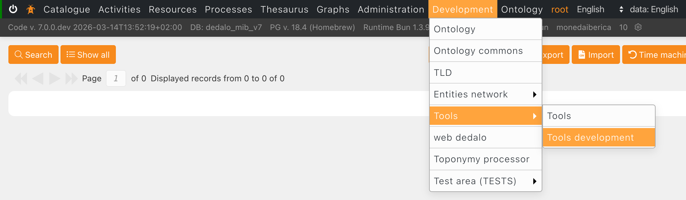

# Creating new tools

## Introduction

Dédalo tools are isolated blocks of code that extend components, sections and areas. A tool consists of a server TS module (`server/index.ts`, exporting a `ToolServerModule`), client JS/CSS files, and a `register.json` file describing it. Tools can add their own user interface for complex interaction and data analysis.

The process has two halves, and they meet in `register.json`:

1. **The code** — a directory under `tools/` with the client, the server module and the icon.
2. **The registration record** — authored *inside Dédalo*, in the **Tools development** section (`dd1340`), and exported from the inspector as `register.json`.

This page is the end-to-end tutorial. The companion references are:

- [Tools catalog](reference/index.md) — every tool shipped with Dédalo v7, grouped by purpose, with per-tool reference pages
- [register.json reference](register_json.md) — every field of the registration file
- [Server contract](server_contract.md) — the `ToolServerModule` contract, API actions, configuration, hooks
- [JS lifecycle](js_lifecycle.md) — the client tool lifecycle and helpers
- [Security](security.md) — what the framework enforces and what you must do

## 1. Name the tool

All tools have a unique name, and the name is load-bearing: it is the directory name, the file names, the JS identifiers, and the value the registry validates against.

- snake_case, lowercase ASCII only — no spaces, accents or non-ASCII characters (they break paths)
- mandatory `tool_` prefix, then your institution/TLD acronym, then the feature:
  `tool_numisdata_import` = `tool_` + `numisdata` (institution) + `import` (feature)
- a name like `my_tool_name` is not portable between installations and will be rejected for sharing
- the tool's `server/index.ts` must export `tool.name` equal to the directory name — the loader validates this every time it scans, not only at registration

!!! note "The descriptive name goes in the label"
    The *Label* field is where the tool gets a human name — *Tool for importing custom Numismatic files*. It is translatable, and it is what users see in menus, modals and windows.

### File naming rules

All examples use the fictitious tool `tool_numisdata_import`:

| File | Rule |
| --- | --- |
| `js/tool_numisdata_import.js` | Main client file: the full tool name |
| `js/render_tool_numisdata_import.js` | Render file: `render_` + the tool name. Extra views insert their name — `render_list_tool_numisdata_import.js` |
| `js/index.js` | Mandatory module entry — Dédalo imports the tool through it |
| `css/tool_numisdata_import.css` | The full tool name. LESS/SASS is fine, as long as the built CSS carries that name |
| `img/icon.svg` | The tool logo: a square SVG (vector only), usually on a 1024×1024 artboard |
| `server/index.ts` | Exports `const tool: ToolServerModule` — never served to the browser |
| `register.json` | The registration record (step 3) |

### Directory layout

``` shell
├── tool_numisdata_import
    ├── register.json
    ├── css
    │   └── tool_numisdata_import.css
    ├── img
    │   └── icon.svg               # square SVG, ~1024×1024 artboard
    ├── js
    │   ├── index.js               # module entry (re-exports the tool)
    │   ├── tool_numisdata_import.js
    │   └── render_tool_numisdata_import.js
    └── server
        └── index.ts               # exports `tool: ToolServerModule` — never served
```

`tools/` is the repo-root, **TS-owned** tree. The common machinery (registry, loader, dispatch, security, config, the `tool_common` client base) is NOT a tool — it lives in `src/core/tools/`.

## 2. Scaffold the directory

The fastest start is the CLI scaffolder, which copies the reference template (`tools/tool_dev_template`) and renames everything:

``` shell
bun run scripts/create_tool.ts \
    --name=tool_numisdata_import \
    --label="Numismatic import" \
    --models=section
```

Options:

| Option | Description |
| --- | --- |
| `--name` | Required. Tool name: `^tool_[a-z0-9_]+$`. Becomes the directory name (class/file renames follow automatically) |
| `--label` | Display label (stored as `lg-eng`); defaults to `--name`. Add more languages later |
| `--models` | Comma-separated affected models, e.g. `section,component_input_text`. Default `all_components` |

The scaffolder copies `tools/tool_dev_template`, renames every `tool_dev_template` occurrence (directory, file names, JS identifiers), and writes a minimal `register.json` in the flat **authoring** format so the package is registrable from the first minute. You can also copy `tools/tool_dev_template` by hand and rename every occurrence yourself.

That placeholder file is a starting point, not the finished registration: the full definition — translated labels, scope flags, ontology, properties, UI labels, configuration — is authored in the next step and **replaces** it.

## 3. Create the record in Tools development (`dd1340`)

Tools need a register file carrying the configuration, labels and other information that positions the tool inside the Dédalo schema. Dédalo has a section built for exactly that, so you never write the file by hand.

1. Go to:

    > Development → Tools → [Tools development](https://dedalo.dev/ontology/dd1340)

    

    Its two sibling sections are read-only from your point of view here: *Registered tools* (`dd1324`) is what the register process writes, and *Tools configuration* (`dd996`) holds the per-install configuration overrides.

2. Create a new record and fill the fields.

    The form is grouped as *Information*, *Scope*, *Ontology*, *Labels* and *Configuration*:

    | Field | Tipo | Description | Comments |
    | --- | --- | --- | --- |
    | Active | `dd1354` | Activate or deactivate the tool | |
    | Tool name | `dd1326` | Real name of the tool, e.g. `tool_numisdata_import` | Must be **exactly** the directory and file name; registration refuses a mismatch |
    | Label | `dd799` | A short free text naming the tool for users | Translatable; used as the title of the tool's modal or window |
    | Version | `dd1327` | Tool version | Semantic version (`1.0.0`); the *Register tools* panel compares it against the installed one |
    | Dédalo version minimum | `dd1328` | Minimum compatible Dédalo version | Registration refuses the tool on an older engine |
    | Description | `dd612` | Free text describing the tool | Shown to inform the user what the tool is for |
    | Developer | `dd1644` | Your name | Use the (+) button for more than one developer |
    | Implementation | `dd1362` | Technical description of how to use and configure the tool | Requirements, options, anything an installer needs |
    | Shown in inspector | `dd1331` | Add the tool to the inspector | For general-purpose tools |
    | Shown in Component | `dd1332` | Add the tool to the component | For component-specific tools: the button appears when the component is active |
    | Translatable requirement | `dd1333` | The tool needs a translatable component | On a non-translatable component the tool will not activate |
    | Active always | `dd1601` | Availability does not depend on the active component or section | Bypasses the per-profile tools grant |
    | Affected models | `dd1330` | The models the tool applies to | Other models never load the tool. The options are the *Target models* records (`dd1342`) |
    | Affected types | `dd1350` | Array of ontology tipos of the affected component, area or section | Use it to restrict the tool to specific nodes instead of every node of that model |
    | Ontology | `dd1334` | An ontology extension | Some tools need to attach their own nodes; use the ontology format |
    | Properties | `dd1335` | An extension of the ontology properties | Usable independently of the ontology definition — `open_as`, events, `tool_config` |
    | Labels | `dd1372` | Strings with translations for the tool's own interface | Read from JS with `self.get_tool_label('my_label')`. Edit them with [`tool_dd_label`](../../tools/using_dd_label.md) instead of typing raw JSON |
    | Default configuration | `dd1633` | JSON object with the factory configuration | Overridable per install in the *Tools configuration* section |
    | Configuration | `dd999` | JSON object with the full configuration definition | The complete option set of the tool |

    Two fields in the form are not yours to fill: *Id* (`dd1351`) is the record locator, and *Simple tool object* (`dd1353`) is a cached blob the engine maintains.

    !!! warning "Configuration flagged `client: true` reaches the browser"
        Properties of `config` marked `"client": true` are served to the client (`getToolClientConfig`). Never put credentials or secrets there — see [Security](security.md).

## 4. Export the register file

{ width="245" align=right }
{ width="245" align=right }

When the record is complete, press **Download register file** in the inspector (bottom of the *Info* block, next to *View record data*). It is offered on `dd1340` records only.

The button reads the record back through the API (a `read_raw` request on that single record) and downloads the whole thing as `register.json` — every field you filled, keyed by component tipo. If you later need to change or add configuration, labels, and so on, you repeat the process: edit the record, download the file again, replace it.

**Move the downloaded file into the root of your tool directory**, next to `css/`, `js/` and `server/`, replacing the placeholder the scaffolder wrote.

!!! note "Exported files are column-keyed, and that is a supported shape"
    The export is a matrix-row dump — top-level `data` / `string` / `relation` / `misc` keyed by component tipo — and every `register.json` shipped in `tools/` is one. `importTools()` detects that shape and passes it through as-is. Do not hand-edit it: change the `dd1340` record and export again, so the record and the file never disagree.

### Alternative: hand-write the authoring format

`register.json` also accepts a flat, hand-authorable **authoring** format, schema-validated and converted at import. It is what the scaffolder writes, and it is the portable option for a tool distributed across installs, because `affected_models` are written as plain model names and resolved to their `dd1342` locators at registration time:

``` json
{
	"$schema": "../../src/core/tools/register.schema.json",
	"name": "tool_numisdata_import",
	"version": "1.0.0",
	"label": { "lg-eng": "Numismatic import" },
	"affected_models": ["section"]
}
```

One language label is enough — the client falls back across languages. The `$schema` pointer gives you autocomplete and validation in any JSON-schema-aware editor. See the [register.json reference](register_json.md) for every field of both shapes.

## 5. Implement the server module

`server/index.ts` exports `const tool: ToolServerModule`, declaring its callable actions in `apiActions` — preferably with a **declarative permission** per action so the framework enforces the gate before your handler runs:

``` ts
import type { ToolActionContext, ToolResponse, ToolServerModule } from '../../../src/core/tools/module.ts';

async function importFile(context: ToolActionContext): Promise<ToolResponse> {
	// context.options is already permission-checked for (section_tipo, level>=2)
	// your logic here...
	return { result: true, msg: 'OK', errors: [] };
}

export const tool: ToolServerModule = {
	name: 'tool_numisdata_import',
	apiActions: {
		import_file: { permission: 'section', minLevel: 2, handler: importFile },
	},
};
```

Full contract (permission kinds, background execution, configuration, lifecycle hooks): [Server contract](server_contract.md). Security model: [Security](security.md).

## 6. Implement the client

The template wires the standard lifecycle for you with `wire_tool` and calls the server through `this.tool_request`:

``` js
import {tool_common, wire_tool} from '../../../core/tools_common/js/tool_common.js'
import {render_tool_numisdata_import} from './render_tool_numisdata_import.js'

export const tool_numisdata_import = function () { /* instance vars */ }

wire_tool(tool_numisdata_import, render_tool_numisdata_import)

tool_numisdata_import.prototype.do_import = async function() {
	return this.tool_request({
		action  : 'import_file',
		options : { section_tipo: this.caller.section_tipo, file: '...' }
	})
}
```

The relative import `../../../core/tools_common/js/tool_common.js` resolves through the **served** URL tree, not the repo tree: `tool_common.js` itself lives at `client/dedalo/core/tools_common/js/tool_common.js` and is served at `/dedalo/core/tools_common/js/tool_common.js`. Lifecycle, `ddo_map`, modal/window modes, labels: [JS lifecycle](js_lifecycle.md).

## 7. Register the tool

The final step that activates the tool is registering it. Go to:

> System administration → Maintenance

Locate the *Register tools* panel and look for your tool in the list — one row per tool, with columns *Active*, *Name*, *Developer*, *Installed*, *Version* and *Info*. If your tool is not there, check that the directory sits in `tools/`, that `register.json` is inside it, and that every required file is named correctly.


Press **Register tools**. The importer scans the tool roots, validates each package and reconciles it with the registered-tools section (`dd1324`). The leading *Active* checkbox is not a row selector: it is the tool's active state, and what you leave checked at submit time outranks the `active` value the file declares.

The panel above is showing exactly the drift it exists to surface: `tool_ontology_parser` ships `1.1.0` on disk while the registry still serves `1.0.1`. Pressing the button is what closes that gap.

Registration validates before it reports: `register.json` structure and format, the tool name matching its directory, a semantic version, at least one label, a satisfied minimum-Dédalo version, and — via the loader — that `server/index.ts`, if present, satisfies the `ToolServerModule` contract. Failures appear in the report with explicit messages; nothing registers silently broken. A tool with no server module registers with a warning: `tool_request` will refuse any action named against it.

!!! warning "The registry is what runs, not the file"
    Tool metadata is served from the registry record, never by re-reading `register.json`. Editing the record, the file, or both changes nothing for users until you press *Register tools* again. The panel makes the drift visible: it shows **Installed** (registry) against **Version** (the file on disk) and flags every disagreement — see [area_maintenance](../../core/areas/area_maintenance.md).

## 8. Authorize and use

Grant the tool to user profiles: System administration → Profiles → Tools. Superusers see all registered tools. Tools flagged *Active always* bypass profile authorization.

The tool button now appears on matching elements (per *Affected models* / *Affected types* and the *Shown in Component* / *Shown in inspector* flags).

## 9. Test

Follow the existing test pattern for a real tool (e.g. `test/parity/tool_export_differential.test.ts` or `test/unit/tools_dispatch.test.ts`): drive the same `tool_request` through the dispatcher and assert on the response — parity gates replay the frozen fixture store (`test/parity/fixtures/oracle_harvest/`) rather than a live external server.

## Out-of-repo tools

Third-party tools can live **outside** the Dédalo checkout (surviving `git pull`, independently versioned). Configure an additional root via `config.tools.additionalRoots` (env `DEDALO_ADDITIONAL_TOOLS`, JSON):

``` env
DEDALO_ADDITIONAL_TOOLS=[{"path":"/srv/custom_tools","url":"/custom_tools"}]
```

- `path`: absolute directory containing `tool_*` folders
- `url`: same-origin web URL serving that directory — the browser loads tool JS/CSS from it; cross-origin URLs are refused at config load

The in-repo `tools/` root always wins on name collisions (reported via `getToolLoadCollisions()`, never silently overridden). Tools in additional roots still require registration and profile authorization, exactly like in-repo tools.

To help you start, Dédalo ships a template/sample tool — [`tool_dev_template`](reference/tool_dev_template.md) — showing the basic functionality.

Done! Now it is your time to create an amazing tool.
