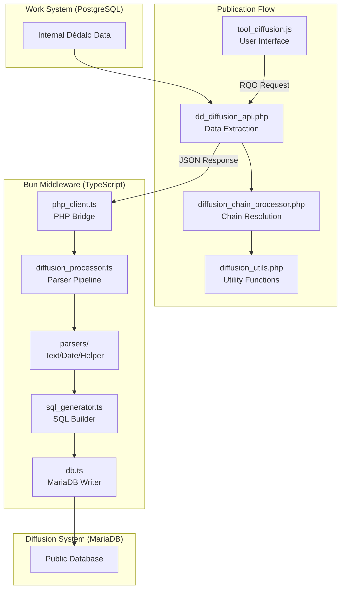
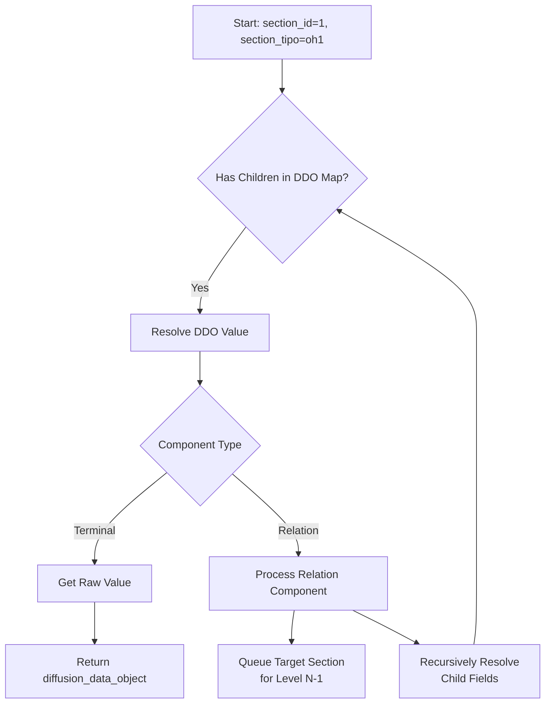
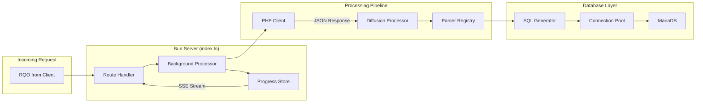
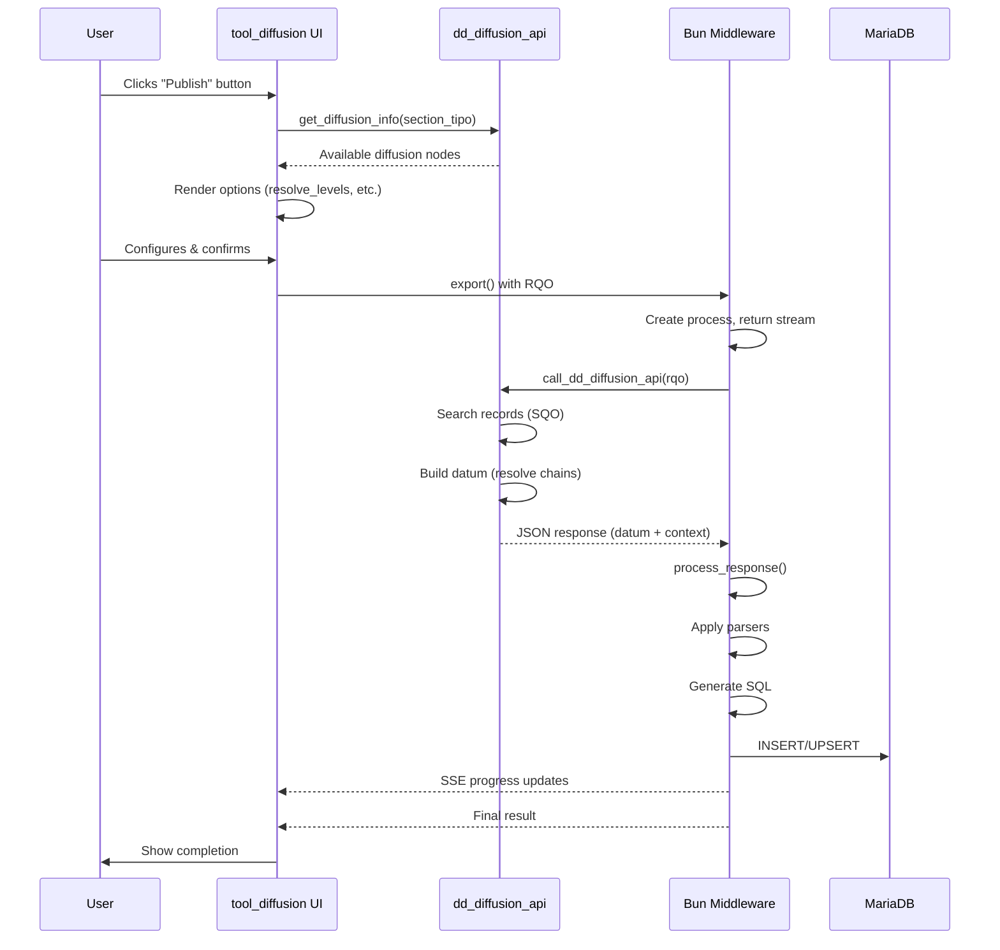
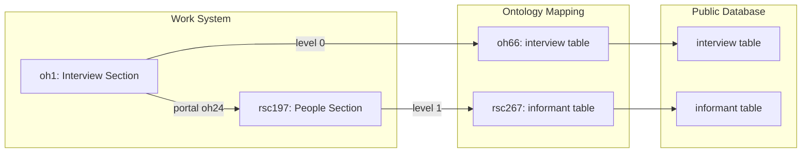
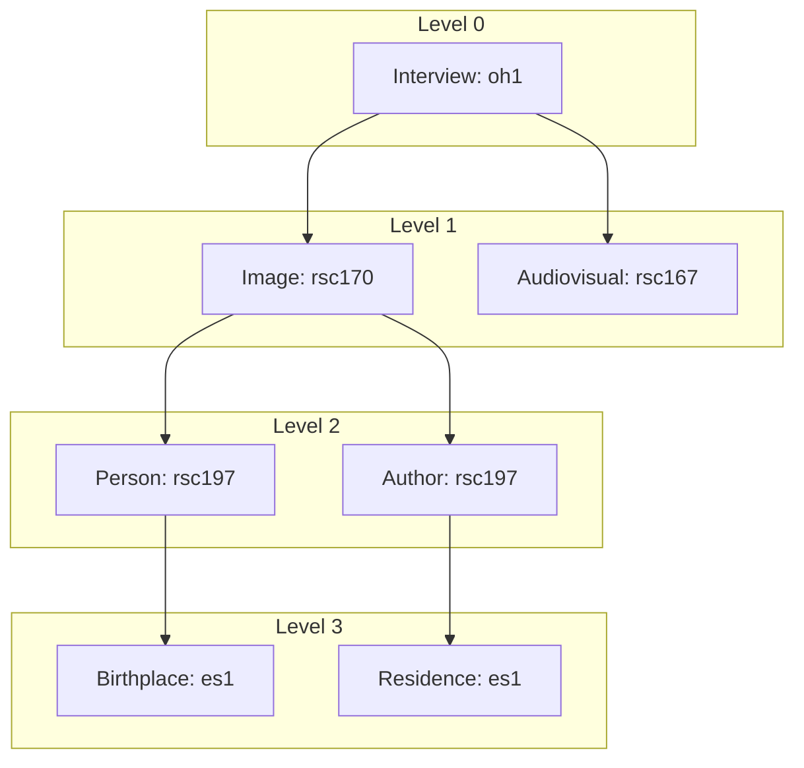

# Diffusion API and Bun

> See also: [Diffusion engine internals](engine_internals.md) · [Diffusion data flow](diffusion_data_flow.md) · [Diffusion config properties](diffusion_config_properties.md) · [Publication API](publication_api/index.md)

The diffusion system is a data publication pipeline that transforms internal, ontology-driven work data into public-facing formats. It has two API layers: a PHP backend that extracts and prepares the data, and a Bun/TypeScript engine that parses it and writes it into MariaDB.

## Overview

The pipeline consists of two main API layers:

1. **`dd_diffusion_api`** — the PHP backend API that extracts and prepares data from the work system.
2. **Bun diffusion API** — a TypeScript/Bun engine that processes, parses and inserts data into MariaDB.

Per the Bun-owns-MariaDB rule, PHP never connects to MariaDB directly: every MariaDB operation goes through a Bun action.

## Architecture

### High-level data flow



## dd_diffusion_api

The `dd_diffusion_api` class (`core/api/v1/common/class.dd_diffusion_api.php`) is the main PHP entry point for diffusion operations.

### Core methods

#### `diffuse(object $rqo): object`

The primary method that executes the diffusion process.

**Parameters:**
```js
$rqo = {
    action: "diffuse",
    source: { tipo, section_tipo, ... },
    sqo: { section_tipo: [...], filter: ... },  // Search Query Object
    options: {
        diffusion_tipo: "rsc...",      // Target diffusion node
        diffusion_element_tipo: "...", // Element scope
        levels: 2,                      // Resolution depth
        total: 100,                   // Expected record count
        chunk_size: 100               // Records per batch
    }
}
```

**Response Structure:**
```js
{
    result: true,
    msg: "OK. Request done",
    langs: { "lg-eng": "English", "lg-spa": "Spanish" },
    main_lang: "lg-eng",
    main: [                          // Hierarchy from domain to field
        { diffusion_tipo: "dd3", term: "diffusion", model: "diffusion" },
        { diffusion_tipo: "oh66", term: "interview", model: "table", ... }
    ],
    datum: [                         // Data organized by section
        {
            diffusion_tipo: "oh66",
            section_tipo: "oh1",
            term: "interview",
            model: "table",
            context: [                   // Field definitions with parsers
                {
                    term: "code",
                    tipo: "oh14",
                    model: "field_varchar",
                    parser: { fn: "parser_text::text_format", ... }
                }
            ],
            data: [                      // Actual records
                {
                    section_id: 1,
                    entries: {
                        "oh14": [      // Values by tipo
                            { tipo: "oh14", lang: "lg-eng", value: "Code-001", id: "abc123" }
                        ]
                    }
                }
            ]
        }
    ]
}
```

#### `get_diffusion_info(object $rqo): object`

Retrieves diffusion configuration for a given section.

**Use Case:** The tool_diffusion uses this to populate the publication interface with available diffusion targets.

```js
// Request
{
    action: "get_diffusion_info",
    options: { section_tipo: "oh1" }
}

// Response
{
    result: {
        section_diffusion_nodes: [
            {
                element_tipo: "oh66",
                name: "Web Publication",
                class_name: "diffusion_sql",
                database_name: "web_dedalo",
                database_tipo: "oh67"
            }
        ],
        resolve_levels: 2
    }
}
```

#### `get_ontology_map(object $rqo): object`

Returns raw parser definitions from ontology.

```js
// Request
{
    action: "get_ontology_map",
    options: { diffusion_tipo: "oh66" }
}

// Response - Returns the process properties from ontology
{
    result: true,
    data: {
        "oh100": { fn: "parser_text::text_format", pattern: "${value}" },
        "oh68": { fn: "parser_date::string_date", date_mode: "year" }
    }
}
```

### Diffusion chain processing

The `diffusion_chain_processor` class handles recursive resolution of related data.



**Key Chain Resolution Features:**
- **Level-based Resolution**: Resolves linked sections up to configured depth (default: 2 levels)
- **Publishability Checking**: Validates if related sections are publishable before including them
- **Deduplication**: Uses `diffusion_activity_logger` to prevent redundant processing
- **Cross-Section Mapping**: Maintains `section_diffusion_map` for efficient lookup

## Bun diffusion API

The Bun-based middleware (`/diffusion/api/v1/`) provides high-performance data processing and MariaDB insertion.

### Architecture components



### Core modules

#### `index.ts` — main server

**Key Features:**
- Unix socket server (configurable via `SOCKET_PATH`)
- Server-Sent Events (SSE) streaming for real-time progress
- Background processing with chunked execution
- Heartbeat mechanism (2s intervals) to prevent proxy timeouts

**Endpoints:**

| Endpoint | Method | Description |
|----------|--------|-------------|
| `/api/v1/diffuse` | POST | Main diffusion endpoint (streaming) |
| `/api/v1/validate` | POST | Pass-through to PHP validation |
| `/api/v1/get_ontology_map` | POST | Pass-through to PHP |
| `/api/v1/health` | GET | Bun engine health check |
| `/api/v1/status` | GET | Full system readiness |
| `/api/v1/processes` | GET | List active processes |

**SSE Progress Format:**
```typescript
{
    process_id: "uuid",
    is_running: true,
    started_at: 1234567890,
    data: {
        msg: "Processing records",
        counter: 50,
        total: 100,
        section_label: "interview",
        time_ms: 150,
        total_ms: 5000
    },
    total_time: "00:00:05",
    errors: []
}
```

#### `php_client.ts` — PHP bridge

Forwards requests to the PHP `dd_diffusion_api` with:
- Cookie header forwarding for session authentication
- 120-second timeout for long-running PHP operations
- Automatic `dd_api: "dd_diffusion_api"` injection

```typescript
// Environment Configuration
DEDALO_API_URL = "https://dedalo.dev/dedalo/core/api/v1/json/"
REQUEST_TIMEOUT_MS = 120000
```

#### `diffusion_processor.ts` — parser pipeline

Transforms PHP agnostic responses into SQL-ready data.

**Processing Steps:**

1. **Database Name Resolution**: Extracts from `main` hierarchy
2. **Datum Group Processing**: Each group = one table
3. **Record Processing**: Applies parsers per context field
4. **Language Expansion**: Creates one record per language
5. **Column Value Resolution**: 5-level fallback chain

**Language Resolution Priority:**
```
1. Exact lang match (lg-spa)
2. Nolan (lg-nolan / null) → duplicated to all records
3. main_lang fallback (lg-eng)
4. Any available lang (best-effort)
5. null (no data)
```

**Column-Order Mode:**
When `context.columns` is defined, passes all entries at once for cross-lang grouping:
```typescript
{
    columns: [
        { tipo: "rsc85", model: "component_input_text" },  // name
        { tipo: "rsc86", model: "component_input_text" }   // surname
    ],
    parser: { fn: "parser_text::text_format", pattern: "${rsc85} ${rsc86}" }
}
```

### Parser system

The parser registry maps PHP-format function strings to TypeScript implementations.

#### Parser registry (`parsers/index.ts`)

```typescript
const parser_registry: Record<string, parser_fn> = {
    // Text Parsers
    'parser_text::default_join':       default_join,
    'parser_text::text_format':        text_format,
    'parser_text::map_value':          map_value,
    'parser_text::v5_html':            v5_html,
    
    // Locator Parsers
    'parser_locator::get_section_id':  get_section_id,
    'parser_locator::get_term_id':     get_term_id,
    'parser_locator::parents':         parents,
    'parser_locator::slice_chain':     slice_chain,
    
    // Date Parsers
    'parser_date::string_date':        string_date,
    'parser_date::unix_timestamp':     unix_timestamp,
    
    // Helper Parsers
    'parser_helper::get_first':        get_first,
    'parser_helper::merge':            merge,
    'parser_helper::count':            count,
    
    // Global Parsers
    'parser_global::merge_columns':    merge_columns,
    'parser_global::publication_unix_timestamp': publication_unix_timestamp,
};
```

#### Parser: `parser_text.ts`

**`text_format`** - Pattern-based text generation:
```typescript
// Input data
[
    { id: "a", value: ["Ana", "Ger"], tipo: "rsc85" },
    { id: "b", value: ["Hero", "Del"], tipo: "rsc86" }
]

// Pattern: "${rsc85} ${rsc86}"
// Output: [
//     { value: ["Ana Hero"], lang: "lg-eng" },
//     { value: ["Ger Del"], lang: "lg-eng" }
// ]
```

**`default_join`** - Simple concatenation:
```typescript
// Options
{ records_separator: " | ", fields_separator: ", " }

// Joins values with separators
```

#### Parser: `parser_helper.ts`

**`merge`** - Complex multi-column merging with strategies:

| merge Style | Output | Example |
|-------------|--------|---------|
| `undefined` | Flat array | `["Madrid", "Spain", "Paris", "France"]` |
| `string` | Joined string | `"Madrid - Spain, Paris - France"` |
| `nested` | Array of arrays | `[["Madrid", "Spain"], ["Paris", "France"]]` |
| `flat` | Flat per-section | `["Madrid - Spain", "Paris - France"]` |
| `pipe` | JSON strings | `'["Madrid","Spain"] - ["Paris","France"]'` |
| `unique` | Deduplicated | `["Madrid", "Spain", "Paris", "France"]` |

**Slot Resolution (5-level fallback):**
```typescript
const resolve_slot = (tipo_map, tipo, lang_key) => {
    if (lang_map.has(lang_key))     return lang_map.get(lang_key);      // 1. exact
    if (lang_map.has('__nolan__'))  return lang_map.get('__nolan__');   // 2. nolan
    if (main_lang && lang_map.has(main_lang)) 
                                     return lang_map.get(main_lang);    // 3. main
    return lang_map.values().next().value;                               // 4. any
    // 5. empty string if none found
};
```

#### Parser: `parser_locator.ts`

**`get_term_id`** - Extracts term IDs from locators:
```typescript
// Input: [{ value: [{ section_id: 1, section_tipo: "rsc197" }] }]
// Output: [{ value: "rsc197_1" }]
```

**`parents`** - Gets parent hierarchy:
```typescript
// Input with parents data
// Output: [{ value: ["term1", "term2", "term3"] }]
```

**`slice_chain`** - Selects portion of parent chain:
```typescript
// Options: { slice: [1, 2] } - start at index 1, take 2 items
// Input: [{ value: ["Spain", "Madrid", "Center"], parents: [...] }]
// Output: [{ value: ["Madrid", "Center"] }]
```

#### Parser: `parser_date.ts`

**`string_date`** - Formats date objects:
```typescript
// Input: [{ value: { start: { year: 1936, month: 5, day: 15 } } }]
// Options: { date_mode: "year" }
// Output: [{ value: "1936" }]
```

**`unix_timestamp`** - Converts to Unix time:
```typescript
// Input: [{ value: { start: { year: 2024, month: 1, day: 1 } } }]
// Output: [{ value: 1704067200 }]
```

### Database layer

#### `db.ts` — connection management

**Pool Caching:**
```typescript
const pool_cache = new Map<string, mysql.Pool>();

// Creates connection pool per database
mysql.createPool({
    socketPath: process.env.DB_SOCKET || '/tmp/mysql.sock',
    user: process.env.DB_USER || 'root',
    password: process.env.DB_PASSWORD || '',
    database: database_name,
    connectionLimit: 10,
    charset: 'utf8mb4'
});
```

**`insert_table_data`** - Atomic transaction handling:
```typescript
async function insert_table_data(table: processed_table): Promise<number> {
    // 1. Begin transaction
    // 2. Ensure table exists (CREATE TABLE IF NOT EXISTS)
    // 3. Ensure columns exist (ALTER TABLE ADD COLUMN)
    // 4. Execute batch upserts (INSERT ... ON DUPLICATE KEY UPDATE)
    // 5. Execute deletions (DELETE FROM ... WHERE section_id IN ...)
    // 6. Commit or rollback
}
```

#### `sql_generator.ts` — SQL builder

**Composite Key:** `(section_id, lang)`

**Upsert Generation:**
```sql
INSERT INTO interview (section_id, lang, code, title)
VALUES (?, ?, ?, ?)
ON DUPLICATE KEY UPDATE
    code = VALUES(code),
    title = VALUES(title);
```

**Type Mapping from Ontology:**

| Ontology Model | SQL Type |
|----------------|----------|
| `field_date` | DATE |
| `field_datetime` | DATETIME |
| `field_int` | INT(length) |
| `field_varchar` | VARCHAR(length) |
| `field_text` | TEXT |
| `field_mediumtext` | MEDIUMTEXT |
| `field_point` | POINT |
| `field_year` | YEAR |
| `field_decimal` | DECIMAL |
| `field_boolean` | BOOLEAN |

## Data flow from tool_diffusion

### User interaction flow



### tool_diffusion.js key methods

#### `get_diffusion_info()`

Fetches available diffusion targets for the current section:
```javascript
const rqo = {
    dd_api: 'dd_diffusion_api',
    action: 'get_diffusion_info',
    source: source,
    options: { section_tipo: section_tipo }
};

// Response used to populate UI dropdown
```

#### `export(options)`

Executes the diffusion with streaming response:
```javascript
const rqo = {
    dd_api: 'dd_diffusion_api',
    action: 'diffuse',
    source: source,
    sqo: sqo,  // Search Query Object from caller
    options: {
        levels: resolve_levels,
        diffusion_tipo: diffusion_tipo,
        diffusion_element_tipo: diffusion_element_tipo,
        total: total,
        process_id: options.process_id
    }
};

// Uses data_manager.request_stream for SSE handling
data_manager.request_stream({
    url: DEDALO_DIFFUSION_API_URL,
    body: rqo
}).then(stream => {
    // Handle streaming response
});
```

#### `get_diffusion_status()`

Checks Bun engine health:
```javascript
// Returns readiness status including:
// - is_bun_running
// - is_db_connected
// - is_php_bridge_reachable
// - last_error
```

## Configuration and environment

### Bun environment variables (`.env`)

```bash
# Server
SOCKET_PATH=/tmp/diffusion.sock

# PHP Bridge
DEDALO_API_URL=http://localhost:8080/dedalo/core/api/v1/json/
DEDALO_MEDIA_PATH=/var/www/html/dedalo/media/
DEDALO_MEDIA_URL=/dedalo/media/

# Database
DB_SOCKET=/tmp/mysql.sock
DB_USER=dedalo_user
DB_PASSWORD=secret
```

!!! note "No Redis"
    Session validation is a cookie passthrough to PHP (Bun forwards the cookie to PHP
    `get_environment`); the engine uses no Redis or external session store.

### Apache configuration

```apache
# Proxy to Bun Unix Socket
ProxyPass /diffusion/api/v1/ unix:/tmp/diffusion.sock|http://localhost/ timeout=120 keepalive=On
ProxyPassReverse /diffusion/api/v1/ unix:/tmp/diffusion.sock|http://localhost/

# Or for TCP (alternative)
# ProxyPass /diffusion/api/v1/ http://localhost:3000/ timeout=120
```

## Use cases and examples

### Use case 1: basic publication

Publishing Oral History interviews to a website:



**Ontology Configuration:**
```json
// Interview table (oh66) - field nodes
{
    "term": "code",
    "tipo": "oh100",
    "model": "field_varchar",
    "parser": { "fn": "parser_text::default_join" }
}
{
    "term": "informant_data",
    "tipo": "oh109",
    "model": "field_text",
    "parser": { 
        "fn": "parser_locator::get_section_id",
        "output_format": "json"
    }
}
{
    "term": "informant",
    "tipo": "oh110",
    "model": "field_text",
    "parser": {
        "fn": "parser_text::text_format",
        "pattern": "${rsc85} ${rsc86}",
        "columns": [
            { "tipo": "rsc85", "model": "component_input_text" },
            { "tipo": "rsc86", "model": "component_input_text" }
        ]
    }
}
```

**Result:**
```sql
-- interview table
INSERT INTO interview (section_id, lang, code, informant_data, informant) 
VALUES (1, 'lg-eng', 'Code-001', '["1","2"]', 'Manuel González, María Gómez');

-- informant table  
INSERT INTO informant (section_id, lang, name, surname)
VALUES (1, 'lg-eng', 'Manuel', 'González');
```

### Use case 2: multilingual publication

Publishing content in multiple languages with fallback:

```mermaid
flowchart TB
    subgraph "Source Data"
        ENG[Title: "My Interview" lg-eng]
        SPA[Título: "Mi Entrevista" lg-spa]
        NOLAN[Code: "Code-001" lg-nolan]
    end

    subgraph "Published Records"
        P1[section_id:1, lang:lg-eng, title:My Interview, code:Code-001]
        P2[section_id:1, lang:lg-spa, title:Mi Entrevista, code:Code-001]
        P3[section_id:1, lang:lg-cat, title:My Interview, code:Code-001]
    end

    ENG --> P1
    SPA --> P2
    ENG -->|fallback| P3
    NOLAN -->|all| P1
    NOLAN -->|all| P2
    NOLAN -->|all| P3
```

**Parser Configuration:**
```typescript
// Language resolution priority:
// 1. Exact match (lg-cat)
// 2. Nolan (non-translatable)
// 3. main_lang fallback (lg-eng)
// 4. Any available
```

### Use case 3: complex chain resolution

Three-level resolution (Interview → Image → Person → Toponym):



**Configuration:**
```json
{
    "options": {
        "levels": 3,
        "diffusion_tipo": "oh66"
    }
}
```

**Note:** Each level exponentially increases processing time. Monitor performance with large datasets.

### Use case 4: custom parser chain

Combining multiple parsers for complex transformations:

```json
{
    "term": "birthplace_hierarchy",
    "tipo": "oh201",
    "model": "field_text",
    "parser": [
        {
            "fn": "parser_locator::parents",
            "options": { "include_self": true }
        },
        {
            "fn": "parser_locator::slice_chain",
            "options": { "slice": [0, 3] }
        },
        {
            "fn": "parser_text::text_format",
            "options": { "pattern": "${term} (${model})" }
        },
        {
            "fn": "parser_helper::merge",
            "options": { 
                "merge": "string",
                "fields_separator": " > ",
                "records_separator": " | "
            }
        }
    ]
}
```

**Data Flow:**
```
Input: { section_id: 1, section_tipo: "es1" }
  ↓
parents() → ["Spain", "Madrid", "Center", "Sol"]
  ↓
slice_chain([0,3]) → ["Spain", "Madrid", "Center"]
  ↓
text_format() → ["Spain (Country)", "Madrid (City)", "Center (District)"]
  ↓
merge(string) → "Spain (Country) > Madrid (City) > Center (District)"
```

### Use case 5: RDF export

For RDF-type diffusion elements:

```php
// In dd_diffusion_api::diffuse()
if ($diffusion_type === 'rdf') {
    $response = self::diffuse_rdf($diffusion_element_tipo, ...);
    // Returns file URLs for merged RDF and ZIP
    return $response;
}
```

The Bun layer handles RDF file merging and ZIP creation via `rdf_file_utils.ts`.

## Advanced topics

### Chunking strategy

For large datasets, Bun paginates requests:

```typescript
const DEFAULT_CHUNK_SIZE = 100;
const use_chunks = total > chunk_size;

// Injects limit/offset into SQO
const chunk_rqo = {
    ...request_rqo,
    sqo: {
        ...request_rqo.sqo,
        limit: chunk_size,
        offset: chunk_idx * chunk_size
    }
};
```

**Benefits:**
- Prevents PHP memory exhaustion
- Allows progress tracking per chunk
- Fault-tolerant (one bad chunk doesn't fail entire process)

### Progress store

In-memory process tracking with pub/sub:

```typescript
// Create process
create_process(estimated_total, process_id);

// Update progress
update_progress(process_id, { counter, msg, ... });

// Subscribe for SSE
subscribe_to_process(process_id, callback);
```

### Session handling

Bun forwards cookies for PHP session validation:

```typescript
const headers: Record<string, string> = {
    'Content-Type': 'application/json',
};
if (cookie_header) {
    headers['Cookie'] = cookie_header;
}
```

## Troubleshooting

### Common issues

| Issue | Cause | Solution |
|-------|-------|----------|
| "PHP API returned HTTP 500" | PHP error during processing | Check Dédalo error logs |
| "Table doesn't exist" | Missing diffusion ontology | Verify diffusion node exists for section |
| Socket permission denied | Apache can't write to socket | `chmod 666 /tmp/diffusion.sock` |
| SSE timeout | Proxy closing connection | Add `timeout=120` to ProxyPass |
| Memory exhausted | Too many levels/records | Reduce `levels` or `chunk_size` |

### Debug mode

Enable debug logging in Bun:
```bash
DEBUG=* bun run dev
```

Enable Dédalo debug:
```php
define('SHOW_DEBUG', true);
```

## API reference summary

### dd_diffusion_api (PHP)

| Method | Action | Purpose |
|--------|--------|---------|
| `diffuse()` | `diffuse` | Main publication process |
| `get_diffusion_info()` | `get_diffusion_info` | Get available diffusion targets |
| `validate()` | `validate` | Validate ontology mapping |
| `get_ontology_map()` | `get_ontology_map` | Get raw parser definitions |

### Bun endpoints

| Endpoint | Purpose |
|----------|---------|
| `POST /api/v1/diffuse` | Execute diffusion with streaming |
| `GET /api/v1/health` | Health check |
| `GET /api/v1/status` | Full system status |
| `GET /api/v1/processes` | List active processes |

### Parser functions

| Function | Module | Purpose |
|----------|--------|---------|
| `text_format` | parser_text | Pattern-based text |
| `default_join` | parser_text | Simple concatenation |
| `merge` | parser_helper | Multi-column merge |
| `get_first` | parser_helper | First value only |
| `count` | parser_helper | Count values |
| `string_date` | parser_date | Format dates |
| `unix_timestamp` | parser_date | Convert to Unix time |
| `get_term_id` | parser_locator | Extract term IDs |
| `parents` | parser_locator | Get parent hierarchy |
| `slice_chain` | parser_locator | Slice parent chain |


## Delete propagation and publication tracking (v7)

### Publication tracking — the dd1758 activity log

Publication state is tracked exclusively in the **diffusion activity log**
(section `dd1758`, PostgreSQL table `matrix_activity_diffusion`), written via
`diffusion_activity_logger::log($section_tipo, $section_id, $element_tipo, $action)`.

Components of each row: `dd1762` user, `dd1761` date, `dd1763` record locator,
`dd1764` section_id, `dd1765` section_tipo, `dd1766` diffusion element and
**`dd1767` action** (component_select → value-list section `dd1774`):

| section_id | action |
|---|---|
| 1 | `published` |
| 2 | `unpublished` |
| 3 | `unpublish_pending` (durable retry marker) |

The legacy per-record publication metadata writer (`update_publication_data`,
components dd271/dd1223/dd1224/dd1225) was removed in v7.

### Delete propagation

When a record is deleted in the work system, `section_record::delete()` calls
`diffusion_delete::delete_record()` (diffusion/class.diffusion_delete.php):

1. Targets are resolved from the flat virtual diffusion tree (type-agnostic).
2. SQL/Socrata targets are deleted in ONE Bun `delete_record` call
   (`DELETE FROM table WHERE section_id IN (...)`, per-target transactions).
3. RDF targets unlink the published file (deterministic name, see below).
4. Per-element outcome is logged to dd1758: success → `unpublished`,
   failure (engine/target down) → `unpublish_pending`.

Pending deletions are retried by `diffusion_delete::retry_pending()` from three
triggers: the start of every `diffuse()` run (first chunk only), the CLI helper
`diffusion/migration/helpers/retry_pending_deletions.php` (cron-able, uses the
internal token), and the tool_diffusion UI retry button
(`retry_pending_deletions` API action, admin-gated).

### XML diffusion (revived in v7)

XML mirrors the RDF pattern: `diffuse()` early-dispatches `type: 'xml'` to
`diffuse_xml()`, which runs `diffusion_xml::update_record` per record:

```
DEDALO_MEDIA_PATH/xml/{service_name}/{section_tipo}_{section_id}.xml
```

XML elements require `properties->diffusion->service_name` (the `validate`
action reports missing ones). Unpublishable records get their file removed
(`unpublished` logged); record deletion propagates via
`diffusion_xml::delete_record_file` (canonical + legacy flat `/xml/` variants).
Legacy timestamped files migrate with
`diffusion/migration/migrate_xml_filenames.php` (`--dry-run` supported).
The Bun engine consolidates XML downloads with a generic `merge_xml_parts`
(the RDF merger is rdf:RDF-specific).

### Markdown diffusion

Markdown publishes one human/AI-readable `.md` per record. Unlike RDF/XML it is
**not** an early dispatch: `diffuse()` runs the normal datum path
(`process_datum` + the levels drain) and then calls `render_markdown_response()`,
which renders each resolved `self::$datum` record to:

```
DEDALO_MEDIA_PATH/markdown/{service_name}/{section_tipo}_{section_id}.md
```

Reusing the datum path gives curated `ddo_map` resolution, the publication gate
and levels-based relation recursion for free: related records are published as
their own `.md` and relation fields link to them. Each document leads with
`# {section_name}` plus YAML frontmatter. Like XML it requires
`properties->diffusion->service_name`; unpublishable records get their file
removed; deletion propagates via `diffusion_markdown::delete_record_file`. The
datum carries the `file_url` only, so the Bun engine **skips the merge** (markdown
is self-contained) and just zips the per-record files. See
[Markdown diffusion](diffusion_markdown.md) for the full rules.

### RDF deterministic filenames

Each record publishes to ONE canonical file, overwritten on re-publish:

```
DEDALO_MEDIA_PATH/rdf/{service_name}/{rdf_name}_{section_tipo}_{section_id}.rdf
```

`diffusion_rdf::get_record_file_path()` is the single source of truth shared by
publish and delete. Legacy timestamped files are migrated by
`diffusion/migration/migrate_rdf_filenames.php` (`--dry-run` supported); the
delete path also glob-unlinks legacy variants for pre-migration installs.

### Database admin actions (MariaDB is a Bun responsibility)

PHP never connects to MariaDB. Server-to-server actions (session OR internal
token auth):

| Action | Purpose |
|---|---|
| `delete_record` | Delete published rows from target databases |
| `check_database` | MariaDB reachability + database existence |
| `backup_database` | mysqldump a target database to an absolute `.sql` path |

PHP calls them through `diffusion_api_client::call()` (unix socket preferred,
`DEDALO_DIFFUSION_SOCKET_PATH`; HTTP fallback `DEDALO_DIFFUSION_API_URL`).
