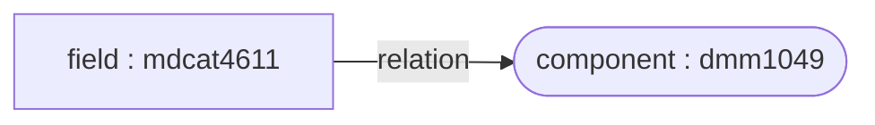
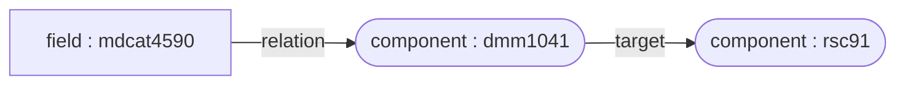
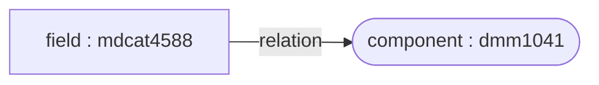
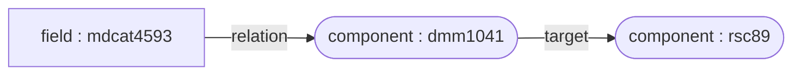

# Diffusion config properties

> See also: [Diffusion data flow](diffusion_data_flow.md) · [Diffusion engine internals](engine_internals.md) · [Diffusion API and Bun](dd_diffusion_api_and_bun.md)

Sample diffusion ontology configurations for the legacy v1 SQL diffusion path, focused on complex `process_dato` parsers and definitions.

!!! note "Work in progress"
    This page is incomplete and will grow over time. For real-world examples, browse the Dédalo diffusion ontology starting at `dd1190`, or read the map and process methods in the `diffusion_sql` class (`core/diffusion/class.diffusion_sql.php`).

## component_autocomplete_hi cases

### With custom parents (slice)

Selects a portion of the parents array.

#### Direct

```mermaid
  flowchart LR
  A[field : mdcat4611] --> | relation | id1([component : dmm1049])
```
```json
{
  "process_dato": "diffusion_sql::resolve_component_value",
  "process_dato_arguments": {
    "component_method": "get_diffusion_value",
    "custom_arguments": [
      {
        "custom_parents": {
        "info": " Select a portion of the result array, normally term with parents. In this case select only the region",
          "slice": [
            1,
            1
          ],
        }
      }
    ]
  }
}
```

#### Deep

```mermaid
  flowchart LR
  A[field : mdcat4589] --> | relation | id1([component : dmm1041]) --> | target | id2([component : rsc91])
```
```json
{
    "process_dato": "diffusion_sql::resolve_value",
    "process_dato_arguments": {
        "target_component_tipo": "rsc91",
        "component_method": "get_diffusion_value",
        "custom_arguments": [
            {
                "custom_parents": {
                    "info": " Select a portion of the result array, normally term with parents. In this case select only the region",
                    "slice": [
                        1,
                        1
                    ]
                }
            }
        ]
    }
}
```
---

### With custom parents (select_model)

Filter results by model code, e.g. `["es2_8871"]`.

#### Direct

```mermaid
  flowchart LR
  A[field : mdcat4611] --> | relation | id1([component : dmm1049])
```
```json
{
  "process_dato": "diffusion_sql::resolve_component_value",
  "process_dato_arguments": {
    "component_method": "get_diffusion_value",
    "custom_arguments": [
      {
        "custom_parents": {
          "info": " Select by model code (region '8871' from es2)",
          "select_model": ["es2_8871"]
        }
      }
    ]
  }
}
```

#### Deep

```mermaid
  flowchart LR
  A[field : mdcat4590] --> | relation | id1([component : dmm1041]) --> | target | id2([component : rsc91])
```
```json
{
  "process_dato": "diffusion_sql::resolve_value",
  "process_dato_arguments": {
    "target_component_tipo": "rsc91",
    "component_method": "get_diffusion_value",
    "custom_arguments": [
      {
        "custom_parents": {
          "info": " Select by model code (region '8871' from es2)",
          "select_model": ["es2_8871"]
        }
      }
    ]
  }
}
```
---

## component_portal cases

### Generic resolution

Resolves the component value inside the portal at the first level.
#### Direct

```mermaid
  flowchart LR
  A[field : mdcat4588] --> | relation | id1([component : dmm1041])
```
```json
{
  "process_dato": "diffusion_sql::resolve_value",
  "process_dato_arguments": {
    "target_component_tipo": "rsc93",
    "component_method": "get_diffusion_value"
  }
}
```

---

### Anonymized name

Anonymizes values, e.g. 'Juan Pérez Marina' becomes 'JPM'.
#### Direct

```mermaid
  flowchart LR
  A[field : mdcat4587] --> | relation | id1([component : dmm1041])
```
```json
{
  "process_dato": "diffusion_sql::anonymized_name",
  "process_dato_arguments": {
    "target_component_tipo": [
      "rsc85",
      "rsc86"
    ],
    "anonymized_type": "name_capitals"
  }
}
```
---

## component_section_id cases

### Map to term_id

Maps a `section_id` to a `term_id`, e.g. `1023` becomes `dmm1023`.
#### Direct

```mermaid
  flowchart LR
  A[field : mdcat4586] --> | relation | id1([component : dmm1045])
```
```json
{
  "process_dato": "diffusion_sql::map_to_terminoID"
}
```

---

## component_radio_button cases

### Map locator to value

Converts locators to mapped values, e.g. `"1"` becomes `true`, `"2"` becomes `false`.
#### Direct

```mermaid
  flowchart LR
  A[field : mdcat4599] --> | relation | id1([component : dmm1052])
```
```json
{
  "process_dato": "diffusion_sql::map_locator_to_value",
  "process_dato_arguments": {
    "map": {
      "1": 1,
      "2": 0
    }
  }
}
```

---

## component_date cases

### Split date range

Splits and formats a `component_date` value, e.g. a `dd_date` becomes `1964`.
#### Direct

```mermaid
  flowchart LR
  A[field : mdcat4607] --> | relation | id1([component : dmm1051])
```
```json
{
  "process_dato": "diffusion_sql::split_date_range",
  "process_dato_arguments": {
    "selected_key": 0,
    "selected_date": "start",
    "date_format": "year"
  }
}
```

#### Deep

```mermaid
  flowchart LR
  A[field : mdcat4593] --> | relation | id1([component : dmm1041]) --> | target | id2([component : rsc89])
```
```json
{
  "process_dato": "diffusion_sql::resolve_value",
  "process_dato_arguments": {
    "target_component_tipo": "rsc89",
    "component_method": "get_dato",
    "output": "split_date_range",
    "output_options": {
      "selected_key": 0,
      "selected_date": "start"
    }
  }
}
```

---
