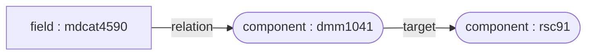

# Diffusion config properties

Samples of diffusion configurations using Publication API v1.

This is a draft  where to write some useful examples of Publication API Ontology configuration for complex parsers and definitions.

Please note that this documentation is incomplete and will grow over time.
In the meantime, you can always see examples of real use cases in the Dédalo Ontology diffusion starting at `dd1190` or you can consult the existing map and process methods in the class `diffusion_sql` at [/dedalo/core/diffusion/class.diffusion_sql.php](https://github.com/renderpci/dedalo/blob/master/core/diffusion/class.diffusion_sql.php)


# component_autocomplete_hi cases

With custom parents (slice)
>Selects a portion of the parents array

#### direct

```json
{
  "process_dato": "diffusion_sql::resolve_component_value",
  "process_dato_arguments": {
    "component_method": "get_diffusion_value",
    "custom_arguments": [
      {
        "custom_parents": {
        "info": " Select a portion of the result array, normally term with parents. In this case select only the region",
          "slice": [
            1,
            1
          ],
        }
      }
    ]
  }
}
```

#### deep

```json
{
    "process_dato": "diffusion_sql::resolve_value",
    "process_dato_arguments": {
        "target_component_tipo": "rsc91",
        "component_method": "get_diffusion_value",
        "custom_arguments": [
            {
                "custom_parents": {
                    "info": " Select a portion of the result array, normally term with parents. In this case select only the region",
                    "slice": [
                        1,
                        1
                    ]
                }
            }
        ]
    }
}
```
---

With custom parents (select_model)
>Filter results by model code like ["es2_8871"]

##### direct

```json
{
  "process_dato": "diffusion_sql::resolve_component_value",
  "process_dato_arguments": {
    "component_method": "get_diffusion_value",
    "custom_arguments": [
      {
        "custom_parents": {
          "info": " Select by model code (region '8871' from es2)",
          "select_model": ["es2_8871"]
        }
      }
    ]
  }
}
```

##### deep

```json
{
  "process_dato": "diffusion_sql::resolve_value",
  "process_dato_arguments": {
    "target_component_tipo": "rsc91",
    "component_method": "get_diffusion_value",
    "custom_arguments": [
      {
        "custom_parents": {
          "info": " Select by model code (region '8871' from es2)",
          "select_model": ["es2_8871"]
        }
      }
    ]
  }
}
```
---

# component_portal cases

Generic resolution
>Resolves component value inside the portal at first level
##### direct

```json
{
  "process_dato": "diffusion_sql::resolve_value",
  "process_dato_arguments": {
    "target_component_tipo": "rsc93",
    "component_method": "get_diffusion_value"
  }
}
```

---

Anonymized name
>Process results anonymizing values like 'Juan Pérez Marina' to 'JPM'
##### direct

```json
{
  "process_dato": "diffusion_sql::anonymized_name",
  "process_dato_arguments": {
    "target_component_tipo": [
      "rsc85",
      "rsc86"
    ],
    "anonymized_type": "name_capitals"
  }
}
```
---

# component_section_id cases

Map to 'terminoID'
>Process result from section_id to term_id like: 1023 => 'dmm1023'
##### direct

```json
{
  "process_dato": "diffusion_sql::map_to_terminoID"
}
```

---

# component_radio_button cases

Map locator to value
>Process result converting locators to mapped values like "1" => true, "2" => false
##### direct

```json
{
  "process_dato": "diffusion_sql::map_locator_to_value",
  "process_dato_arguments": {
    "map": {
      "1": 1,
      "2": 0
    }
  }
}
```

---

# component_date cases

Split date range
>Process result splitting and formatting a component_date value like dd_date => 1964
##### direct

```json
{
  "process_dato": "diffusion_sql::split_date_range",
  "process_dato_arguments": {
    "selected_key": 0,
    "selected_date": "start",
    "date_format": "year"
  }
}
```

---
