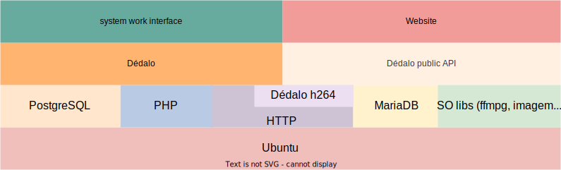
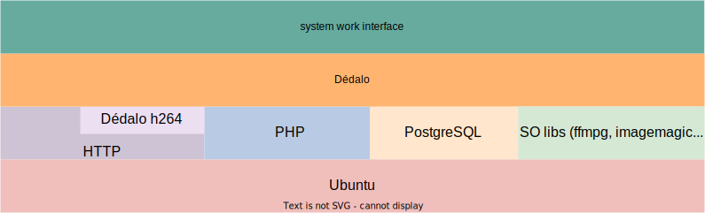
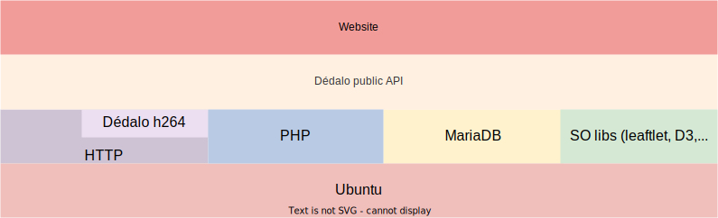
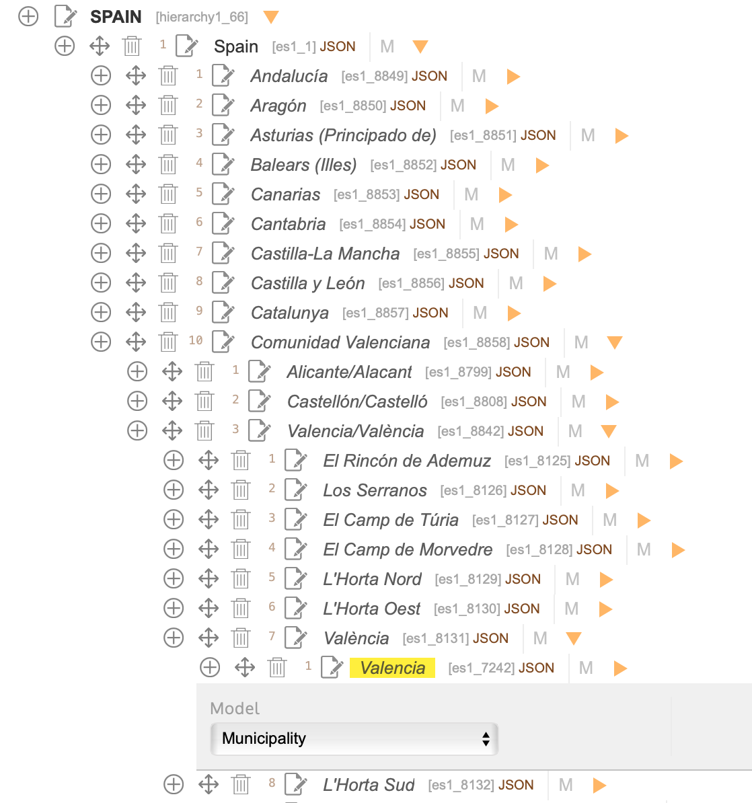
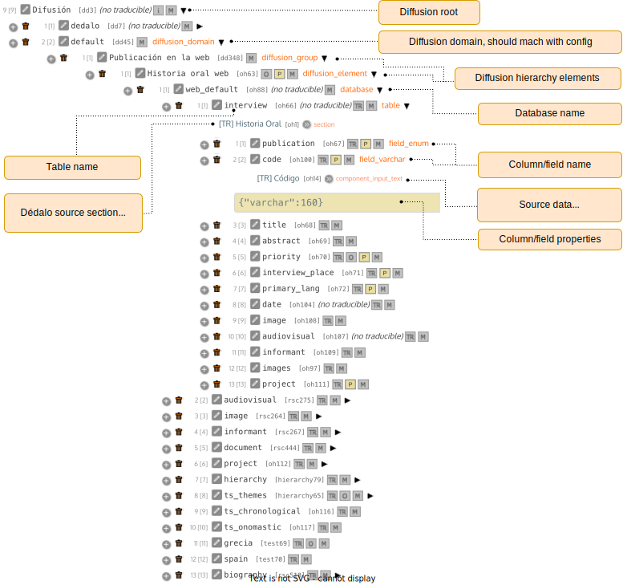
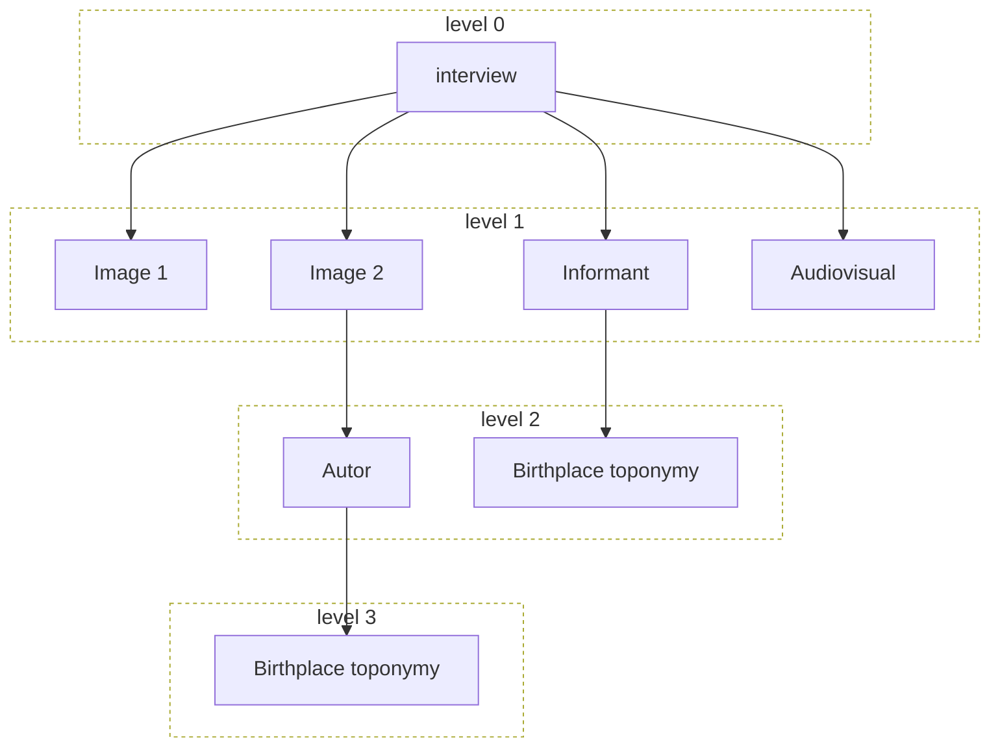
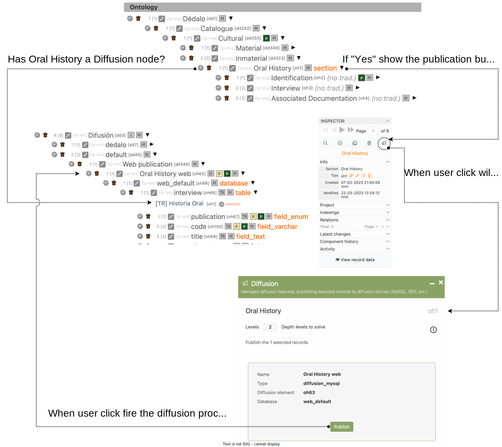
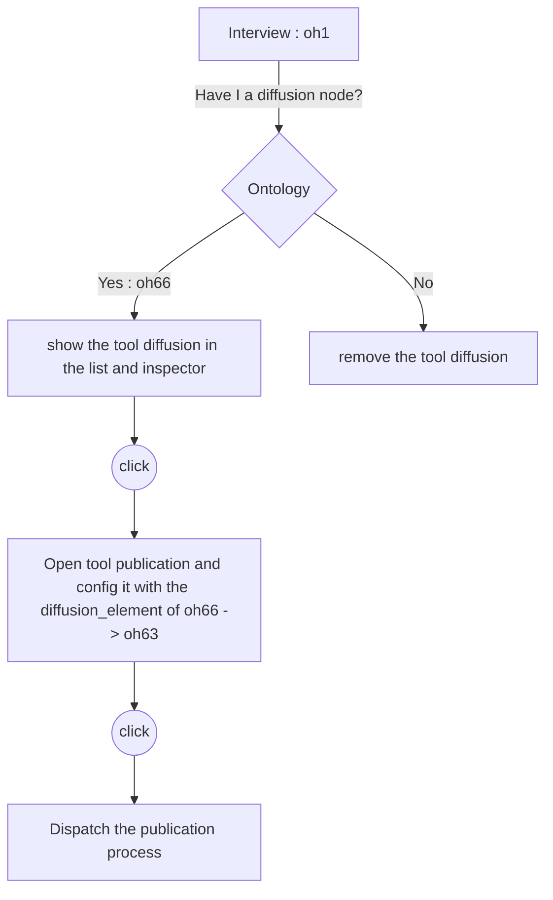
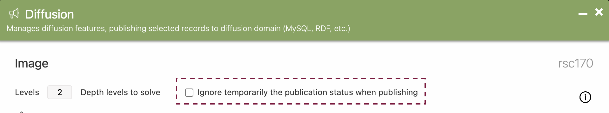

# Dédalo diffusion data flow

Dédalo has two different database system, work system and diffusion system, both are controlled by the ontology.

Diffusion system is used to dissemination/publication of content and it get his data from work system. But in the process to publish data Dédalo will do a transformation to adapt work data into different formats and standards. This means that work data and public data are totally separate, with different database and sometimes on different physical servers.

Diffusion system has been build to create flexible system with access **only** to data that can be public, preserving the original data of the work system.

Researchers decide what data is public and what is not, and since they are separated, an attack on the public server or a technical problem in the publication area will not affect the working system.

Yuo can think in diffusion system as a copy of your data, a copy done in the moment of publication, in the same way that print a copy in paper. Diffusion data is a flat version ready to use in web pages.

## Server

Dédalo can be installed and configured in some different ways. It depends of your capacity and your own requirements. For a small museum or personal researched the installation could be done in the same server. For a medium or big collections is better to use two different servers one for the work system and other for the diffusion system. In a large museums with lots of visitants is possible replicate the diffusion system to second (or more) diffusion server to balance the visitors to avoid saturation.

1. The most basic configuration is a unique server with all systems (work system and diffusion system). The workspace and the diffusion is inside the same server. Pros: This configuration is easy to create and maintain, the server has all services, media, etc. Cons: any interference in website or attack will affect to work system.

   

   In this configuration all libs a services are shared between work system and diffusion system. Apache and PHP configuration are the same and all libraries are shared between both systems.

   

2. The most typical, and maybe the most used configuration is the configuration with two servers, one for work system, and another for Diffusion. Pros: the website is totally separated of the work system and you can scale if you have a lot of traffic into website, an attack to the website do no affect to work system. Cons: double maintenance, double cost.

   

   In this configuration the libraries and servicers are not shared. Worksystem has his own Apache and PHP configuration and the system has the libraries to use at work system, MariaDB or MySQL is not installed.

   

   In diffusion server Dédalo is not full installed, only publication API and shared libraries between works system and diffusion will be installed. Apache and PHP has his own configuration and PostgreSQL will not installed.

   

3. Three different servers, first for work system, the second for media, the third for diffusion. This configuration ensure that your media files are shared by work system and diffusion system without copy media data into diffusion system.

   

In all configurations Dédalo will copy/export data from work system (stored in PostgreSQL) to diffusion system (stored in MariaDB/MySQL).

## Configuration

Diffusion system has two config file with his own parameters that need to be changed with the your own project environment.

Work system will need access to MariaDB / MySQL database to publish data, to config this part:

1. Changing parameters of [database configuration file](../config/config_db.md#changing-parameters-of-dédalo-database-config-file).
   1. Changing parameters of database for diffusion system [configuration](../config/config_db.md#diffusion-system-database-variables)

Diffusion system has his own publication API to connect public web pages with the public database:
2. Changing parameters of Dédalo public API [configuration file](./publication_api/public_api_configuration.md).

## Diffusion ontology

All data flow from work system to diffusion system is controlled by diffusion ontology. Diffusion ontology is a specific part of the Dédalo ontology to define how the data will be published. The main idea is control the access to private data and how will be showed in the public web.

Diffusion system will not have all data managed by Dédalo work system, only specific data than researches want to publish will be accessible. To understand this, you need to know that some archives has a personal data as telephone or address that it can not to be public. And doing this transform you can control what data can be public and what no.

Besides, publication process could transform the original data into different "formats" or "versions".

For example: if you want to show one city, you can choose how this data will be processed by the web, so you can to define different formats to achieve these needs. So, to publish "Valencia" you can think; what kind of data will I need? and format it.

Let me explain it. Inside Dédalo a toponymy as Valencia is a thesaurus term with all administrative hierarchy:



Ontology definition to publish this toponymy could be configured to get:

- Publish only the name of the town.
- Publish the name and all his parents (all administrative hierarchy).
- Publish the name and the county.
- Publish the name and model (municipality)
- etc...

So you can create different fields in the publication database with different data:

| field           | value                                                                |
| ----------------- | ---------------------------------------------------------------------- |
| toponymy        | Valencia                                                             |
| with_parents    | Valencia, València, Valencia/Valéncia, Comunitat Valenciana, Spain |
| toponymy_county | Valencia, Spain                                                      |
| toponymy_model  | Valencia, Municipality                                               |
| etc             | etc                                                                  |

And you will have your publish data for different situations, if you need search by community ("Comunitat Valenciana") instead the municipality, so, you can do it searching in the field "with_parents".

In other situation will need add Valencia as a point into a map, to do that, you will need to use the geo data, so, you can define the ontology to add it to the resolution:

| field    | value                                                                     |
| ---------- | --------------------------------------------------------------------------- |
| toponymy | Valencia                                                                  |
| geo      | \{"alt":16,"lat":39.469860091745815,"lon":-0.3764533996582032,"zoom":12} |

Or you will need to link the term and his parents with the thesaurus table then you can configure publication ontology to add his locators:

| field        | value                                                                |
| -------------- | ---------------------------------------------------------------------- |
| toponymy     | Valencia                                                             |
| data         | \["es1_7242"]                                                       |
| with_parents | Valencia, València, Valencia/Valéncia, Comunitat Valenciana, Spain |
| data_parents | \["es1_7242", "es1_8131","es1_8842", "es1_8858", "es1_1"]           |

The original data "Valencia" could be transformed into different fields to be used as specific needs without change the original data in PostgreSQL.

Doing those transformations we can adapt the data into publication database to be ready for different applications / optimizations, and create a very efficient websites, because the data is prepared to resolve the needs of the website, and, if in the future, you will need to add another combination not defined, is easy to include it.

### How publication ontology works?

All publication process is defined in Dédalo ontology, and it is dependent of the [diffusion](https://dedalo.dev/ontology/dd3) node.

Ontology defines some models to create a diffusion schema. This diffusion ontology defines the characteristics, relationships and nomenclatures of the destination tables and their columns, as well as the format of the data to be published.

There are pre-configured dissemination ontologies such as Oral History that can be extended and modified as needed.



For each target element there is an object or element in the ontology (node in the hierarchy) that represents it and on which specific parameters can be configured. This node element has a 'model' that defines what it is, which determines the options it can use and how they will be dynamically interpreted by Dédalo.

For example, to represent a standard table and its columns in MySQL, we would define in the ontology a 'table' model element configured with a related term (TR) that points to the Oral History section (oh1) where the data will come from.

As a child of this term, we would create a 'field_varchar' model term (note that it corresponds to the standard MySQL column type preceded by the 'field_' prefix) and in its JSON properties, in this case, we would define the value of the length of desired characters, for example, {"varchar":160}.

This element would point (related term) to the source component of the data, 'Code' (oh14). This is the case for all the desired columns.

For a publication ontology to be operational, it is necessary to always create a 'field_enum' column related to the publication component of the section. In this way we will have control of whether a record is publishable or not.

#### Common models

**diffusion_root**
Dédalo defines the publication architecture as an ontology subtree below the root diffusion node 'dd3' with the model "diffusion", this node ca not be changed, to build a specific diffusion model is necessary build a diffusion domain below the root diffusion node.

**diffusion_domain**
Every diffusion domain would be created using the custom diffusion model elements to describe the complete diffusion flow. One Dédalo installation can has some different diffusion domain nodes, each of these nodes for one specific publication.

**diffusion_group**
Group of diffusion_elements, used to organize the hierarchy.

**diffusion_element**
The diffusion element define the start point into the model of publication. These nodes defines the publication format and the script that can convert the data to specific output.

| model             | definition                                |
| ----------------- | --------------------------------------- |
| diffusion         | main diffusion ontology                   |
| diffusion_domain  | entity or tld group (main diffusion term) |
| diffusion_group   | specific group                            |
| diffusion_element | diffusion stream start point              |
| external_ontologies | main diffusion to defines external ontologies |
| external_ontology | main node of every ontology as Dublin Core, Nomisma, CIDOC, etc. |

#### Models for SQL

| model            | definition                                                         |
| ------------------ | -------------------------------------------------------------------- |
| database         | name of MariaDB / MySQL database                                   |
| database_alias   | name of table in database (copy of schema of other database term ) |
| table            | name of table in database                                          |
| table_alias      | name of table in database (copy of schema of other table term )    |
| field_boolean    | bool field inside table in database                                |
| field_date       | timestamp field inside table in database                           |
| field_decimal    | float field inside table in database                               |
| field_enum       | enum field inside table in database                                |
| field_int        | in field inside table in database                                  |
| field_mediumtext | mediumtext field inside table in database                          |
| field_point      | mediumtext field inside table in database                          |
| field_varchar    | varchar field inside table in database                             |
| field_text       | text field inside table in database                                |
| field_year       | year field inside table in database                                |

##### Table nodes

Within diffusion ontology, we should create as many table nodes as tables we would like to publish in the public database (mysql). Every table node is related through a Related Term (TR) with a source data section element. In the example below, `interview` table node is related with 'oh1' section (Oral History).

##### Field nodes

Within diffusion ontology, field nodes are the equivalent of mysql columns within a table. We would add as many field nodes to a table element as we would like to publish in the public database.

Every field node is related through a Related Term (TR) with a source data component element, in the previous table example, publication, code, title and abstract fields nodes are related with some components within 'oh1' section (Oral History).

Depending on the selected field model, there are some different properties that must be set. These are some examples:

| Dédalo field element | Dédalo property |
| --- | --- |
| field_enum | {"enum": {"1": "yes","2": "no"}} |
| field_varchar | {"varchar":160} |

Some times the source data should be processed before sending a response. There is a special property used to configure a function that should be executed to get the final data result:

```json
{
    // class_name - will be set with name of the class where the function to be executed is located
    // function_name - will be set with the name of the function to be executed to process the data
    "process_dato": "class_name::function_name",
    "process_dato_arguments": {
        // argument1…N - will be set with the different parameters that the function needs to process the data
        // value1…N - will be set with the value that will be assigned to the parameter"
        "argument1": "value1_text",
        "argument2": "value2_int",
        ...
        "argumentN": "valueN_text"
        }
}
```

Examples:

```json
{
  "process_dato": "diffusion_sql::split_date_range",
  "process_dato_arguments": {
    "selected_key": 0,
    "selected_date": "start"
  }
}
```

The function will process a component date of range type and will split it returning, in this case, the start date.

```json
{
    "process_dato": "diffusion_sql::map_locator_to_termID",
    "process_dato_arguments": {
        "custom_arguments": {
            "add_parents": false
        }
    }
}
```

The function will map the locators to their termID and, in this case, is not adding their parents.

#### Models for RDF

| model               | definition                                  |
| --------------------- | --------------------------------------------- |
| external_ontologies | group of definitions (main  diffusion term) |
| external_ontology   | definition of other ontology                |
| owl:Class           | Class                                       |
| owl:ObjectProperty  | Property                                    |

## Dédalo diffusion engine

It manages Dédalo’s diffusion schema and data.

Diffusion engine will process the Dédalo data and transform to other formats using the diffusion ontology. When user publish data Diffusion engine will do the transoms and store the result into other databases or files using an ontology map that defines what sections and fields will be exported.

The most common scenario is to publish the data in a separate MariaDB / MySQL database. All the published data is intentionally published by the administrators and therefore, the destination database can be used for consultation without compromising the original data stored in the Dédalo working database.

> Output could be targeted to another database or RDF files or any other format defined in the diffusion ontology. Every format will has his own diffusion engine.

Dédalo has some configurations already prepared for use as Oral History, Bibliography or Web, but you can build others, following the already existing elements patterns.

Each element of the ontology has several parameters that define the characteristics and the output format of the field in the MySQL table.

For example, the column name, the column type (varchar, text, int, date, etc.) the output processing (diffusion methods to post process the data), etc.

When data is published it will be accessible by the Publication Server API.

## Dédalo diffusion resolve levels

In the process to publish data Dédalo will do a resolution of linked information to add as flat to the main data. The information inside Dédalo work system use a relation model resolved by locators, and one section can has a lots of ramifications to different resources, bibliography, thesaurus, etc. every information linked from portals or autocomplete is a level of information. The direct linked information to the main level is the first level, the information that is linked to the first level is the second, etc... When the user click the publication button Dédalo will follow every locator to resolve the linked data. This process could be very long in large databases and sometimes it is not necessary resolve all linked data.

Ex: If you have 1 interview of oh with 1 linked image and this image has a person linked as author that has 1 linked toponym for the birthplace. For publishing all linked information will be necessary 3 levels of resolution:

1 interview -> 1 image -> 1 person -> 1 toponym



The default this parameter is 2 levels. If you increase the value of this parameter, the time needed by Dédalo to resolve the linked data in the publication process will also increase because the ramifications will multiple in x times for every level in exponential progression.

You can change this default parameter in [DEDALO_DIFFUSION_RESOLVE_LEVELS](../config/config.md#defining-resolution-levels-going-to-the-deeper-information) in server_config_api.php or manually in work system interface before dispatch the publication process.

## Publishing data

Publishing data is a process dispatched by users in work system. If the section is referred by some diffusion node, the work system will show the button to fire the process. Work system will see the diffusion ontology and will transform work data into the model of data defined in diffusion ontology.



Do you want to see previous image in a graph?



When the user publishes data from the 'Oral History' section (oh1) with the publication button, that have been activated because the section has a caller in diffusion ontology, the publication flow begins.

Dédalo then collects the required data from the section (oh1), traverses each of the terms defined in the section's publication ontology tree transforming the original data into flat export values. This conversion implies, for example, that the translatable data in Dédalo, which contains all languages simultaneously, is broken down at the time of publication into a value for each language that will generate a different record for each of them.

!!! Note "Publication buttons"
    The publication button appear in list and edit modes. In list will publish all records found (user can search to filter the records to be published), in the edit will be published only the record that is editing.

### Data managed

Take account this data used in work system.

Table **interview : oh1**

| tipo | field label | value | data - in Dédalo format |
| --- | --- | --- | --- |
| [oh62](https://dedalo.dev/ontology/oh62) | id | 1 | \[1] |
| [oh14](https://dedalo.dev/ontology/oh14) | Code | oh_code1 | \["oh_code1"] |
| [oh16](https://dedalo.dev/ontology/oh16) | Title | My title |  \["My title"] |
| [oh23](https://dedalo.dev/ontology/oh23) | Summary | My abstract translated | \["My abstract translated"] |
| [oh24](https://dedalo.dev/ontology/oh24) | Informants | Manuel González, María Gómez | \[{"section_id" : "1","section_tipo" : "rsc197"},{"section_id" : "2", "section_tipo" : "rsc197"}] |

The interview 1 has two informants (interviewees) linked by locators stored in `informants oh24` field. THerefore the table of informant will had two records:

Table **informants : rsc197**

| tipo | field label | value | data - in Dédalo format |
| --- | --- | --- | --- |
| [rsc261](https://dedalo.dev/ontology/rsc261) | id | 1 | \[1] |
| [rsc85](https://dedalo.dev/ontology/rsc85) | Name | Manuel | \["Manuel"] |
| [rsc86](https://dedalo.dev/ontology/rsc86) | Surname | González | \["González"] |
| [rsc89](https://dedalo.dev/ontology/rsc89) | Date of birth | 1936 | \[{"start":{"year":1936}}] |

| tipo | field label | value | data - in Dédalo format |
| --- | --- | --- | --- |
| [rsc261](https://dedalo.dev/ontology/rsc261) | id | 2 | \[2] |
| [rsc85](https://dedalo.dev/ontology/rsc85)  | Name | María | \["María"] |
| [rsc86](https://dedalo.dev/ontology/rsc86) | Surname | Gómez | \["Gómez"] |
| [rsc89](https://dedalo.dev/ontology/rsc89) | Date of birth | 1945-09-30 | \[{"start":{"day":30,"year":1945,"month":9}}] |

Lets go to publish this data and see what will stored into MariaDB/MySQL.

Diffusion ontology has this resolution

| tipo | field name | model | get data from | name of working data |
| --- | --- | --- | --- |  --- |
| [oh66](https://dedalo.dev/ontology/oh66) | interview | table | [oh1](https://dedalo.dev/ontology/oh1)  | Oral history |
| [oh100](https://dedalo.dev/ontology/oh100) | code | field_varchar | [oh14](https://dedalo.dev/ontology/oh14)  | Code |
| [oh68](https://dedalo.dev/ontology/oh100) | title | field_text | [oh16](https://dedalo.dev/ontology/oh16)  | Title |
| [oh69](https://dedalo.dev/ontology/oh69) | abstract | field_text | [oh23](https://dedalo.dev/ontology/oh23)  | Summary |
| [oh109](https://dedalo.dev/ontology/oh109) | informant | field_text | [oh24](https://dedalo.dev/ontology/oh23)  | Informants |
| [rsc267](https://dedalo.dev/ontology/rsc267) | informant | table | [rsc197](https://dedalo.dev/ontology/rsc197)  | People under study |
| [rsc269](https://dedalo.dev/ontology/rsc269) | name | field_text | [rsc85](https://dedalo.dev/ontology/rsc85)  | Name |
| [rsc270](https://dedalo.dev/ontology/rsc270) | surname | field_text | [rsc86](https://dedalo.dev/ontology/rsc86) | Surname |
| [rsc272](https://dedalo.dev/ontology/rsc272) | birthdate | field_date | [rsc89](https://dedalo.dev/ontology/rsc89) | Date of birth |

First at all the publication process will verify if the database and the table exist in MariaDB / MySQL, if not, will create it automatically with the schema defined in diffusion ontology. By default Dédalo add the columns `id` `section_id` and `lang` because this columns are mandatory.

Example; if diffusion ontology only has a `code` node defined as field_varchar of 160 characters, Dédalo will create the database, table and mandatory columns in this way.

```SQL
CREATE TABLE `interview` (
    `id` int NOT NULL PRIMARY KEY,
    `section_id` int NOT NULL,
    `lang` varchar(8) NOT NULL,
    `code` varchar(160) NOT NULL
) ENGINE='MyISAM';
```

!!! note "MariaDB / MySQL engine"
    By default Dédalo use MyISAM as database engine, because the tables are only for read by the website and it will not required edition functionalities as InnoDB has. If you want change it, you will see the `./core/diffusion/class.diffusion_mysql.php`

The table `interview` will has the columns

| id | section_id | lang | code |
| --- | --- | --- | --- |
| 1 | 1 | lg-eng | oh_code1 |

These publish tables could be deleted at any time and for different reasons, since the original data is saved in the working system and it is possible to republish it to recreate the table.

If an user republish a previously published record, the actual record in MariaDB/MySQL will be delete and will recreated new one with the current data even if the data in work system was not changed (in this case the id will increment but the rest of data will be the same).

| id | section_id | lang | code |
| --- | --- | --- | --- |
| 2 | 1 | lg-eng | oh_code1 |

Every language defined will create his own record and will store the lang code in lang column. Therefore publishing a multilingual data in English, Español and Català, as the same data you will get 3 different rows for the record 1 (section_id = 1).

| id | section_id | lang | title |
| --- | --- | --- | --- |
| 1 | 1 | lg-eng | My title |
| 2 | 1 | lg-spa | Mi título |
| 3 | 1 | lg-cat | El meu títol |

If the working data do not has the translation, publication process will do fallback to the main data lang defined in [DEDALO_DATA_LANG_DEFAULT](../config/config.md#defining-default-data-language) in `./config/config.php` file

For example if working data has the abstract in English and Español but it is not done in Català, (català is empty) you will get:

| id | section_id | lang | abstract |
| --- | --- | --- | --- |
| 1 | 1 | lg-eng | My abstract translated |
| 2 | 1 | lg-spa | Mi resumen traducido |
| 3 | 1 | lg-cat | My abstract translated |

If the working data is not translatable, as `code` is, the data will repeat in all rows.

| id | section_id | lang | code | title |
| --- | --- | --- | --- | --- |
| 1 | 1 | lg-eng | oh_code1 | My title |
| 2 | 1 | lg-spa | oh_code1 | Mi título |
| 3 | 1 | lg-cat | oh_code1 |  El meu titol |

In diffusion process the related data is resolve in lot of cases but sometimes is necessary to have links between tables to resolve complex situation, in these cases the column will store an array of  `section_id` of the other table in JSON and how this data is not translatable it will repeat for every row.

In this sample we have 2 informants (two interviewees) for the interview his section will have two `locators` to link with this persons.

```json
[
    {
    "section_id" : "1",
    "section_tipo" : "rsc197"
    },
    {
    "section_id" : "2",
    "section_tipo" : "rsc197"
    }
]
```

When user do the publication you will have:

Table **interview**:

| id | section_id | lang | code | title | informant_data
| --- | --- | --- | --- | --- | --- |
| 1 | 1 | lg-eng | oh_code1 | My title | \["1","2"]  |
| 2 | 1 | lg-spa | oh_code1 | Mi título | \["1","2"]  |
| 3 | 1 | lg-cat | oh_code1 |  El meu títol | \["1","2"]  |

Table **informant**:

| id | section_id | lang | name | surname |
| --- | --- | --- | --- | --- |
| 4 | 1 | lg-eng | Manuel | González |
| 7 | 2 | lg-eng | María | Gómez |

To avoid resolve data is possible to add the related data into the main table, therefore you can get the names of the informants in the same table of the interview.

| id | section_id | lang | code | informant_data | informant |
| --- | --- | --- | --- | --- | --- |
| 1 | 1 | lg-eng | oh_code1 | \["1","2"]  | Manuel González, María Gómez |
| 2 | 1 | lg-spa | oh_code1 | \["1","2"] | Manuel González, María Gómez |
| 3 | 1 | lg-cat | oh_code1 | \["1","2"]  | Manuel González, María Gómez |

Or is possible to define the resolve data of other fields as birth date of informants.

| id | section_id | lang | code  | informant_data | informant | birthdate |
| --- | --- | --- | --- | --- | --- | --- |
| 1 | 1 | lg-eng | oh_code1 | \["1","2"]  | Manuel González, María Gómez | 1936, 1945-09-30 |
| 2 | 1 | lg-spa | oh_code1 | \["1","2"]  | Manuel González, María Gómez | 1936, 1945-09-30 |
| 3 | 1 | lg-cat | oh_code1 | \["1","2"]  | Manuel González, María Gómez | 1936, 1945-09-30 |

Besides birth date will be in the informant table.

| id | section_id | lang | name | surname |  birthdate |
| --- | --- | --- | --- | --- | --- |
| 4 | 1 | lg-eng | Manuel | González |  1936 |
| 7 | 2 | lg-eng | María | Gómez | 1945-09-30 |

Sometimes, related data could be stored as an array instead a string.

| id | section_id | lang | code  | informant_data | informant | birthdate |
| --- | --- | --- | --- | --- | --- | --- |
| 1 | 1 | lg-eng | oh_code1 | \["1","2"] | \["Manuel González", "María Gómez"] | \["1936", "1945-09-30"] |
| 2 | 1 | lg-spa | oh_code1 | \["1","2"] | \["Manuel González", "María Gómez"] | \["1936", "1945-09-30"] |
| 3 | 1 | lg-cat | oh_code1 | \["1","2"] | \["Manuel González", "María Gómez"] | \["1936", "1945-09-30"] |

The order of related data will be the same of the section_id array order, if the user change the order in the interview the resolution of the related data will be sync with it.

| id | section_id | lang | code  | informant_data | informant | birthdate |
| --- | --- | --- | --- | --- | --- | --- |
| 2 | 1 | lg-spa | oh_code1 | \["2","1"] | \["María Gómez", "Manuel González"] | \[ "1945-09-30", "1936"] |
| 1 | 1 | lg-eng | oh_code1 | \["2","1"] | \["María Gómez", "Manuel González"] | \[ "1945-09-30", "1936"] |
| 3 | 1 | lg-cat | oh_code1 | \["2","1"] | \["María Gómez", "Manuel González"] | \[ "1945-09-30", "1936"] |

### Check the publication state

skip_publication_state_check `int`

When one user publishes some record, Dédalo checks if this information has changes that are not published, if Dédalo found new data to publish the diffusion process began and the information will be replaced in MySQL. If the register doesn't have new information the process is stopped for this record.

Checking the publication status prevent double, triple o more publications of the same record and all process will be faster (some records will not published), but in some cases can be useful that Dédalo don't check the diffusion state, and perform the publication process for every record has new information or no.

This property configures the publication process to check the new data status or ignore it. This property is stored into the global Dédalo `$_SESSION`.

```php
$_SESSION['dedalo']['config']['skip_publication_state_check'] = 1;
```

| Value | skip state check? |
|  --- |  ---  |
| 0 | don't check |
| 1 | check  |

The property is possible change by users into the publication tool.


