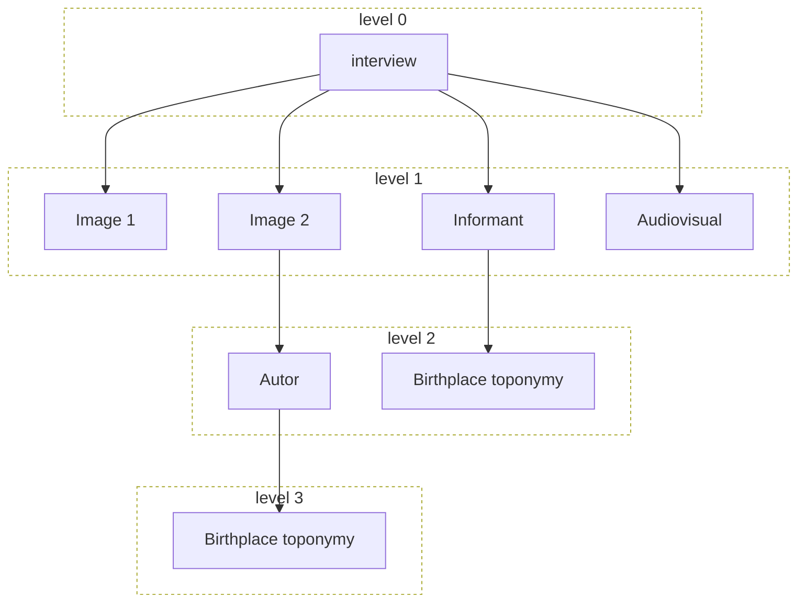

# Dédalo diffusion data flow

Dédalo has two different database system, work system and diffusion system, both are controlled by the ontology.

Diffusion system is used to dissemination/publication of content and it get his data from work system. But in the process to publish data Dédalo will do a transformation to adapt work data into different formats and standards. This means that work data and public data are totally separate, with different database and sometimes on different physical servers.

Diffusion system has been build to create flexible system with access **only** to data that can be public, preserving the original data of the work system.

Researchers decide what data is public and what is not, and since they are separated, an attack on the public server or a technical problem in the publication area will not affect the working system.

Yuo can think in diffusion system as a copy of your data, a copy done in the moment of publication, in the same way that print a copy in paper. Diffusion data is a flat version ready to use in web pages.

## Server

Dédalo can be installed and configured in some different ways. It depends of your capacity and your own requirements. For a small museum or personal researched the installation could be done in the same server. For a medium or big collections is better to use two different servers one for the work system and other for the diffusion system. In a large museums with lots of visitants is possible replicate the diffusion system to second (or more) diffusion server to balance the visitors to avoid saturation.

1. The most basic configuration is a unique server with all systems (work system and diffusion system). The workspace and the diffusion is inside the same server. Pros: This configuration is easy to create and maintain, the server has all services, media, etc. Cons: any interference in website or attack will affect to work system.

   

   In this configuration all libs a services are shared between work system and diffusion system. Apache and PHP configuration are the same and all libraries are shared between both systems.

   
2. The most typical, and maybe the most used configuration is the configuration with two servers, one for work system, and another for Diffusion. Pros: the website is totally separated of the work system and you can scale if you have a lot of traffic into website, an attack to the website do no affect to work system. Cons: double maintenance, double cost.

   

   In this configuration the libraries and servicers are not shared. Worksystem has his own Apache and PHP configuration and the system has the libraries to use at work system, MariaDB or MySQL is not installed.

   

   In diffusion server Dédalo is not full installed, only publication API and shared libraries between works system and diffusion will be installed. Apache and PHP has his own configuration and PostgreSQL will not installed.

   
3. Three different servers, first for work system, the second for media, the third for diffusion. This configuration ensure that your media files are shared by work system and diffusion system without copy media data into diffusion system.

   

In all configurations Dédalo will copy/export data from work system (stored in PostgreSQL) to diffusion system (stored in MariaDB/MySQL).

## Configuration

Diffusion system has two config file with his own parameters that need to be changed with the your own project environment.

Work system will need access to MariaDB / MySQL database to publish data, to config this part:

1. Changing parameters of [database configuration file](../config/config_db.md#changing-parameters-of-dédalo-database-config-file).
   1. Changing parameters of database for diffusion system [configuration](../config/config_db.md#diffusion-system-database-variables)

Diffusion system has his own publication API to connect public web pages with the public database:
2. Changing parameters of Dédalo public API [configuration file](./publication_api/public_api_configuration.md).

## Diffusion ontology

All data flow from work system to diffusion system is controlled by diffusion ontology. Diffusion ontology is a specific part of the Dédalo ontology to define how the data will be published. The main idea is control the access to private data and how will be showed in the public web.

Diffusion system will not have all data managed by Dédalo work system, only specific data than researches want to publish will be accessible. To understand this, you need to know that some archives has a personal data as telephone or address that it can not to be public. And doing this transform you can control what data could be public and what no.

Besides, publication process could transform the original data into different "formats" or "versions".

For example: if you want to show one city, you can choose how this data will be processed by the web, so you can to define different formats to achieve these needs. So, to publish "Valencia" you can think; what kind of data will I need? and format it.

Let me explain it. Inside Dédalo a toponymy as Valencia is a thesaurus term with all administrative hierarchy:

Ontology definition to publish this toponymy could be configured to get:

Only the name of the town. The name and all his parents (all administrative hierarchy), the name and the county, name and model (municipality), etc...

So you can create different fields in the publication database with different data:

| field           | value                                                                |
| ----------------- | ---------------------------------------------------------------------- |
| toponymy        | Valencia                                                             |
| with_parents    | Valencia, València, Valencia/Valéncia, Comunitat Valenciana, Spain |
| toponymy_county | Valencia, Spain                                                      |
| toponymy_model  | Valencia, Municipality                                               |
| etc             | etc                                                                  |

If you need search by community ("Comunitat Valenciana") instead the municipality, so, you can do it searching in the field "with_parents", but if you need add one point to map, you will need to  use the geo data, so, you can define to add it to the resolution:

| field    | value                                                                     |
| ---------- | --------------------------------------------------------------------------- |
| toponymy | Valencia                                                                  |
| geo      | `{"alt":16,"lat":39.469860091745815,"lon":-0.3764533996582032,"zoom":12}` |

Or you will need to link the term and his parents with the thesaurus table and you can add his locators:

| field        | value                                                                |
| -------------- | ---------------------------------------------------------------------- |
| toponymy     | Valencia                                                             |
| data         | `["es1_7242"]`                                                       |
| with_parents | Valencia, València, Valencia/Valéncia, Comunitat Valenciana, Spain |
| data_parents | `["es1_7242", "es1_8131","es1_8842", "es1_8858", "es1_1"]`           |

The original data "Valencia" could be transformed into different fields to be used as needs without change the original data in PostgreSQL.

Doing those transformations we can adapt the data into publication database to be ready for different applications / optimizations, and create a very efficient websites, because the data is prepared to resolve the needs of the website, and, if in the future, you will need to add another combination not defined, is easy to include it.

### How publication ontology works?

All publication process is defined in Dédalo ontology, and it is dependent of the [diffusion](https://dedalo.dev/ontology/dd3) term.

Ontology defines some models to create a diffusion schema.

This dissemination ontology defines the characteristics, relationships and nomenclatures of the destination tables and their columns, as well as the format of the data to be published.

There are pre-configured dissemination ontologies such as Oral History that can be extended and modified as needed.

For each target element there is an object or element in the ontology (node in the hierarchy) that represents it and on which specific parameters can be configured.

This node element has a 'model' that defines what it is, which determines the options it can use and how they will be dynamically interpreted by Dédalo.

For example, to represent a standard table and its columns in MySQL, we would define in the ontology a 'table' model element configured with a related term (TR) that points to the Oral History section (oh1) where the data will come from.

As a child of this term, we would create a 'field_varchar' model term (note that it corresponds to the standard MySQL column type preceded by the 'field_' prefix) and in its JSON properties, in this case, we would define the value of the length of desired characters, for example, {"varchar":160}.

This element would point (related term) to the source component of the data, 'Code' (oh14). This is the case for all the desired columns.

For a publication ontology to be operational, it is necessary to always create a 'field_enum' column related to the publication component of the section. In this way we will have control of whether a record is publishable or not.

Common models

| model             | definition                                |
| ----------------- | --------------------------------------- |
| diffusion_domain  | entity or tld group (main diffusion term) |
| diffusion_group   | specific group                            |
| diffusion_element | diffusion stream start point              |

For SQL:

| model            | definition                                                         |
| ------------------ | -------------------------------------------------------------------- |
| database         | name of MariaDB / MySQL database                                   |
| database_alias   | name of table in database (copy of schema of other database term ) |
| table            | name of table in database                                          |
| table_alias      | name of table in database (copy of schema of other table term )    |
| field_boolean    | bool field inside table in database                                |
| field_date       | timestamp field inside table in database                           |
| field_decimal    | float field inside table in database                               |
| field_enum       | enum field inside table in database                                |
| field_int        | in field inside table in database                                  |
| field_mediumtext | mediumtext field inside table in database                          |
| field_point      | mediumtext field inside table in database                          |
| field_varchar    | varchar field inside table in database                             |
| field_text       | text field inside table in database                                |
| field_year       | year field inside table in database                                |

For RDF:

| model               | definition                                  |
| --------------------- | --------------------------------------------- |
| external_ontologies | group of definitions (main  diffusion term) |
| external_ontology   | definition of other ontology                |
| owl:Class           | Class                                       |
| owl:ObjectProperty  | Property                                    |

## Dédalo diffusion engine

It manages Dédalo’s diffusion schema and data.

Diffusion engine will process the Dédalo data and transform to other formats using the diffusion ontology. When user publish data Diffusion engine will do the transoms and store the result into other databases or files using an ontology map that defines what sections and fields will be exported.

> Output could be targeted to another database or to RDF files.

The most common scenario is to publish the data in a separate MariaDB / MySQL database. All the published data is intentionally published by the administrators and therefore, the destination database can be used for consultation without compromising the original data stored in the Dédalo working database.

Dédalo has some configurations already prepared for use as Oral History, Bibliography or Web, but you can build others, following the already existing elements patterns.

Each element of the ontology has several parameters that define the characteristics and the output format of the field in the MySQL table.

For example, the column name, the column type (varchar, text, int, date, etc.) the output processing (diffusion methods to post process the data), etc.

When data is published it will be accessible by the Publication Server API.

## Dédalo diffusion resolve levels

The resolution of linked information that Dédalo can be resolved in the publication process. The information inside Dédalo has a relation model resolved by locators, and one section can has a lots of ramifications to different resources, thesaurus, etc. every linked information from portals or autocomplete is a level of information. The direct linked information to the main level is the first level, the information that is linked to the first level is the second, etc..

Ex: If you have 1 interview of oh with 1 linked image and this image has a person linked as author that has 1 linked toponym for the birthplace. For publishing all linked information will be necessary 3 levels of resolution:

1 interview -> 1 image -> 1 person -> 1 toponym

The default parameter is 2 levels. If you increase the value of this parameter, the time needed by Dédalo to resolve the linked data in the publication process will also increase.
