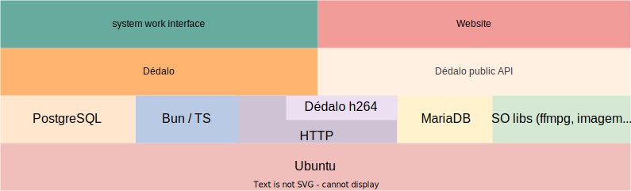
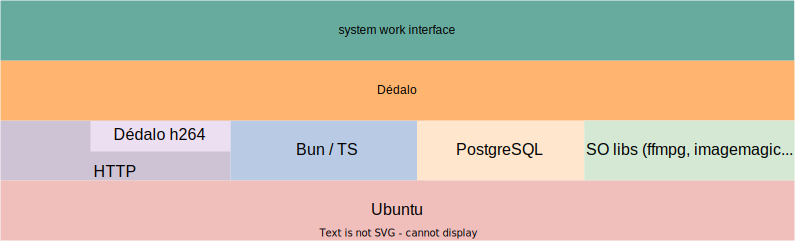
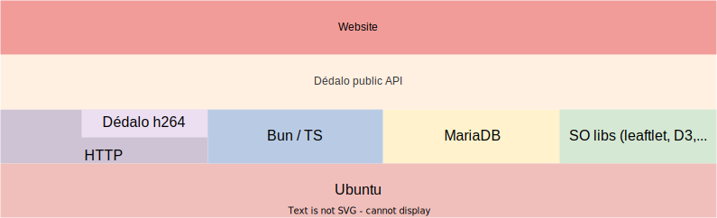
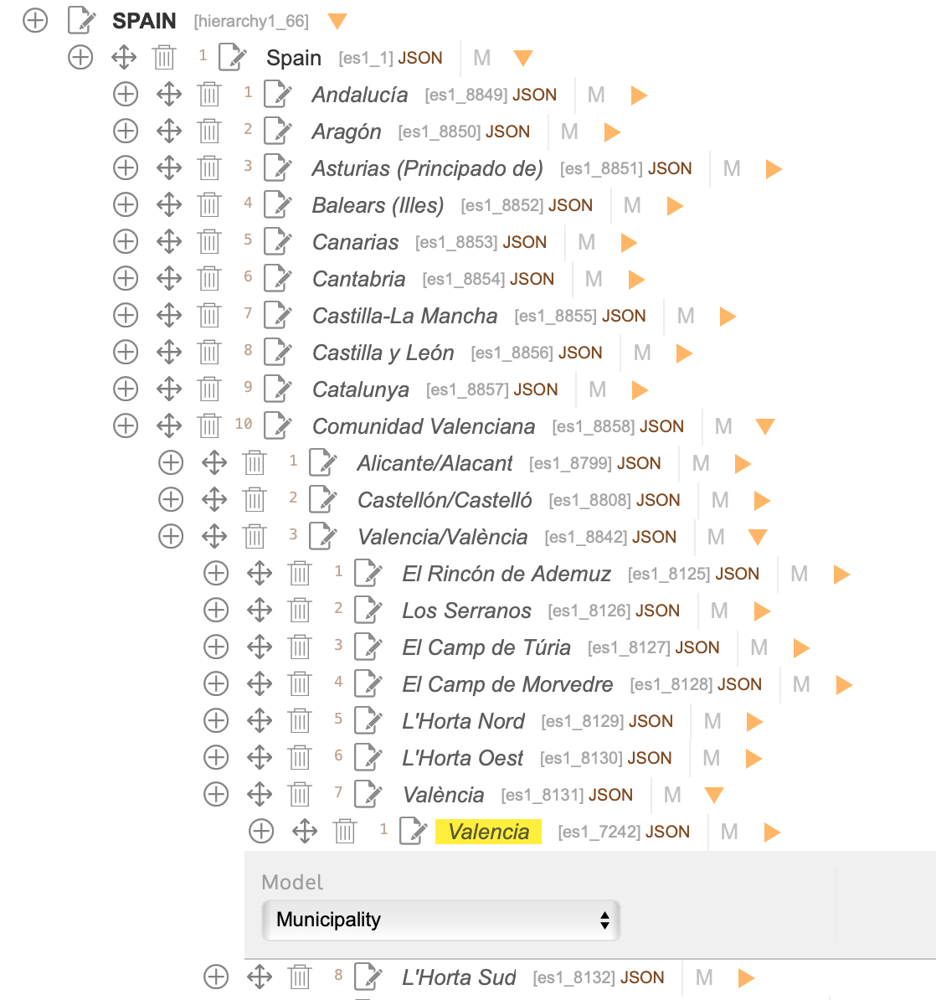
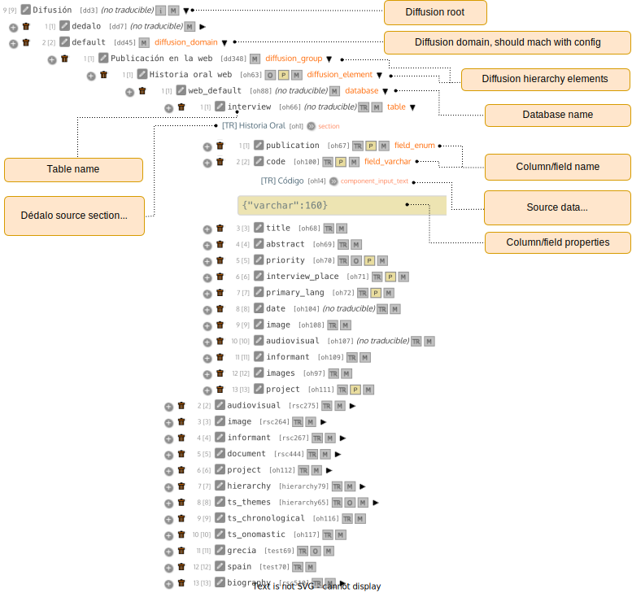
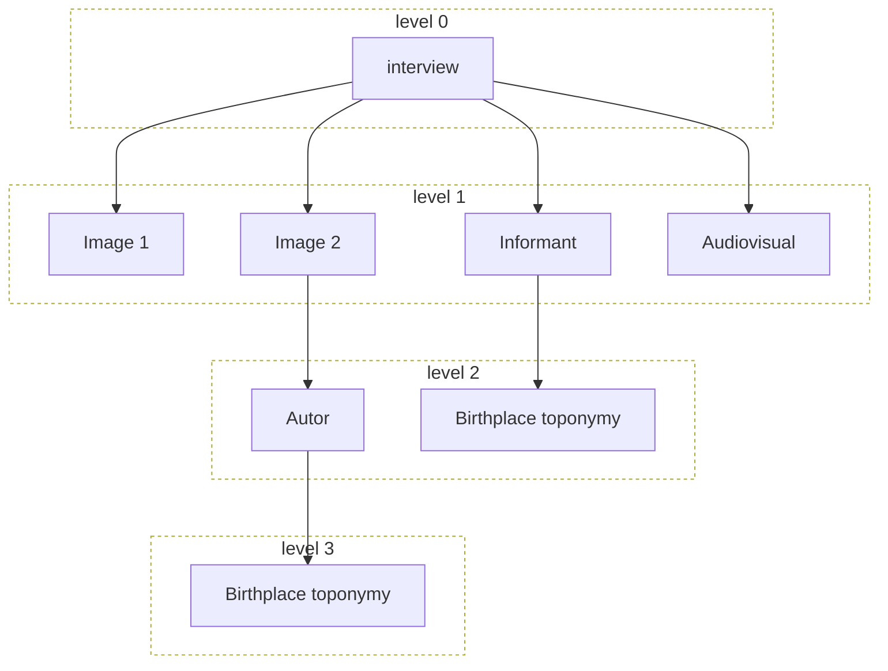
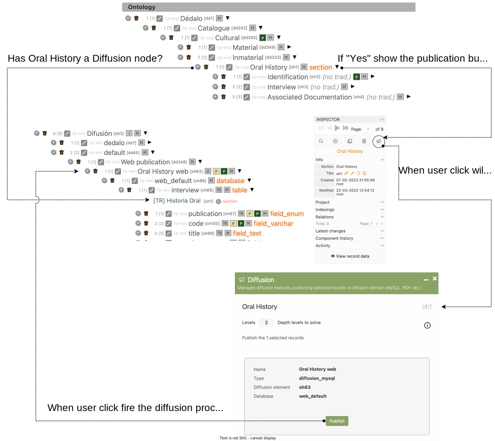
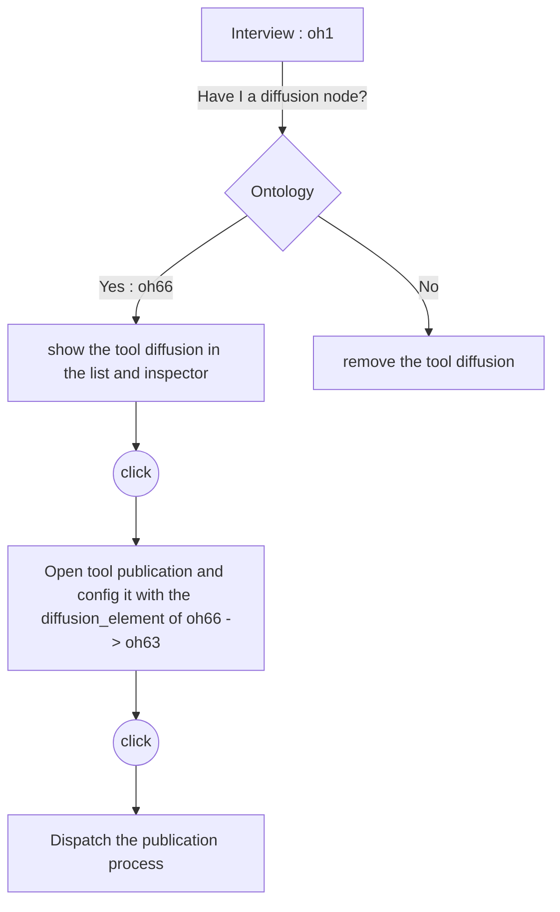
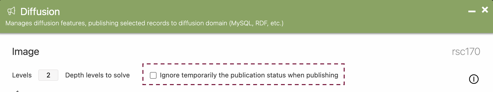

# Dédalo diffusion data flow

> See also: [The diffusion engine](native_engine.md) · [Diffusion (system overview)](../core/system/diffusion.md) · [Publication API](publication_api/index.md) · [Glossary: diffusion](../core/glossary.md#diffusion)

Dédalo has two database systems — the work system and the diffusion system — both driven by the ontology. This page explains how data flows from one to the other when you publish.

The diffusion system disseminates and publishes content, and it takes its data from the work system. When publishing, Dédalo transforms the work data to fit different formats and standards. Work data and public data therefore stay completely separate: different databases, sometimes on different physical servers.

The diffusion system is built to be flexible and to expose **only** data that can be public, preserving the original work data. Researchers decide what is public and what is not. Because the two systems are separated, an attack on the public server or a technical problem in the publication area never affects the work system.

You can think of the diffusion system as a copy of your data, made at the moment of publication — much like printing a copy on paper. Diffusion data is a flat version, ready to use in web pages.

## Server

Dédalo can be installed and configured in several ways, depending on your capacity and requirements. For a small museum or a personal research project, everything can run on the same server. For a medium or large collection it is better to use two servers, one for the work system and one for the diffusion system. For a large museum with many visitors, you can replicate the diffusion system to a second (or further) diffusion server to balance the load and avoid saturation.

1. The most basic configuration is a single server hosting everything (work system and diffusion system). The workspace and the diffusion run inside the same server. Pros: easy to create and maintain; the server has all services, media and so on. Cons: any interference on the website, or an attack, affects the work system.

   

   In this configuration all libraries and services are shared between the work system and the diffusion system: one web-server configuration, one set of runtimes, one machine.

   

2. The most typical configuration uses two servers, one for the work system and another for diffusion. Pros: the website is fully separated from the work system; you can scale if the website gets a lot of traffic; an attack on the website does not affect the work system. Cons: double maintenance, double cost.

   

   Here the libraries and services are not shared. The work server runs its own web-server configuration and the libraries it needs; MariaDB/MySQL is not installed on it.

   

   On the diffusion server Dédalo is not installed at all — only the [Publication API](publication_api/index.md) serving the published MariaDB data, with its own web-server configuration; PostgreSQL is not installed.

   

3. Three servers: the first for the work system, the second for media, the third for diffusion. This configuration lets the work system and the diffusion system share media files without copying media into the diffusion system.

   

In every configuration, Dédalo copies/exports data from the work system (stored in PostgreSQL) to the diffusion system (stored in MariaDB/MySQL).

## Configuration

The diffusion system has two configuration surfaces, each with its own parameters that you must adapt to your project environment.

1. The work server needs access to a MariaDB/MySQL database to publish data: set the `DEDALO_DIFFUSION_*` keys in `../private/.env` — see [the diffusion engine → Configuration](native_engine.md#configuration) and the [database configuration guide](../config/config_db.md#diffusion-system-database-mariadb).

2. The diffusion system has its own [Publication API](publication_api/index.md) to connect public web pages with the public database (use [v2](publication_api/v2/index.md) for new integrations): configure it via the [v2 deployment](publication_api/v2/deployment.md) (`.env`) for new servers, or the legacy v1 [configuration file](publication_api/public_api_configuration.md).

## Diffusion ontology

The whole data flow from the work system to the diffusion system is controlled by the diffusion ontology — a specific part of the Dédalo ontology that defines how data is published. Its main purpose is to control access to private data and how data is shown on the public web.

The diffusion system does not hold all the data managed by the work system; only the specific data that researchers want to publish is accessible. For example, an archive may store personal data such as a telephone number or an address that must not be public. By transforming the data on publication, you control what can be public and what cannot.

The publication process can also transform the original data into different "formats" or "versions".

For example, if you want to show a city, you can choose how the web processes the data, defining different formats for different needs. To publish "Valencia", ask yourself: what kind of data do I need, and how should it be formatted?

Inside Dédalo a toponymy such as Valencia is a thesaurus term with its full administrative hierarchy:



Ontology definition to publish this toponymy could be configured to get:

- Publish only the name of the town.
- Publish the name and all his parents (all administrative hierarchy).
- Publish the name and the county.
- Publish the name and model (municipality)
- etc...

So you can create different fields in the publication database with different data:

| field           | value                                                                |
| ----------------- | ---------------------------------------------------------------------- |
| toponymy        | Valencia                                                             |
| with_parents    | Valencia, València, Valencia/Valéncia, Comunitat Valenciana, Spain |
| toponymy_county | Valencia, Spain                                                      |
| toponymy_model  | Valencia, Municipality                                               |
| etc             | etc                                                                  |

You then have your published data ready for different situations. If you need to search by community ("Comunitat Valenciana") instead of the municipality, you can search the `with_parents` field.

In another situation you might need to place Valencia as a point on a map. For that you need the geo data, so you can configure the ontology to add it to the resolution:

| field    | value                                                                     |
| ---------- | --------------------------------------------------------------------------- |
| toponymy | Valencia                                                                  |
| geo      | \{"alt":16,"lat":39.469860091745815,"lon":-0.3764533996582032,"zoom":12} |

Or you might need to link the term and its parents to the thesaurus table, in which case you can configure the publication ontology to add their locators:

| field        | value                                                                |
| -------------- | ---------------------------------------------------------------------- |
| toponymy     | Valencia                                                             |
| data         | \["es1_7242"]                                                       |
| with_parents | Valencia, València, Valencia/Valéncia, Comunitat Valenciana, Spain |
| data_parents | \["es1_7242", "es1_8131","es1_8842", "es1_8858", "es1_1"]           |

The original data "Valencia" can be transformed into several fields for specific needs, without changing the original data in PostgreSQL.

These transformations adapt the data in the publication database for different applications and optimizations, producing efficient websites: the data is prepared to serve the website's needs. If you later need another combination that was not defined, it is easy to add it.

### How the publication ontology works

The whole publication process is defined in the Dédalo ontology and depends on the [diffusion](https://dedalo.dev/ontology/dd3) node.

The ontology defines several models to build a diffusion schema. This diffusion ontology defines the characteristics, relationships and naming of the destination tables and their columns, as well as the format of the data to be published.

There are pre-configured diffusion ontologies, such as Oral History, that you can extend and modify as needed.



Each target element has a node in the ontology hierarchy that represents it and on which specific parameters can be configured. This node has a `model` that defines what it is; the model determines which options it can use and how Dédalo interprets them at runtime.

For example, to represent a standard MySQL table and its columns, you define in the ontology a `table` model element configured with a related term (TR) pointing to the Oral History section (`oh1`), the source of the data.

As a child of this term you create a `field_varchar` model term (it matches the standard MySQL column type, prefixed with `field_`); in its JSON properties you set the desired character length, for example `{"varchar":160}`.

This element points (related term) to the source component of the data, `Code` (`oh14`). The same applies to every desired column.

For a publication ontology to work, you must always create a `field_enum` column related to the section's publication component. This gives you control over whether a record is publishable or not.

#### Common models

**diffusion_root**
Dédalo defines the publication architecture as an ontology subtree below the root diffusion node `dd3` (model `diffusion`). This node cannot be changed; to build a specific diffusion model, create a diffusion domain below the root diffusion node.

**diffusion_domain**
Each diffusion domain is built from the custom diffusion model elements that describe the complete diffusion flow. One Dédalo installation can have several diffusion domain nodes, each for a specific publication.

**diffusion_group**
A group of `diffusion_element` nodes, used to organize the hierarchy.

**diffusion_element**
The diffusion element defines the start point of a publication model. These nodes define the publication format and the script that converts the data to a specific output.

| model             | definition                                |
| ----------------- | --------------------------------------- |
| diffusion         | main diffusion ontology                   |
| diffusion_domain  | entity or tld group (main diffusion term) |
| diffusion_group   | specific group                            |
| diffusion_element | diffusion stream start point              |
| external_ontologies | main diffusion to defines external ontologies |
| external_ontology | main node of every ontology as Dublin Core, Nomisma, CIDOC, etc. |

#### Models for SQL

| model            | definition                                                         |
| ------------------ | -------------------------------------------------------------------- |
| database         | name of MariaDB / MySQL database                                   |
| database_alias   | name of table in database (copy of schema of other database term ) |
| table            | name of table in database                                          |
| table_alias      | name of table in database (copy of schema of other table term )    |
| field_boolean    | bool field inside table in database                                |
| field_date       | timestamp field inside table in database                           |
| field_decimal    | float field inside table in database                               |
| field_enum       | enum field inside table in database                                |
| field_int        | in field inside table in database                                  |
| field_mediumtext | mediumtext field inside table in database                          |
| field_point      | mediumtext field inside table in database                          |
| field_varchar    | varchar field inside table in database                             |
| field_text       | text field inside table in database                                |
| field_year       | year field inside table in database                                |

##### Table nodes

In the diffusion ontology, create as many table nodes as tables you want to publish in the public database (MySQL). Every table node is related through a Related Term (TR) to a source section element. In the example below, the `interview` table node is related to the `oh1` section (Oral History).

##### Field nodes

In the diffusion ontology, field nodes are the equivalent of MySQL columns within a table. Add as many field nodes to a table element as columns you want to publish.

Every field node is related through a Related Term (TR) to a source component. In the previous table example, the `publication`, `code`, `title` and `abstract` field nodes are related to components within the `oh1` section (Oral History).

Depending on the selected field model, you must set different properties. Some examples:

| Dédalo field element | Dédalo property |
| --- | --- |
| field_enum | {"enum": {"1": "yes","2": "no"}} |
| field_varchar | {"varchar":160} |

Sometimes the source data must be processed before it is published. Field
processing is configured under the field node's `properties->process`: the
**`ddo_map`** describes *where* the value comes from — including relation
chains that pull related-section data into the main record — and the
**`parser`** chain describes *how* it is transformed (split a date range into
its start date, map locators to their term ids, add the parents, truncate,
reformat, …). The engine compiles both when it builds the publication plan and
refuses to run with an unknown parser function, so a configuration typo fails
loudly before any data moves — see
[The diffusion engine → The ontology contract](native_engine.md#the-ontology-contract).

Example `ddo_map` resolving a related field through a relation component:

```json
{ "process": { "ddo_map": [
  { "tipo": "<relation_component>",  "parent": "self",                 "section_tipo": "self" },
  { "tipo": "<related_field>",       "parent": "<relation_component>", "section_tipo": "<related_section>" }
] } }
```

#### Models for RDF

| model               | definition                                  |
| --------------------- | --------------------------------------------- |
| external_ontologies | group of definitions (main  diffusion term) |
| external_ontology   | definition of other ontology                |
| owl:Class           | Class                                       |
| owl:ObjectProperty  | Property                                    |

## Dédalo diffusion engine

The diffusion engine manages Dédalo's diffusion schema and data.

It processes the Dédalo data and transforms it into other formats using the diffusion ontology. When a user publishes data, the engine performs the transforms and stores the result in other databases or files, guided by an ontology map that defines which sections and fields to export.

The most common scenario is to publish the data into a separate MariaDB/MySQL database. All published data is published intentionally by the administrators, so the destination database can be queried without compromising the original data stored in the Dédalo work database.

> The output can target another database, RDF files or any other format defined in the diffusion ontology. Each format has its own writer inside the one engine — see [the diffusion engine → Formats](native_engine.md#formats).

Dédalo ships ready-made configurations for Oral History, Bibliography and Web, but you can build others by following the patterns of the existing elements.

Each ontology element has several parameters that define the characteristics and output format of the field in the MySQL table: for example, the column name, the column type (varchar, text, int, date, etc.) and the output processing (diffusion methods that post-process the data).

Once data is published, it is accessible through the Publication Server API.

## Dédalo diffusion resolve levels

When publishing, Dédalo resolves linked information and flattens it into the main data. Information in the work system uses a relation model resolved by locators, and one section can branch into many resources — bibliography, thesaurus and so on. Every piece of information linked from a portal or an autocomplete is one *level* of information: information directly linked to the main level is the first level, information linked to the first level is the second, and so on. When the user clicks the publication button, Dédalo follows every locator to resolve the linked data. In large databases this process can take a long time, and resolving all linked data is not always necessary.

For example, suppose you have one Oral History interview with one linked image, that image has a person linked as author, and that person has one linked toponym for their birthplace. Publishing all the linked information requires three levels of resolution:

1 interview -> 1 image -> 1 person -> 1 toponym


```mermaid
flowchart TB

   %% classDef default fill:#eeeeee,stroke:#000,stroke-width:0,stroke-dasharray: 5 5;
   %% classDef orange fill:#FFAB70,stroke:#000,color:#000
    classDef level fill:none, stroke-dasharray: 3 3;

    subgraph level0[level 0]
    direction TB
    A[interview]
    end

    subgraph level1[level 1]
    direction TB
    A --> B[Image 1]
    A --> C[Image 2]
    A --> D[Informant]
    A --> E[Audiovisual]
    end

    subgraph level2[level 2]
    C --> F[Autor]
    D --> H[Birthplace toponymy]
    end

    subgraph level3[level 3]
    F --> G[Birthplace toponymy]
    end

    level0:::level
    level1:::level
    level2:::level
    level3:::level
```

The default value of this parameter is 2 levels. Increasing it also increases the time Dédalo needs to resolve the linked data, because the branches multiply at every level in an exponential progression.

You can change this default in [DEDALO_DIFFUSION_RESOLVE_LEVELS](../config/config.md#defining-resolution-levels-going-to-the-deeper-information), or set it manually in the work-system interface before dispatching the publication process.

## Publishing data

Publishing is a process dispatched by users in the work system. If a section is referenced by a diffusion node, the work system shows the button that fires the process. The work system reads the diffusion ontology and transforms the work data into the data model defined there.



Do you want to see previous image in a graph?


```mermaid
graph TD
    A[Interview : oh1] -- Have I a diffusion node? --> B{Ontology}
    B -- Yes : oh66--> C[show the tool diffusion in the list and inspector]
    B -- No --> D[remove the tool diffusion ]
    C --> E((click))
    E --> F[Open tool publication and config it with the diffusion_element of oh66 -> oh63 ]
    F --> G((click))
    G --> H[Dispatch the publication process]
```

When the user publishes data from the Oral History section (`oh1`) with the publication button — which appears because the section has a caller in the diffusion ontology — the publication flow begins.

Dédalo then collects the required data from the section (`oh1`) and traverses each term defined in the section's publication ontology tree, transforming the original data into flat export values. This conversion means, for example, that translatable data in Dédalo, which holds all languages at once, is broken down at publication time into one value per language, generating a separate record for each.

!!! note "Publication buttons"
    The publication button appears in list and edit modes. In list mode it publishes all records found (the user can search to filter which records to publish); in edit mode it publishes only the record being edited.

### Data managed

Consider this data from the work system.

Table **interview : oh1**

| tipo | field label | value | data - in Dédalo format |
| --- | --- | --- | --- |
| [oh62](https://dedalo.dev/ontology/oh62) | id | 1 | \[1] |
| [oh14](https://dedalo.dev/ontology/oh14) | Code | oh_code1 | \["oh_code1"] |
| [oh16](https://dedalo.dev/ontology/oh16) | Title | My title |  \["My title"] |
| [oh23](https://dedalo.dev/ontology/oh23) | Summary | My abstract translated | \["My abstract translated"] |
| [oh24](https://dedalo.dev/ontology/oh24) | Informants | Manuel González, María Gómez | \[{"section_id" : "1","section_tipo" : "rsc197"},{"section_id" : "2", "section_tipo" : "rsc197"}] |

Interview 1 has two informants (interviewees) linked by locators stored in the `Informants` (`oh24`) field. The informant table therefore has two records:

Table **informants : rsc197**

| tipo | field label | value | data - in Dédalo format |
| --- | --- | --- | --- |
| [rsc261](https://dedalo.dev/ontology/rsc261) | id | 1 | \[1] |
| [rsc85](https://dedalo.dev/ontology/rsc85) | Name | Manuel | \["Manuel"] |
| [rsc86](https://dedalo.dev/ontology/rsc86) | Surname | González | \["González"] |
| [rsc89](https://dedalo.dev/ontology/rsc89) | Date of birth | 1936 | \[{"start":{"year":1936}}] |

| tipo | field label | value | data - in Dédalo format |
| --- | --- | --- | --- |
| [rsc261](https://dedalo.dev/ontology/rsc261) | id | 2 | \[2] |
| [rsc85](https://dedalo.dev/ontology/rsc85)  | Name | María | \["María"] |
| [rsc86](https://dedalo.dev/ontology/rsc86) | Surname | Gómez | \["Gómez"] |
| [rsc89](https://dedalo.dev/ontology/rsc89) | Date of birth | 1945-09-30 | \[{"start":{"day":30,"year":1945,"month":9}}] |

Let's publish this data and see what is stored in MariaDB/MySQL.

The diffusion ontology has this resolution:

| tipo | field name | model | get data from | name of working data |
| --- | --- | --- | --- | --- |
| [oh66](https://dedalo.dev/ontology/oh66) | interview | table | [oh1](https://dedalo.dev/ontology/oh1)  | Oral history |
| [oh100](https://dedalo.dev/ontology/oh100) | code | field_varchar | [oh14](https://dedalo.dev/ontology/oh14)  | Code |
| [oh68](https://dedalo.dev/ontology/oh100) | title | field_text | [oh16](https://dedalo.dev/ontology/oh16)  | Title |
| [oh69](https://dedalo.dev/ontology/oh69) | abstract | field_text | [oh23](https://dedalo.dev/ontology/oh23)  | Summary |
| [oh109](https://dedalo.dev/ontology/oh109) | informant | field_text | [oh24](https://dedalo.dev/ontology/oh23)  | Informants |
| [rsc267](https://dedalo.dev/ontology/rsc267) | informant | table | [rsc197](https://dedalo.dev/ontology/rsc197)  | People under study |
| [rsc269](https://dedalo.dev/ontology/rsc269) | name | field_text | [rsc85](https://dedalo.dev/ontology/rsc85)  | Name |
| [rsc270](https://dedalo.dev/ontology/rsc270) | surname | field_text | [rsc86](https://dedalo.dev/ontology/rsc86) | Surname |
| [rsc272](https://dedalo.dev/ontology/rsc272) | birthdate | field_date | [rsc89](https://dedalo.dev/ontology/rsc89) | Date of birth |

First, the publication process checks whether the table exists in MariaDB/MySQL; if not, it creates it automatically with the schema defined in the diffusion ontology (and evolves it additively when new columns appear later). Dédalo always adds the columns `section_id` and `lang`, because they are mandatory.

For example, if the diffusion ontology only has a `code` node defined as a `field_varchar` of 160 characters, Dédalo creates the table and mandatory columns like this (the schema the engine's SQL writer generates — `src/diffusion/targets/mariadb/sql_generator.ts`):

```sql
CREATE TABLE IF NOT EXISTS `interview` (
    `section_id` int NOT NULL,
    `lang` varchar(8) NOT NULL,
    `code` varchar(160),
    PRIMARY KEY (`section_id`, `lang`)
) ENGINE=InnoDB DEFAULT CHARSET=utf8mb4 COLLATE=utf8mb4_unicode_ci;
```

!!! note "MariaDB / MySQL engine and key"
    There is no separate `id` column: the **composite primary key is
    `(section_id, lang)`**, and rows are written with
    `INSERT … ON DUPLICATE KEY UPDATE` (a true upsert on that key), not
    delete-then-recreate. The storage engine is **InnoDB**; this schema is the
    only one v7 produces. Target *databases* are pre-created by the
    administrator — a missing database is a loud configuration error, never an
    auto-create.

The `interview` table then has the columns:

| section_id | lang | code |
| --- | --- | --- |
| 1 | lg-eng | oh_code1 |

These published tables can be deleted at any time, for any reason, because the original data is kept in the work system and can be republished to recreate the table.

When a user republishes a previously published record, the existing `(section_id, lang)` row is **updated in place** with the current data — there is no `id` to increment, and republishing unchanged data leaves the row byte-identical.

| section_id | lang | code |
| --- | --- | --- |
| 1 | lg-eng | oh_code1 |

!!! note "The `id` column below is illustrative only"
    The remaining worked examples on this page keep a surrogate `id` column purely to make each
    example row individually referenceable in prose. Real tables have **no `id` column** — the key is
    `(section_id, lang)`, as shown above.

Each defined language creates its own row and stores the language code in the `lang` column. So publishing multilingual data in English, Spanish and Catalan produces 3 rows for record 1 (`section_id = 1`):

| id | section_id | lang | title |
| --- | --- | --- | --- |
| 1 | 1 | lg-eng | My title |
| 2 | 1 | lg-spa | Mi título |
| 3 | 1 | lg-cat | El meu títol |

If the work data has no translation, the publication process falls back through the language ladder, ending at the main data language defined in [DEDALO_DATA_LANG_DEFAULT](../config/config.md#defining-default-data-language).

For example, if the work data has the abstract in English and Spanish but not in Catalan (Catalan is empty), you get:

| id | section_id | lang | abstract |
| --- | --- | --- | --- |
| 1 | 1 | lg-eng | My abstract translated |
| 2 | 1 | lg-spa | Mi resumen traducido |
| 3 | 1 | lg-cat | My abstract translated |

If the work data is not translatable, as `code` is, the value repeats in every row:

| id | section_id | lang | code | title |
| --- | --- | --- | --- | --- |
| 1 | 1 | lg-eng | oh_code1 | My title |
| 2 | 1 | lg-spa | oh_code1 | Mi título |
| 3 | 1 | lg-cat | oh_code1 |  El meu titol |

During diffusion, related data is resolved in many cases, but sometimes you need links between tables to handle complex situations. In those cases the column stores a JSON array of the other table's `section_id` values; since this data is not translatable, it repeats in every row.

In this sample the interview has 2 informants (two interviewees), so its section has two locators linking to those people:

```json
[
    {
    "section_id" : "1",
    "section_tipo" : "rsc197"
    },
    {
    "section_id" : "2",
    "section_tipo" : "rsc197"
    }
]
```

After publication you have:

Table **interview**:

| id | section_id | lang | code | title | informant_data |
| --- | --- | --- | --- | --- | --- |
| 1 | 1 | lg-eng | oh_code1 | My title | \["1","2"]  |
| 2 | 1 | lg-spa | oh_code1 | Mi título | \["1","2"]  |
| 3 | 1 | lg-cat | oh_code1 |  El meu títol | \["1","2"]  |

Table **informant**:

| id | section_id | lang | name | surname |
| --- | --- | --- | --- | --- |
| 4 | 1 | lg-eng | Manuel | González |
| 7 | 2 | lg-eng | María | Gómez |

To avoid resolving the data later, you can add the related data into the main table, so you get the informants' names in the interview table itself:

| id | section_id | lang | code | informant_data | informant |
| --- | --- | --- | --- | --- | --- |
| 1 | 1 | lg-eng | oh_code1 | \["1","2"]  | Manuel González, María Gómez |
| 2 | 1 | lg-spa | oh_code1 | \["1","2"] | Manuel González, María Gómez |
| 3 | 1 | lg-cat | oh_code1 | \["1","2"]  | Manuel González, María Gómez |

You can also resolve other fields, such as the informants' birth dates:

| id | section_id | lang | code  | informant_data | informant | birthdate |
| --- | --- | --- | --- | --- | --- | --- |
| 1 | 1 | lg-eng | oh_code1 | \["1","2"]  | Manuel González, María Gómez | 1936, 1945-09-30 |
| 2 | 1 | lg-spa | oh_code1 | \["1","2"]  | Manuel González, María Gómez | 1936, 1945-09-30 |
| 3 | 1 | lg-cat | oh_code1 | \["1","2"]  | Manuel González, María Gómez | 1936, 1945-09-30 |

The birth date also appears in the informant table:

| id | section_id | lang | name | surname |  birthdate |
| --- | --- | --- | --- | --- | --- |
| 4 | 1 | lg-eng | Manuel | González |  1936 |
| 7 | 2 | lg-eng | María | Gómez | 1945-09-30 |

Sometimes related data is stored as an array instead of a string:

| id | section_id | lang | code  | informant_data | informant | birthdate |
| --- | --- | --- | --- | --- | --- | --- |
| 1 | 1 | lg-eng | oh_code1 | \["1","2"] | \["Manuel González", "María Gómez"] | \["1936", "1945-09-30"] |
| 2 | 1 | lg-spa | oh_code1 | \["1","2"] | \["Manuel González", "María Gómez"] | \["1936", "1945-09-30"] |
| 3 | 1 | lg-cat | oh_code1 | \["1","2"] | \["Manuel González", "María Gómez"] | \["1936", "1945-09-30"] |

The order of the related data matches the order of the `section_id` array. If the user reorders the informants in the interview, the resolved related data stays in sync:

| id | section_id | lang | code  | informant_data | informant | birthdate |
| --- | --- | --- | --- | --- | --- | --- |
| 2 | 1 | lg-spa | oh_code1 | \["2","1"] | \["María Gómez", "Manuel González"] | \[ "1945-09-30", "1936"] |
| 1 | 1 | lg-eng | oh_code1 | \["2","1"] | \["María Gómez", "Manuel González"] | \[ "1945-09-30", "1936"] |
| 3 | 1 | lg-cat | oh_code1 | \["2","1"] | \["María Gómez", "Manuel González"] | \[ "1945-09-30", "1936"] |

### Check the publication state

`skip_publication_state_check` `int`

When a user publishes a record, Dédalo checks whether it has unpublished changes. If it finds new data to publish, the diffusion process runs and the row is replaced in MySQL. If the record has no new data, the process is skipped for that record.

Checking the publication state prevents double (or more) publications of the same record and makes the whole process faster, since unchanged records are skipped. In some cases, though, it is useful to have Dédalo ignore the publication state and run the process for every record, whether it has new data or not.

This option controls whether the publication process checks the data state or ignores it. It is a per-user setting, sent with the publish request (`options.skip_publication_state_check`) and remembered for the session.

| Value | Behavior |
| --- | --- |
| 0 | Check the publication state (skip unchanged records) |
| 1 | Skip the check and publish every record |

Users can change this property in the publication tool.


