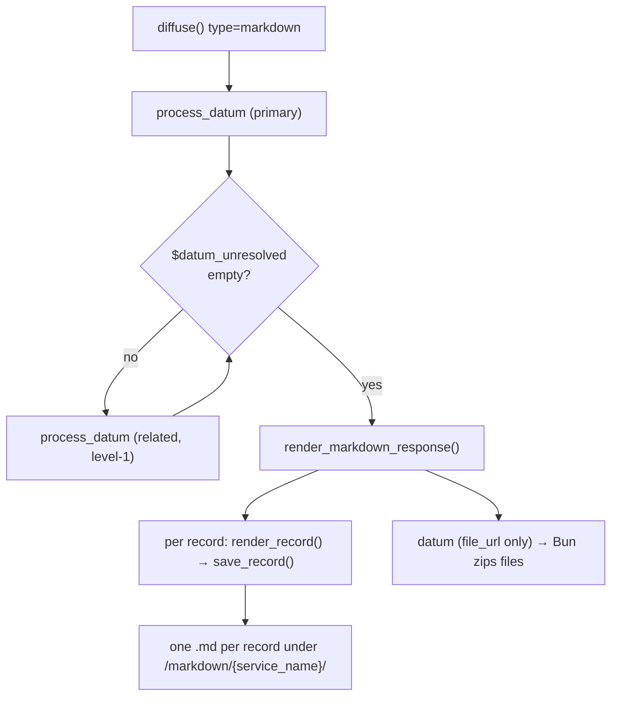

# Markdown diffusion

`markdown` is a file-based diffusion output format (alongside `sql`, `rdf`, `xml`
and `socrata`). It publishes **one Markdown file per record** so that AI agents —
and humans — can read a record's data comfortably. It is configured in the
diffusion ontology like any other format and is fully wired into the diffusion
flow: publish through `dd_diffusion_api::diffuse`, delete propagation, the dd1758
activity log, and the Bun streaming/zip layer.

For the shared rules (Bun owns MariaDB, v7 `properties`, flat virtual tree, the
chain processor and `ddo_map`) see [Engine internals](engine_internals.md) and
[`dd_diffusion_api` and Bun](dd_diffusion_api_and_bun.md). This page documents
only what is specific to the Markdown format.

## Behaviour at a glance

| Aspect | Markdown |
| --- | --- |
| Field selection | **Curated** via the ontology `ddo_map` (same as RDF/XML), not a generic dump |
| Output unit | **One `.md` per record** |
| File path | `DEDALO_MEDIA_PATH/markdown/{service_name}/{section_tipo}_{section_id}.md` |
| Access | **Public** (parity with RDF/XML); only publishable records are written |
| Relations | Flattened value **inline** *and* a link to the related record's own `.md` |
| Depth | `levels` budget drives how deep related records are published (so links resolve) |
| Document header | `# {section_name}` + YAML frontmatter |

## Key design: reuse the datum path (no early dispatch)

RDF and XML **short-circuit** `diffuse()` before the datum builder
(`type:'rdf'`/`'xml'` → `diffuse_rdf()`/`diffuse_xml()`). **Markdown does not.**
It flows through the standard SQL-style datum path and is rendered to files at the
end:

```text
diffuse():
  build langs + main
  process_datum(primary records, levels)        ← curated ddo_map, alias merge,
  drain $datum_unresolved (breadth-first)          publication gate, RELATION enqueue
  if diffusion_type === 'markdown':
      return render_markdown_response(...)        ← render self::$datum → .md files
  else:
      return SQL datum response
```

This reuses the chain processor's curated resolution, alias handling, the
publication state gate and — crucially — the **levels-based cross-section
recursion**. The relation enqueue in `diffusion_chain_processor::process_relation_component`
adds every related locator to `dd_diffusion_api::$datum_unresolved` and the drain
loop publishes those records too. Two consequences:

- Related records get their **own `.md`** automatically (they end up in `self::$datum`).
- A relation field-group carries the related record's `section_tipo`/`section_id`,
  which is exactly what the renderer needs to link to `{section_tipo}_{section_id}.md`.



## The renderer — `diffusion_markdown`

`diffusion/class.diffusion_markdown.php` is a **pure renderer + file IO** class. It
does **not** load parsers or resolve chains; it consumes the already-resolved
datum `context` (field definitions) and `fields` (grouped per-record values) that
`process_datum()` produced.

Public surface (mirrors `diffusion_xml`):

| Member | Role |
| --- | --- |
| `get_record_file_path($element_tipo, $section_tipo, $section_id)` (static) | Single source of truth for the `.md` path; returns `null` (and logs) when `service_name` is missing |
| `render_record($options)` | Builds the Markdown document from `context` + `fields` |
| `save_record($element_tipo, $section_tipo, $section_id, $markdown)` (static) | Writes the deterministic file; accumulates `self::$saved_files` |
| `delete_record_file($element_tipo, $section_tipo, $section_id)` (static) | Removes canonical + legacy `_*.md` variants; idempotent |
| `reset_cache()` (static) | Clears the per-request section-name cache (not `$saved_files`) |

### Document structure

```markdown
---
section_name: "Interview"
section_tipo: "rsc197"
section_id: "42"
title: "Interview with Jane Doe"
diffusion_element: "dd1234"
---

# Interview

## Title

- **en:** Interview with Jane Doe
- **es:** Entrevista con Jane Doe

## Author

Jane Doe ([rsc167_88](rsc167_88.md))

## Photograph


```

Rendering rules (`render_record` / `render_field`):

- **Header**: always `# {section_name}` — the section's resolved label
  (`ontology_node::get_term_by_tipo($section_tipo, DEDALO_APPLICATION_LANG)`,
  falling back to the tipo). The record `title` (first non-empty input_text value)
  goes in the frontmatter.
- **One `## {label}` block per field**, in context (column) order; the label is the
  diffusion node term. Empty fields are skipped to keep the document compact.
- **Translatable fields** emit one bold sub-line per language
  (`- **en:** …`), using `DEDALO_DIFFUSION_LANGS` (fallback `[DEDALO_DATA_LANG]`).
- **Relation fields** (field-group carries `section_tipo` + `section_id`): the
  flattened value followed by a link to the related record's `.md`
  (`value ([rsc_id](rsc_id.md))`), or a bare link when there is no value.
- **Media fields** (`component_image` / `av` / `3d` / `pdf`): a Markdown image
  `` or link `[label](url)`.
- `sanitize_md_value()` escapes only structure-breaking sequences (line-leading
  ATX headers, a lone `---`); values are **not** HTML-escaped — readability is the
  goal.

!!! note "Dangling links are a configuration matter"
    A relation link is emitted from the related record's identity even if that
    related section is not mapped under the element (so no `.md` is generated for
    it). To make links resolve, configure the related sections under the **same**
    markdown element, reachable within `levels`.

## API wiring — `dd_diffusion_api`

- `diffuse()` leaves `markdown` out of the RDF/XML early-dispatch and, after the
  drain loop, calls `render_markdown_response()`.
- `render_markdown_response()` iterates `self::$datum`; per record it either
  removes the file (`record->fields === 'delete'`, i.e. unpublishable) or renders
  and writes it, then builds the file-format datum.
- `validate()` accepts `markdown` in `$known_types` and runs the `service_name`
  check (shared with RDF/XML).

### Datum shape (must match Bun's reader)

Bun's file-stream extractor reads `record.fields?.[diffusion_tipo].entries[].file_url`.
`render_markdown_response()` therefore emits, per record:

```text
diffusion_tipo = {markdown element tipo}
record.fields = { [element_tipo]: [ { entries: [ { value: null, file_url } ] } ] }
```

`entry.value` is left **null** on purpose: a string value would be collected into
Bun's `raw_xml_parts` and corrupt the (skipped) merge step.

## Delete propagation

`diffusion_delete::delete_record()` handles `markdown` in both switches (grouped
with the file formats) and calls `delete_markdown()` →
`diffusion_markdown::delete_record_file()`, which unlinks the deterministic `.md`.
Unpublishing during a publish run is handled the same way: an unpublishable record
arrives with `fields === 'delete'` and `render_markdown_response()` removes its
file. Activity logging and `retry_pending()` are type-agnostic and need no
markdown-specific code.

## Bun engine

Markdown rides the existing file-format streaming path
(`handle_diffuse_rdf_stream` → `run_background_rdf_diffusion`) but **skips the
merge** — each `.md` is self-contained, so there is no consolidated document.

| File | Change |
| --- | --- |
| `lib/types.ts` | `rqo_options.type` includes `'markdown'`; `consolidated_files.merged_url` is optional |
| `index.ts` | dispatch case `markdown` → file stream; `'rdf'\|'xml'` unions widened; `merged_content = null`; ZIP built from the per-record files; `diffusion_class = 'diffusion_markdown'`; `type_label = 'md'` |
| `lib/status.ts` | `markdown` joins the PHP-session-only readiness branch |

The result still produces a downloadable ZIP of the individual `.md` files (no
merged file). Because markdown carries only `file_url` (no string `entry.value`),
`raw_xml_parts` stays empty and the merge is correctly skipped.

## Ontology configuration

Markdown uses the **same node structure and ddo_map resolution as every other
format** — it is not special-cased. The canonical models are `diffusion_section`
for the section node and `diffusion_component` for the field nodes (the SQL-typed
`table` / `field_*` models are not used; their column-type meaning is irrelevant
to markdown).

```text
diffusion_element        { "diffusion": { "type": "markdown", "service_name": "…" } }
└── diffusion_section     ──related──▶ section
    ├── diffusion_component   { "process": { "ddo_map": [ … ] } }   → component
    └── diffusion_component   { "process": { "ddo_map": [ relation chain ] } }
```

- **`diffusion_element`** — `properties->diffusion->type = "markdown"` **and**
  `service_name` (required: without it no file path resolves and nothing is
  written). Run the `validate` action to find elements missing `service_name`.
- **`diffusion_section`** — a `related` relation to the target `section`
  (`get_related_section_tipo`). This is the node published per the
  `levels`-resolved record set; its children are the fields.
- **`diffusion_component`** — one per `## heading`; carries
  `properties->process->ddo_map`. The node's term becomes the heading.

The `ddo_map` is resolved by `diffusion_utils::get_ddo_map()` +
`diffusion_chain_processor::resolve_chain()` — **identical** to SQL/RDF/XML,
including **relation chains that pull related-section data into the main record**
and the cross-section `levels` recursion. Example (relation → related field):

```json
{ "process": { "ddo_map": [
  { "tipo": "<relation_component>",  "parent": "self",                "section_tipo": "self" },
  { "tipo": "<related_field>",       "parent": "<relation_component>", "section_tipo": "<related_section>" }
] } }
```

Notes:
- `diffusion_section` / `diffusion_component` are **structural ontology models with
  no PHP class** (like `field_text`); they need no code — only ontology
  definition + the structure relations that allow them as children of
  `diffusion_element` / `diffusion_section`.
- The resolution code is **model-agnostic**: nothing in `process_datum`,
  `get_ddo_map` or the chain processor inspects the field model. The only
  model-specific code (`field_* → SQL column type`) lives in the SQL/Socrata path,
  which markdown never enters.
- To make relation **links** resolve, also give the related section its own
  `diffusion_section` under the same element, reachable within `levels`.
- `parser` / `output_format` on `diffusion_component` nodes are **not applied** by
  the markdown renderer (they format for SQL/XML); markdown renders the resolved
  value directly. Data **resolution** (incl. related data) is the same.

No new constants are needed; `DEDALO_MEDIA_PATH/markdown/{service_name}/` is
created on demand.

## Tests

- **PHP** — `test/server/diffusion/diffusion_markdown_Test.php`: pure
  `render_record` (header, frontmatter, per-lang lines, relation link, empty-field
  skipping) and `sanitize_md_value`; guarded `get_record_file_path` /
  `delete_record_file` via `diffusion_test_helper::require_markdown_ontology()`
  (skipped until a markdown element is seeded — same pattern as RDF/XML).
  Run: `cd test/server && ../../vendor/bin/phpunit --testsuite "diffusion"`.
- **Bun** — `test/handler.test.ts` asserts `type:'markdown'` streams over SSE.
  Run: `cd diffusion/api/v1 && bunx tsc --noEmit && bun test`.
