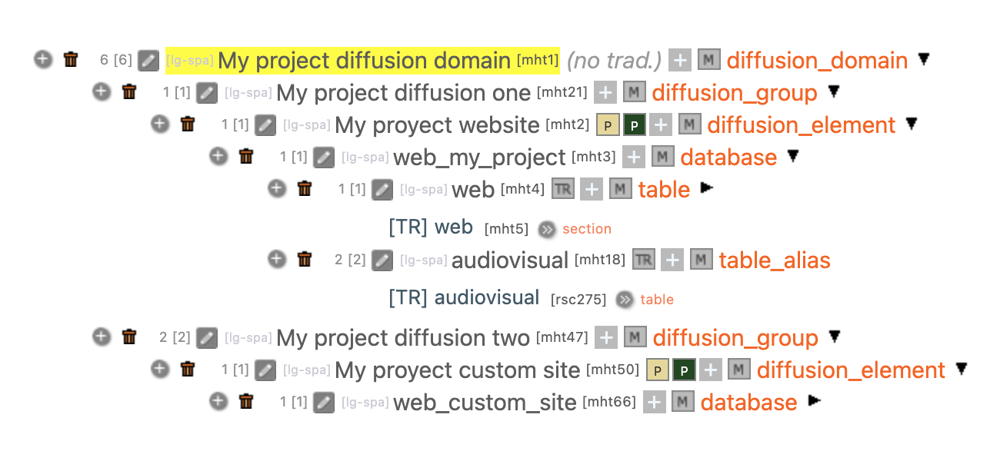
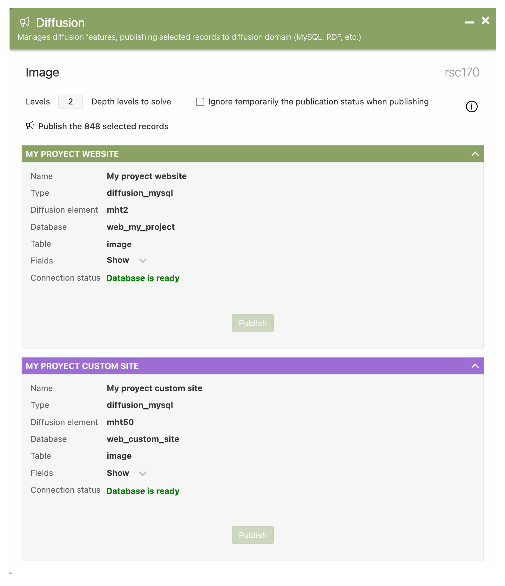
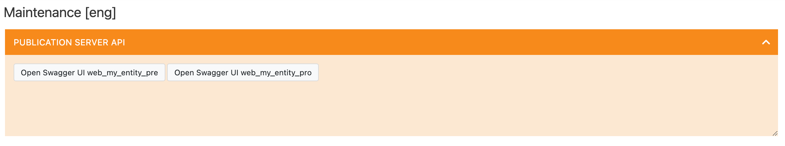
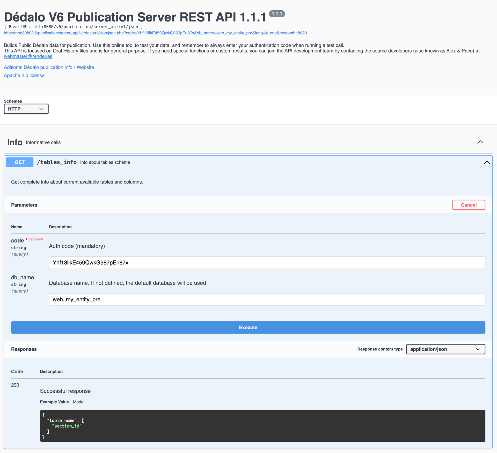

# Diffusion: multiple databases (MySQL)

> See also: [Diffusion data flow](diffusion_data_flow.md) · [Publication API](publication_api/index.md)

Dédalo can publish content to one or more databases for better data organization. This page covers the legacy v1 SQL publication path; for new integrations, prefer [Publication API v2](publication_api/v2/index.md).

For example, you might keep separate PRE (pre-production) and PRO (production) databases so you can test new schemas or configurations in a private test database before applying the changes to the production public database. You might also organize your public websites into different databases, such as "main website", "custom exhibition website" and so on.

To do this, you configure your Dédalo config files and the diffusion output ontology definitions.

## Dédalo config file

You must find and set the const: `API_WEB_USER_CODE_MULTIPLE` in your config file (/config/config.php). For example:

```php
define('API_WEB_USER_CODE_MULTIPLE', [
    [
        'db_name'  => 'web_my_entity_pre',
        'code'     => 'Yhf13likE459QwkG987pErl87x'
    ],
    [
        'db_name' => 'web_my_entity_pro',
        'code'    => 'Yhf13likE459QwkG987pErl87x'
    ]
]);
```

## Diffusion engine database config (Bun)

In Dédalo v7 the MariaDB write connection is **not** a PHP setting — it lives in the Bun diffusion engine's env file `diffusion/api/v1/.env`. PHP never connects to MariaDB.

!!! warning
    From the Dédalo side, **only one DB user and password** is defined, and that DB user must have write permissions.

Sample (`diffusion/api/v1/.env`):

```ini
DB_HOST=localhost
DB_USER=my_user_with_write_permissions
DB_PASSWORD=my_user_db_password
DB_NAME=web_my_entity_pro   # main diffusion database
```

The connection points at the main database, but if multiple databases are set in the Ontology, the diffusion engine swaps and writes to the proper output DB using the same user and password.

Each diffusion database must be created, and the configured user must be granted privileges on it, for example:

```sql
CREATE USER 'dedalo_write'@'localhost' IDENTIFIED BY 'your_password';
GRANT ALL PRIVILEGES ON `web_dedalo`.* TO 'dedalo_write'@'localhost';
```

## Ontology config

You can use the common diffusion definitions, such as the Dédalo default (focused on Oral History), or create your own definitions with new elements or aliases of existing ones.

Sample custom ontology definition for multiple databases:

   {: .big}

!!! info "More about diffusion ontology definitions"
    See [Diffusion ontology](diffusion_data_flow.md#diffusion-ontology).

Sample tool_diffusion window using multiple databases:

   {: .big}

## Publication server config file

Several sites can call the same publication server, but you must configure the server to read the target database from the API request instead of using a fixed value.

### server_config_api.php

The file is located at:

```text
/dedalo/publication/server_api/v1/config_api/server_config_api.php
```

```php
// db config. Use always a read only user for connect to the database
    $DEFAULT_DDBB = 'web_my_project';
    // db_name . Optional
    $db_name = !empty($db_name)
        ? $db_name
        : $DEFAULT_DDBB;
    // MYSQL connection config (must be different that Dédalo main config)
    define('MYSQL_DEDALO_HOSTNAME_CONN' , 'localhost');
    define('MYSQL_DEDALO_USERNAME_CONN' , 'read_only_user');
    define('MYSQL_DEDALO_PASSWORD_CONN' , 'XXXXXXXXXXXXX..');
    define('MYSQL_DEDALO_DATABASE_CONN' , $db_name);
    define('MYSQL_DEDALO_DB_PORT_CONN'  , null);
    define('MYSQL_DEDALO_SOCKET_CONN'   , null);
```

The `$db_name` variable is filled with the `db_name` value passed by the site's API call, as shown below.

### An implementation example

This example shows a typical JavaScript connection, but you can adapt it to other languages (Python, Java, etc.).

To access the API, use a standard `fetch` call.

```text
/web_my_entity_pre/my_data_manager.js
```

```js
const api_response = fetch(
    url,
    {
    method         : 'POST',
    mode           : 'cors',
    cache          : 'no-cache',
    credentials    : 'omit',
    headers        : {'Content-Type': 'application/json'},
    redirect       : 'follow',
    referrer       : 'no-referrer',
    body           : JSON.stringify({
        dedalo_get    : 'records',
        code          : 'Yhf13likE459QwkG987pErl87x',
        db_name       : 'web_my_entity_pre',
        table         : 'images',
        ar_fields     : '*',
        lang          : 'lg-spa',
        sql_filter    : null,
        count         : false,
        limit         : 10,
        offset        : 0,
        order         : null
    })
})
.then(handle_errors)
.then(response => {
    const json_parsed = response.json().then((result)=>{
        return result
    })
    return json_parsed
})// parses JSON response into native Javascript objects
.catch(error => {
    console.error("ERROR:", error)
    return {
        result  : false,
        msg     : error.message,
        error   : error
    }
});
```

In this case, `db_name = web_my_entity_pre`.

## Area maintenance access to the Publication API UI (Swagger)

The maintenance area lets administrators open the Publication API UI viewer and select any site of the current diffusion domain:

   {: .big}

When you select a site, the viewer's `code` and `db_name` are filled from the settings in `API_WEB_USER_CODE_MULTIPLE`:

{: .big}
