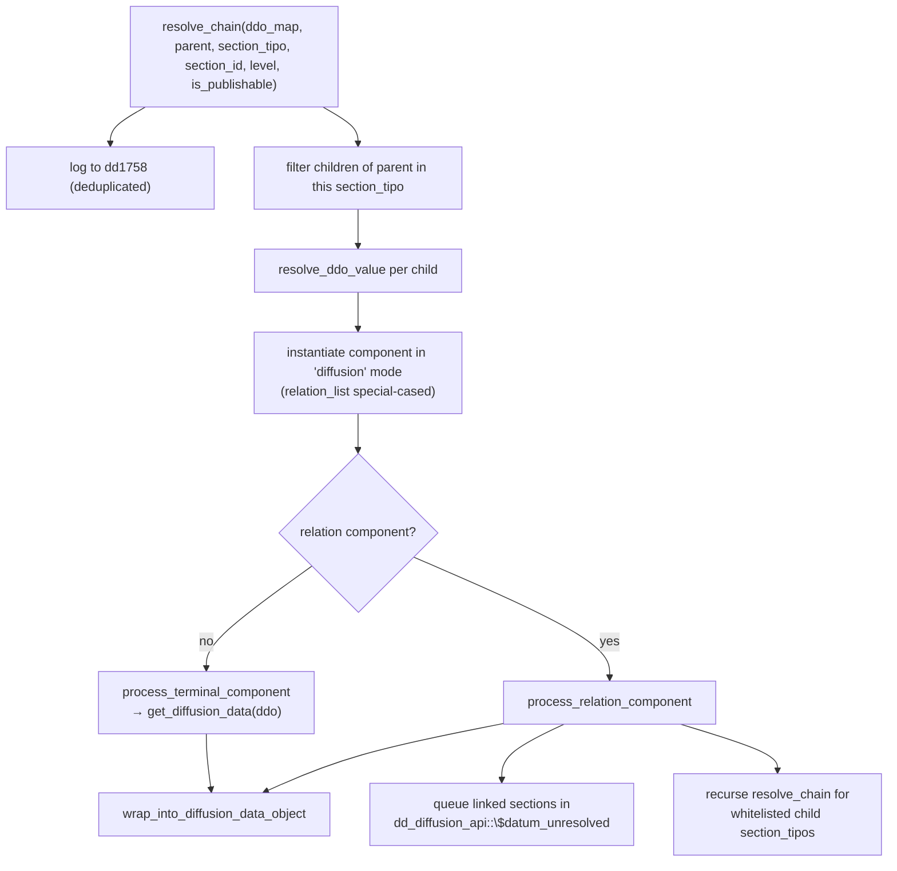
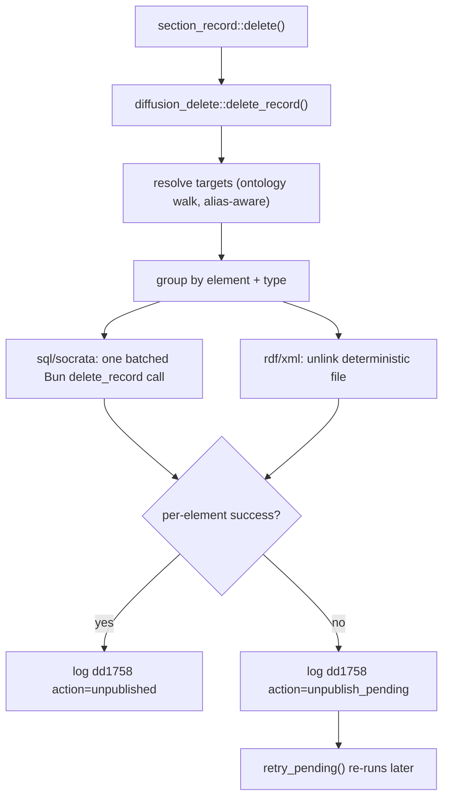

# Diffusion engine internals

> The server-side machinery of the diffusion subsystem — the PHP publish
> orchestrator, the recursive chain processor, the datum/data wire containers,
> the RDF/XML/Socrata file generators, delete propagation, and the Bun engine
> that owns every MariaDB operation.

> See also: [diffusion (system overview)](../core/system/diffusion.md) ·
> [Diffusion API & Bun](dd_diffusion_api_and_bun.md) ·
> [diffusion config properties](diffusion_config_properties.md) ·
> [Architecture overview](../core/architecture_overview.md)

This is a **developer reference for the diffusion *engine*** — the code that
turns a publish request into rows, files and log entries. It assumes you have
read the [system overview](../core/system/diffusion.md) (what diffusion is, the
flat virtual tree, eligibility, the Bun-owns-MariaDB rule) and complements
[Diffusion API & Bun](dd_diffusion_api_and_bun.md) (which documents the API
actions, the tool UI flow and configuration). Here the focus is the **internal
control flow and data shapes** of the publish pipeline.

The engine spans two runtimes and the line between them is exact:

- **PHP** resolves the ontology and the work data: it walks the diffusion tree,
  instantiates components, resolves each record's field values, writes RDF/XML
  files, propagates deletes and logs activity. PHP **never** connects to MariaDB.
- **Bun/TypeScript** (`diffusion/api/v1`) owns all MariaDB I/O: it parses the
  PHP datum, applies output parsers, generates DDL/DML and runs it in atomic
  per-table transactions, and streams progress to the UI.

## Role

```mermaid
flowchart LR
    subgraph php["PHP engine (work runtime)"]
        API["dd_diffusion_api::diffuse<br/>(orchestrator)"]
        UTIL["diffusion_utils<br/>(tree resolution)"]
        CP["diffusion_chain_processor<br/>(recursive ddo_map)"]
        CC["component_common::get_diffusion_data<br/>+ diffusion_fn"]
        DAT["diffusion_datum / diffusion_data_object"]
        RDF["diffusion_rdf / diffusion_xml / diffusion_socrata"]
        DEL["diffusion_delete"]
        LOG["diffusion_activity_logger (dd1758)"]
        CLI["diffusion_api_client"]
    end
    subgraph bun["Bun engine (diffusion/api/v1)"]
        IDX["index.ts (action switch + SSE)"]
        PROC["diffusion_processor.ts"]
        PARS["parsers/*"]
        SQL["sql_generator.ts"]
        DB["db.ts / delete_handler.ts"]
    end
    PG[("PostgreSQL matrix")]
    MARIA[("MariaDB publication DB")]
    FILES[("RDF/XML files")]

    IDX -->|cookie+CSRF| API
    API --> UTIL
    API --> CP --> CC --> DAT
    CC --> PG
    API -->|datum[]| IDX
    API -->|type=rdf/xml| RDF --> FILES
    IDX --> PROC --> PARS
    PROC --> SQL --> DB --> MARIA
    DEL --> CLI -->|unix socket| IDX
    LOG --> PG
```

The PHP side is a **pure datum builder** for SQL/Socrata: it never emits SQL, it
emits a serialisable `diffusion_datum[]` describing *what* to publish. The Bun
side is the only place that knows *how* to write it into a relational table. For
RDF and XML, PHP both builds and writes the artifact (a file on disk), and Bun
only orchestrates pagination, merging and the download bundle.

## Source map

| concern | file |
| --- | --- |
| Publish orchestrator | `core/api/v1/common/class.dd_diffusion_api.php` |
| Recursive field/relation resolver | `diffusion/class.diffusion_chain_processor.php` |
| Datum-group wire container | `diffusion/class.diffusion_datum.php` |
| Per-field value item / chain wrapper | `diffusion/class.diffusion_data_object.php` |
| RDF generator | `diffusion/class.diffusion_rdf.php` |
| XML generator | `diffusion/class.diffusion_xml.php` |
| Socrata generator (dormant) | `diffusion/class.diffusion_socrata.php` |
| `fn`-dispatch transform helpers | `diffusion/class.diffusion_fn.php` |
| Delete propagation + retry | `diffusion/class.diffusion_delete.php` |
| Publication activity log (dd1758) | `diffusion/class.diffusion_activity_logger.php` |
| PHP → Bun transport | `diffusion/class.diffusion_api_client.php` |
| PHP-side parsers | `diffusion/parser/parser_main.php` (loads `parser_text`, `parser_date`, `pattern_replacer`) |
| Bun server + action switch + SSE | `diffusion/api/v1/index.ts` |
| PHP datum → processed tables | `diffusion/api/v1/lib/diffusion_processor.ts` |
| CREATE/ALTER/upsert/DELETE SQL | `diffusion/api/v1/lib/sql_generator.ts` |
| MariaDB pools + per-table transaction | `diffusion/api/v1/lib/db.ts` |
| `delete_record` executor | `diffusion/api/v1/lib/delete_handler.ts` |
| Bun → PHP callback | `diffusion/api/v1/lib/php_client.ts` |
| Bun parser registry | `diffusion/api/v1/lib/parsers/index.ts` |
| Wire types (frozen contract) | `diffusion/api/v1/lib/types.ts` |

## The SQL publish pipeline

The end-to-end SQL path, from a curator clicking *publish* to committed rows.

```mermaid
sequenceDiagram
    participant UI as tool_diffusion (JS)
    participant Bun as index.ts
    participant PHP as dd_diffusion_api::diffuse
    participant CP as chain_processor
    participant Proc as diffusion_processor.ts
    participant DB as db.ts → MariaDB

    UI->>Bun: POST {action:diffuse, type:sql, options:{total,chunk_size}}
    Note over Bun: check_auth(cookie) → background SSE process
    loop per chunk (offset/limit injected into SQO)
        Bun->>PHP: call_dd_diffusion_api (cookie + CSRF)
        Note over PHP: reset caches; retry_pending (offset 0 only)
        PHP->>PHP: search(SQO) → locators
        PHP->>CP: resolve_chain per ddo_map node
        CP->>CP: terminal vs relation; queue deeper levels
        PHP-->>Bun: {result, langs, main, datum[]}
        Bun->>Proc: process_response(php_response)
        Proc->>Proc: apply parsers, lang expansion → processed_table[]
        Bun->>DB: insert_table_data (atomic txn per table)
        DB-->>Bun: affectedRows; apply media markers
        Bun-->>UI: SSE progress snapshot
    end
    Bun-->>UI: final SSE {tables, records, errors?}
```

### Step 1 — Bun starts a background, chunked, SSE run

`handle_request` (`index.ts`) routes `action:'diffuse'` after `check_auth`
(cookie forwarded to PHP `get_environment`). `type:'sql'` (and `socrata`, which
falls through) goes to `handle_diffuse_stream`, which:

- generates a **server-side** `process_id` (`crypto.randomUUID()` — never trusts
  a client id, DIFFTS-02 IDOR fix),
- kicks off `run_background_diffusion` detached from the client connection, and
- returns a `text/event-stream` that polls the `progress_store` and emits a 2s
  heartbeat so proxies do not time out.

`run_background_diffusion` paginates: it splits `options.total` into chunks of
`options.chunk_size` and calls PHP once per chunk with `limit`/`offset` injected
into the SQO. One failing chunk is logged and **skipped**, never aborting the run.

### Step 2 — PHP builds the datum (`dd_diffusion_api::diffuse`)

`diffuse($rqo)` is the orchestrator. Its pipeline (verified against the source):

1. `session_write_close()` immediately — a long publish chunk must not hold the
   PHP session lock and block the UI.
2. **Opportunistic delete retry**: only when `sqo->offset` is empty (first
   chunk), call `diffusion_delete::retry_pending()` inside a `try/catch
   (\Throwable)` — engine faults surface as `Error`/`TypeError`, not `Exception`
   (DIFFU-03). A failed retry never fails the publish.
3. **Reset all request-scoped caches**: `diffusion_chain_processor::reset_cache()`,
   `diffusion_activity_logger::reset_cache()`, `diffusion_utils::reset_cache()`,
   and the class-static accumulators `$datum`, `$datum_unresolved`,
   `$publishable_overrides`. This is mandatory in a persistent worker.
4. Resolve the **diffusion element** ancestor of `diffusion_tipo`
   (`options.diffusion_element_tipo` if Bun supplied it, else
   `diffusion_utils::get_diffusion_element()`), then set the chain-processor
   scope: `diffusion_chain_processor::set_diffusion_element_scope()` builds the
   in-scope `section_tipo → diffusion_tipo` map.
5. Resolve the **main section** (`diffusion_utils::get_related_section_tipo()`)
   and assert read permission (SEC-13: `common::get_permissions(...) >= 1`).
6. Run the **SQO search**: `search::get_instance(new search_query_object($sqo))->search()`
   returns the locator list.
7. **Dispatch by type** read from `properties->diffusion->type` of the element:
   `'rdf'`/`'xml'` short-circuit to `diffuse_rdf()` / `diffuse_xml()` (file
   formats); `'sql'`/`'socrata'`/`'markdown'` continue to the datum builder.
   `'markdown'` is then post-processed into one `.md` file per record by
   `render_markdown_response()` (it reuses the datum path rather than
   short-circuiting — see [Markdown](diffusion_markdown.md)).
8. Build `langs` (`build_langs()` from `DEDALO_DIFFUSION_LANGS`) and `main`
   (`build_main_hierarchy()` — the ordered domain→…→target breadcrumb Bun needs
   to find the database name and element properties).
9. Copy `sqo->filter_by_locators` into `self::$sqo_filter_by_locators`, then
   `process_datum()` for the primary records and **drain the breadth-first
   queue** (see [Multi-level resolution](#multi-level-resolution-breadth-first)).
10. Return `{result, msg, langs, main_lang, main, datum}`.

!!! warning "Never `dump()` in this path"
    `diffuse()` returns JSON that Bun parses (or an SSE stream). `dump()` writes
    to the output buffer and corrupts the response. Use
    `debug_log(..., logger::DEBUG)`. The whole method body is wrapped in
    `try/catch (\Throwable)` so any fault becomes `{result:false, errors:[…]}`.

### Step 3 — `process_datum()`: one `diffusion_datum` per section group

`process_datum($diffusion_tipo, $iterable_data, $levels, $options)` builds **one
`diffusion_datum`** for a section group:

- Resolves the source node, its parent, and the main section. If the node is an
  **alias** (`*_alias`), it merges the real node's children + properties, with
  alias children appended **last** so they override default field mappings.
- For each child field-group node it builds the `ddo_map`
  (`diffusion_utils::get_ddo_map()`) and the **context** entry
  (`build_datum_context()` — see below). The combined `ddo_map` per node is kept
  for the per-record resolution loop.
- Pre-detects **embedded-RDF field nodes** (a field whose
  `properties->diffusion->type === 'rdf'`): these store a full RDF document into
  a SQL column via `diffusion_rdf::build_rdf_xml()` instead of resolving a chain.
- Per record (locator):
  - **Dedup** via the bitmask `diffusion_chain_processor::is_used()` /
    `mark_used()` — a record becomes a top-level datum entry only once.
  - **SQO filter**: records whose `section_tipo` is in `filter_by_locators` must
    also match a listed `section_id`; cross-section relations of *other*
    section_tipos pass freely (they are reference data pulled in at deeper levels).
  - **Publication state** resolution order: ontology-node `is_publishable`
    constant → `$publishable_overrides["{tipo}_{id}"]` set by a parent chain →
    live `diffusion_utils::is_publishable($locator)`.
  - Runs `new diffusion_chain_processor()->resolve_chain(...)` for each node's
    `ddo_map`, flattens the resolved values, and **groups** them into
    `field_group`s keyed by `tipo|lang|id|section_id|section_tipo`. Each group is
    `{tipo, lang, entries:[{value, …extras}], id}`.
  - The record's output is
    `{section_id, fields: is_publishable ? {node_tipo:[field_group…]} : 'delete'}`.
    **`fields:'delete'`** is the signal to Bun to remove the row.

The datum is only appended to `self::$datum` when it has at least one record.

### `build_datum_context()` — the per-column schema

Each field-group node produces one **context** entry (a column definition) that
Bun uses to create/alter the SQL column before inserting:

```text
{ term, tipo, model, parent, parser, columns[, output_format, varchar, length, index] }
```

- `term` = the diffusion node term = the **column name source** (Bun sanitizes it).
- `model` = the field model (`field_varchar`, `field_text`, `field_date`, …) →
  drives the MariaDB column type in `sql_generator.ts`.
- `parser` = the `properties->process->parser` definition(s) (`class::method` fn
  strings) Bun applies to the raw values.
- `columns` = the **leaf** ddo entries: it strips every tipo that appears as a
  `parent` in the ddo_map, leaving the actual target columns. Leaves are cloned
  before stripping internal keys so the original `ddo_map` (reused per record) is
  not mutated.
- `output_format` resolves in two stages: explicit
  `properties->process->output_format`, else the component class's static
  `$diffusion_output_format[$type]` map (currently hard-coded to `'sql'` in the
  fallback — see the inline TODO; RDF/XML field embedding still rides this path).

### Step 4 — Bun parses the datum (`diffusion_processor.ts`)

`process_response(php_response)` turns the datum into `processed_table[]`:

- `resolve_database_name(main)` reads the `database`/`database_alias` node's
  `term` from `main`.
- For each `datum_group`, `process_datum_group()` builds `columns_context` keyed
  by `sanitize_column_name(ctx.term)`, then walks `datum.data`:
  - `fields === 'delete'` → push `section_id` into `deletions`.
  - otherwise `flatten_fields()` expands the grouped `field_group`s back into a
    flat `entry_value[]` (merging group-level `tipo/lang/id/section_id/section_tipo`
    with each entry), and `process_record()` runs the parsers.
- **Language expansion** (`process_record`, one `processed_record` per
  `(section_id, lang)`): per column, pick the current-lang value, else duplicate
  the `nolan`/`null` value across all langs, else `main_lang`, else any available
  lang, else `null`. The composite SQL key is `(section_id, lang)`.

### Step 5 — Bun writes MariaDB (`sql_generator.ts` + `db.ts`)

`insert_table_data(table)` runs one **atomic transaction per table** on a pooled
connection (`db.ts`, `mysql2` pool cached per database, limit 10):

1. If there are records: `CREATE TABLE IF NOT EXISTS` (`generate_create_table`),
   then `ensure_columns()` diffs `INFORMATION_SCHEMA.COLUMNS` and runs
   `ALTER TABLE ADD COLUMN` for any missing column.
2. Upsert each record: `INSERT … ON DUPLICATE KEY UPDATE` on key
   `(section_id, lang)` (`generate_upsert`; `INSERT IGNORE` when a row has no
   data columns).
3. Deletions: `DELETE FROM table WHERE section_id IN (…)` — wrapped to tolerate
   errno **1146** (table missing) as a no-op.
4. `commit()`, else `rollback()` and rethrow. After commit, the caller mirrors
   the committed `section_id`s into the **media publication markers**
   (`apply_table_state`); marker failures are reported but never fail the run.

Column types come from `ctx.model` (`field_date → DATE`, `field_varchar →
VARCHAR(ctx.varchar||255)`, `field_text → TEXT`, etc.), with index generation
mimicking v6 (FULLTEXT for text, prefix KEY for long varchars). Identifiers are
backtick-escaped; the COMMENT literal escapes backslashes before doubling quotes
(DIFFTS-05).

## The chain processor

`diffusion_chain_processor` is the recursive resolver of a node's `ddo_map`. The
class is instantiated per node (`new diffusion_chain_processor()`) while its
**scope and dedupe state are static**.

### The ddo_map

A `ddo_map` is a flat array of nodes. Each node carries
`{tipo, parent, section_tipo, id?, diffusion_tipo?, fn?, …}`. `parent` links a
node to its parent in the chain (`self`/the section tipo for the root); a node
with children in the map is a chain step, a node without is terminal.
`diffusion_utils::get_ddo_map()` builds it from `properties->process->ddo_map`,
or auto-generates one from the related components.

### `resolve_chain()` — terminal vs relation



`resolve_chain()`:

1. Logs the record to dd1758 via `diffusion_activity_logger::log()` (the logger
   dedupes per `{section, action, element}`).
2. Filters `ddo_map` children of `$parent` that belong to `$section_tipo`.
3. For each, `resolve_ddo_value()` resolves the model name
   (`ontology_node::get_model_by_tipo()`), instantiates the component in
   **`diffusion` mode** (`relation_list` is constructed directly; everything else
   via `component_common::get_instance(...,'diffusion',…)`), and branches:
   - **relation component** (in `component_relation_common::get_components_with_relations()`
     or `relation_list`) → `process_relation_component()`;
   - **terminal** → `process_terminal_component()` → `element->get_diffusion_data($ddo, $element_tipo)`.

### `process_relation_component()` — queue + recurse

For a relation component the processor:

- Reads the linked locators from `get_diffusion_data()`.
- **Guards against non-locator values**: component diffusion values may include
  scalars; a non-object or one without `section_tipo` is skipped with a warning
  (a `TypeError` here would abort the whole run).
- Computes the **linked** record's publishability
  (`$publishable ?? diffusion_utils::is_publishable($locator)` — the diffusion
  node's `is_publishable` overrides the live check).
- **Parent-unpublishable rule**: when the parent is unpublishable but the linked
  record is publishable, the locator is skipped — only the *unpublishable* linked
  locators flow through so they can be marked for deletion downstream.
- **Queues** the linked section for top-level resolution at the next level:
  `dd_diffusion_api::$datum_unresolved["{level-1}:{target_diffusion_tipo}"][]`,
  and records publishable overrides in `dd_diffusion_api::$publishable_overrides`.
  Queuing only happens at `level > 0` and not for `relation_list`.
- **Recurses** into the chain (`resolve_chain` at `level-1`) only for locators
  whose `section_tipo` is in the whitelist derived from the node's children, and
  guarded by `$recursively_resolved["{section_tipo}_{section_id}"]` to break
  cycles. Resolved child values are merged; otherwise the raw locator is appended
  as the value (DIFFU-09: append, never reassign — reassigning discarded earlier
  locators' values).
- Returns a **single wrapped** `diffusion_data_object` containing the
  accumulated relation values.

### Multi-level resolution (breadth-first)

`dd_diffusion_api::diffuse` processes primary records first, then **drains**
`$datum_unresolved` in a `while` loop. Keys are `"{level}:{diffusion_tipo}"`;
each batch is deduped by `(section_tipo, section_id)` and fed back into
`process_datum()` at the remaining depth. The default depth is
`DEDALO_DIFFUSION_RESOLVE_LEVELS` (2). This is why a related section's fields
appear as reference data even when that section is not itself in the SQO.

### `wrap_into_diffusion_data_object()` — the two roles

The processor wraps results into a `diffusion_data_object` carrying
`{diffusion_tipo, id, label (component term), term (diffusion node term), model,
value}`. This is the **chain-processor wrapper** role of the container — its
`->value` holds an array of **inner value items**. Do not conflate the two:

| role | shape | built by |
| --- | --- | --- |
| inner value item | `{tipo, lang, value, id}` (+ `section_id`/`section_tipo`/`meta` extras) | components' `get_diffusion_data()`, `diffusion_fn::*` |
| chain wrapper | `{diffusion_tipo, id, label, term, model, value:[inner items…]}` | `wrap_into_diffusion_data_object()` |

`process_datum` flattens wrappers down to the inner items when building
`field_group`s. The public `$errors` array on `diffusion_data_object` serialises
as `"errors":[]` in the wire entries — it is **load-bearing**; do not remove or
privatize it.

### Static caches and reset

| static | purpose |
| --- | --- |
| `$diffusion_element_tipo` | current element scope |
| `$section_diffusion_map` | in-scope `section_tipo → diffusion_tipo` |
| `$resolved_sections_cache` | per-section **bitmask** of processed ids (`mark_used`/`is_used`) |
| `$recursively_resolved` | per `{section_tipo}_{section_id}` recursion guard |

`reset_cache()` clears all four and is called in `diffuse()` step 3. Long-running
CLI loops must call it between iterations.

## Component data extraction & `fn` dispatch

Every component implements `component_common::get_diffusion_data($ddo,
$diffusion_element_tipo)`. The default builds one `diffusion_data_object` per
`get_data()` item (lang + value). When the ddo declares `fn`, the named method is
called on the component instance with two outcomes (this is the seam to
`diffusion_fn`):

- the name is a **native method** of the component → its return value is set on
  the default object;
- the name resolves via `common::__call` to a **`diffusion_fn::` extension** →
  the full returned `diffusion_data_object[]` *replaces* the default array.

`diffusion_fn` (`abstract class`, all static) holds the cross-cutting transforms:
`map_target_section_tipo`, `map_parent_to_norder`,
`map_section_id_to_subtitles_url`, `parse_tag_to_html`,
`map_locator_to_section_label`. Each takes `($element_instance, $ddo,
$diffusion_element_tipo)` and returns `diffusion_data_object[]`.

!!! note "PHP parsers vs Bun parsers"
    PHP has only `parser_text`, `parser_date` and `pattern_replacer`
    (`diffusion/parser/`, loaded via `parser_main.php`) — used by RDF/XML
    rendering on the PHP side. The **SQL pipeline's** parsers live in Bun
    (`diffusion/api/v1/lib/parsers/`): the registry maps `class::method` strings
    (e.g. `parser_text::text_format`, `parser_locator::get_section_id`,
    `parser_global::merge_columns`) to TS implementations, with `default_join`
    as the fallback. The `class::method` string is the contract between the
    ontology `parser` config and the Bun registry.

## RDF / XML / Socrata generators

The three format classes are **standalone** (no shared base). RDF and XML share
the same publish/delete shape; Socrata is dormant and rides the SQL path.

### RDF — `diffusion_rdf`

`diffuse_rdf()` (in `dd_diffusion_api`) iterates the SQO locators and, per
record, instances `diffusion_rdf` and calls `update_record()` which writes one
**deterministic** file. The path is resolved by the single source of truth
`diffusion_rdf::get_record_file_path()`:

```text
DEDALO_MEDIA_PATH/rdf/{service_name}/{rdf_name}_{section_tipo}_{section_id}.rdf
```

- `service_name` ← element `properties->diffusion->service_name` (alias-aware);
- `rdf_name` ← the term of the owl:Class node related to the section.

The file is **overwritten** on re-publish (one current file per record). The
response carries each record's `file_url`; Bun
(`run_background_rdf_diffusion`) merges all raw parts into one consolidated
`.rdf`, zips the individual files, and returns download URLs on the final SSE.
`diffusion_rdf::build_rdf_xml($section_tipo, $section_id, $element_tipo)` (static)
also produces the RDF string used to **embed RDF into a SQL column** (the
`rdf_field_nodes` path in `process_datum`).

### XML — `diffusion_xml`

`diffuse_xml()` mirrors RDF but reuses a **single** `diffusion_xml` instance
across records (amortising parser loading via `reset_cache()` + constructor).
Each record renders + saves one file:

```text
DEDALO_MEDIA_PATH/xml/{service_name}/{section_tipo}_{section_id}.xml
```

XML elements **require** `properties->diffusion->service_name` (`validate()`
reports it when missing). The datum value carries the **`file_url`**, not the
document body (XML can be large; Bun only needs the reference). Bun consolidates
with a type-aware merger (`merge_xml_parts` — the RDF merger would corrupt XML).
Row grouping uses `resolve_row_key()` (related-record section scoping); lang
splitting flattens chain wrappers to inner items via `flatten_to_inner_items()`
(never read `->lang`/`->key` on a wrapper). Public statics
`get_record_file_path()` / `delete_record_file()` mirror RDF's.

### Markdown — `diffusion_markdown`

Unlike RDF/XML, markdown is **not** an early dispatch: it runs the normal datum
path (`process_datum` + the levels drain) and is rendered afterwards by
`render_markdown_response()` in `dd_diffusion_api`, which walks `self::$datum` and
writes one **deterministic** file per record:

```text
DEDALO_MEDIA_PATH/markdown/{service_name}/{section_tipo}_{section_id}.md
```

`diffusion_markdown` is a pure renderer + file IO (no parser loading, no chain
resolution): it consumes the resolved `context` + grouped `fields`. Each document
leads with `# {section_name}` plus YAML frontmatter; relation fields show the
flattened value **and** a link to the related record's `.md` (published through the
same `levels` budget). The datum carries the **`file_url`** only (`entry.value`
left null), so Bun zips the per-record files and **skips the merge** (markdown is
self-contained). Public statics `get_record_file_path()` / `delete_record_file()`
mirror RDF/XML's. Full details: [Markdown diffusion](diffusion_markdown.md).

### Socrata — `diffusion_socrata`

`update_record()` / `upsert_data()` exist but cloud push is unreachable;
in the action switch and delete path Socrata behaves as **SQL**.

## Delete propagation

When a work record is deleted, `section_record::delete()` calls
`diffusion_delete::delete_record($section_tipo, $section_id)`. There is **no
registry** — the published copy is always the single current one, so targets are
resolved by an **ontology walk** of `diffusion_utils::get_section_diffusion_nodes()`.
A diffusion failure must **never** block the work-system delete; per-target
failures become retryable log rows.



`delete_record()`:

1. Resolves diffusion nodes for the section; empty → nothing to do.
2. Groups targets by diffusion **element** and **type**. Finds the element in the
   node's `parents` path (`diffusion_element` / `diffusion_element_alias`),
   resolves the **real** element tipo (`resolve_node_with_alias()`). For
   `sql`/`socrata` it collects `{database_name, table_name=node->label}` (deduped).
   `rdf`/`xml` are handled per element in step 4. Unknown types hit the
   **extension point** (`// EXTENSION POINT`) and are skipped with a warning.
3. Executes **all** SQL deletes in **one** Bun `delete_record` call
   (`diffusion_api_client::call()`), passing `section_tipo` so Bun can drop the
   media markers. Bun (`delete_handler.ts`) tolerates errno 1146 (table missing)
   and 1049 (db missing) as no-op success and isolates per-target failures.
4. Per element, computes success, executes `rdf`/`xml` unlinks
   (`delete_rdf`/`delete_xml` → the format class `delete_record_file()`; missing
   file = idempotent success), and logs each outcome to dd1758 (`ACTION_UNPUBLISHED`
   on success, `ACTION_UNPUBLISH_PENDING` on failure).
5. `result = (pending_count === 0)`.

### Hybrid retry

Pending rows are re-run by `retry_pending($limit=100)`, triggered three ways:
opportunistically at the start of `diffuse()` (first chunk), the CLI helper
`diffusion/migration/helpers/retry_pending_deletions.php`, and the tool UI.
It finds pending rows (`search_pending_rows`), re-runs the delete restricted to
the row's element (`log_activity=false`), and — only when the retry actually
resolved (`result===true && !empty(ar_deleted)`, DIFFU-08) — **flips the row in
place** from `unpublish_pending` to `unpublished` so the pending query stays
trivially correct.

!!! warning "JSONB containment is type-sensitive"
    Locators serialise `section_id` as a **string** in the `relation` column.
    `search_pending_rows()` queries with JSONB `@>` containment, so the action
    value (`ACTION_UNPUBLISH_PENDING = 3`) must be cast to a string
    (`(string)…`) or the query never matches. The in-place flip writes the new
    action id as a string for the same reason.

## The dd1758 activity log

There is **no bespoke publication table** ("the Dédalo way"). Publication state
is a standard Dédalo section, **dd1758**, stored in `matrix_activity_diffusion`
(PostgreSQL), written by `diffusion_activity_logger::log($section_tipo,
$section_id, $diffusion_element_tipo=null, $action=ACTION_PUBLISHED)`.

| component | tipo | content |
| --- | --- | --- |
| user | dd1762 | logged user locator (or session/system user) |
| date | dd1761 | `component_date::get_date_now()` |
| processed-section locator | dd1763 | locator to `(section_tipo, section_id)` |
| section_id | dd1764 | the record id (scalar) |
| section_tipo | dd1765 | the record's section tipo (scalar, `lg-nolan`) |
| diffusion element | dd1766 | locator to the `{tld}0` section, id = numeric part of the element tipo |
| **action** | **dd1767** | `component_select` → value-list **dd1774**: `1`=published, `2`=unpublished, `3`=unpublish_pending |

The element locator derivation is reversible: `oh63` → section `oh0`, id `63`
(`get_tld_from_tipo` / `get_section_id_from_tipo`); `diffusion_delete::parse_pending_row()`
inverts it. The logger **dedupes** per request via
`$logged_sections["{section_tipo}_{section_id}_{action}_{element}"]` (action and
element are part of the key, so one record can legitimately log one row per
action/element pair). `reset_cache()` clears it.

`log()` is called from `resolve_chain()` (every publish, deduped) and from
`diffusion_delete` (every unpublish / pending). Constants:
`ACTION_TIPO = 'dd1767'`, `ACTION_SECTION_TIPO = 'dd1774'`,
`ACTION_PUBLISHED = 1`, `ACTION_UNPUBLISHED = 2`, `ACTION_UNPUBLISH_PENDING = 3`.

!!! note "Legacy writer removed"
    The old per-record metadata writer `update_publication_data()`
    (dd271/dd1223/dd1224/dd1225) was removed; never reintroduce it. Its tipo
    statics survive on `diffusion_utils` only because `component_common` reads
    them to detect modified publication components.

## The Bun-owns-MariaDB rule

PHP **never** opens a MariaDB connection — there is no `mysqli` in PHP and no
MariaDB connector in `DBi` (the former `DBi::_getConnection_mysql` was removed).
Every MariaDB operation is a Bun action reached
through `diffusion_api_client::call($body, $timeout=10)`:

| operation | Bun action | Bun handler |
| --- | --- | --- |
| publish SQL rows | `diffuse` (Bun calls PHP back for the datum) | `handle_diffuse_stream` → `db.ts` |
| delete published rows | `delete_record` | `delete_handler.ts` |
| db existence check | `check_database` | `check_database_exists` |
| `mysqldump` backup | `backup_database` | `backup_database` |
| media marker resync | `rebuild_media_index` | `media_index.ts` |

`diffusion_api_client`:

- resolves the endpoint **unix-socket-first**
  (`DEDALO_DIFFUSION_SOCKET_PATH`, default `/tmp/diffusion.sock`) and falls back
  to `DEDALO_DIFFUSION_API_URL` for remote installs;
- forwards the **session cookie** (interactive) **and/or** the internal token
  `X-Diffusion-Internal-Token` (`DEDALO_DIFFUSION_INTERNAL_TOKEN`), so CLI/cron
  contexts without a session can still operate;
- **never throws** — connection/HTTP/JSON failures return
  `{result:false, msg, errors}` so callers can convert them to pending/retryable
  state. `$endpoint_override` is a **test-only** hook to simulate an unreachable
  engine.

### Bun auth, per action

The action switch enforces two auth tiers (`index.ts`):

- **interactive** actions (`diffuse`, `validate`, `get_ontology_map`,
  `get_diffusion_info`, `retry_pending_deletions`, process management) →
  `check_auth(cookie)` (validated by calling PHP `get_environment`);
- **server-to-server / privileged** actions (`delete_record`,
  `rebuild_media_index`, `check_database`, `backup_database`) →
  `check_privileged_action(request)` requiring the internal token (DIFFTS-01 —
  the proxied socket must not let a low-priv cookie delete arbitrary rows).
  `media_index_status` uses `check_server_auth`.

The server only opens the socket under `import.meta.main`, so importing
`handle_request` from tests does not start a listener. On startup it runs
`reconcile()` to heal media-marker drift.

## `properties`, never `propiedades`

All diffusion config is read from the v7 ontology `properties`
(`ontology_node::get_properties(true)`); for alias nodes via
`diffusion_utils::resolve_node_with_alias($tipo)->properties` (alias wins,
inherits from the real node). The v6 `propiedades` / `get_propiedades()` accessor
is dead in this subsystem — the **only** legitimate reader is the one-way
migrator `diffusion/migration/migrate_diffusion_properties.php`.

## The frozen wire contract

The PHP↔Bun boundary is a **frozen contract** pinned by golden fixtures
(`diffusion/api/v1/test/contract.test.ts` ↔
`test/server/diffusion/wire_contract_Test.php`). Two PHP containers define the
PHP side; `diffusion/api/v1/lib/types.ts` defines the Bun side.

`diffusion_datum` (one per section group) declares its properties in **canonical
serialisation order — do not reorder**:

```text
diffusion_tipo, section_tipo, term, model, parent, context, data
```

- `term` = alias-aware label = the **published table name** (`datum.term`).
- `context` = column definitions (from `build_datum_context`).
- `data` = per-record `{section_id, fields}` where `fields` is the grouped
  `{node_tipo:[field_group…]}` or the string `'delete'`.

The constructor routes every key through a setter and **throws on unknown keys**
under `SHOW_DEBUG` — an unknown key means the contract drifted. If a wire test
breaks, the contract moved: update **both** sides deliberately.

## Examples

### Trace a record's resolution

```text
SQO search → locator{oh1, 7}
process_datum('oh88', [loc], levels=2)
  per node 'oh90':
    resolve_chain(ddo_map, parent='oh1', section_tipo='oh1', id=7, level=2)
      log dd1758 (oh1/7, published)
      child 'rsc170' terminal → get_diffusion_data() → [{tipo:rsc170, lang:lg-spa, value:'…'}]
      child 'rsc200' relation → locators[{ts1, 12}] → queue "1:tsXX", recurse if whitelisted
  group → fields{ oh90:[ {tipo:rsc170, lang:lg-spa, entries:[{value:'…'}], id:a} ] }
  record → { section_id:7, fields:{…} }
datum{ diffusion_tipo:oh88, term:'web_default', context:[…], data:[record] }
```

### Propagate a delete (what `section_record::delete()` does)

```php
// Never throws for per-target failures; failures become dd1758
// unpublish_pending rows that retry_pending() re-runs later.
$response = diffusion_delete::delete_record('oh1', 7);
// $response->result, ->ar_deleted, ->ar_pending, ->errors
```

### Call the engine directly (server-to-server)

```php
// PHP never touches MariaDB: every DB op is a Bun action.
$response = diffusion_api_client::call((object)[
    'action'  => 'delete_record',
    'targets' => [(object)[
        'database_name' => 'web_default',
        'table_name'    => 'oh_web',
        'section_ids'   => [7],
        'section_tipo'  => 'oh1' // enables media marker removal
    ]]
]);
// $response->result, $response->deleted[], $response->errors
```

## Testing the engine

Run the relevant layer when touching engine code (see the
[dedalo-diffusion skill](../../.agents/skills/dedalo-diffusion/SKILL.md) for the
full matrix):

- **Bun unit/contract**: `bun test` + `bunx tsc --noEmit` in
  `diffusion/api/v1`. `contract.test.ts` pins the wire contract;
  `handler.test.ts` covers the action switch auth/validation against the exported
  `handle_request`. (`parsers.test.ts` has a known pre-existing failure — ignore.)
- **Bun integration** (`test/integration/`): auto-creates/drops
  `web_test_diffusion`; self-skips without server or privilege.
- **PHP suite**:
  `cd test/server && ../../vendor/bin/phpunit --testsuite "diffusion"`
  (+ `api/dd_diffusion_api_Test.php`). Ontology-guarded; skips on databases
  lacking the diffusion ontology / dd1767. `diffusion_api_client::$endpoint_override`
  simulates engine outage for the hybrid delete-cycle test.
- **Acceptance gate**: `php test/acceptance/diffusion_acceptance.php` against a
  live dev instance with the internal token pair configured.

## Related

- [diffusion (system overview)](../core/system/diffusion.md) — what diffusion
  is, the flat virtual tree, eligibility, the public API surface of
  `diffusion_utils` / `dd_diffusion_api`.
- [Diffusion API & Bun](dd_diffusion_api_and_bun.md) — the API actions, the
  `tool_diffusion` UI flow, environment/Apache configuration.
- [diffusion config properties](diffusion_config_properties.md) — the ontology
  `properties->diffusion` / `properties->process` config the engine reads.
- [diffusion data flow](diffusion_data_flow.md) ·
  [multiple databases](diffusion_multiple_databases.md) — companion notes.
- [Architecture overview](../core/architecture_overview.md) — the two-system
  (work PostgreSQL vs publication MariaDB) split the engine straddles.
- [common](../core/system/common.md) — the `__call → diffusion_fn` forward and
  `get_diffusion_data` plumbing components inherit.
- [section](../core/sections/section.md) — `section_record::delete()` (the delete
  entry point) and `get_ar_all_section_records_unfiltered()` (large runs).
- Source: `diffusion/` (PHP + Bun engine `diffusion/api/v1/`),
  `core/api/v1/common/class.dd_diffusion_api.php`.
- Skills: `.agents/skills/dedalo-diffusion/SKILL.md`,
  `.agents/skills/dedalo-diffusion-development/SKILL.md`.
