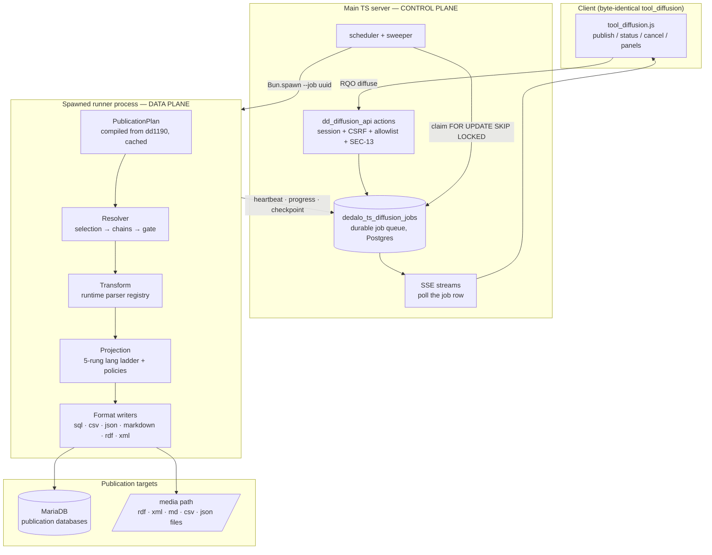

# The diffusion engine

> See also: [Diffusion (system overview)](../core/system/diffusion.md) · [Diffusion data flow](diffusion_data_flow.md) · [Parser cookbook & reference](parsers.md) · [Publication API](publication_api/index.md) · [Exporting data](../core/exporting_data.md)

The **diffusion engine** is Dédalo's publication pipeline, built directly into
the work server (`src/diffusion/`): **one engine in one codebase**, driven by
the **diffusion ontology**, operated by the **`tool_diffusion` client**, and
producing the **published artifacts** — SQL tables and RDF / XML / Markdown /
CSV / JSON files. This page is the full technical reference: architecture,
lifecycle, formats, configuration. For the conceptual role of diffusion inside
Dédalo read [Diffusion (system overview)](../core/system/diffusion.md); for how
you *decide* what gets published read
[Diffusion data flow](diffusion_data_flow.md).

Standing spec: `engineering/DIFFUSION_SPEC.md`.

---

## Design in one sentence

> **One compiler, one resolver, one IR, many writers.** A schema source (the
> dd1190 diffusion ontology, or a tool_export column set — both live)
> compiles into an executable `PublicationPlan`; one streaming resolver turns
> plan + records into a typed intermediate representation; format writers are
> plugins that consume it and know nothing about ontology or resolution.

A little history: earlier Dédalo versions split publication across two runtimes
— resolution in the work server, parsing and MariaDB ownership in a separate
external engine — because that runtime could not sustain long publication runs.
In this server resolution is native, so that seam (per-record HTTP hops,
half-resolved wire payloads, a second public socket) is gone: what used to be a
runtime side-channel (`merge_columns`, `global_table_maps`, `empty_to_string`,
alias resolution, the virtual-tree walk itself) is now a *compile-time plan
concept*.

## Architecture



Two planes, one codebase:

- **Control plane (main server).** All client actions dispatch through the
  normal API gates. `diffuse` enqueues a **durable job** and answers with an SSE
  stream that *observes the job row* — the stream is a view, not the run.
- **Data plane (runner process).** A scheduler claims queued jobs
  (`FOR UPDATE SKIP LOCKED`, bounded by `DEDALO_DIFFUSION_MAX_RUNNERS`) and
  spawns `bun run src/diffusion/runner.ts --job <uuid>`: same codebase, its own
  process — own memory ceiling, crash-isolated from the interactive API,
  killable. The runner communicates **exclusively** through the job row
  (heartbeat, progress, checkpoint, terminal state) plus the targets. Because
  there is zero runner↔server RPC, a runner daemon on **another machine** can
  claim from the same queue — placement is deployment, not architecture.

### The pipeline stages

| Stage | What happens | Module |
| --- | --- | --- |
| **A → B Compile** | The dd1190 element subtree (flat virtual tree: aliases resolved in place, consumed branches suppressed, parents paths) compiles into an immutable, JSON-serializable `PublicationPlan`: per-section field plans, ddo-map trees with parent linkage, parser split, column typing, policies, lang + recursion policy. Cached per ontology revision; any dd_ontology write invalidates via the core cache-invalidation hub. | `src/diffusion/plan/{virtual_tree,compile,cache,types,identifier}.ts` |
| **C Selection** | Keyset-batched cursor over the **sanitized** SQO (`WHERE section_id > cursor ORDER BY section_id LIMIT batch`; never OFFSET) + batched matrix reads (one `IN` query per batch). | `src/diffusion/resolve/selection.ts` |
| **D Resolution** | Per record: publication gate first (fail-closed), then the recursive ddo-tree chain walk — the previous engine's `resolve_chain` twin: per-locator recursion, cross-section hops with batched term/typology prefetch, breadth-first frontier for linked-section publishing (levels budget + per-run dedup + cycle guard), rewriter semantics (`parents`, truncations, `merge_columns`, `publication_unix_timestamp`, …). Output: typed `RecordIR` with `status: publish | unpublish`. | `src/diffusion/resolve/{resolver,rewriters,default_value,record_ir}.ts` |
| **E Transform** | The surviving runtime parsers run as **pure functions** over typed atoms — an exact port of the old parser-chain state machine, fed the same per-lang grouping. Unknown parser fn = loud compile error, never a silent skip. | `src/diffusion/resolve/transform.ts`, `src/diffusion/parsers/` |
| **F Projection** | The 5-rung language ladder (exact → nolan → main lang → any → null) collapses each field per output language; `empty_to_string` / `default_value` policies apply here, in exactly one place. Output: `ProjectedRow` per lang. | `src/diffusion/project/lang_ladder.ts` |
| **G Write** | The format writer for `properties->diffusion->type` consumes rows/records behind a fixed session contract: `ensureSchema()` once per run (serialized, outside row transactions), idempotent `writeRows`/`removeRecords` per batch, `close()` finalizes (merge/zip/counts). | `src/diffusion/writers/`, `src/diffusion/targets/mariadb/` |
| **H Ledger** | dd1758 activity rows (`published` per primary record), media markers, run report. | `src/core/resolve/diffusion_delete.ts` (`logDiffusionActivity`) |

## From the user's click to a published row

1. **Click.** The (byte-identical) client builds the same RQO it always built —
   `{action:'diffuse', dd_api:'dd_diffusion_api', source, sqo, options}` — and,
   with `DEDALO_DIFFUSION_API_URL` absent from the environment payload, its own
   fallback posts it to the **main API**.
2. **Gate + enqueue (milliseconds).** Session, CSRF, action allowlist, read
   permission on the source section (SEC-13). The SQO is sanitized at the
   boundary; the plan is loaded from cache (or compiled — a bad parser fn or a
   label that fails the SQL-identifier chokepoint dies **here**, loudly). A job
   row is inserted; a partial-unique index guarantees **one active run per
   element + section** — a re-click *attaches* to the running job instead of
   double-publishing. The HTTP response is the SSE stream.
3. **Claim + spawn.** The scheduler claims the job and spawns the runner
   process.
4. **The run.** Schema-ensure once, then the streaming batch loop
   (default 500 records/batch): select → resolve → transform → project →
   batched writes (~200-row multi-row upserts, one transaction per batch,
   PK `(section_id, lang)`) → **committed checkpoint**
   `{cursor, run_started_at, processed}` → progress update (the user's bar
   moves) → cancel-flag check → next batch. Unpublishable records become
   `removeRecords` calls (the typed successor of the old `fields:'delete'`
   sentinel).
5. **Finish / disconnect / crash.** File formats merge + zip on `close()`; the
   final SSE chunk carries the result (tables summary, or
   `consolidated_files` + `diffusion_data` links for file runs). A closed
   browser changes nothing — the client reconnects later via
   `list_processes` → `get_process_status` by its deterministic process label.
   A dead runner is swept (stale heartbeat) and **re-queued from its
   checkpoint** (≤3 attempts); deterministic batches + idempotent upserts make
   the resumed run **byte-identical** to an uninterrupted one — the gate test
   proves it literally.
6. **Deletes (the reverse path).** `section_record.delete()` calls the
   diffusion hook in-process: MariaDB rows deleted natively (per-target
   isolation, missing table/database = idempotent success), files unlinked,
   failures ledgered as dd1758 `unpublish_pending` and retried on boot,
   opportunistically, or from the tool button. A diffusion failure never blocks
   the work-system delete.

## The ontology contract

The engine consumes the **v7 diffusion ontology exactly as it exists** — it
never writes to `dd_ontology` and needs no migration:

| Ontology construct | Consumed as |
| --- | --- |
| `diffusion_domain / group / element[_alias]` | Element enumeration; `properties->diffusion->{type, service_name}` picks the writer + file service dir |
| `database[_alias]` / `table[_alias]` node **labels** | MariaDB database / table names — every one passes the SQL-identifier chokepoint (`^[a-z][a-z0-9_]{0,63}$` after the oracle-parity sanitize) at compile time; rdf/xml labels are XML identities and are **not** SQL-sanitized |
| `*_alias` nodes | Resolved in place at compile: alias tipo/label win, properties inherit, the consumed real branch is suppressed (institution redirection keeps working) |
| Field node `properties->process->ddo_map` | Compiled to a `ResolveStep` tree with parent linkage (`self` resolution, auto-from-relations fallback, `fn` variants) |
| `properties->process->parser` chains | Split at compile: **10 rewriter fns** are absorbed into plan structure (`parents`, `get_locator`, `merge_columns`, `map_section_tipo_to_name`, `publication_unix_timestamp`, truncations/filters/slices); **23 runtime fns** run as pure value transforms — see the [parser cookbook & reference](parsers.md) for every fn with in→out examples. All 33 names stay resolvable; an unknown name fails `validate` loudly |
| `exclude_column`, `varchar/length/index`, `output_format`, `empty_to_string`, `default_value`, `preserve_order` | First-class `FieldPlan` / `FieldPolicy` / `ColumnDef` concepts (including the component-class `output_format` fallback: relation-family fields default to `json`) |
| `component_publication` + ontology `is_publishable` | The publication gate — evaluated per record, **fail-closed** (any gate error ⇒ unpublish) |

The admin-only `validate` action compiles an element and returns every error and
warning — the loud pre-run gate (missing `service_name`, invalid identifiers,
unknown parser fns, rewriter absorptions).

## Formats

| `type` | Writer | Target & layout | Notes |
| --- | --- | --- | --- |
| `sql` | `writers/mariadb_sql.ts` | MariaDB, one table per section; PK `(section_id, lang)`; additive-only self-evolving schema (CREATE IF NOT EXISTS → INFORMATION_SCHEMA diff → ALTER ADD) | True multi-row upserts (~200 rows, 4 MB budget); oracle-parity column typing/indexes/comments |
| `socrata` | alias of `sql` | — | Dormant, as in the old engine |
| `csv` | `writers/csv.ts` | `<media>/csv/<db-or-service>/<table>.csv` | RFC 4180, streamed, header = plan column order |
| `json` | `writers/json.ts` | `<media>/json/…/<table>.ndjson` + `.meta.json` sidecar | One JSON object per row line |
| `markdown` | `writers/markdown.ts` | `<media>/markdown/<service>/<st>_<id>.md` (+ zip) | Same name grammar as the delete path, byte-pinned |
| `rdf` | `writers/rdf.ts` | `<media>/rdf/<service>/<sanitized rdfName_st_id>.rdf` + merged + zip | EasyRdf envelope pinned against a file published by the previous engine; `xml:lang` literals |
| `xml` | `writers/xml.ts` | `<media>/xml/<service>/<st>_<id>.xml` + merged + zip | Matches the previous engine's `render_dom` output shape; per-lang alpha-2 children |

Adding a community format = one ontology `type` string + one registered writer
(`writers/registry.ts`); an unknown type throws a named error.

All file artifacts are written temp-then-rename (atomic), zips are deterministic
(zeroed timestamps), and **no wall-clock leaks into content** — who/when lives in
the dd1758 ledger, and determinism is what makes crash-resume byte-equivalent.

## Durability & the job queue

Job state lives in two TS-owned Postgres tables (`dedalo_ts_diffusion_jobs`,
`dedalo_ts_diffusion_job_events` — the deliberate, documented exception to the
"no bespoke tables" convention: a queue is high-churn infrastructure, while
dd1758 remains the *user-facing* publication ledger).

- **States:** `queued → running → completed | failed | cancelled`, plus
  `interrupted → queued` (sweeper re-queue, ≤ `max_attempts`).
- **Identity:** the server-generated `job_id` UUID is the internal capability;
  the client's deterministic label
  (`process_diffusion_{user}_{element}_{section}`) is the **client-facing**
  `process_id` — authorization is by owner (or admin), never by id knowledge.
- **Checkpoint:** `{cursor, run_started_at, processed}` committed after every
  batch. `run_started_at` is captured once and reused on resume, so the
  `publication_unix_timestamp` system field is stable across crashes.
- **Cancel:** queued jobs finalize immediately; running jobs honor the flag
  between batches; committed work stays (idempotent re-run completes it).
- **Progress transport:** SSE streams poll the job row (the old engine's exact
  wire: `data:\n{json}` padded to 16 KB, 2 s heartbeat, `X-Accel-Buffering: no`);
  any server instance can stream any runner's progress.

Measured throughput (dev hardware, real 62-column `coins` plan, publication
gates + cross-section chains included): **≈226 records/s** single-runner —
against the old architecture's floor of one full API round-trip per record
(chunk size 1, ≤5 records/s).

## Security chokepoints

1. Single dispatch surface: session auth, CSRF, class/action allowlist — there
   is no separate publicly-proxied diffusion socket and no internal-token
   header.
2. `diffuse`/`get_diffusion_info` require read permission on the source section
   (server-enforced); `validate` and `rebuild_media_index` are admin-only.
3. Status/cancel/list are **owner-scoped** (admins see all) — stronger than the
   old engine, which accepted any authenticated cookie for any process id.
4. Ontology labels → SQL identifiers pass one strict chokepoint at compile time;
   backtick-escaping applies everywhere regardless; values are always
   parameterized.
5. The job spec stores only the **sanitized** SQO — a replay can never smuggle
   server-only keys.
6. Publication gate fail-closed; media markers fail closed (a marker failure
   never fails a run, and markers only ever widen access when present).

## Client compatibility

The copied `tool_diffusion` client works with **zero edits**. The full action
set it calls is served natively:

| Action | Behavior |
| --- | --- |
| `diffuse` | Enqueue-or-attach + SSE stream |
| `get_process_status` | Reconnect stream by client process label (poll rate honored, `:\n` heartbeat, pinned not-found chunk) |
| `list_processes` | `{result, processes: progress_data[]}`, 24 h window — the reconnect-by-label predicate **actually works** (the old engine only ever exposed its internal UUID, so the client's reconnect could never match) |
| `cancel_process` | Pinned `{result, msg}` shapes |
| `get_diffusion_info` | Panel descriptors from the virtual tree, with honest per-format `connection_status` |
| `get_engine_advisory` | Native subsystem health (there is no separate engine process to be "down") |
| `retry_pending_deletions` | Native dd1758 pending-unpublish retry |
| `validate` | Admin plan validation |
| `rebuild_media_index` | Media-marker resync (admin) |

## Configuration

All keys live in `../private/.env` (see [config](../config/index.md)):

| Key | Default | Meaning |
| --- | --- | --- |
| `DEDALO_DIFFUSION_DOMAIN` | — | The dd1190 domain the virtual tree/plans are built for |
| `DEDALO_DIFFUSION_RESOLVE_LEVELS` | `2` | Breadth-first linked-record publishing budget |
| `DEDALO_DIFFUSION_LANGS` | — | Output languages (the ladder's row set) |
| `DEDALO_DIFFUSION_DB_SOCKET` / `_DB_HOST` / `_DB_PORT` / `_DB_USER` / `_DB_PASSWORD` | socket `/tmp/mysql.sock` | MariaDB target access (never reuses the old engine's `DB_*` keys — both must coexist during transition). Target databases are **pre-created**; a missing one is a loud config error, never auto-created |
| `DEDALO_DIFFUSION_MAX_RUNNERS` | `2` | Concurrent runner processes |
| `DEDALO_DIFFUSION_NATIVE` | unset | **Cutover lever 1**: `true` stops emitting `DEDALO_DIFFUSION_API_URL` in the environment payload → the client flips to the main API |
| `DEDALO_DIFFUSION_NATIVE_ELEMENTS` | unset | **Cutover lever 2**: csv of element tipos (or `all`) allowed to publish natively; un-routed elements refuse loudly (never both engines on one element+section) |
| `DEDALO_DIFFUSION_FILES_ROOT` | media path | File-writer root override (tests) |

## Migrating from an older Dédalo installation

Coming from an older Dédalo installation that published through the legacy
external diffusion service? Migration is operational, not structural — the
diffusion ontology, the client tool and the published artifacts are unchanged,
and during the transition both publishers coexist safely on the same MariaDB
**for different elements** (idempotent upserts, additive schema):

1. Pilot: set `DEDALO_DIFFUSION_NATIVE_ELEMENTS` to a short list of element
   tipos; spot-check published rows.
2. Flip: `DEDALO_DIFFUSION_NATIVE=true` — the byte-identical client lands on
   the native actions; browser-smoke the tool panel.
3. Remove the `/dedalo/diffusion/api/v1` proxy route,
   `DEDALO_DIFFUSION_SOCKET_PATH` and `DEDALO_DIFFUSION_INTERNAL_TOKEN` (RETIRED at the 2026-07-11 cutover — the keys are unread; the native seams are the only transport),
   then decommission the old service.

## Technical reference

**Module map** (`src/diffusion/`):

```
plan/       virtual_tree.ts  compile.ts  cache.ts  types.ts  identifier.ts
resolve/    selection.ts  resolver.ts  rewriters.ts  transform.ts
            default_value.ts  record_ir.ts
parsers/    registry.ts  parser_{text,date,helper,locator,misc}.ts  item_bridge.ts
project/    lang_ladder.ts
writers/    types.ts  registry.ts  mariadb_sql.ts  files.ts
            csv.ts  json.ts  markdown.ts  rdf.ts  xml.ts
targets/    mariadb/{db,sql_generator,delete_record}.ts   ← only MariaDB importer
jobs/       schema.ts  queue.ts  scheduler.ts  sse.ts
api/        actions.ts  info.ts
runner.ts   the data-plane process entry
```

Boundary rules (mechanically enforced by `test/unit/diffusion_boundaries.test.ts`):
Postgres only via `src/core/db/`; MariaDB only inside `src/diffusion/targets/mariadb/`;
`src/core/**` never imports `src/diffusion/**` (registration seams instead —
the native delete executor and the plan-cache invalidation hook).

**Test gates** (228 tests, 16 suites — `bun test test/unit/diffusion_* test/integration/diffusion_*`):

| Gate | What it pins |
| --- | --- |
| `diffusion_sse` + `test/parity/fixtures/diffusion/pinned.ts` | The verbatim client wire (chunk framing, progress_data shape, cancel messages) |
| `diffusion_jobs` / `diffusion_actions` | Queue lifecycle; real runner spawn → SSE → reconnect → cancel → SIGKILL → sweep → requeue |
| `diffusion_plan_compile` | Real-domain compilation (37 sections / 961 fields), alias semantics, loud failures |
| `diffusion_parsers` | 84 oracle-mined parser cases + classification completeness |
| `diffusion_datum_replay` | **Frozen-fixture parity**: the old engine's golden datum → identical processed tables through the production transform+ladder |
| `diffusion_resolver` | Real-DB end-to-end record resolution, gate variants, frontier levels, determinism |
| `diffusion_mariadb` / `diffusion_file_writers` / `diffusion_rdfxml_writers` | Live-target writer behavior; file grammars byte-pinned against the delete path and real files published by the previous engine |
| `diffusion_publish_e2e` | The keystone: real plan → real matrix → scratch tables; oracle spot-check vs old-engine-published rows (53 matching cells / 8 differing, every diff hard-asserted); **interrupted-resume byte-equivalence** |

## Extending the engine: custom fns

The ontology names behaviors; the engine implements them — an ontology can
never inject code, only *demand* it. When an ontology references a fn the
engine does not know, nothing silently breaks: a **parser** fn fails plan
compilation (surfaced by `validate`, naming the field and fn, before any run);
a **ddo** fn becomes a per-field collected error in the run report while the
rest of the publication proceeds. That fail-loud contract is the designed path
for needs that cannot be known in advance.

Implementing a new fn is one registered function plus tests:

- **Parser fns** (`properties->process->parser[].fn`) — pure value transforms,
  `(values: ValueIR[], options, ctx) => ValueIR[]`, no I/O ever. Add the
  function in the matching `src/diffusion/parsers/parser_*.ts` family file and
  one entry in `parsers/registry.ts` (`PARSER_CLASSIFICATION` +
  `RUNTIME_PARSERS`). Chaining, `${id}` handles, per-lang grouping and
  projection compose around it automatically. See the
  [parser cookbook](parsers.md).
- **ddo fns** (`ddo_map[].fn`) — component-resolution variants that may need
  data access. They live in `src/diffusion/resolve/` (dispatch in
  `resolver.ts`, implementations in `ddo_fns.ts`) where batched matrix reads,
  the relations engine and the per-run caches are available. Examples:
  `parse_tag_to_html` (text-tag → publication HTML), `get_geojson_data`
  (geo-tag ↔ geolocation pairing), `get_diffusion_iconography` (nested
  iconography portals) — each gated against cells the previous engine actually
  published.

Every fn ships with the engine (the ontology stays pure data — a deliberate
security line); the registries are the single place to touch.

!!! warning "Honest ledger — known gaps"
    - Two niche fn variants remain unported and fail **loudly per field** (the
      column falls to its policy default): the typology-based `parents`
      truncation options and `get_geolocation_data` (the pre-GeoJSON variant).
      Zero and one uses respectively in the reference domain; the extension
      seam above is their landing path.
    - SQL-target **media publication markers** still ride the old engine's
      marker store until the `media_index` port (file formats and deletes are
      unaffected).
    - The `diffusion_server_control` maintenance widget still reports the old
      engine; its re-home is coordinated with the cutover.
    - rdf `rdf:about` uses a urn fallback until dd1010 entity URIs are wired;
      xmlns prefixes resolve from a pinned well-known set until the compiler
      carries `properties->xmlns`.
    - File-run `diffusion_data` lists the merged + zip links (not yet one link
      per record).
    - `tool_export` record resolution now RIDES the shared engine
      (`src/diffusion/export/`: the ar_ddo_to_export plan front-end + the
      resolver's atom-level entry point `resolveRecordAtoms`); the NDJSON
      grid protocol and projection stay export-specific and byte-identical
      (A/B keystone `test/unit/diffusion_export_unified.test.ts` + the live
      live differential run through the unified route).
      `DEDALO_EXPORT_UNIFIED=false` is the kill-switch back to the legacy
      in-tool walker, whose DELETION is ledgered until the tools refactor
      settles.
