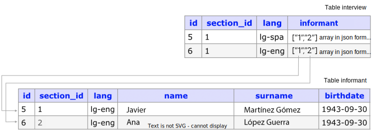
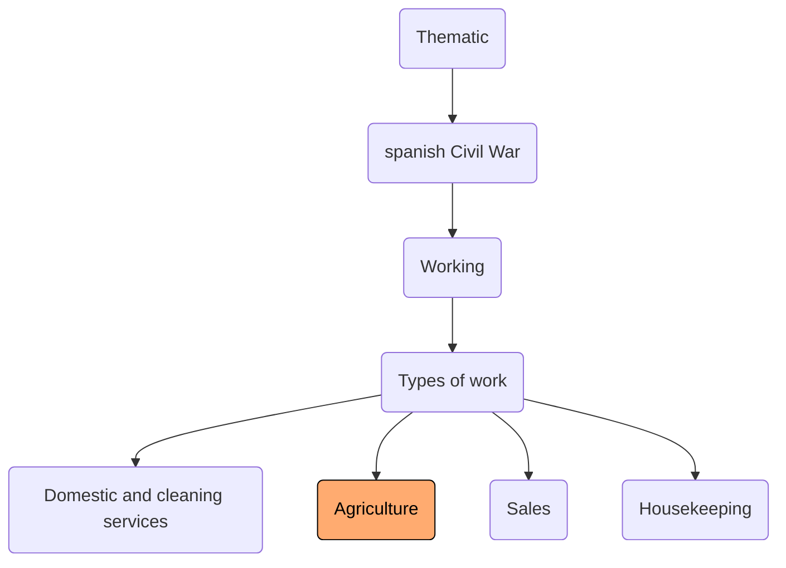
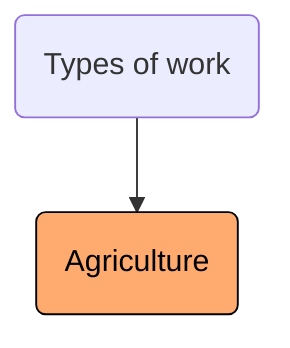
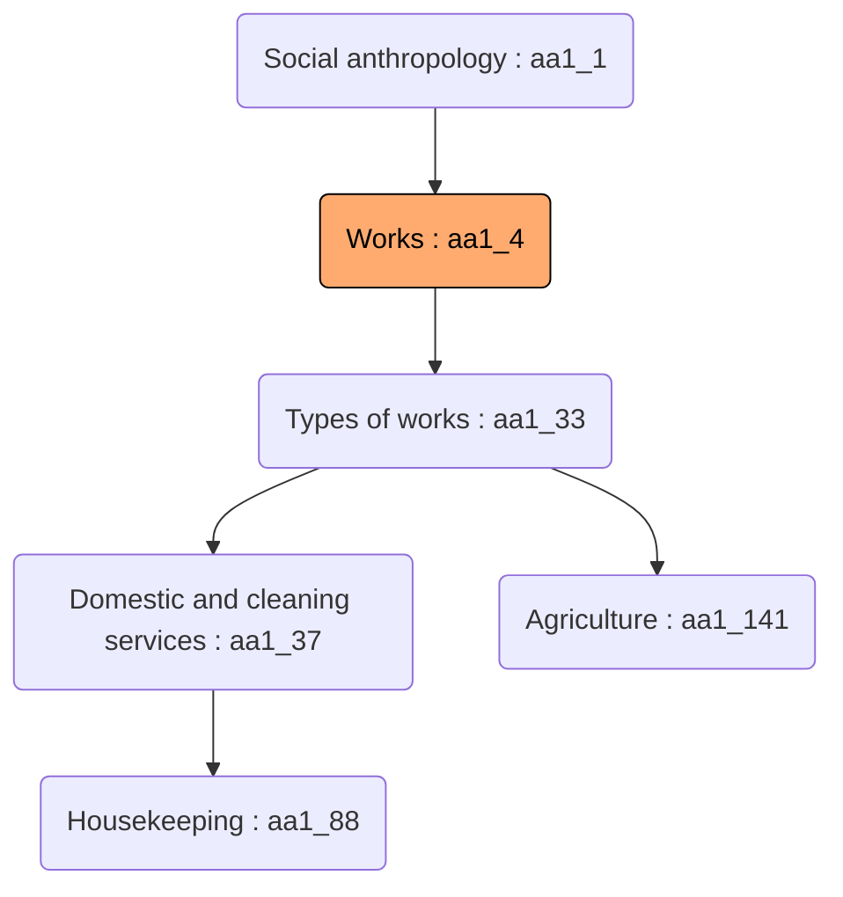
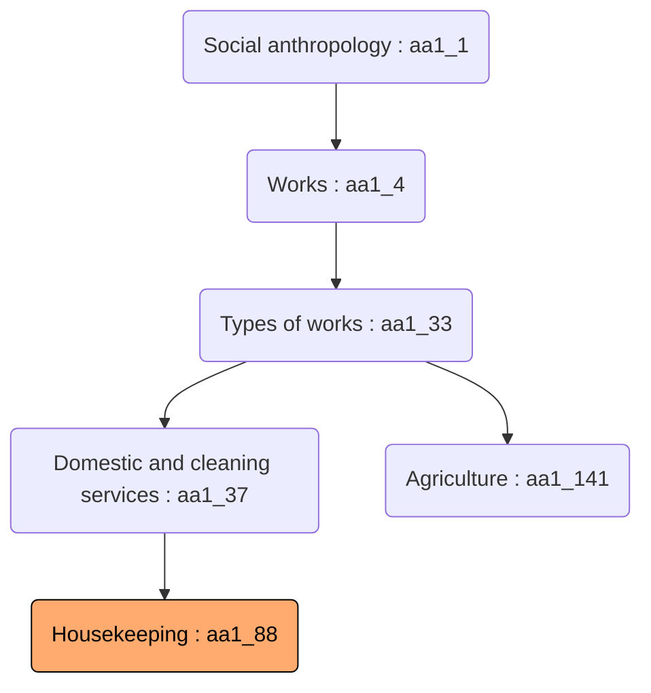

# Publication API

Dédalo Publication API connects your archive data with the web.

## Introduction

Dédalo stores all data in a private PostgreSQL database, only accessible by the back-end.

When it is needed to publish some of the data stored, Dédalo is able to do that through a publication tool (Dédalo diffusion engine).

One of the most used publication services is the SQL publication format, and generally, these published data will be stored in a MySQL or MariaDB database. This database is accessible through Dédalo’s Public API.

Publication process transform your data into different formats as SQL, RDF or any other diffusion format without change your work data. This process is controlled by the ontology definition.

The purpose of this document is to guide you through the different available methods in the API, explaining every option and showing you how to use them with examples, code snippets and much more.

## Diffusion ontology

Diffusion ontology is a specific part of the Dédalo ontology to control what kind of data could be public and how this data need to be processed. The main idea is control the access to private data and how will be showed in the public web.

If you want to know more read [ontology](../diffusion_data_flow.md#diffusion-ontology) in diffusion data flow documentation.

## Dédalo Publication Server API

It manages the public server request using a REST interface.

The publication server API can be hosted in the same Dédalo server or in another server used to create a website.
Publication server files are placed by default in Dédalo file structure at:

../httpdocs/dedalo/publication/server_api

but, you can move or copy this folder to another location or server. The only requirement to function is to allow access to the public database and media files.

Requests must be made to:

[https://mydomain.org/my_path/server_api/v1/json/](#dédalo-publication-server-api)

Example to get a list with all available tables in the database:

[http://mydomain.org/my_path/server_api/v1/json/tables_info?code=XXXX](#dédalo-publication-server-api)

The manager receives http requests from the public site, processes them and returns the data in JSON format.

Requests could be made with javascript, php, perl or any language capable of managing REST using json headers.

## Server configurations

Some examples of server configuration and data flow.

1. All system in the same server. The workspace and the diffusion is inside the same server. This configuration is easy to create and maintain, the server has all services, media, but any interference in website or attack will affect to work system.

   
2. Two different servers, one for work system, and another for Diffusion. Pros: the website is totally separated of the work system and you can scale if you have a lot of traffic into website, an attack to the website do no affect to work system. Cons: double maintenance, double cost.

   
3. Three different servers, first for work system, the second for media, the third for diffusion. This configuration ensure that your media files are shared by work system and diffusion system

   

## Data flow

1. User do an action to get information.
2. Website sent a request to the publication API as `Publication API::records`.
3. The request is processed and sended as SQL call to the database.
4. MariaDB/MySQL search into public data and return the result.
5. With the result publication API send a query to get authorization of the media associated.
6. Publication API create the final JSON mixing data and media result to be sended to website.
7. Finally website render the webpage and send to the user browser.


More about diffusion about data flow [here](../diffusion_data_flow.md).

## Publication API Setup

Set up publication API has two parts, activate the config files and setup the constants.

1. Set up Dédalo [Publication API configuration files](./public_api_configuration.md)
2. Dédalo [Publication API configuration](./server_config_api.md)

## Using publication API

The most widely used publication model in Dédalo is the publication on tables in a MySQL database.

Once the publication model (publication ontology) is generated, either using a pre-existing model such as Oral History or creating a custom one.

Dédalo publication API use a REST model to access to public data and we follow the OpenAPI initiative to document it.

The calls to API are sended via GET or POST queries, using variables as code to identify the authorized calls:

`https://mydomain/dedalo/lib/dedalo/publication/server_api/v1/json/tables_info?code=XXXX`

The documentation API user interface is accessible in the path:

`../dedalo/publication/server_api/v1/docu/ui/`

You can view your specific configuration and open publication API user interface directly inside Dédalo, go to `Development` menu and locate `Publication server API`, to open it click into "Open Swagger UI":

{: .medium}

You will see the Swagger interface ready to be used.

!!! warning
    If you have problems with getting data review the [public api configuration](server_config_api.md),and MariaDB / MySQL installation.


## Doing request and getting data

Before begin to do calls you need to know:

- By default the request calls to get information about tables, fields, schema, etc use GET, but request calls to get data use POST.
- Every call to API need to send the API code as variable. API Code is defined in [server_config_api.php](./server_config_api.md#setting-the-api-code-authorization-code) file.
- Every call to API need to specify the database.
- Some calls will need to specify the table.
- Response data are strings.

!!! note
    For historical reasons and compatibility with old webpages all response data will be sended as JSON stringified, you will need parse before use it.

- You can do the calls directly or with CURL. All examples in this doc will use direct calls.

  This two request are the same:

  ```api_request
  https:///my_domain.org/dedalo/lib/dedalo/publication/server_api/v1/json/publication_schema?code=XXXX
  ```

  ```curl
  curl -X 'GET' \
  'https://my_domain.org/dedalo/publication/server_api/v1/json/publication_schema?code=XXXX' \
  -H 'accept: application/json'
  ```

### Related data

In the process to publish data Dédalo will resolve lost of relations to create flat version of data, but not all relations should be resolved because some data need to have relations to be resolve as web users need, so public data has some relations between tables and need to be resolved.

The data they hold is a stringified array in JSON format as `["1","2"]`. This data corresponds to the section_id column of each destination table.



In this example we see the correspondence between the informant column (interview table) and the section_id column (informant table). This correspondence can be resolved (if we need it) individually, through via single requests to each table, or in a joint request using the resolve_portals or resolve_portals_custom option on the same table.Table interviewTable informant array in json format array in json format

### /tables_info

Method: **GET**

The GET 'tables_info' request returns information from all the existing tables in our publication database. If you are doing a Oral History website the tables that you will get are:

- interview: contains generic information on the interview, as well as links to the resources used in the itself (image, audiovisual, informant)
- 'image': contains the data of the images associated with the interview (url, title, caption, description)
- audiovisual: contains the data of the audiovisuals (recordings) at the level of ' tape', with the url of the video file, the transcription text, the duration, subtitles, etc.
- 'informant': contains the data of the informants associated with the interviews (name, surname, year and place of birth, etc. )
- interview: this table contains relationship columns to the image, audiovisual, and informant tables.

Request:

```api_request
https://my_domain.org/dedalo/publication/server_api/v1/json/tables_info?code=XXXX
```

Response:

```json
{
  "image": [
    "section_id",
    "lang",
    "publication",
    "image",
    "title",
    "footprint",
    "description"
  ],
  "informant": [
    "section_id",
    "lang",
    "publication",
    "name",
    "surname",
    "nickname",
    "birthdate",
    "birthplace",
    "birthplace_id",
    "gender",
    "location",
    "location_id",
    "profession",
    "dead_date",
    "dead_place",
    "dead_id",
    "biography",
    "observations"
  ],
  "interview": [
    "section_id",
    "lang",
    "publication",
    "code",
    "title",
    "abstract",
    "priority",
    "interview_place",
    "primary_lang",
    "date",
    "image",
    "audiovisual",
    "informant",
    "images",
    "project"
  ],
  "publication_schema": [
    "data"
  ]
}
```

### /publication_schema

Method: **GET**

Get information about automatic portal resolution map. Publication schema is the definition to resolve the connection between fields and the tables.

!!! info About portal fields
    Portal is a relation between data, we name portal to fields with connections with other record in the same or other table.
    If you have a interview with two audiovisuals, yo will have a portal named `audiovisual` in the table `interview`, the portal will be a array with two section_id to locate the record in the table audiovisual.

The request to 'publication_schema' returns information on the configuration of the automatic resolution of portals (see [resolve_portals](#resolve_portal)), which collects the data from the publication_schema table.

It is defined in the properties of the 'diffusion_element' node in the diffusion ontology and is updated when it is saved. As mentioned, it will be used as a map for the automatic resolution of relations (portals).

The name of each property corresponds to the column that houses the pointer and value to the destination table where the information is stored.

```json
"publication_schema":{
    "field_name" : "table_name"
}
```

Example of publication schema defined in ontology diffusion_element:

```json
"publication_schema":{
    "image"         : "image",
    "audiovisual"   : "audiovisual",
    "informant"     : "informant",
    "images"        : "image"
}
```

When you request to publication_schema you will return this:

Request:

```api_request
https://my_domain.org/dedalo/publication/server_api/v1/json/publication_schema?code=XXXX
```

Response:

```json
{
    "image"         : "image",
    "audiovisual"   : "audiovisual",
    "informant"     : "informant",
    "images"        : "image"
}
```

### /table_thesaurus

Method: **GET**

Request information about the table thesaurus resolution. This call get the configuration of the table thesaurus defined in the [TABLE_THESAURUS](./server_config_api.md#setting-the-thesaurus-table-map) constant in ./server_config_api.php file.

It is used when is necessary to manage several indexations pointed to several thesaurus. For example if you have one interview fragment with terms of thematic, onomastic and chronologic thesaurus, this definition will use in [fragment_from_index_locator](#fragment_from_index_locator) request to resolve the fragment into all thesaurus tables.

Request:

```api_request
https://my_domain.org/dedalo/publication/server_api/v1/json/table_thesaurus?code=XXXX
```

Response:

```json
"ts_chronological,ts_themes,ts_onomastic"
```

### /table_thesaurus_map

Method: **GET**

Request information about the table thesaurus map defined in [table_thesaurus_map](./server_config_api.md#setting-the-thesaurus-table-map) variable in ./server_config_api.php

Thesaurus map definition is used to prevent unnecessary union tables. It is used when you have a portal with different locators pointed to some thesaurus and the resolution will use the section_tipo tld to search only in the thesaurus table of this tld.

For expample if you have a indexation with thematic and onomastic thesaurus, you will have a portal with the locator in flat mode:

```json
{
    "indexation" : ["ts1_34","on1_55"]
}
```

The main Dédalo locator for this indexation are:

```json
[
    {
        "section_tipo" : "ts1",
        "section_id" : 34
    },
    {
        "section_tipo" : "on1",
        "section_id" : 55
    }
]
```

Thesaurus map define that section_tipo `ts1` will be resolved with `ts_themes` table and `on1` will be resolved in `ts_onomastic` table. The request will use only those tables prevent use all thesaurus tables.

When you call to [thesaurus_term](#thesaurus_term) or [thesaurus_children](#thesaurus_children), or any other thesaurus call, will use this definition to avoid unnecessary UNION with all thesaurus tables, and use only the tables that the request will need.

Request:

```api_request
https://my_domain.org/dedalo/publication/server_api/v1/json/table_thesaurus_map?code=XXXX
```

Response:

```json
{
    "dc1": "ts_chronological",
    "ts1": "ts_themes",
    "on1": "ts_onomastic",
    "fr1": "ts_onomastic"
}
```

### /records

Method: **POST**

The request to 'records' is a generic SQL query that returns the list of records found as an array of objects. It can be used to retrieve rows of tables, making it possible to select the columns to return, the number of records, the language of the themselves, grouping, sql filters, etc.

This request is similar to a basic sql query but note that not all commands are supported or allowed for security reasons.

!!! warning Security
    All calls did to API are filtered and analyzed by server processes to avoid SQL injection. Any call is directly processed by database. Diffusion API is defined to be easy to use and understand and the calls maintain similar SQL syntax, but thinking in security all calls are filtered before will send to database.

**Parameters:**

---

#### code

Authorization code `string` **Mandatory**

#### db_name

Database name. If not defined, the default database will be used `string`

#### table

Table name in the database `string` **Mandatory**

#### are_fields

Fields names to request data, similar to SELECT in SQL language. `sting || array`

By default you will get all fields / columns of the table, but you can limited the information that you need to specific field o column setting the `ar_fields` parameter. The `ar_fields` use a comma separated list of required columns in table or strings array, both formats are allowed.

Sample:

```json
"name","surname"
```

OR:

```json
["name","surname"]
```

Request:

```api_request
https://my_domain.org/dedalo/publication/server_api/v1/json/records?code=XXX&db_name=my_database&table=informant&ar_fields=["name","surname"]
```

Response:

```json
[
    {
        "table"     : "informant",
        "name"      : "John",
        "surname"   : "Doe"
    }
]
```

#### section_id

Get specific section_id. `int || int sequence`

If you need specific record like 1 you can a request to section_id also, it is valid a sequence separated by comma, like 1,4,5.

!!! info
    Dédalo do not use classical primary key id of the databases to locate information, it use a section_id in combination of section_tipo to define a unique record, in the work system it is possible to have the same section_id in the same table because the row is defined as these combination of section_id and section_tipo. This scenario is only for the work system but it is translated to publication scenario. All request will use section_id instead id.

Sample:

```json
{
    "section_id" : 1
}
```

Request:

```api_request
https://my_domain.org/dedalo/publication/server_api/v1/json/records?code=XXX&db_name=my_database&table=informant&section_id=1
```

Response:

```json
[
    {
        "table"         : "informant",
        "section_id"    : 1,
        "lang"          : "lg-eng",
        "name"          : "John",
        "surname"       : "Doe",
        "nickname"      : "Johny",
        "birthdate"     : "1943-09-30",
        "birthplace"    : "Valencia",
        "birthplace_id" : ["es1_7242"],
        "gender"        : "non binary",
        "location"      : "Valencina de la Concepción",
        "location_id"   : ["es1_7248"],
        "profession"    : "writer",
        "dead_date"     : null,
        "dead_place"    : null,
        "dead_id"       : null,
        "biography"     : null,
        "observations"  : null
    }
]
```

#### sql_filter

Custom query added to standard filter. `string`

It is possible to define the same parameters than SQL: `=, >, <, >=, <=, LIKE, LIKE %, ILIKE %, NOT LIKE, IN, IS NULL, IS NOT NULL` in any combination with fields.

Sample:

```json
"sql_filter": "name = John"
```

Request:

```api_request
https://my_domain.org/dedalo/publication/server_api/v1/json/records?code=XXX&db_name=my_database&table=informant&sql_filter="name = John"
```

```json
{
    "table"         : "informant",
    "section_id"    : 1,
    "lang"          : "lg-eng",
    "name"          : "John",
    "surname"       : "Doe"
    ...
}
```

#### lang

Defines the lang of the data.

Dédalo is a multilingual system, every installation has his own language definition in his own configuration. The request to API will define the language that you want retrieve information. If this parameter is not defined publication API will get the default lang defined in [DEFAULT_LANG](./server_config_api.md#setting-the-default-lang-to-get-data) constant in server_config_api.php file.

??? note "Languages"
    For the languages, Dédalo uses the pattern: `lg-xxx`
    lg : identify the term as language
    xxx : with the official tld of the ISO 639-6, Alpha-4 code for comprehensive coverage of language variants.

    Some common languages:

    | Value | Diffusion language |
    | --- | --- |
    | lg-spa | Spanish |
    | lg-cat | Catalan |
    | lg-eus | Basque |
    | lg-eng | English |
    | lg-fra | French |
    | lg-ita | Italian |
    | lg-por | Portuguese |
    | lg-deu | German |
    | lg-ara | Arabian |
    | lg-ell | Greek |
    | lg-rus | Russian |
    | lg-ces | Czech |
    | lg-jpn | Japanese |

#### order

Custom order for result.`string`

To set the order by specific field and the order as name ASC or name DESC and is possible add more than 1 field / column.
Set this parameter with `null` if you do not want sort.

Sample:

```json
"order" : "name ASC, surname ASC"
```

Request:

```api_request
https://my_domain.org/dedalo/publication/server_api/v1/json/records?code=XXX&db_name=my_database&table=informant&order=name ASC, surname ASC
```

Response:

```json
[
    {
        "table"         : "informant",
        "section_id"    : 315,
        "lang"          : "lg-eng",
        "name"          : "Alberto",
        "surname"       : "Bertomeu",
        "nickname"      : "Pinxo",
        "birthdate"     : "1948-10-01",
        "birthplace"    : "Valencia",
        "birthplace_id" : ["es1_7242"],
        "gender"        : "male",
        "location"      : null,
        "location_id"   : null,
        "profession"    : "his profession",
        "dead_date"     : null,
        "dead_place"    : null,
        "dead_id"       : null,
        "biography"     : null,
        "observations"  : null
    },
    {
        "table"         : "informant",
        "section_id"    : 1,
        "lang"          : "lg-eng",
        "name"          : "John",
        "surname"       : "Doe",
        "nickname"      : "Johny",
        "birthdate"     : "1943-09-30",
        "birthplace"    : "Valencia",
        "birthplace_id" : ["es1_7242"],
        "gender"        : "non binary",
        "location"      : "Valencina de la Concepción",
        "location_id"   : ["es1_7248"],
        "profession"    : "writer",
        "dead_date"     : null,
        "dead_place"    : null,
        "dead_id"       : null,
        "biography"     : null,
        "observations"  : null
    }
]
```

#### offset

Custom records offset for query `int`

Used to do pagination between rows in combination with `limit`. When you request has more rows than limit definition, you can specify the offset of the pagination to get other portion of the rows.

#### count

Count the number of total rows was fonded in the search. `bool`

If you set this parameter to `true` you will get the total records number that found in your request.
Request:

```api_request
https://my_domain.org/dedalo/publication/server_api/v1/json/records?code=XXX&db_name=my_database&table=informant&count=true
```

Response:

```json
{
"result":  [
    {   
        "table"         : "informant",
        "section_id"    : 1,
        "lang"          : "lg-eng",
        "name"          : "John",
        "surname"       : "Doe"
        ...
    },
    {   
        "table"         : "informant",
        "section_id"    : 2,
        "lang"          : "lg-eng",
        "name"          : "Another",
        "surname"       : "Informant"
        ...
    }
    "msg"   : "Ok get rows_data done. Ok exec_query done",
    "total" : 2,
    "debug" : {
        "total_time": 0.001
    }
}
```

If your request do not match to any record you will get `false` in total.

```json
{
"result"  : false,
"msg"     : "Ok get rows_data done.",
"total"   : false,
"debug"   : {
    "total_time": 0.001
}
}
```

#### resolve_portal

Activates automatic resolution of portals. `bool`

Default `false`

When resolve portal is set to `true` the request will use the publication_schema of defined in diffusion_element. The data of the fields / columns that has the relation to other tables will be resolved automatically and will send the resolve rows instead the section_id in the fields. The option is use to resolve relations in one call, the portal will be get the destination data and will send as data of the portal field.

Portals stored the relation to other tables as array of section_id.

For example the fields audiovisual and informant are portals of the table interview:

Request:

```api_request
https://my_domain.org/dedalo/publication/server_api/v1/json/records?code=XXX&db_name=my_database&table=informant&resolve_portal=false
```

Response:

```json
{
    "table"         : "interview",
    "section_id"    : 1,
    "lang"          : "lg-spa",
    "publication"   : "yes",
    "audiovisual"   : ["1"],
    "informant"     : ["1","2"],
    ...
}
```

When you request a interview you will get these portals with array of section_id. But if server has a [publication_schema](#publication_schema) defined in this way:

```json
"publication_schema":{
    "image"         : "image",
    "audiovisual"   : "audiovisual",
    "informant"     : "informant",
    "images"        : "image"
}
```

and `resolve_portal` is set to `true`

Request:

```api_request
https://my_domain.org/dedalo/publication/server_api/v1/json/records?code=XXX&db_name=my_database&table=informant&resolve_portal=true
```

The request will get the informant data and the audiovisual data in this way:

```json
{
    "table"         : "interview",
    "section_id"    : 1,
    "lang"          : "lg-spa",
    "publication"   : "yes",
    "audiovisual"   : [
        {
            "table"         : "audiovisual",
            "section_id"    : 1,
            "lang"          : "lg-spa",
            "publication"   : "yes",
            ...
        }
    ],
    "informant"     :  [
        {
            "table"         : "informant",
            "section_id"    : 1,
            "lang"          : "lg-spa",
            "publication"   : "yes",
            "name"          : "John",
            "surname"       : "Doe"
            ...
        },
        {
            "table"         : "informant",
            "section_id"    : 2,
            "lang"          : "lg-spa",
            "publication"   : "yes",
            "name"          : "Another",
            "surname"       : "Informant"
            ...
        }
    ],
    ...
}
```

The main idea is get deep data in one request.

#### resolve_portals_custom

Resolve requested portals only. `object`

In the same way that resolve portal, this property is use to get related data, but it will not use the publication_schema set in diffusion_element. Publication API will use your own schema definition.

Example:

```json
{
    "audiovisual" : "audiovisual",
    "informant"   : "informant"
}
```

Where key is column name and value is target table.

```json
{
    "column" : "table"
}
```

An is possible to resolve deeper, using the two properties in this way:

```json
{
    "column"        : "table",
    "table.column2" : "table2"
}
```

The column is resolve with table, and the column in the target table is resolve in table2.

`column -> table -> table.column2 -> table2`

Request:

```api_request
https://my_domain.org/dedalo/publication/server_api/v1/json/records?code=XXX&db_name=my_database&table=informant&resolve_portals_custom={"audiovisual":"audiovisual","informant":"informant"}
```

Response:

```json
{
    "table"         : "interview",
    "section_id"    : 1,
    "lang"          : "lg-spa",
    "publication"   : "yes",
    "audiovisual"   : [
        {
            "table"         : "audiovisual",
            "section_id"    : 1,
            "lang"          : "lg-spa",
            "publication"   : "yes",
            ...
        }
    ],
    "informant"     :  [
        {
            "table"         : "informant",
            "section_id"    : 1,
            "lang"          : "lg-spa",
            "publication"   : "yes",
            "name"          : "John",
            "surname"       : "Doe"
            ...
        },
        {
            "table"         : "informant",
            "section_id"    : 2,
            "lang"          : "lg-spa",
            "publication"   : "yes",
            "name"          : "Another",
            "surname"       : "Informant"
            ...
        }
    ],
    ...
}
```

##### link

In global_search tables is defined a link property. Link property resolve different relations of every row.

Link columns has data format like `{"table":"interview","section_id":1}`, and can change from a row to other, pointed to other table and other section_id as `{"table":"informant","section_id":5}`, every row has his link to the main table that create the row in global_seach table.

To resolve the main data when the query is in global tables is possible to set `resolve_portals_custom` with the link property in 'auto', in this way `{"link":"auto"}`.

This will solve dynamically the main data of the linked table.

#### process_result

Resolve a column/s of the request with specific function. `object`

Process some data in column to get a different result instead the value in the publication. Used to manage very specific scenarios where records call its not enough.

For example this parameter could be used to resolve geo-location information of toponymy column.

If you request the birthplace of an informant you will get the name of the toponymy. But if you need the coordinates of the toponymy you could request this info in this way:

```json
{
"fn": "process_result::resolve_geolocation",
"columns": [
    {
    "name": "birthplace_id"
    }
]
}
```

The publication API will apply the function `resolve_geolocation` to the data in `birthplace_id` field, and the result will be sent in the same `birthplace_id` property.

Request:

```api_request
https://my_domain.org/dedalo/publication/server_api/v1/json/records?code=XXX&db_name=my_database&table=informant&process_result={"fn":"process_result::resolve_geolocation","columns":[{"name":"birthplace_id"}]}
```

Without process_result response:

```json
{
    "result": [
        {
        "table"           : "informant",
        "section_id"      : 133,
        "lang"            : "lg-spa",
        "publication"     : "yes",
        "birthplace"      : "Huelva, Huelva, Andalucía, Reino de España",
        "birthplace_id"   : [ "es1_3410"],
        ...
        }
    ],
    "msg": "Ok get rows_data done. Ok exec_query done",
    "total": false,
    "debug": {
        "total_time": 0.002
    }
}
```

With process_result response:

```json
{
"result": [
    {
    "table"           : "informant",
    "section_id"      : 133,
    "lang"            : "lg-spa",
    "publication"     : "yes",
    "birthplace"      : "Huelva, Huelva, Andalucía, Reino de España",
    "birthplace_id"   : [
        {
        "layer_id": 1,
        "text": "",
        "layer_data": {
            "type": "FeatureCollection",
            "features": [
            {
                "type": "Feature",
                "properties": {},
                "geometry": {
                "type": "Point",
                "coordinates": [
                    -6.95040588,
                    37.26004113
                ]
                }
            }
            ]
        }
        }
    ],
    ...
    }
],
"msg": "Ok get rows_data done. Ok exec_query done",
"total": false,
"debug": {
    "total_time": 0.002
}
}
```

Other functions defined:

- add_parents_and_children_recursive

  ```json
  {
      "fn": "process_result::add_parents_and_children_recursive",
      "columns": [
          {
          "name": "parents"
          }
      ]
  }
  ```

  Used in numisdata catalog tree to create the records hierarchy in server side
- add_parents_or_children
- break_down_totals

  ```json
  {
      "fn": "process_result::break_down_totals",
      "base_column": "term_id",
      "total_column": "total"
  }
  ```

  Used for example to split interview informants place of birth when more than one informant or place exists.
- sum_totals
- resolve_indexation_fragments

  ```json
  {
      "fn": "process_result::resolve_indexation_fragments",
      "column": "indexation",
      "fragment_terms": false
  }
  ```

  Used to auto-resolve indexation column values of "exhibitions" table in qdp.

!!! note
    see  ../dedalo/publication/server_api/v1/common/class.process_result.php file descriptions for every method.

## Thesaurus

To work with the thesaurus, there is a series of specific calls that facilitate operations and queries that would be very complex to do using only the records request.

The thesaurus can be a single table or a group of tables defined in the API server configuration, or in each request, on the fly.

### /reel_terms

Method: **POST**

The request to 'reel_terms' returns the resolution of all terms used in indexing a transcript. This is useful, for example, to know which terms are referred to throughout an interview.

A 'reel' is every row of the 'audiovisual' table. An interview ('interview' table) can refer to several 'reels'.

The transcription information is always contained in the column named 'rsc36' named like this because it is the type of the real component that hosts it in Dédalo.

**Parameters:**

---

#### code

Authorization code `string`  **Mandatory**
see [code](#code)

#### db_name

Database name. If not defined, the default database will be used `string`
see [db_name](#db_name)

#### lang

Defines the lang of the data.
see [lang](#lang)

#### av_section_id

Defines the section_id for the table audiovisual to be resolved.

Request:

```api_request
https://my_domain.org/dedalo/publication/server_api/v1/json/records?code=XXX&db_name=my_database&table=informant&av_section_id=1
```

Response:

```json
{
  "result": [
    {
      "term_id": "aa1_115",
      "term": "War",
      "locators": [
        {
          "type": "dd96",
          "tag_id": "71",
          "section_id": "1",
          "section_tipo": "rsc167",
          "component_tipo": "rsc36",
          "section_top_id": "1",
          "section_top_tipo": "oh1",
          "from_component_tipo": "hierarchy40"
        },
        {
          "type": "dd96",
          "tag_id": "90",
          "section_id": "1",
          "section_tipo": "rsc167",
          "component_tipo": "rsc36",
          "section_top_id": "1",
          "section_top_tipo": "oh1",
          "from_component_tipo": "hierarchy40"
        }
      ]
    }
  ]
}
```

Every locator in the response is a fragment of the audiovisual (an indexation of the transcription, a moment of the interview that one person talk about any theme) to get the video and transcription text and it could resolve using fragment_from_index_locator publication API call.

### /fragment_from_index_locator

Method: **POST**

Build a fragment of text and video indexed with the index locator requested.

A fragment is a piece of the transcription indexed by users and related to one or more thesaurus terms. The request sent a locator and publication API will return the fragment with the text of transcription and the audiovisual file with the tc in and tc out to be cut.

**Parameters:**

---

#### code

Authorization code `string`  **Mandatory**
see [code](#code)

#### db_name

Database name. If not defined, the default database will be used `string`
see [db_name](#db_name)

#### lang

Defines the lang of the data.
see [lang](#lang)

#### fragment_terms

Calculate index tag intersections with current text fragment `bool`

When is set to true, add the terms found to the result.

```api_request
https://my_domain.org/dedalo/publication/server_api/v1/json/records?code=XXX&db_name=my_database&table=informant&index_locator={"type":"dd96","tag_id":"71","section_id":"1","section_tipo":"rsc167","component_tipo":"rsc36","section_top_id":"1","section_top_tipo":"oh1","from_component_tipo":"hierarchy40"}&fragment_terms=true
```

Response:

```json
{
    "fragm": "<strong>text fragment of the transcription.</strong> in html format",
    "video_url": "/dedalo/media/av/404/rsc35_rsc167_1.mp4?vbegin=732&vend=869",
    "posterframe_url": "/dedalo/media/av/posterframe/rsc35_rsc167_1.jpg",
    "posterframe_tag_url": "/dedalo/media/av/posterframe/rsc35_rsc167_1/rsc35_rsc167_1_71.jpg",
    "subtitles_url": "/dedalo/lib/dedalo/publication/server_api/v1/subtitles/?section_id=1&lang=lg-spa&tc_in=732.047&tc_out=869",
    "tcin_secs": 732.047,
    "tcout_secs": 869,
    "fragment_terms_inside": {
      "ts1_90": "Child Games"
    },
    "terms": [
      {
        "table": "ts_onomastic",
        "term_id": "on1_28",
        "term": "Postwar and dictatorship"
      },
      {
        "table": "ts_thematics",
        "term_id": "ts1_115",
        "term": "Nutrition"
      }
    ]
}
```

#### index_locator

Locator of the audiovisual transcription `object` **Mandatory**

In certain contexts, we can know the indexing locator (for example with the result of the 'reel_terms' request) If we know the indexing locator we can extract the fragment of the interview that was indexed with the locator.

The 'fragment' returned will contain the selection of the text of the indexed transcript, as well as the url of the video fragment and subtitles as the information of the start and end times of the fragment (tc in / tc out )

Request:

```api_request
https://my_domain.org/dedalo/publication/server_api/v1/json/records?code=XXX&db_name=my_database&table=informant&index_locator={"type":"dd96","tag_id":"71","section_id":"1","section_tipo":"rsc167","component_tipo":"rsc36","section_top_id":"1","section_top_tipo":"oh1","from_component_tipo":"hierarchy40"}
```

Response:

```json
{
  "result": {
    "fragm": "<strong>text fragment of the transcription.</strong> in html format",
    "video_url": "/dedalo/media/av/404/rsc35_rsc167_1.mp4?vbegin=732&vend=869",
    "posterframe_url": "/dedalo/media/av/posterframe/rsc35_rsc167_1.jpg",
    "posterframe_tag_url": "/dedalo/media/av/posterframe/rsc35_rsc167_1/rsc35_rsc167_1_71.jpg",
    "subtitles_url": "/dedalo/lib/dedalo/publication/server_api/v1/subtitles/?section_id=1&lang=lg-spa&tc_in=732.047&tc_out=869",
    "tcin_secs": 732.047,
    "tcout_secs": 869,
    "index_locator": {
        "type": "dd96",
        "tag_id": "71",
        "section_id": "1",
        "section_tipo": "rsc167",
        "component_tipo": "rsc36",
        "section_top_id": "1",
        "section_top_tipo": "oh1",
        "from_component_tipo": "hierarchy40"
    },
  "msg": "Request done successfully"
}
```

To cut the audiovisual file you only need to add the video_url parameter into html5 video tag.

### /thesaurus_root_list

Method: **POST**

The request will return the main terms, first level, of the thesaurus.

Return an array of 'ts_term' objects with resolved data.

!!! note
This functionality requires that all thesaurus tables follow the same schema. Besides, the root terms will be considered the xx1_1 terms. To able work you must configure your Dédalo thesaurus data in this way.
For example, for thesaurus 'Themes' with tld 'ts' must be exists a root term 'Themes' with section_id 1. This will be publish as term_id 'ts1_1' to be discoverable by the API.

This call is used to get the main terms to build a thesaurus view. The call without parameters will return the first level of the hierarchy, and is possible to define witch thesaurus will returned.

**Parameters:**

---

#### code

Authorization code `string` **Mandatory**
see [code](#code)

#### db_name

Database name. If not defined, the default database will be used `string`
see [db_name](#db_name)

#### lang

Defines the lang of the data.
see [lang](#lang)

#### table

Defines the table/s of the data. `string || string sequence` **Optional**

You can defines the thesaurus table or a comma separated names of multiple thesaurus tables. If the parameter is undefined, publication API will use server config [thesaurus tables](./server_config_api.md#setting-the-thesaurus-table-map).

#### parents

Defines the root parent/s `string` **Optional**

Sometimes you will need to define specific starting points or parents, rather than main level. This can be done with the 'parents' parameter, adding the desired terms separated by ',':

Request

```api_request
https://my_domain.org/dedalo/publication/server_api/v1/json/thesaurus_root_list?code=XXX&db_name=my_database&parents=hierarchy1_245,hierarchy1_253
```

Response:

```json
{
  "result": {
    "hp1": [
      {
        "term_id": "hp1_3",
        "term": "Second Republic",
        "scope_note": "",
        "indexation": [
          {
            "type": "dd96",
            "tag_id": "39",
            "section_id": "7",
            "section_tipo": "rsc167",
            "component_tipo": "rsc36",
            "section_top_id": "5",
            "section_top_tipo": "oh1",
            "from_component_tipo": "hierarchy40"
          }
        ],
        "time": "",
        "space": {
          "alt": 16,
          "lat": "39.462571",
          "lon": "-0.376295",
          "zoom": 15
        },
        "lang": "lg-eng",
        "options": {},
        "highlight": null,
        "table": "periodos",
        "parent_term": null,
        "section_id": "3",
        "tld": "hp1",
        "model": null,
        "parent": [
          "hp1_1"
        ],
        "childrens": null,
        "norder": "0",
        "ar_childrens": []
      },
      {
        "term_id": "hp1_25",
        "term": "Civil War",
        "scope_note": "",
        "indexation": null,
        "time": "",
        "space": {
          "alt": 16,
          "lat": "39.462571",
          "lon": "-0.376295",
          "zoom": 12
        },
        "lang": "lg-eng",
        "options": {},
        "highlight": null,
        "table": "periodos",
        "parent_term": null,
        "section_id": "25",
        "tld": "hp1",
        "model": null,
        "parent": [
          "hp1_1"
        ],
        "childrens": null,
        "norder": "1",
        "ar_childrens": []
      }
    ]
  }
}
```

#### exclude_tld

Comma separated list of tld to be exclude like 'xx,rt' in the call.  `string` **Optional**

### /thesaurus_random_term

This request returns a random term from the thesaurus.

You can define the source thesaurus table(s) of the term and exclude unwanted terms.

Used to generate a random reference term in a thematic search to show different results to the visitor every time to visit the website, showing different terms every time seems that the page was changed.

**Parameters:**

---

#### code

Authorization code `string` **Mandatory**
see [code](#code)

#### db_name

Database name. If not defined, the default database will be used `string`
see [db_name](#db_name)

#### lang

Defines the lang of the data.
see [lang](#lang)

#### table

Defines the table/s of the data.
see [table](#table-1)

#### exclude_tld

Defines the table/s of the data.
see [exclude_tld](#exclude_tld)

Request

```api_request
https://my_domain.org/dedalo/publication/server_api/v1/json/thesaurus_random_term?code=XXX&db_name=my_database
```

Response:

```json
{
  "term": "Playing",
  "term_id": "aa1_90",
  "indexation": [
    {
      "type": "dd96",
      "tag_id": "15",
      "section_id": "1",
      "section_tipo": "rsc167",
      "component_tipo": "rsc36",
      "section_top_id": "1",
      "section_top_tipo": "oh1",
      "from_component_tipo": "hierarchy40"
    }
  ]
}
```

### /thesaurus_search

Execute a search against thesaurus tables

You can define the source thesaurus table(s) of the term and exclude unwanted terms.

Used to generate a random reference term in a thematic search to show different results to the visitor every time to visit the website, showing different terms every time seems that the page was changed.

**Parameters:**

---

#### code

Authorization code `string` **Mandatory**
see [code](#code)

#### db_name

Database name. If not defined, the default database will be used `string`
see [db_name](#db_name)

#### lang

Defines the lang of the data.
see [lang](#lang)

#### table

Defines the table/s of the data.
see [table](#table-1)

#### exclude_tld

Defines the table/s of the data.
see [exclude_tld](#exclude_tld)

#### q

To search term column in thesaurus database/s. `string` **Mandatory**

By default q parameter will search in the `term` column of all thesaurus tables. Out the box the minimum characters for full text search is set to 3, but it's possible to change it in MariaDB / MySQL configuration, changing the [ft_min_word_len](https://dev.mysql.com/doc/refman/8.0/en/fulltext-fine-tuning.html#fulltext-word-length) parameter

Returns a array of objects with the data of the records found in the thesaurus, including indexing data, his direct parent and his direct children in the hierarchy. It also returns the complete information of the recursive parents in order to be able to build the hierarchical path until reaching the root term of the thesaurus table.

Request

```api_request
https://my_domain.org/dedalo/publication/server_api/v1/json/thesaurus_search?code=XXX&q=war
```

Response:

```json
{
  "search_data": {
    "result": [
      {
        "table": "ts_thematics",
        "section_id": 26,
        "lang": "lg-eng",
        "publication": null,
        "descriptor": "yes",
        "tld": "ts1",
        "term_id": "ts1_26",
        "term": "Spanish Civil War",
        "model": null,
        "parent": ["ts1_1"],
        "children": ["ts1_15","ts1_65"],
        ...
      }
    ]
  }
}
```

#### rows_per_page

Pagination preference. `int`

By default one term /row per page. When user request a concept will lots of terms it can useful to create a page with the term and his context (parents, indexations) isolated of other terms founded.

For deactivate the limit use 0.

#### page_number

Offset of the search `int`

Used in combination with [rows_per_page](#rows_per_page) The parameter indicate the current page number. By default is set to 1.

#### tree_root

Defines first element from build the hierarchy tree when showing the results. `string`

The accepted values of the parameter are: first_parent || last_parent. The default value is last_parent.



A search for the "Agriculture" with "last_parent" property, you will to get all hierarchy from Thematic -> spanish Civil War -> Working -> Types of work -> Agriculture

But a search for the "Agriculture" with "first_parent" property, you will get only the direct parent of the term.



### /thesaurus_term

Method: **POST**

Get terms objects form thesaurus. Resolve one or more ts_term from ar_term_id.

!!! note "About **term_id**"
    term_id is a flat version of the Dédalo locator. It use section_tipo and section_id to identify the term. Example: ts1_55 is the same that standard locator:

```json
{
    "section_tipo"  : "ts1",
    "section_id"    : 55
}
```  

- ts1: could mapped to table ts_thematic see [table_thesaurus_map](./server_config_api.md#setting-the-thesaurus-table-map) in server_congig_api.php file
- 55: indicate the id of the table (section_id)

!!! warning
    For historical reasons the term_id nomenclature is maintained in the publication API, in the future version of this API will be changed to standard locator nomenclature.
**Parameters:**

---

#### code

Authorization code `string` **Mandatory**
see [code](#code)

#### db_name

Database name. If not defined, the default database will be used `string`
see [db_name](#db_name)

#### lang

Defines the lang of the data.
see [lang](#lang)

#### ar_term_id

term_id to be searched. `string || sequence string` **Mandatory**

Defines the term_id to search, it could be multiple specifying a string sequence of term_id.

Only one term_id: `ts1_55`

Multiple term_id: `ts1_55,ts1_85,on1_154`

Request

```api_request
https://my_domain.org/dedalo/publication/server_api/v1/json/thesaurus_term?code=XXX&ar_term_id=ts1_55
```

Response:

```json
{
    "term_id": "ts1_55",
    "term": "Education",
    "descriptor": "yes",
    "scope_note": null,
    "indexation": null,
    "time": null,
    "space": null,
    "lang": "lg-eng",
    "options": {},
    "highlight": null,
    "table": "ts_thematic",
    "ar_childrens": [
        "hp1_3",
        "hp1_25",
        "hp1_26",
        "hp1_6"
    ]
    "children": [
        {"type":"dd48","section_id":"3","section_tipo":"ts1","from_component_tipo":"hierarchy49"},
        {"type":"dd48","section_id":"25","section_tipo":"ts1","from_component_tipo":"hierarchy49"},
        {"type":"dd48","section_id":"26","section_tipo":"ts1","from_component_tipo":"hierarchy49"},
        {"type":"dd48","section_id":"6","section_tipo":"ts1","from_component_tipo":"hierarchy49"}
        ]
    ...
}
```

#### combine

Combined result mode. `bool` **(!) Experimental**

When is set to combine will return only indexations with intersections. Options: false || combined. By default is set to `false`.

Used to get terms in combination with other terms based of the indexation of the current term. It will search the used context of the term and will return other terms used in the same context, terms that has coincidences.

### /thesaurus_indexation_node

Method: **POST**

Gets indexation object with all required information.
A request to thesaurus_indexation_node will build a indexation_node with all fragments of the term

An "indexing node" is an object that contains information of all the indexings of the given term grouped by interview.

This is useful, for example, if within the same interview there are 3 references (indexations) to a term. We then obtain the data of all of them, which allows us to navigate on the different labels, within the same interview.

We also obtain the url of the interview's posterframe, which facilitates the management of the thumbnails.

**Parameters:**

---

#### code

Authorization code `string` **Mandatory**
see [code](#code)

#### db_name

Database name. If not defined, the default database will be used `string`
see [db_name](#db_name)

#### lang

Defines the lang of the data.
see [lang](#lang)

#### term_id

Term to be located in the transcription. `string` **Mandatory**

Only one term_id is allowed by request.

`ts1_55`

#### ar_locators

Array of indexation locators with tag_id to be used in combination of term_id. `string` **Mandatory**

!!! note About **tag_id**
    tag_id is a part of Dédalo locator that identify a text fragment of a field (component) in work system. tag_id has in and out reference inside a text. to locate this part of text Dédalo locator use the path:
    `section_tipo -> section_id -> component_tipo -> tag_id`
    You can think in this path as:
    `table -> row -> column -> part of text`

Example of locators to get an indexations:

```json
[
  {
    "tag_id": "1",
    "section_id": "1",
    "section_tipo": "rsc167",
    "component_tipo": "rsc36",
    "from_component_tipo": "hierarchy40"
  },
  {
    "tag_id": "1",
    "section_id": "4",
    "section_tipo": "rsc167",
    "component_tipo": "rsc36",
    "from_component_tipo": "hierarchy40"
  }
]
```

The tag_id and field (component_tipo) and the table (section_tipo) is the same in both locators but the row (section_id) it's different.

Request

```api_request
https://my_domain.org/dedalo/publication/server_api/v1/json/thesaurus_indexation_node?code=XXX&term_id=ts1_1&ar_locators=[{"type":"dd96","tag_id":"1","section_id":"1","section_tipo":"rsc167","component_tipo":"rsc36","section_top_id":"1","section_top_tipo":"oh1","from_component_tipo":"hierarchy40"},{"type":"dd96","tag_id":"1","section_id":"4","section_tipo":"rsc167","component_tipo":"rsc36","section_top_id":"3","section_top_tipo":"oh1","from_component_tipo":"hierarchy40"}]
```

Response:

```json
{
  "result": [
    {
      "term_id": "ts1_1",
      "locator": {
        "type": "dd96",
        "tag_id": "1",
        "section_id": "1",
        "section_tipo": "rsc167",
        "component_tipo": "rsc36",
        "section_top_id": "1",
        "section_top_tipo": "oh1",
        "from_component_tipo": "hierarchy40"
      },
      "node_id": "1",
      "image_type": "posterframe",
      "lang": "lg-spa",
      "image_url": "/dedalo/media/av/posterframe/rsc35_rsc167_1.jpg",
      "group_locators": [
        {
          "type": "dd96",
          "tag_id": "1",
          "section_id": "1",
          "section_tipo": "rsc167",
          "component_tipo": "rsc36",
          "section_top_id": "1",
          "section_top_tipo": "oh1",
          "from_component_tipo": "hierarchy40"
        }
      ]
    },
    {
      "term_id": "ts1_1",
      "locator": {
        "type": "dd96",
        "tag_id": "1",
        "section_id": "4",
        "section_tipo": "rsc167",
        "component_tipo": "rsc36",
        "section_top_id": "3",
        "section_top_tipo": "oh1",
        "from_component_tipo": "hierarchy40"
      },
      "node_id": "3",
      "image_type": "posterframe",
      "lang": "lg-spa",
      "image_url": "/dedalo/media/av/posterframe/rsc35_rsc167_4.jpg",
      "group_locators": [
        {
          "type": "dd96",
          "tag_id": "1",
          "section_id": "4",
          "section_tipo": "rsc167",
          "component_tipo": "rsc36",
          "section_top_id": "3",
          "section_top_tipo": "oh1",
          "from_component_tipo": "hierarchy40"
        }
      ]
    }
  ],
  "msg": "Ok. Request thesaurus_indexation_node done"
}
```

#### image_type

Defines type of image to use. `string`

When you want to get a indexation is possible that you want to show the audiovisual poster-frame or the interview image. you can choose it setting this parameter.

Options: identify_image || posterframe. By default is set to `posterframe`.

### /thesaurus_children

Method: **POST**

Get all children nodes of the requested term_id.

This search will make a records query in current term table to find the records with data parent equal to current term_id.

**Parameters:**

---

#### code

Authorization code `string` **Mandatory**
see [code](#code)

#### db_name

Database name. If not defined, the default database will be used `string`
see [db_name](#db_name)

#### lang

Defines the lang of the data.
see [lang](#lang)

#### ar_fields

Comma separated list of required columns in table.`string`

Remove some fields of the result. see [are_fields](#ar_fields)

#### term_id

Term to be located in the transcription. `string` **Mandatory**

Only one term_id is allowed by request.

Example: Take account this hierarchy nodes.



If we want to get `aa1_4` child term:

Request

```api_request
https://my_domain.org/dedalo/publication/server_api/v1/json/thesaurus_children?code=XXX&term_id=aa1_4
```

Response:

```json
[
    {
        "table": "anthropology",
        "section_id": 33,
        "lang": "lg-eng",
        "publication": null,
        "descriptor": "yes",
        "tld": "aa1",
        "term_id": "aa1_33",
        "term": "Types of works",
        "model": null,
        "parent": ["aa1_4"],
        "parents": ["aa1_4","aa1_1"],
        "children": [
            {"type":"dd48","section_id":"141","section_tipo":"aa1","from_component_tipo":"hierarchy49"},
            {"type":"dd48","section_id":"37","section_tipo":"aa1","from_component_tipo":"hierarchy49"}
        ],
        "location": null,
        "location_name": null,
        "illustration": null,
        "dd_relations": [{"type":"dd48","section_id":"33","section_tipo":"aa1","from_component_tipo":"hierarchy49","from_section_tipo":"aa1","from_section_id":"4"}],
        "dd_tm": "1679437224",
        "external_uri": null,
        "project": "["1"]",
        "location_map": null,
        "space_geojson": ""
    }
]
```

#### recursive

Get all children in all levels `bool`

When is set to true the request will go deep hierarchy search to get all children inside children until last one. By default is set to `false`

If we will to get `aa1_4` children terms:

Request

```api_request
https://my_domain.org/dedalo/publication/server_api/v1/json/thesaurus_children?code=XXX&term_id=aa1_4&recursive=true
```

Response:

```json
[
    {
        "table": "anthropology",
        "section_id": 33,
        "lang": "lg-eng",
        "descriptor": "yes",
        "term_id": "aa1_33",
        "term": "Types of works",
        "parent": ["aa1_4"],
        "parents": ["aa1_4","aa1_1"],
        "children": [
            {"type":"dd48","section_id":"141","section_tipo":"aa1","from_component_tipo":"hierarchy49"},
            {"type":"dd48","section_id":"37","section_tipo":"aa1","from_component_tipo":"hierarchy49"}
        ],
        ...
    },
    {
        "table": "anthropology",
        "section_id": 141,
        "lang": "lg-eng",
        "descriptor": "yes",
        "term_id": "aa1_141",
        "term": "Agriculture",
        "parent": ["aa1_33"],
        "parents": ["aa1_33","aa1_4","aa1_1"],
        "children": null,
        ...
    },
    {
        "table": "anthropology",
        "section_id": 37,
        "lang": "lg-eng",
        "descriptor": "yes",
        "term_id": "aa1_37",
        "term": "Domestic and cleaning services",
        "parent": ["aa1_33"],
        "parents": ["aa1_33","aa1_4","aa1_1"],
        "children": [
            {"type":"dd48","section_id":"88","section_tipo":"aa1","from_component_tipo":"hierarchy49"},
        ],
        ...
    },
    {
        "table": "anthropology",
        "section_id": 88,
        "lang": "lg-eng",
        "descriptor": "yes",
        "term_id": "aa1_88",
        "term": "Housekeeping",
        "parent": ["aa1_37"],
        "parents": ["aa1_37","aa1_33","aa1_4","aa1_1"],
        "children": null,
        ...
    }
]
```

#### only_descriptors

Exclude no descriptors in the result `bool`

Use it to get descriptor terms or all terms (descriptor and no descriptors). By default this parameter is set to `true`. No descriptors are synonyms of descriptors, and normally you will not use it to show the thesaurus tree. But in some cases you will note that descriptor term has this other names.

For example:

War -> War conflict

the term `War` has a no descriptor `War conflict` but you will not get the synonym.

#### remove_restricted

Exclude restricted terms in the result `bool`

Use to remove the terms restricted in the result. Restricted terms are used to forbidden the publication of some part of the texts. By default this parameter is set to `true`. When is set to `false` you will get restricted term to use it to block the access to the information,

!!! note
    Publication API will check this terms automatically but you can see whats happen in the search.

### /thesaurus_parents

Method: **POST**

Get parent nodes of the requested term_id.

This search will make a records query in current term table to find the records with children equal to current term_id.

**Parameters:**

---

#### code

Authorization code `string` **Mandatory**
see [code](#code)

#### db_name

Database name. If not defined, the default database will be used `string`
see [db_name](#db_name)

#### lang

Defines the lang of the data.
see [lang](#lang)

#### ar_fields

Comma separated list of required columns in table.`string`

Remove some fields of the result. see [are_fields](#ar_fields)

#### term_id

Term to be located in the transcription. `string` **Mandatory**

Only one term_id is allowed by request.

Example: Take account this hierarchy nodes.



To get `aa1_88` parent term:

Request

```api_request
https://my_domain.org/dedalo/publication/server_api/v1/json/thesaurus_parents?code=XXX&term_id=aa1_88
```

Response:

```json
[
    {
        "table": "anthropology",
        "section_id": 37,
        "lang": "lg-eng",
        "descriptor": "yes",
        "term_id": "aa1_37",
        "term": "Domestic and cleaning services",
        "parent": ["aa1_33"],
        "parents": ["aa1_33","aa1_4","aa1_1"],
        "children": [
            {"type":"dd48","section_id":"88","section_tipo":"aa1","from_component_tipo":"hierarchy49"},
        ],
        ...
    }
]
```

#### recursive

Get all children in all levels `bool`

When is set to true the request will go deep hierarchy search to get all children inside children until last one. By default is set to `false`

Request to get all `aa1_88` parents terms:

```api_request
https://my_domain.org/dedalo/publication/server_api/v1/json/thesaurus_children?code=XXX&term_id=aa1_37&recursive=true
```

Response:

```json
[
        {
        "table": "anthropology",
        "section_id": 37,
        "lang": "lg-eng",
        "descriptor": "yes",
        "term_id": "aa1_37",
        "term": "Domestic and cleaning services",
        "parent": ["aa1_33"],
        "parents": ["aa1_33","aa1_4","aa1_1"],
        "children": [
            {"type":"dd48","section_id":"88","section_tipo":"aa1","from_component_tipo":"hierarchy49"},
        ],
        ...
    },
    {
        "table": "anthropology",
        "section_id": 33,
        "lang": "lg-eng",
        "descriptor": "yes",
        "term_id": "aa1_33",
        "term": "Types of works",
        "parent": ["aa1_4"],
        "parents": ["aa1_4","aa1_1"],
        "children": [
            {"type":"dd48","section_id":"141","section_tipo":"aa1","from_component_tipo":"hierarchy49"},
            {"type":"dd48","section_id":"37","section_tipo":"aa1","from_component_tipo":"hierarchy49"}
        ],
        ...
    },
    {
        "table": "anthropology",
        "section_id": 4,
        "lang": "lg-eng",
        "descriptor": "yes",
        "term_id": "aa1_4",
        "term": "Works",
        "parent": ["aa1_33"],
        "parents": ["aa1_1"],
        "children": [
            {"type":"dd48","section_id":"33","section_tipo":"aa1","from_component_tipo":"hierarchy49"}
        ],
        ...
    },
    {
        "table": "anthropology",
        "section_id": 1,
        "lang": "lg-eng",
        "descriptor": "yes",
        "term_id": "aa1_1",
        "term": "Social anthropology",
        "parent": null,
        "parents": null,
         "children": [
            {"type":"dd48","section_id":"4","section_tipo":"aa1","from_component_tipo":"hierarchy49"}
        ],
        ...
    }
]
```

## Free

Free is used to do request at interviews transcription. It use the component rsc36 to query the search. Publication API has this specific call to resolve fragments of the interviews than can not be done with regular SQL calls.

### /free_search

Method: **POST**

Request a search against transcription column in audiovisual table. By default the request will be in rsc36 column.

The request returns a list of objects with the data of the elements found when executing the search. These data include the interview information, images, informants and the associated audiovisual, as well as the urls of the poster frames, of the files 'cut' video footage and subtitles, as well as relevant restricted fragment (included in fragment found)

**Parameters:**

---

#### code

Authorization code `string` **Mandatory**
see [code](#code)

#### db_name

Database name. If not defined, the default database will be used `string`
see [db_name](#db_name)

#### lang

Defines the lang of the data.
see [lang](#lang)

#### q

String to search. `string` **Mandatory**

This field is use full-text search.

Request

To get all `aa1_88` parents terms:

```api_request
https://my_domain.org/dedalo/publication/server_api/v1/json/free_search?code=XXX&q=war
```

Response:

```json
{
  "result": [
    {
      "av_section_id": 13,
      "q": "war",
      "appearances_limit": 1,
      "match_select": false,
      "image_type": "posterframe",
      "video_fragment": false,
      "list_fragment": true,
      "fragment_terms": false,
      "lang": "lg-eng",
      "video": "/dedalo/media/av/404/rsc35_rsc167_13.mp4",
      "interview_section_id": 10,
      "code": "ICR-10",
      "title": "",
      "abstract": "The interview abstract",
      "priority": 5,
      "interview_place": "Tomelloso, Ciudad Real, Castilla-La Mancha, Spain",
      "primary_lang": "Castellano",
      "date": "2012-03-20",
      "image": [
        {
          "table": "image",
          "section_id": 10,
          "lang": "lg-eng",
          "publication": "yes",
          "image": "/dedalo/media/image/1.5MB/0/rsc29_rsc170_10.jpg"
        }
      ],
      "audiovisual": ["13"],
      "informant": [
        {
          "table": "informant",
          "section_id": 19,
          "lang": "lg-eng",
          "publication": "yes",
          "birthdate": "1921-05-20",
          "birthplace": "Tomelloso, Ciudad Real, Castilla-La Mancha, Spain",
          "birthplace_id": ["es1_6800"],
          "gender": "Woman",
          "name": "Alicia",
          "surname": "Ferrero Vidal",
          "surname_single_maiden": ""
        }     
      ],
      "project": ["1"],
      "image_url": "/dedalo/media/av/posterframe/rsc35_rsc167_13.jpg",
      "ar_restricted_fragments": null,
      "fragments": [
        {
          "word": "war",
          "match": 1,
          "list_fragment": ".. chool of the monks, at all, two years. I did the communion, the first communion of... Six years. After<mark>war</mark>ds already they changed me my parents of house. They carried me to a private school, of a lady that called sister Victoria. It had to carry the seat from house, a .."
        }
      ]
    }
  ],
  "msg": "Ok. Request free_search done successfully",
  "page_number": 1,
  "rows_per_page": 10,
  "total": 45
}
```

#### is_literal

Allow search literals like "my house" `bool`

Used in combination of q to set if the request will be a literal, exactly as q is. By default is set to `false`

#### rows_per_page

Number of records returned by page. `int`

Limit the number of records. Default is set to 10

#### page_number

Current page number. `int` **Deprecated** use `offset`

#### offset

Offset used to paginate results. `int`

Default is set to 0

#### appearances_limit

Maximum number of appearances `int`

Free search will get rows of transcriptions, the maximum rows of audiovisual transcriptions is limit with the row_per_page parameter, but inside the transcription the word searched could be appear more than 1 and this parameter limit the times to be appear the q searched inside the same transcription (matches calculated). By default is set to 1.

#### match_select

Selects a specific match inside results. `int`

For example, to get only the first appearance of a word.

#### count

Total records count. `bool`

By default is set to `true`

#### image_type

Type of image returned. `string`

When you want to get a indexation is possible that you want to show the audiovisual poster-frame or the interview image. you can choose it setting this parameter.

Options: identify_image || posterframe. By default is set to `posterframe`.

#### list_fragment

Get small text version `bool`

Resolve text fragment of the interview to show in list mode. Get a preview of the fragment but it will not resolve the video cut if you need the video fragment you will need active [video_fragment](#video_fragment) parameter.

By default is set to `true`

#### video_fragment

Activates the resolution to cut audiovisual associated to fragment `bool`

When the parameter is active the query will resolve the audiovisual time to be cut of every fragment it extended text transcription fragment with his audiovisual fragment. By default is set to `false`

#### fragment_terms

Calculates indexations terms for every fragment of transcription. `bool`

When is set to `true` publication API will calculate if the fragment requested has an indexation and will return the terms of this indexation. By default is set to `false`.

#### filter

Optional filter to apply at request `string`

This parameter will add a filter to be apply to request. If this filter is not set the request will be apply to all records in the table, but you can limit the search to specific records adding, for example, `section_id = 1`, the q will use to search only in the  transcription of the section_id 1.

## Utils

### /combi

Combined calls to publication API in one request.
It will execute an array of requests in only one call to the server.

The /combi parameter is useful in cases where we need to make many known requests to the API, if we do every call independently it will generate a lot of traffic and long wait times associated with network latency. By grouping them into one, the request/response process is speeded up and the time required is reduced traffic considerably. Requests thus encapsulated can be of any type supported by the API, with no limit on quantity or repetition.

#### code

Authorization code `string` **Mandatory**
see [code](#code)

#### db_name

Database name. If not defined, the default database will be used `string`
see [db_name](#db_name)

#### ar_calls

Group of calls `array`

The call object need to be JSON stringified. Every call will be iterated and resolved in the server side. Every call need a unique id and the options of the call with the parameter of the request. The id will be set in the result data to be identified the all associated.

Example:

```json
 [
  {
    "id": "templates_all",
    "options": {
      "dedalo_get": "records",
      "table": "template_map",
      "ar_fields": [
        "data",
        "name"
      ],
      "lang": "lg-spa"
    }
  },
  {
    "id": "menu_all",
    "options": {
      "dedalo_get": "records",
      "table": "ts_web",
      "ar_fields": [
        "section_id",
        "term_id",
        "term",
        "web_path",
        "parent",
        "children",
        "template_name",
        "title",
        "abstract",
        "body",
        "norder",
        "image"
      ],
      "lang": "lg-spa"
    }
  }
]
```
