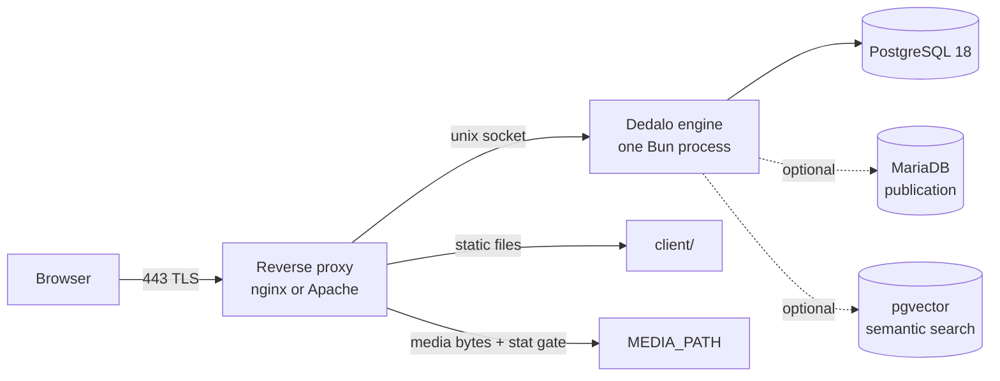

# Installation

> See also: [Production install](production.md) · [Docker](docker.md) · [Dev quickstart](dev_quickstart.md) · [Configuration](../config/index.md)

Dédalo manages cultural heritage: archaeological, ethnological and documentary
collections, memory and oral history. It is a client–server application, so
installing it means preparing a server — the pages below take you from a clean
operating system to a running, TLS-protected, supervised instance.

## What you are installing

Four moving parts, and it is worth knowing which is which before you start:

- **The engine** — a single long-lived process on the Bun runtime. It listens on
  a **unix socket**, never on a TCP port in production.
- **PostgreSQL** — the system of record. Everything is in it: the ontology, the
  records, the users, the audit trail.
- **The reverse proxy** — owns TCP and TLS, serves the client files, and
  **enforces media access control** using rule files the engine generates. It is
  not optional.
- **The media tree** — an absolute path, usually on its own volume. Originals plus
  every derivative. It is the largest thing you will store, and the only one no
  amount of database backup can reconstruct.

Everything else — publication to a public website, semantic search, the AI
assistant — is optional and off by default.

## Choose your path

| Path | For | Start here |
| --- | --- | --- |
| **Bare metal, Ubuntu 24.04** | the production reference | **[Production install](production.md)** |
| **Bare metal, RHEL family** | Rocky, AlmaLinux, RHEL, Fedora | [RHEL-based systems](install_rhel.md) — a delta on top of the above |
| **Containers** | Docker Compose, orchestrated deployments | [Docker](docker.md) |
| **A laptop, in ten minutes** | development, evaluation, a demo | [Dev quickstart](dev_quickstart.md) |

And the supporting pages, whichever path you take:

- **[Reverse proxy and TLS](reverse_proxy.md)** — nginx and Apache, certbot, and
  the generated media rules you must wire in. The load-bearing page.
- **[Installer reference](installer_reference.md)** — every flag, every step, what
  the seed contains, and exactly which keys land in `.env`.
- **[Troubleshooting](troubleshooting.md)** — symptom → cause → fix.
- **[Upgrading](upgrading.md)** — the runtime pin, boot migrations, retired keys,
  rollback.
- **[H.264 streaming module](install_h264_module.md)** — serve audiovisual
  fragments by time range.

## Prerequisites at a glance

| | Requirement | Notes |
| --- | --- | --- |
| **Runtime** | Bun, **the exact version pinned in `.bun-version`** | never `bun upgrade` a production box — the pin is load-bearing |
| **Database** | PostgreSQL 18, **plus the client tools** | `psql` must not be older than the server; the role must be able to `CREATE EXTENSION` |
| **Web server** | nginx or Apache 2.4+, with TLS | it enforces media access control; the engine is never in the media byte path |
| **Media tools** | `ffmpeg` (with `qt-faststart`), ImageMagick, poppler, optionally `ocrmypdf` | without them, uploads produce no derivatives |
| **Base tools** | `git`, `unzip`, `gzip`, `file`, `curl`, `ca-certificates` | the code-update subsystem shells out to some of these |
| **Filesystem** | the directory **above** the repo must be writable by the service user | the installer creates `../private/` there, holding every secret |
| **Optional** | MariaDB (publication), pgvector (semantic search) | you create the target databases; the engine never does |

!!! note "A clone is self-contained"
    The browser libraries the client loads ship **with the repo** — from
    `bun install` or from the committed `vendor/` tree. There is no sync step, no
    fetch step and no build step: the engine runs TypeScript directly.

## Sizing the server

Dédalo computes its data shape at read time from the ontology rather than storing
a fixed schema, and it builds audiovisual editions on demand. Both are CPU- and
memory-hungry, and both scale with how much your users search rather than with
how many records you hold.

| | Minimum | Recommended |
| --- | --- | --- |
| **OS** | Ubuntu 22.04 LTS · Rocky 9 · RHEL 9 | **Ubuntu 24.04 LTS** · Rocky 9 · RHEL 9 |
| **CPU** | 8 cores @ 3 GHz | 8+ cores @ 3 GHz |
| **RAM** | 32 GB | 64 GB |
| **Disk (system)** | 150 GB SSD, RAID 10 | same |
| **Disk (data + media)** | 1 TB SSD, RAID 10 | grows with the collection — size it for the media, not the records |
| **Network** | static IP, 500 Mb/s, a domain, a TLS certificate | 1 Gb/s |

Storage is the number you must actually think about. A project of a few thousand
records with images, PDFs and audiovisual material will hold **orders of
magnitude more media than data** — plan for the collection you expect in five
years, not the one you are importing this month.

!!! warning "Back up four things, not one"
    The matrix database alone is **not** a backup. The complete set is: the
    matrix database, the vector database (if you enabled semantic search), the
    **media originals**, and `../private/` (the secrets and the state). Losing the
    last one means a restored database you cannot start. See
    [backup](../management/backup.md).

!!! note "macOS and Windows"
    Fine for development and evaluation — see [dev quickstart](dev_quickstart.md).
    Not recommended for production.

## After the install

1. Log in as `root`, create an **admin user**, and keep `root` for emergencies.
2. Create your [users and projects](../management/users_and_permissions.md).
3. Import and activate the [hierarchies](../management/install_new_hierarchies.md)
   your collection needs — importing one is not the same as activating its
   thesaurus.
4. Set up [backups](../management/backup.md), and restore-test them.
5. Read the [configuration reference](../config/index.md): the installer writes
   only the database, entity and language keys — everything else is yours.
