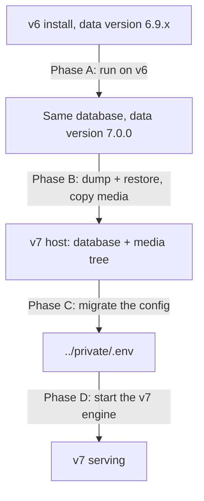

# Migrating a v6 install to v7

> See also: [What changed in v7](../config/whats_changed_v7.md) · [Upgrading](upgrading.md) · [Backup](../management/backup.md) · [area_maintenance](../core/areas/area_maintenance.md) · [Server-side observers](../core/system/observers.md) · [Troubleshooting](troubleshooting.md)

This page is the whole operator path from a running Dédalo v6 to a running Dédalo v7: what the old engine does to your data, how you move the database and the media, and what to do when the data itself turns out to be wrong.

## 1. What this migration is

Two engines, one handover. **The v6 engine transforms your data into the v7 format, in place, in its own database.** Only then does the v7 engine take over that database. The v7 engine cannot do the transform — it deliberately ships no v6 update catalog, and pointed at an untransformed database it will simply report that there is nothing to update.



The transform ships as a **self-contained maintenance package** for v6, `close_v6_prepare_v7`. It is part of the Dédalo **v6** source tree — `core/area_maintenance/widgets/close_v6_prepare_v7/` — and not of the v7 repository, because it runs on v6: take it from a v6 checkout at 6.9.1 or later. It carries its own copy of the transforming engine and runs it as a separate process, so nothing in your v6 install is upgraded or replaced by installing it. Deploying it is three steps — see [get and deploy the package](#25-get-and-deploy-the-package).

!!! danger "The transform rewrites the v6 database in place"
    It is not a copy-then-convert. The only way back to v6 is the database backup — see [rollback](#9-rollback). Everything below assumes you have one.

## 2. Before you start

### Backups

Four stores, with v6 paths — do not take them from the v7 backup list, whose fourth store (`../private/`) and `MEDIA_PATH` do not exist on a v6 host. [Production §13](production.md#13-backups) describes the equivalent set on v7 only.

1. The **matrix database**: `pg_dump --host localhost --username <v6 user> --format custom --file dedalo_v6.custom.backup <v6 db>`.
2. The **media root** — the directory holding `image/ av/ pdf/ 3d/ svg/`.
3. The **RAG vector database**, if you use semantic search.
4. The v6 **`config/` directory**, including any included `private/config.inc`: it holds `DEDALO_INFORMATION` / `DEDALO_INFO_KEY`, the key material the password migration needs.

Restore-test the database dump before you touch anything:

```shell
createdb dedalo_restore_test
pg_restore --dbname dedalo_restore_test --no-owner --no-privileges dedalo_v6.custom.backup
psql -d dedalo_restore_test -c "SELECT count(*) FROM matrix_dd;"
dropdb dedalo_restore_test
```

`pg_restore` must exit 0 and the count must be non-zero. A dump that has never been restored is not a backup.

!!! warning "A database backup alone is not enough"
    The old configuration files hold the key material that makes the stored passwords readable. Lose them and the password migration in Phase D cannot run. See [backup](../management/backup.md).

### Preconditions

| Check | Required value | Where to look |
| --- | --- | --- |
| Data version | **6.9.1 or later, and below 7.0.0** | the `matrix_updates` table; the v6 preparation panel reports it |
| You are logged in as | the Dédalo **superuser** | the panel refuses anyone else |
| Maintenance mode | **on** before anything that writes | [maintenance status](../management/maintenace_status.md) |
| Dump tool on the **v6** host | `pg_dump --version` not older than the v6 server's `SELECT version();`, and not older than the v7 target's major | the preflight fails hard if the dump cannot run |
| Server on the **v6** host | the PostgreSQL that already serves v6 — the transform runs there, in place | — |
| Server on the **v7** host | PostgreSQL 18 plus the client tools | [prerequisites](index.md#prerequisites-at-a-glance) |
| Free disk on the **v6** host | at least 2× the database size plus 20% — the deep preflight and the migrate run each take a full backup | `df -h <backup dir>` against `SELECT pg_size_pretty(pg_database_size(current_database()));` |

If you cannot install PostgreSQL 18 client tools on the v6 host, dump remotely from the v7 host instead: `pg_dump --host <v6 host> …`.

The version is checked as a **range**, not an exact match: any v6 at or after 6.9.1 and below 7.0.0 is eligible, so an install kept current (6.9.2, 6.9.3, …) migrates without any adjustment. Below 6.9.1, update it on v6 first — that floor can never be forced. At or above 7.0.0 the database is already migrated.

!!! note "You do not update the ontology separately"
    The migration builds the v7 ontology itself, from the v6 one, as its first step. There is no ontology import to do beforehand.

### Inventory — what you must carry to the v7 host

- [ ] The **matrix database** (dumped *after* Phase A).
- [ ] The **media tree** — the whole directory holding `image/`, `av/`, `pdf/`, `3d/`, `svg/`.
- [ ] The **v6 configuration directory**, for Phase C and for the password migration.
- [ ] The values you will have to set by hand: the media root, the public hostname and scheme, the backup path, the default interface and data language. See the [hand-set keys](#52-hand-set-keys).
- [ ] Your denied areas, if you had any — they are not expressed as settings in v6 and must be re-declared.

### 2.5 Get and deploy the package

The package is `close_v6_prepare_v7/` in the Dédalo **v6** source tree, under `core/area_maintenance/widgets/`. Take it from a v6 checkout at 6.9.1 or later; there is no build step.

1. Copy the whole `close_v6_prepare_v7/` folder onto the v6 server, somewhere the maintenance user can read and write — **preferably outside the web root**. If it must live inside, deny HTTP access to it.
2. Copy `close_v6_prepare_v7/widget/prepare_v7/` (the class and its `js/`) into the v6 install's `core/area_maintenance/widgets/prepare_v7/`. If the package does not sit inside the v6 tree, set `PREPARE_V7_PACKAGE_ROOT` so the class can find it.
3. Register the widget in v6's maintenance-area widget list with `id = 'prepare_v7'` — that id is what makes v6 load both the widget class and its `js/prepare_v7.js`.
4. Set ownership to the user the v6 web server runs as, then verify the copy:

    ```shell
    ./verify_package.sh
    ```

    Expected last line: `Package is self-contained.` Anything else — in particular `Package is INCOMPLETE.` — means a partial copy: fix it before continuing, do not run the transform.

5. Turn maintenance mode on and reload the v6 Maintenance area. The panel **Prepare installation for v7** appears, with its action buttons.

### Prepare the v7 host first

Follow [production install](production.md) steps **1 through 7**: service user, OS packages, media toolchain, PostgreSQL 18, the pinned Bun runtime, the code, and the empty database and role. **Stop before step 8 (run the installer)** — a migrated instance never runs the installer, see [6.1](#61-do-not-run-the-installer). Steps 10 onward (systemd, reverse proxy, TLS) come after Phase D verification.

## 3. Phase A — transform the data, on v6

All of this happens on the v6 host, in the v6 Maintenance area, in the panel labelled **Prepare installation for v7**.

The panel opens with a readiness snapshot: whether you are the superuser, whether maintenance mode is on, the data version found in the database, the engine version, the package and engine paths, and the log file it will write. **While maintenance mode is off, the panel offers no action buttons at all.**

Run the three modes in order.

### 3.1 Preflight

Writes nothing. It checks the version gate, the database connection, that the backup tool can actually run, and the structure of your data.

!!! note "A plain preflight cannot see your data yet"
    It runs before the v7 ontology exists, so no component model resolves and every value is reported as an orphan tipo. This mode verifies the *environment*, not the data. The next one verifies the data.

### 3.2 Deep preflight

Takes the backup, builds the v7 ontology from the v6 one, then reviews your data **with the models resolved** and previews the diffusion mapping — and stops there. It writes, so maintenance mode must be on. The backup lands in `var/backup/` inside the package unless you point `--backup-dir` elsewhere; the review lands in `var/data_review.json` next to the log.

This is the mode that tells you whether your data is clean. It classifies every finding into three buckets, reported as counters on the panel and in detail in the review file the run writes:

| Bucket | Meaning | What you do |
| --- | --- | --- |
| **auto-fixed** | repaired in memory during the run — most often a value stored as a bare language map, which gets wrapped | nothing |
| **notices** | dropped on purpose, typically a value under a tipo that no longer exists in the ontology | read them, decide whether the loss matters |
| **needs attention** | the ontology model and the stored shape disagree — a human must decide | **fix it before migrating**; this is the only bucket that blocks |

A non-empty *needs attention* bucket fails the preflight. See [when something goes wrong](#8-when-something-goes-wrong-data-errors).

!!! note "The ontology step is safe to leave in place"
    Building the v7 ontology only *adds* — the matrix tables are not rewritten and the v6 data is intact. An install can sit at that state and continue later. Run steps 1 and 2 (the numbered list in [3.3](#33-migrate)) are idempotent, so re-running after a partial failure is safe.

### 3.3 Migrate

The real run: backup → transform → passwords → diffusion ontology. It is launched detached and in the background; the panel answers with the process id and a pointer to the log:

```text
Migration started in background (pid 12345). Watch var/prepare_v7.log.
```

The panel then tails the last 200 lines of that log every 5 seconds. The log lives at `var/prepare_v7.log` inside the package and is rotated to `var/prepare_v7.log.previous` on each launch.

The panel is only a tail: closing it does not stop the run. From the shell, `ps -p 12345` says whether the process is still alive, and the log's terminal lines are what tell you how it ended — each phase writes `exited with code <n>` (the codes below), and a complete run ends with `=== PREPARE V7: DONE. …`. If the process is gone and no such line was written, the run was killed: re-run it (run steps 1 and 2 are idempotent).

What the run does, in order:

1. **Backup**, then build the v7 ontology.
2. **Schema and data transform**: adds the v7 typed columns (`data`, `relation`, `string`, `date`, `iri`, `geo`, `number`, `media`, `misc`, `relation_search`, `meta`) to 23 matrix tables, then redistributes each record's single v6 value blob into them by component model. Rebuilds the time machine, drops the legacy `datos` column, then migrates the dataframe pairing locators to the v7 contract, materialises IRI titles, and finally builds and backfills the two derived search stores.
3. **Passwords**: converts every recoverable account to Argon2id.
4. **Diffusion ontology**: rewrites the diffusion properties.

Duration is a function of how many rows you have. There is no progress bar: the runner prints a `progress:` heartbeat about every 10 seconds. **No heartbeat for several minutes means the run is stuck** — read the log tail and check the database for locks.

### 3.4 After the run — what to check

- The data version in `matrix_updates` reads **7.0.0**. That row is written only after run steps 1 and 2 both succeed.
- Read the log for errors. Not every error stops the run:

!!! danger "A stamped 7.0.0 does not mean every row converted"
    A failing schema step aborts immediately and stamps nothing — the database is left half-migrated at the v6 version, and you re-run. But a failing *script* step that is not marked fatal is logged and the run **continues to the version stamp**. That includes the main data-reformat step. Rows that failed to convert are carried past the stamp. Search the log before you declare the migration clean:

    ```shell
    grep -n "Error on run_scripts\|Request done with errors" var/prepare_v7.log
    ```

    Each hit names the failing step and the affected table and record id. Note them, re-run the migration (it is idempotent) and grep again; rows that still fail are data errors — treat them as [needs attention](#81-needs-attention-findings-v6-host-before-phase-a) findings and fix the record before Phase B.

- Passwords and diffusion run **after** the stamp and are deliberately non-fatal. A failure there does not mean the database migration failed; each can be re-run on its own afterwards. If the password phase reports no Argon2 support in the interpreter, fix the interpreter and re-run just that phase — you can also do the equivalent on the v7 side later (see [Phase D](#62-migrate-the-passwords)).

### Result codes you can meet

| Code | Meaning |
| --- | --- |
| 0 | success |
| 2 | usage or boot problem — a writing mode was started without confirming |
| 3 | not eligible: no data version found, below 6.9.1, or already at/beyond 7.0.0 |
| 4 | the mandatory pre-migration backup could not run |
| 5 | the ontology build or the update failed |
| 6 | the preflight found data errors (the *needs attention* bucket is not empty) |
| 7 | the diffusion ontology migration failed (database migration already done) |
| 8 | this interpreter has no Argon2 support (database migration already done) |
| 9 | an uncaught error — the run failed, loudly, on purpose |

## 4. Phase B — move the database and the media

Maintenance mode stays **on**, and the v6 engine stays unreachable to users, until you have verified v7 in [§7](#7-verify). Any v6 write made after the dump below is lost — there is no re-sync.

Dump the migrated database and restore it into the **empty** database created in production step 7:

```shell
# on the v6 host, after Phase A
pg_dump --host localhost --username <v6 user> --format custom --file dedalo_v6_migrated.custom.backup <v6 db>

# on the v7 host, into the EMPTY database
pg_restore --host localhost --username <v7 user> --dbname <v7 db> --no-owner --no-privileges --verbose dedalo_v6_migrated.custom.backup
```

Do **not** pass `--clean`: the target is empty by requirement. The [backup page](../management/backup.md#restore-a-backup-for-the-work-system) covers the general restore, including the existing-database case, as background.

The role that owns the target database must be able to `CREATE EXTENSION`: `pg_trgm`, `unaccent` and `btree_gin` are required. If policy forbids that, have a superuser create the three extensions in the empty database first.

Then copy the media tree. The per-type folder names do not change between v6 and v7 — `image`, `av`, `pdf`, `3d`, `svg` — so the subtree carries over as it is. **Only the root moves.** Whatever absolute directory contains those folders on the new host is the value you will set as `MEDIA_PATH` in the next phase.

!!! warning "Copy the media completely before you start the engine"
    The stored media index is a cache derived from what is on disk. A partial copy makes the engine record a smaller file set, and the repair sweep will then refuse to shrink it back without an explicit override. Finish the copy first.

## 5. Phase C — the config

A v6 install keeps its settings as ~200 `define()` statements in `<dedalo>/config/`. v7 reads one file, `../private/.env`. `dedalo:migrate-config` turns the first into the second. It does not guess: it reads your v6 config, tells you exactly what it will write, what it will drop and why, and what it cannot migrate — and it writes nothing until you say so.

!!! note "Where every `bun` command on this page runs"
    On the **v7 host**, from the install root (`/var/www/dedalo/master_dedalo` in the production guide), **as the service user**: `sudo -u dedalo bun run …`. Relative paths such as `../private/.env` are relative to that directory. Run as root and you get a root-owned `.env` the service cannot read.

The spine is three commands. The rest of this section is what each one tells you.

```shell
# 1. dry-run: prints the plan, writes nothing
bun run dedalo:migrate-config --config-dir=/path/to/dedalo_v6/config

# 2. candidate: write it somewhere safe, add the hand-set keys, boot against it
bun run dedalo:migrate-config --config-dir=/path/to/dedalo_v6/config --out=/tmp/candidate.env

# 3. apply: merges into ../private/.env, backs the previous file up, stays 0600
bun run dedalo:migrate-config --config-dir=/path/to/dedalo_v6/config --execute
```

`--config-dir` is the v6 `config/` directory — the one holding `config.php`, `config_db.php`, `config_areas.php` and `config_core.php`.

!!! warning "If your defines live somewhere else"
    Some installs keep the payload in an included file (e.g. `../private/config.inc`) and leave `config.php` as a stub. The tool reads the config **directory only** and never follows an include out of it — but it says so, loudly, and refuses to proceed:

    ```text
    !! CONFIG INCLUDED FROM OUTSIDE THE CONFIG DIRECTORY — and NOT read.
    ```

    Point `--config-dir` at the directory that really holds the `define()`s.

### 5.1 Read the report

Every constant it found is grouped. Values are never printed, so the report is safe to paste into a ticket — passwords and salts stay in your files.

| Section | What it means | What you do |
| --- | --- | --- |
| `SAME` | v7 reads this key under the same name | nothing |
| `ALIAS` | v7 has its own name for it; the value carries over | nothing |
| `RENAMED` | the name changed **and the old one is retired** | nothing — the tool writes the new name |
| `RESHAPED` | the name and/or the value shape changed | nothing — the tool converts it |
| `DROPPED` | v7 has no such setting, with the reason | nothing. See [what changed in v7](../config/whats_changed_v7.md#settings-that-are-gone) |
| `COMMENTED OUT` | you had deliberately left it at the default | nothing |
| **`NOT MIGRATABLE`** | **the v6 value is computed at runtime** | **set it by hand — see [5.2](#52-hand-set-keys)** |
| **`UNKNOWN`** | the tool has never heard of this constant | **report it** — it is a gap in the map, not a fault in your config |

### 5.2 Hand-set keys

v6 computed some settings instead of stating them — the host from the request, the media and backup paths from the script's own location, the interface language from a function call. A static reader cannot know what those evaluate to on your server, and **guessing would be worse than stopping**: it would write a plausible wrong path and look like it had worked. So they are listed as `NOT MIGRATABLE` and you set them by hand in `../private/.env`:

| Key | What to set it to |
| --- | --- |
| `MEDIA_PATH` | the absolute media root on the **new** host — the directory holding `image/`, `av/`, `pdf/`, `3d/`, `svg/` |
| `DEDALO_HOST`, `DEDALO_PROTOCOL` | the server's real public hostname and scheme |
| `DEDALO_BACKUP_PATH`, `ONTOLOGY_DATA_IO_DIR`, `UPDATE_LOG_FILE` | paths on the new host |
| `APPLICATION_LANG`, `DATA_LANG` | the defaults you used in v6 |
| `DEDALO_FILTER_SECTION_TIPO_DEFAULT` | as in v6, if you set it |
| `AREAS_DENY` | your denied areas, as a JSON array of tipos — v6 did not express them as a setting |

`MEDIA_PATH` is the one that matters most: get it wrong and no media resolves, and writes made while it is wrong corrupt the media index.

### 5.3 Try the candidate before you apply it

Do not migrate straight into your live `.env`. Write the candidate (command 2 above), open it, add the hand-set keys, then boot a server against it:

```shell
mkdir -p /tmp/try/private && cp /tmp/candidate.env /tmp/try/private/.env
DEDALO_PRIVATE_DIR=/tmp/try/private bun run dev
```

A good config boots, answers `/health`, and shows a configured install in **maintenance → check config**. A bad one usually fails loudly at boot, naming the key.

### 5.4 Apply it

`--execute` **merges** into `../private/.env`:

- keys already present are left exactly as they are — your file is never rewritten or reordered
- new keys are appended under a dated comment block
- the previous file is backed up to `.env.bak.<timestamp>`
- the write is atomic, and the file stays `0600`

It refuses to run if anything is still `UNKNOWN`, or if a **boot-critical** key (`ENTITY`, the `DB_*` set, and the language block) is unresolved — a configured install without those crash-loops, and it is better to find out now.

If the result is wrong, nothing is destroyed: the previous file is at `.env.bak.<timestamp>`. Restore it and re-run the dry run.

??? note "What is *not* migrated, on purpose"
    - **Secrets are not invented.** `DEDALO_SALT_STRING` is dropped: in v6 it seeded a *session* token, never a password salt. v7 manages its own session secrets.
    - **The password keys are dropped deliberately.** `DEDALO_INFORMATION` / `DEDALO_INFO_KEY` were the AES key and IV for v6 passwords. Carrying them into v7 would only preserve the ability to *decrypt* old passwords — exactly what you do not want. v7 stores Argon2id hashes, whose salt is embedded per password. They are still needed **once**, by the password migration in [6.2](#62-migrate-the-passwords) — which is why you kept the old config directory, and why you delete it afterwards.
    - **`config_areas.php`** holds no `define()`s — it is code appending to a deny list. If you denied areas, set `AREAS_DENY` yourself, or use the maintenance area.
    - **Runtime state** (maintenance mode, install status) is not config in v7 — it lives in `../private/ts_state.json` and is written by the app.

    The full v6 → v7 settings map, key by key, is [what changed in v7](../config/whats_changed_v7.md).

!!! warning "Retired keys refuse the boot"
    A v6 `.env` carried over may still name a key v7 has retired. The server names the key and the file and refuses to start until you rename the line — the full list is in [upgrading](upgrading.md#4-retired-configuration-keys).

## 6. Phase D — first v7 boot

### 6.1 Do not run the installer

!!! danger "The installer is a fresh-database tool only"
    Pointed at a migrated database it stops at the seed step:

    ```text
    Database is not empty (matrix_users already exists) — restore refused
    ```

    There is no flag to skip the seed — you skipped [production](production.md) step 8 on purpose. The migrated path is: migrate the config, migrate the passwords, then **start the server**, in that order. Nothing else.

The install wizard will not appear either, and that is deliberate: the install surface is reachable only on an unconfigured box or mid-install. A migrated instance has its database keys set, so the normal login serves.

### 6.2 Migrate the passwords

!!! danger "Skip this and every user is locked out"
    v6 did not *hash* passwords, it **AES-encrypted** them. v7 accepts **only Argon2id**, and there is no upgrade-on-next-login path: any user whose stored value does not start with `$argon2` cannot log in. Run this **after** the config exists (it needs the database settings) and **before** you let users in — the server does not have to be running.

    Count who is still on the old storage:

    ```sql
    SELECT COUNT(*) FROM matrix_users
     WHERE "string"->'dd133'->0->>'value' NOT LIKE '$argon2%';
    ```

**Nobody has to choose a new password.** Because the old storage is reversible, the tool decrypts each legacy value once and re-hashes it with Argon2id. Users log in afterwards with the passwords they already have, and are never told anything happened.

```shell
# dry-run: reports who is recoverable; writes nothing, prints no passwords
bun run dedalo:migrate-passwords --config-dir=/path/to/dedalo_v6/config

# apply
bun run dedalo:migrate-passwords --config-dir=/path/to/dedalo_v6/config --execute
```

It needs the v6 **`DEDALO_INFORMATION`** and **`DEDALO_INFO_KEY`** — the encryption key and IV. If your install keeps its defines in an included file, name it with `--config-file=/path/to/private/config.inc`, or pass them directly with `--information='…' --info-key='…'`.

!!! warning "Use the config that was in use when the passwords were last set"
    Those two constants are marked *don't change it after install* for exactly this reason: change them and every stored password becomes undecryptable. If the dry run says **NOT RECOVERABLE** for everyone, the key material is wrong — it does **not** mean the passwords are lost. Find the right config before doing anything else. A wrong key is always reported, never silently applied.

    Users it genuinely cannot recover must have their password reset by an admin.

!!! info "This is a security upgrade, not just a compatibility fix"
    `DEDALO_INFORMATION` defaults to a published string and the IV seed is the entity name — so on a default v6 install, **anyone with a copy of the database can decrypt every password**. Argon2id ends that. It is also why the config migration deliberately does not carry those two keys into the v7 `.env`.

Once this has run and [§7](#7-verify) passes, the v6 config copy on the v7 host can decrypt nothing you still need. Securely delete it (`shred -u`): it holds the AES key for every legacy password.

### 6.3 Start the server — what happens automatically at boot

| Step | Behaviour |
| --- | --- |
| Schema migrations | ordered files applied before serving; they provision **only** the engine's own operational tables, never the matrix schema |
| Search stores | if a store table, a trigger or the store's contents are missing, the engine provisions and **backfills** `matrix_string_search` and `matrix_relation_index` |
| Media index, observers, diffusion, caches | registered and warmed; failures are logged, not fatal |
| Statistics wipe | a restore wipes Postgres cumulative statistics; boot **detects and warns only** |

!!! warning "The first boot can take minutes before it serves"
    The search-store backfill is exactly the post-migration case: the stores are empty while the data is not. It is loudly logged. Until it finishes, relation searches refuse with a maintenance message rather than returning wrong results.

!!! note "A green health check does not prove the migrations applied"
    A failed migration run logs and the server keeps serving on lazy fallbacks. Read the boot log, not just `/health`.

### 6.4 Operator actions the boot does not do for you

| Action | Where | Why it matters |
| --- | --- | --- |
| Register tools | maintenance area, `register_tools` panel | tool records are not migrated; without this the tools are not offered |
| Activate hierarchies | maintenance area, `add_hierarchy` panel | see [install new hierarchies](../management/install_new_hierarchies.md) |
| Repair sequences | maintenance area, `sequences_status` panel | opening it audits every table sequence except a named skip list (`session_data`, the counter tables, `temp`, the legacy `relations` tables) and **repairs one that is behind, as a side effect of loading** |
| Refresh statistics | `analyze_statistics` in the Database info panel | the repair for the statistics wipe boot warned about |
| Repair the media index | `bun scripts/media_repair_files_info.ts` | see [media drift](#84-media-drift-files-on-disk-nothing-rendered-v7) |

Widget by widget, the panels are described in [area_maintenance](../core/areas/area_maintenance.md).

## 7. Verify

```shell
curl --fail --unix-socket /run/dedalo/dedalo_ts.sock http://localhost/health
```

Expected: HTTP 200 with `db` reporting `ok`. If you run on a TCP port instead of a socket, `curl --fail http://localhost:<port>/health`. No socket file at all means the process is not running — `journalctl -u dedalo -n 100`. Set up systemd and the reverse proxy ([production](production.md) steps 10–11) **after** this verification passes. Then, in the browser, as a normal user:

| Check | Expected |
| --- | --- |
| Log in with a pre-migration account | it works — if it does not, the password migration did not run |
| Open a record with images | thumbnails render |
| Run a text search | results |
| Run a search on a related section | results — not a maintenance message; if you get one, the search-store backfill is still running |
| Open a thesaurus | the tree has terms |
| Maintenance → update data version | the version in the database reads **7.0.0** |
| Maintenance → `dataframe_control`, press *run check* | `OK. Integrity scan done. Orphans found: 0` |
| Maintenance → `counters_status` | no counter reported against a non-section |

!!! note "The login panel's version row is not the database's"
    It shows the engine constant, so it reads `7.0.0` even on a database still stamped 6.x. Only the update-data-version panel reads the real value.

## 8. When something goes wrong — data errors

Most trouble is found by the deep preflight, **before** the migration. The rule for everything below is the same:

!!! danger "Dry run first, every time — and there is no rollback for a move"
    The bulk transforms default to reporting only, and mutate **only** when explicitly told to. The section-move and tipo-rename transforms offset record counters irreversibly: the dry run is the safety gate, and a database backup is the only undo. Run them under maintenance mode.

### Symptom → cause → fix, before you migrate (v6 host, Phase A)

| Symptom | Cause | Fix |
| --- | --- | --- |
| Preflight refuses: not eligible, no data version found | the database is fresh or not a Dédalo database | you are pointed at the wrong database |
| Preflight refuses: requires 6.9.1 or later | v6 data is too old | update the v6 install first; this can never be forced |
| Preflight refuses: already at or beyond 7.0.0 | already migrated | do not re-run; go to Phase B |
| Preflight fails on the backup | the dump client is unusable or older than the server | install matching client tools; the backup is the real run's first step, so this is fatal by design |
| Preflight fails with *needs attention* findings | model and stored shape disagree | [fix in v6 first](#81-needs-attention-findings-v6-host-before-phase-a) |
| Panel offers no buttons | maintenance mode is off | turn it on |
| Refused: only the Dédalo superuser | you are not the superuser | log in as superuser |

### Symptom → cause → fix, after you migrate (v7 host, Phase D onward)

| Symptom | Cause | Fix |
| --- | --- | --- |
| A component shows the wrong or no value | the row failed to reformat and was carried past the stamp | search the log, re-run the migration (it is idempotent), or fix the record |
| Widget with a subsidiary form shows nothing / duplicated rows | dataframe frames left legacy or orphaned | [dataframe frames](#82-dataframe-frames-v7) |
| A computed/mirrored value is empty or stale | the mirror was written by the migration, outside the save path | [stale mirrors](#83-stale-observer-mirrors-v7) |
| Media widget empty although the files are on disk | media index drift, usually a wrong media root | [media drift](#84-media-drift-files-on-disk-nothing-rendered-v7) |
| Thesaurus tree empty, portal resolves nothing | the hierarchy was imported but never activated | [hierarchy not activated](#86-hierarchy-not-activated-v7) |
| New records collide with existing ids | the record counter is behind the data | [counters](#87-counters-and-sequences-v7) |
| A relation points at a record that is not there | structural leftovers | [dangling relations](#85-dangling-relations-and-wrong-tipos-v7) |
| Stale values after an ontology or media change | stored per-record data needs regenerating | clear the caches from the runtime panel, then run [tool_update_cache](../tools/using_update_cache.md) |

### 8.1 *Needs attention* findings (v6 host, before Phase A)

These are the only findings that block the migration, and they block it on purpose: the ontology says a component is one model and the stored value has the shape of another. A tool cannot decide which one is right.

Every review writes its findings to `var/data_review.json` inside the package, next to the log — that file is what the panel's chips read. The blocking bucket is also printed in the log, one group per model mismatch, with the records it touches and a ready-to-paste statement:

```text
   14 × Bad component data [2]. Expected object. … tipo: 'ich147' … model: button_new
        written as: component_input_text · ontology now says: button_new
        records in matrix_dd · section_tipo ich145 · section_id: 1, 2, 3, 4, 5, 6, 7
        SELECT * FROM matrix_dd WHERE section_tipo = 'ich145' AND section_id IN (1, 2, 3, 4, 5, 6, 7);
```

Read it as: the component **tipo**, the **model** the ontology declares, the shape the value was **written as**, and the table, section tipo and record ids to look at. Run the printed `SELECT` on the v6 database and read the value stored under that tipo in the legacy `datos` column. The ids are de-duplicated and capped at 200 per table and section tipo; the same `locations` and `sql` fields are in `var/data_review.json`.

Then decide, and the criterion is the majority:

- **The ontology is right, the record is wrong** when other records of the same component hold the model's shape. Fix the record, in the v6 edit form.
- **The stored shape is right, the ontology is wrong** when *every* record disagrees with the model — usually a component whose model was changed in the ontology after the data was written. Fix the model in v6's ontology tool.

Re-run the deep preflight; the bucket must read 0. The other two buckets do not block: auto-fixed findings are repaired by the run itself, and notices are values under tipos the ontology no longer knows — read them and decide whether the loss matters before you continue.

!!! note "Re-running the review with the repairs off"
    There is no panel control for this: run the preflight from the shell with `--no-auto-fix`. That is a **diagnostic** view of what your data looks like untouched; the real migration always repairs.

### 8.2 Dataframe frames (v7)

The migration rewrites every subsidiary-record pairing locator to the v7 contract. Entries it cannot resolve are **left in the legacy shape on purpose** and reported, so nothing is lost — the engine still reads them.

In the maintenance area, [`dataframe_control`](../core/areas/area_maintenance.md#the-widgets) scans for frames whose main item no longer exists: *run check* reports, *run fix* repairs.

Read the report's `complete` and `uncovered` fields before you trust a zero: a message beginning `PARTIAL.` is not a clean bill of health. Full widget contract: [area_maintenance](../core/areas/area_maintenance.md#the-widgets).

The panel does **not** scan on load — it shows *not run* until you press run check.

### 8.3 Stale observer mirrors (v7)

A migration writes records without going through the save chokepoint, so mirrored values are stale by construction. The v7 update engine reconciles them automatically at the end of a run it performed itself; after a migration performed by the old engine, do the sweep by hand:

```shell
bun scripts/observer_reconcile.ts                  # dry run — census only
bun scripts/observer_reconcile.ts --json > census.json
bun scripts/observer_reconcile.ts --budget         # adjudicate the drops
bun scripts/observer_reconcile.ts --apply          # repair
```

!!! danger "The sweep drops as well as adds"
    Since it applies the full law, a repair can delete mirrored references. Always run the dry run, the census and `--budget` first. If it prints `SHRINK BUDGET BUSTED`, do **not** apply — investigate the drops.

Scope, refusal causes and how to read the census by cause are on the canonical page: [server-side observers](../core/system/observers.md).

### 8.4 Media drift: files on disk, nothing rendered (v7)

The per-record file list inside the media column is a **cache derived from the disk**, served as stored. If it is stale, the client renders nothing although the files are there. The documented cause is exactly the migration case: writes ran while the media root pointed at the wrong tree.

```shell
bun scripts/media_repair_files_info.ts                                   # dry run
bun scripts/media_repair_files_info.ts --section rsc170 --id 1 --component rsc29
bun scripts/media_repair_files_info.ts --apply
```

- It **refuses to run** unless the media root exists and holds the image originals — precisely so a wrong root cannot re-corrupt every index. If it refuses, fix `MEDIA_PATH` first.
- It does not rebuild derivatives and writes no time machine version; it only re-reads the disk.
- A rescan that finds **fewer** files than are stored is reported and skipped unless you pass `--allow-shrink`. That is the expected signal of an incomplete media copy — finish the copy, do not force it through.

To rebuild *missing derivatives* as well, use [tool_update_cache](../tools/using_update_cache.md) instead.

### 8.5 Dangling relations and wrong tipos (v7)

Run **relation integrity report** in the Database info panel to see what points nowhere.

Repairing it by restructuring — moving a section to another tipo, moving values into a portal, changing a component's language — is done with the five bulk transforms in the maintenance area's *migration* category ([area_maintenance](../core/areas/area_maintenance.md#the-widgets)), driven by JSON definition files under [`DEDALO_TRANSFORM_DEFINITIONS_DIR`](../config/config.md#defining-the-transform-definitions-directory). That is a **planned project, not a migration-night task**: the panel buttons report only, execution is a separate explicit call, a section move is not idempotent, and none of it writes a time machine snapshot. Plan it after the migration is verified.

### 8.6 Hierarchy not activated (v7)

Importing a hierarchy lands its terms but does not make them reachable: until it is activated, its ontology does not exist, the tree shows nothing and portals resolve an empty target. Activate it from the `add_hierarchy` panel — see [install new hierarchies](../management/install_new_hierarchies.md). Re-activating an already-installed hierarchy is skipped, and never overwrites identity metadata you have edited.

If activation refuses with *not registered (no valid typology)*, the registry record for that hierarchy is incomplete — fix it in the ontology, then activate.

### 8.7 Counters and sequences (v7)

A counter behind the data makes new records collide with existing ids — which is why both mechanisms are worth checking after a restore or a transform. The `counters_status` panel audits record counters (and offers *fix* and *reset*), and opening `sequences_status` audits and repairs a lagging table sequence as a side effect of loading. Both are described in [area_maintenance](../core/areas/area_maintenance.md#the-widgets).

## 9. Rollback

There is no reverse migration. Rolling back means restoring what you backed up:

1. Restore the **matrix database** dump — the one taken before Phase A if you want v6 back, the one taken after Phase A if you only want to redo the v7 side.
2. Restore the configuration that matches the target. Restoring to **v6**: the v6 `config/` directory (and `private/config.inc` if you use one) alongside the pre-Phase-A dump — the password key material lives there. Restoring the **v7 side only**: `../private/` alongside the post-Phase-A dump. A restored database with the wrong secrets does not start.
3. The media originals are unchanged by the migration; restore them only if you moved rather than copied them.

!!! danger "Two things a restore is the only undo for"
    The password conversion destroys the plaintext after hashing — there is no reverse tool, only a restore or an admin reset. And the section-move and tipo-rename transforms offset counters irreversibly. Both are why the backup comes first.

Rolling the **engine** back across a v7 release is a different operation, covered in [upgrading](upgrading.md#rollback).
