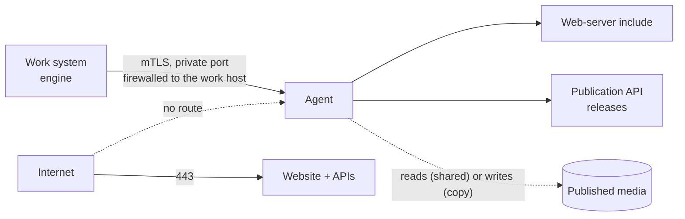

# Publication host agent

> See also: [Reverse proxy and TLS](reverse_proxy.md) · [Production install](production.md) · [Media protection](../core/system/media_protection.md) · [Installation](index.md)

Your public website, the Publication APIs and the published media can live on their own
server, away from the work system. This page installs the **publication host agent**:
the small service on that server that the work system controls. It explains what the
agent may and may not do, how it is provisioned and paired, and how to keep it running.

!!! note "Driven from the maintenance panel"
    Once the agent is provisioned, [pair it with the work system](#pair-it-with-the-work-system).
    The work system's **Publication hosts** panel then shows its state and applies its
    media rules. You can still install the media rules by hand, as described in
    [media protection](../core/system/media_protection.md#a-separate-publication-server-with-shared-media-storage).

!!! info "The Publication API v1 is optional"
    The Publication API **v2** is always installed. The Publication API **v1** is legacy: install
    it only for a website built for Dédalo v6 that still calls it. A declaration **without a
    `v1` block** is a v2-only instance, the recommended shape for a new site: no PHP-FPM pool, no
    PHP runtime, no v1 account, no v1 configuration file anywhere on the host. Every v1-only
    account, file, step and table row on this page is marked **(v1 only)**; on a v2-only site,
    skip it. A v2-only host refuses a v1 release (`api_not_served`), and the work system never
    sends one there: the panel shows its v1 row as *Not served*.

## When you need it

- **Two machines.** The work system stays internal, and a second, public server runs the
  website. The agent is how the work system reaches that server.
- **One machine, two hostnames.** A small institution runs the work system on
  `dedalo.museum.org` and the website on `www.museum.org` on the same server. The
  separate hostname is what keeps a website flaw from acting with a curator's login. The
  same agent then listens on a local socket instead of the network.

A single install that serves its website from the work system's own hostname does not
need it.

## Who owns and runs what

The whole page follows one example site. Replace these names with your own:

| Example | What it is |
| --- | --- |
| `museum.org`, `www.museum.org` | the site, and the website's hostname |
| `dedalo.museum.org` | the work system |
| `/home/museum.org` | the site's home directory on the publication host |
| `museum_org` | the instance: the agent's name for this site, also used as the paired name |
| `museum_site` | the website's own user (its files, its PHP-FPM pool, its SFTP login): Dédalo never runs as it |
| `museum_org_v1` | **(v1 only)** the Publication API v1's user: it runs v1's own PHP-FPM pool, `dedalo_museum_org_v1` |
| `museum_org_agent` | the agent's own user |
| `museum_org_api` | the Publication API v2's user and group |
| `dedalo-publication-api-v2-museum_org`, port `3100` | the v2 service and its local port |
| `dedalo`, `/opt/dedalo/master_dedalo`, `/opt/dedalo/.bun/bin/bun`, `/opt/dedalo/private` | the user that runs Dédalo, its checkout, its pinned Bun and its private directory ([production layout](production.md#the-layout-this-guide-builds)) |
| `/srv/dedalo/media` | the work system's media directory |

**The machines.** The *work host* runs Dédalo. The *publication host* runs the website, the
Publication API v2 (and, when declared, v1), and the agent. On one machine, both names mean the same server:
every step still says which role the command plays.

**The accounts.** Every account has one job, and the reason for each one is a trust reason:

| Machine | Account | Runs, or owns | Why it is separate |
| --- | --- | --- | --- |
| publication host | `root` | runs `provision`; owns the declarations, `/etc/dedalo_publication_host/`, `/home/museum.org`, `host_agent/`, `.bun/` and the state root | whoever could replace one of these would inherit the agent's sudo and polkit grants |
| publication host | `museum_org_agent` | runs the agent service; holds the token, the TLS server key and the sudo and polkit grants | it never runs code the work system pushed. It only **reads** its own code, never owns it |
| publication host | `museum_org_v1` **(v1 only)** | runs the v1 API in its own PHP-FPM pool (`v1.user`); owns the v1 configuration | it is the only account that can read the v1 configuration, which holds the site's database credentials. Never the web server's user, never the website's own pool: a flaw in the website's PHP cannot read it |
| publication host | `museum_site` | the website: owns `httpdocs/` and runs the website's own pool, as before | Dédalo changes nothing about it |
| publication host | `museum_org_api` (user and group) | runs the v2 service and the scratch copy that tests each new v2 release | pushed v2 code runs here, never as the agent. Its group reads `v2.env` |
| publication host | `www-data` | the web server's user and group, shared by every site's pool (`apache` or `nginx` on RHEL) | because every pool shares it, a group permission on a secret would let every site read it |
| publication host | `dedalo_pubhost` (group) | every agent of the host, through its service | the host-wide locks and, on nginx, the shared media map's contributions: no account is ever added to it |
| work host | `dedalo` | runs Dédalo, owns its private directory, runs the pairing command | the work system stores the host's token and certificates as its own private files |

On one machine, the agent's service runs as `User=museum_org_agent` with `Group=dedalo`, the
work system's group (the declaration's `engine_group`). Its runtime directory (`0750`) and
its socket (`0660`) therefore carry the work system's group, and only `dedalo` can open the
socket, as long as `dedalo` is the only account in that group (see `engine_group` in step 2).
The agent and the work system stay two users, each with its own group: nobody is
added to anybody's group. `dedalo` is already a member of its own group, which is all the
fragment's comment *the engine's user must be a member of that group* asks for. The agent
also gets `museum_org_api` as a supplementary group, so that it can check that `v2.env`
exists.

`check` (step 4) refuses an `engine_group` that is certainly wrong: the agent's own group,
`museum_org_v1`'s or `museum_org_api`'s primary group, or the v2 group itself. It cannot prove
the right one, because the declaration never names the work system's account: step 7's
request through the socket, made as `dedalo`, is that proof.

**The directories.** The agent runs as `museum_org_agent`, never as root, so it must be able
to traverse `/home/museum.org` and read `host_agent/` and `.bun/`. It owns none of them,
because code it could rewrite would run as root at the next `apply`. `museum_org_api` runs
the same Bun, and all three service accounts must traverse every directory above the state
root. `check` (step 4) tests each of these with the groups each service actually runs with,
and refuses the plan when one is missing, naming the account, the path and the `chmod` that
fixes it, instead of letting a service fail later with *Permission denied*.

| Path | Owner and mode | Created by | Why |
| --- | --- | --- | --- |
| `/etc/dedalo_publication_host/` | `root:root 0755` | you (step 2) | the declarations and every instance's secrets live here |
| `/etc/dedalo_publication_host/museum_org.json` | `root:root 0644` | you (step 2) | root grants permissions from it |
| `/etc/dedalo_publication_host/museum_org/credentials/SERVICE_TOKEN` | `root:root 0600`, in a `0700` directory | `apply` | the bearer token; systemd hands it to the agent |
| `/etc/dedalo_publication_host/museum_org/engine.env.fragment` | `root:root 0644` | `apply` | what the work system needs to pair; it holds no token |
| `/etc/dedalo_publication_host/museum_org/engine_bundle/` | `root:root 0700` | `apply` | two machines: the work system's client certificate and key |
| `/home/museum.org` | `root:root 0755` (`0751` at least) | you (step 0) | the agent must traverse it; Ubuntu creates homes `0750` |
| `/home/museum.org/httpdocs` | `museum_site:www-data 0750` | you (step 0) | the website, as before |
| `/home/museum.org/.bun/bin/bun` | `root:root 0755` | you (step 1) | the site's own Bun: it runs the agent |
| `/home/museum.org/host_agent/` | `root:root`, `u=rwX,go=rX` | you (step 1) | the agent's code: root runs `provision` from it |
| `/home/museum.org/dedalo/` (the state root) | `root:root 0755` | `apply` | the API releases, the media rules and the audit log |
| `…/dedalo/publication_api/v1/shared/` **(v1 only)** | `root:root 0711` | `apply` | `museum_org_v1` reaches its file by name but cannot list or change the directory |
| `/var/lib/dedalo_publication_host/museum_org/v1/` **(v1 only)** | `root:root 0711`; its `tmp/` and `log/` `museum_org_v1 0700` | `apply` | the v1 pool's temporary files and error log, outside the state root |
| `/etc/dedalo_publication_host/museum_org/web.apache.conf` | `root:root 0644` | `apply` | the site's Dédalo lines (media rules, v2 and, when declared, v1): the vhost includes it (step 9) |
| `/etc/php/8.3/fpm/pool.d/dedalo_museum_org_v1.conf` **(v1 only)** | `root:root 0644` | `apply` | the v1 API's own PHP-FPM pool |
| `…/dedalo/publication_api/v2/shared/` | `root:museum_org_api 0750` | `apply` | `v2.env` is readable by the v2 group only |
| `/var/log/apache2/museum.org/` | `root:root 0755` | `apply` (home layout) | the site's web server logs, **outside the home**: the web server opens them as root. RHEL: `/var/log/httpd/museum.org/`; nginx: `/var/log/nginx/museum.org/` |
| `/etc/logrotate.d/dedalo_museum_org_web` | `root:root 0644` | `apply` (home layout) | rotates that directory: the distribution's own logrotate files reach only `/var/log/apache2/*.log`, one level |
| `/etc/logrotate.d/dedalo_museum_org_v1` **(v1 only)** | `root:root 0644` | `apply` (every site with v1) | rotates the v1 pool's own error log in `/var/lib/dedalo_publication_host/museum_org/v1/log/`, as `museum_org_v1` (the directory is that account's) |
| `/home/museum.org/logs/php/` | `museum_site 0700`, in a `root:root 0711` `logs/` | you (step 0), optional | the website's own PHP error log, if you keep it in the home: its own pool writes it. Nothing of Dédalo's logs here |
| `/run/dedalo_publication_host/museum_org/` | `museum_org_agent:dedalo 0750`, `agent.sock` `0660` | systemd and the agent, at start | one machine: only the work system can connect |

## What it does, and what it never does

The agent answers a fixed list of requests. There is no "run a command", no shell, and no
request that names a file outside the agent's own directories and the copy media root.

| Request | What happens on the publication host |
| --- | --- |
| status | reports the agent and API versions, which APIs the host serves (v2, and v1 when declared), the installed releases, the applied media-rule hash, the media mount and free disk |
| media probe | checks that the media mount is present, read-only and readable |
| apply media rules | writes the web-server include, runs the web server's configuration test, reloads; if the test fails, the previous include is put back and nothing is reloaded |
| install an API release | unpacks a release of Publication API v1 or v2, checks it, switches to it. **v2:** tested in a scratch copy of the v2 service first, then switched; if it is unhealthy after the switch, the previous release is put back. **v1:** every PHP file is linted (`php -l`) and the shared configuration linked, then switched; v1 has no health check. A v2-only host refuses a v1 release (`api_not_served`) without reading it |
| roll back an API release | switches back to the previous release |
| copy media: put, delete, mark, list | copy mode only: the path is relative and confined under the copy media root |

Every change is written to the agent's append-only audit log, with who asked for it and
the before and after state.

## How the work system reaches it



- **Direction is one way.** The work system connects to the publication host. The
  publication host never connects back, and holds no address or password of the work
  system. Make the firewall say the same thing.
- **Two machines: mutual TLS.** The provisioner creates a private certificate authority
  on the publication host. It issues the agent's server certificate and **one** client
  certificate for the work system, and the agent accepts only certificates its own
  authority issued (see [Revoking a leaked engine bundle](#revoking-a-leaked-engine-bundle)).
  If its certificate, key or client-certificate authority file is missing, unreadable or
  not a PEM file of the right type, or the key is accessible to others, the agent refuses
  to start rather than serve unverified. Put the port on a private interface, firewalled
  to the work host's address. A WireGuard tunnel underneath is recommended as an extra
  layer. Neither init nor `provision` opens a port: on RHEL, Rocky and Alma, firewalld
  blocks the agent's port until you allow it, and pairing then answers *unreachable*.
  Allow the work host's address only (here `10.20.0.1`, and the agent's port `8471`):

    ```bash
    # publication host, as root (firewalld)
    firewall-cmd --permanent --add-rich-rule='rule family=ipv4 source address=10.20.0.1/32 port port=8471 protocol=tcp accept'
    firewall-cmd --reload
    # or, with ufw (Debian, Ubuntu):
    ufw allow from 10.20.0.1 to any port 8471 proto tcp
    ```
- **One machine: a local socket.** The agent listens on a unix socket that only the
  work system's group can open. Nothing listens on the network.
- **Never plain, unencrypted TCP.** The agent has exactly two ways to listen, the two above.
- **And a shared secret.** Every request except the health check carries a bearer token
  of at least 32 characters. The health check publishes a **pairing fingerprint**
  computed from the instance name and the token, so both sides can prove they mean the
  same host. A wrong instance name and a wrong token look exactly alike from outside.

## Its only privileges

The agent never gets a root shell. It runs as its own user and writes only under its own
directories. The provisioner grants it exactly two things:

| Grant | Allows | Why |
| --- | --- | --- |
| a sudo rule | the web server's configuration test (`apache2ctl -t`, `apachectl -t` or `nginx -t`), nothing else | the test must read TLS keys only root can read |
| a polkit rule | reloading the web server's unit, restarting the Publication API v2 unit, starting and stopping a scratch copy of the v2 unit on a high local port; on nginx with the shared media map (step 9), starting `dedalo-pubhost-map`, the root service that renders that map; on a host with fapolicyd, starting `dedalo-pubhost-trust-<instance>`, the root service that refreshes this instance's fapolicyd trust | applying rules, testing and switching v2 releases need them |

Neither grant lets the work system reach root through the agent:

- The media rules the agent installs are checked against a closed list of web server
  directives before the configuration test reads them. They cannot load a module, include
  another file, start a piped log or name a path outside the media directory.
- A new API v2 release is tested in that scratch copy of the v2 unit, as the v2 user. It
  never runs as the agent's user, which holds the grants, the TLS key and the token.

!!! warning "The work system is trusted completely"
    Installing an API release runs code the work system sent. If the work system is
    compromised, the publication host is too. The reverse is not true: a compromised
    publication host gives no access to the work system. The agent checks the **shape** of
    what it receives (a checksum, a strict archive format, files that stay inside their
    directory, the closed list of media-rule directives), not whether the work system
    *meant* it. Protect the work system
    accordingly, and keep the publication host's port closed to everything else.

## Guided install (`provision init`) {#guided-install}

`provision init` does the [manual install](#install) for you, on Debian 12 and 13, Ubuntu
24.04 and 26.04, and RHEL, Rocky and Alma 9 and 10. On RHEL, Rocky or Alma 8 (or any kernel older than
Bun needs), `install.sh` refuses before it downloads Bun. On any other system (Ubuntu 22.04,
CentOS Stream, Oracle Linux) init stops at `host.os` and the manual install applies. It
looks at the host, compares it with what the instance needs, shows you **everything** it would
change, and changes it only after you confirm. Every change it makes is a step of the manual install, which stays the reference.

It never installs a package (it prints the `apt` or `dnf` command), and it never edits a file
of yours, sets an SELinux boolean or types a password without your answer.

!!! warning "Whoever can write the source can become root"
    init runs, as root, the agent code you give it: the **source**. On one machine that is
    the work system's checkout; on two machines, the kit built on the work host (or the entries
    you copied from it). Anyone who can write the source before you run init chooses the code
    root runs. init shows the source's digest (and its git commit and the number of uncommitted
    files), or the kit's sha256, and asks you to confirm it; give it only a source you trust.

### Run it

The source is a directory with exactly these entries: `.bun-version`, `.bun-sha256`,
`publication/host_agent/` (with its production `node_modules/` from
[step 1](#1-prepare-the-code), without `.test-tmp/`), `publication/server_api/v2/.env.example`
and `publication/server_api/v1/config_api/sample.server_config_api.php` (used only for v1, and
optional for a site that serves v2 only).

```bash
# publication host, as root — the first run, from the source (one machine shown)
sh /opt/dedalo/master_dedalo/publication/host_agent/deploy/install.sh museum_org \
  --source /opt/dedalo/master_dedalo --draft /root/museum_org.draft.json
```

#### Two machines: the kit {#the-kit}

On two machines, build ONE file on the work host — the **kit** — and carry only that. It holds
the source above (the agent's code with its production dependencies, installed for the kit,
without the tests), your draft and `install.sh`, plus a `MANIFEST` of every file's sha256. It
carries no secret: the database passwords are typed on the publication host, and the agent's
token is created there.

```bash
# work host, in the work checkout
bun run hostagent:pack -- --draft /root/museum_org.draft.json
```

(Or build it in the panel: [New publication host](#new-publication-host) → **Build kit**, then
**Download kit**; the panel shows the kit's sha256.) The command checks the draft with the
agent's own rules (a draft init would refuse is refused here), writes `dedalo_publication_host_kit_museum_org.tar.gz` (`--out <file>` names another
path) and prints its sha256. The same checkout and draft always give the same file, so the same
sha256. The v1 sample is in the kit only when the draft serves v1.

```bash
# publication host, as root — copy the kit here over a channel you trust, then:
sha256sum dedalo_publication_host_kit_museum_org.tar.gz    # must print the sha256 the work host printed
tar -xzf dedalo_publication_host_kit_museum_org.tar.gz install.sh
sh install.sh museum_org --kit dedalo_publication_host_kit_museum_org.tar.gz \
  --kit-sha256 <the sha256 the work host printed>
```

`install.sh` hashes its own copy of the kit before anything reads it, and refuses a kit whose
sha256 is not the one you gave (without `--kit-sha256` it shows the sha256 and asks, on a
terminal). Only then does it list the archive (every name must be a plain relative path, every
member a file or a directory), extract it into its root-only stage, and check the result
against the `MANIFEST`: an altered, extra or missing file, or a symbolic link, stops it before
any of the kit's code runs. The kit's draft is the draft (`--kit` and `--draft` together are
refused). Re-runs need no kit.

Once the install converged, init offers to remove the kit you gave `install.sh`: on a terminal
it asks (the default is no); without one, `-- --yes` removes it. It removes only that file, and
only while it still has the sha256 `install.sh` verified — a file you replaced since, or a link,
is left in place and named. The kit holds no secret, so keeping it (to install another host) is
safe; the work host can always build it again.

A later run (to repair drift, or after an upgrade of the source) needs neither: it runs the
Bun and the agent code the first run installed.

```bash
# publication host, as root — a re-run
sh /home/museum.org/host_agent/deploy/install.sh museum_org
```

| `install.sh` option | What it does |
| --- | --- |
| `--source <dir>` | the source (first run, or to install new code) |
| `--kit <file>` | the kit built on the work host ([above](#the-kit)), instead of `--source` and `--draft` |
| `--kit-sha256 <sha256>` | the sha256 `hostagent:pack` printed: a kit with another one is refused before it is opened (without it, install.sh asks on a terminal) |
| `--draft <file>` | the draft declaration (below); required on the first run (unless the kit carries it) |
| `--offline <bun zip> [<SHASUMS256.txt>]` | use a Bun archive you downloaded, instead of downloading it (a host without internet access) |
| `--mirror <https base url>` | download Bun from a mirror (https only); the archive is still checked against the source's hash table |
| `--source-digest <sha256>` | without a terminal: the source digest you accept (otherwise init asks) |
| `-- <init flags>` | the flags below, passed to `provision init` |

`install.sh` is the only way to start init. Before any of the agent's code runs it:

- refuses to run as anything but root, on anything but Linux, on a musl system, or without
  `curl`, `unzip`, `sha256sum`, `runuser` and `setsid` (and `tar` and `gzip` with `--kit`; it
  prints the `apt install` or `dnf install` line). On an SELinux host it also refuses a root shell that is not
  `unconfined_t` (`id -Z` shows it);
- copies the source into a root-only directory,
  `/var/lib/dedalo_publication_host_init/museum_org/stage/`, refusing any special file and any
  symbolic link that leaves the tree, and shows its digest for you to confirm;
- downloads the Bun archive for the CPU over https only, and checks it against the hash table
  committed in the source (`.bun-sha256`, [below](#the-bun-hash-table)). Bun's own
  `SHASUMS256.txt` is a cross-check that must agree. `bun --version` runs only after the hash
  matched;
- starts Bun from that root-only copy, with an empty environment and none of the files a
  Bun process would otherwise read from its directory.

### What it looks at

init reads the host before it proposes anything, and writes nothing while it looks:

- **the system**: the OS release and kernel, a hosting panel, SELinux and its tools,
  `fapolicyd`, the mounts (`noexec`, network filesystems), systemd, polkit (installed and
  startable: the system bus starts it on the first request, so an idle host shows it stopped),
  sudo and the policy file the installed sudo reads (`/etc/sudoers`; with sudo-rs, Ubuntu 26.04's
  `sudo`, `/etc/sudoers-rs` when it exists), `chattr`, the CPU (for the Bun archive), and how
  accounts are resolved (`/etc/nsswitch.conf`);
- **the web server**: Apache or nginx, its unit and version, its modules, the TLS virtual host
  that serves the draft's domain, and on nginx whether `conf.d` is included inside `http{}`.
  With both installed and the draft naming neither, init asks which one serves the site
  (`host.web`), proposing the one that runs, and reads the server you choose (a stopped Apache
  can stay listed beside a running nginx: Ubuntu 24.04 keeps a disabled `apache2` loaded);
- **PHP-FPM** (v1 only): every install, its version and CLI, and the pool the vhost's handler
  names. For a v2-only draft init looks for no PHP at all: it runs no PHP binary and reads no
  PHP configuration;
- **the accounts and ports**: the accounts and groups the instance needs, the listening ports
  (for a free v2 port), and the work system's service (`dedalo-ts` or `dedalo-ts@<site>`) and
  its group;
- **what is already there**: an earlier declaration, the agent code and its digest, the pinned
  Bun, other instances sharing the same code, the state root, the API configuration files (their
  owner and mode, never their content) and what `provision check` would report.

Nothing it reads leaves the run: the vhost and pool files are reduced to the few facts it needs,
and no password, token or configuration value is kept.

### The draft

The draft is the [declaration](#2-declare-the-instance) with the fields init can discover
left out, plus two fields of its own, `layout` and `apis`. It must say what discovery cannot
know: the instance, the media (mode and root) and, for a website, the site's domain. This
draft installs a **v2-only** instance, the recommended shape for a new site:

```json
{
  "instance": "museum_org",
  "layout": "home",
  "site": { "domain": "museum.org" },
  "media": { "mode": "shared", "root": "/srv/dedalo/media" }
}
```

**Which APIs.** `apis` is `"v2_only"` or `"v1_and_v2"`. Without it, the draft's own `v1` block
decides, exactly as in a declaration: no `v1` block is a v2-only instance (the draft above),
and a `v1` block, even an empty `{}`, installs v1 too. For a v6-era website that still calls
the Publication API v1:

```json
{
  "instance": "museum_org",
  "layout": "home",
  "apis": "v1_and_v2",
  "site": { "domain": "museum.org" },
  "media": { "mode": "shared", "root": "/srv/dedalo/media" }
}
```

`"apis": "v2_only"` beside a v1 key (`v1`, `php_bin`, `site.fpm`, `site.api_paths.v1`) is
refused, naming the key. The report's `declaration.apis` item says which APIs the instance
serves. A v2-only run shows no PHP item at all (no PHP-FPM install, PHP CLI, v1 account, v1
database transport or v1 configuration), and does not require `proxy_fcgi`.

Write it as root, `0600` or `0644`, in a directory only root can write (`/root/`). init fills
every other field from the host or from its defaults, and lists each one with where its value
came from, before it writes anything: the web server and its unit, the PHP-FPM install
(`site.fpm`, v1 only) or, on a v2-only site, the host's family (`site.os_family`), the vhost, the work system's group (`engine_group`, from its service), a free v2 port, the
systemd profile, the paths of the layout, and the accounts it proposes —
`museum_org_agent`, `museum_org_v1` (v1 only) and `museum_org_v2`, with the v2 service
`dedalo-publication-api-v2-museum_org` on port 3100 (or the next free one). Give a field in the
draft to choose it yourself. (The manual install's example calls the v2 account `museum_org_api`:
any name the declaration gives works, as long as the steps use the same one.)

init writes the final declaration to `/etc/dedalo_publication_host/museum_org.json`. On a
re-run that file is the draft; a `--draft` that differs from it is shown as a diff to accept.

### The three lists

Before it changes anything, init prints the whole report:

1. **Already right**: nothing to do.
2. **Will change**: each change with its exact command, and a diff for every file (secrets
   removed from it). Then one question: `Apply these N changes? [y/N]`.
3. **Needs your decision**: one question per item, with its options. The default is shown, but
   you type it. An item that touches every site on the host (an SELinux boolean, fapolicyd), or
   a file of yours (the vhost, a hand-written nginx map), is always a decision.

Then, if they are missing, it asks for the API configuration files' secrets: the database
password and, for v1 only, the v1 `API_WEB_USER_CODE`, typed without echo, twice. They are never printed,
never written to the journal and never passed on a command line. A secret is 8 to 256
printable ASCII characters with no space, `'`, `\` or `$` (Bun's environment-file loader expands
`$` even inside quotes, so v2 would read another value); a refused one is named, never echoed,
and its file stays under *still to do*.

**(v1 only)** How v1 reaches MariaDB is a decision of its own (`api_config.v1_db_transport`: `socket` or
`tcp`). Its default is what init found: the local MariaDB socket when one exists
(`/run/mysqld/mysqld.sock` on Debian and Ubuntu, `/var/lib/mysql/mysql.sock` on RHEL, Rocky and
Alma), else TCP to `127.0.0.1:3306`, and the item says whether anything listens on 3306. The
prompts that follow offer the same defaults. For TCP the host is `127.0.0.1`, never `localhost`:
v1's PHP database driver reads `localhost` as "use the socket", whatever the port. A database on
another machine is `tcp` with its host and port typed in.

| Exit code | Meaning |
| --- | --- |
| 0 | done: everything is right, the agent answers its health check, and it is paired or the pairing commands were printed. Optional items may remain under *still to do* |
| 1 | a dry run (or no terminal without `--yes`) found something to change; nothing was written |
| 2 | the command line is wrong |
| 3 | refused: a decision is still open, you declined, a check failed, a secret was needed without a terminal, or another run holds the instance |
| 4 | a change failed: what was rolled back, and how, is printed |
| 5 | `provision check` only: init or `provision apply` is changing the instance; nothing was checked |

| `provision init` flag | Meaning |
| --- | --- |
| `--draft <file>` | the draft (`install.sh` passes its root-only copy) |
| `--source <dir>` | the staged source (`install.sh` passes it) |
| `--source-digest-confirmed <sha256>` | the digest you confirmed (`install.sh` passes it) |
| `--bun-archive <zip>` | the verified Bun archive (`install.sh` passes it) |
| `--bun-sums <file>` | Bun's `SHASUMS256.txt`, a cross-check (`install.sh` passes it) |
| `--kit-file <file>` | the kit you gave `install.sh --kit` (`install.sh` passes it): once the install converged, init offers to remove it |
| `--kit-digest-confirmed <sha256>` | the kit's sha256 `install.sh` verified (`install.sh` passes it): only a file that still has it is removed |
| `--yes` | apply every *will change* item without asking. It never answers a decision, never edits a file of yours, never sets an SELinux boolean and never types a secret |
| `--decide <item-id>=<option>` | answer one decision, for example `--decide declaration.layout=system`. Repeat it for each |
| `--resume` | continue a run that stopped halfway (the journal shows it); without it such a run is refused |
| `--dry-run` | look and compare only; write nothing, not even the journal |
| `--pair-name <name>` | the work system's name for this host (default: the instance) |
| `--no-pair` | print the pairing commands instead of pairing |

Pass them after `--`: `sh …/install.sh museum_org -- --dry-run`. `--declaration` is refused:
init writes the declaration, you give it the draft.

Without a terminal, init behaves as `--dry-run` unless `--yes` is given; with `--yes` the
changes run, and every decision and secret it could not ask for stays open, so the run ends
with exit 3 naming them. Answer them with `--decide`, or run init on a terminal.

### The site's home, or the system directories

By default (`"layout": "home"`) everything Dédalo installs for the site lives in its home
directory, as in the [manual install](#lay-out-each-site-in-its-home-directory):

| | `home` (the default) | `system` (the alternative) |
| --- | --- | --- |
| state root | `/home/museum.org/dedalo` | `/srv/dedalo_publication_host/museum_org` |
| agent code | `/home/museum.org/host_agent` | `/opt/dedalo_publication_host/host_agent` |
| the site's Bun | `/home/museum.org/.bun/bin/bun` | `/opt/dedalo_publication_host/bun/bin/bun` |
| the site's web server logs | `/var/log/apache2/museum.org` (RHEL `/var/log/httpd/…`, nginx `/var/log/nginx/…`): never in the home | where your virtual host puts them |

Root runs the Bun and the agent code from beneath the home, so the home must belong to root.
init makes it so, as a *will change* item (`--yes` applies it):

```bash
chown root:root /home/museum.org && chmod 0755 /home/museum.org
```

What that changes, and init says it again when it proposes it:

- the site's user keeps every file and directory it owns, but can no longer create new entries
  directly in the home, **dotfiles included** (`.bash_history`, `.cache`, `.ssh`): existing ones
  stay writable. `sshd` accepts a root-owned home, so logins still work;
- **the mode widens** when the home was tighter (`useradd` creates homes `0700` on Debian 13,
  RHEL, Rocky and Alma and `0750` on Ubuntu 24.04 and 26.04; on Debian 12 `adduser` creates them
  `0700`, while its `useradd` gives `0755`): with `0755`, every local account, other sites' PHP-FPM users
  included, can list the home and read any file in it that is itself world-readable. init
  names the previous mode and the world-readable files it found;
- an existing `.bun/` or `host_agent/` that root does not own is never taken over: the decision
  is to use `.dedalo_bun/` and `dedalo_host_agent/` beside it, or to fix it by hand.

The home cannot be given to root when it is a symbolic link, when `/home` (or a directory
above it) is not root's or is writable by others, when it is on a network filesystem (`nfs`,
`nfs4`, `cifs`, `smb3`, `autofs`, `fuse.*`) or mounted `noexec`, or when the web server's or
PHP-FPM's service hides `/home` (`ProtectHome=`, `InaccessiblePaths=`, `TemporaryFileSystem=`).
init then offers only `system`, naming the reason. On a host run by a hosting panel (Plesk,
cPanel, ISPConfig, Virtualmin, HestiaCP and the like) init stops: the panel owns the vhosts and
the pools, so follow the manual install with the panel's own tools.

### nginx: one media map for the host

On nginx the media rules need an `http{}` map, and nginx accepts only one per host. When
`conf.d` is included inside `http{}` (Debian and RHEL both do), init declares
`"nginx_map": "conf_d"`: `apply` writes the host-wide include
`/etc/nginx/conf.d/dedalo_media_map.conf` and the root service `dedalo-pubhost-map`, and from then
on the work system's **Apply media rules** pushes the map into it, for every instance on the host.
On such a host the map must not be placed by hand. A map you placed earlier is found and offered
as a decision (`web.nginx_manual_map.<id>`): init moves it into the host map in one configuration
test and reload, with a backup, so the media rules never lose their variables. When `conf.d` is
not inside `http{}`, init prints the one `include` line to add to `nginx.conf` (it never edits that
file) and writes `"nginx_map": "none"`. After adding the line, set `"nginx_map": "conf_d"` under
`web` in `/etc/dedalo_publication_host/museum_org.json` and re-run: a re-run keeps what the
declaration says. Apache needs no map.

The root service renders the map from every instance's part, tests it with `nginx -t` and
reloads nginx. If nginx stops on that reload although the test passed (on SELinux, a denial
the test cannot see), the service puts back the map nginx had loaded, tests it again and
restarts nginx; the panel then reports the push as failed and keeps showing the map that is
really loaded. The panel's **Host media map** check is red until this instance's map is the
one nginx serves.

### Pairing

- **One machine.** When the agent listens on a socket and init finds exactly one running work
  system service, it runs the work system's own pairing command (step 8) as the work system's
  user, with the token on its standard input only: nothing to copy. Several work services are a
  decision; a name already registered asks whether to replace it. `--pair-name` chooses the name,
  `--no-pair` prints the commands instead.
- **Two machines.** When the agent listens on TLS, init seals the engine fragment, the agent's
  token and the engine TLS bundle into ONE encrypted file,
  `/var/lib/dedalo_publication_host_init/museum_org/museum_org.pairing` (root `0600`), and shows
  its one-time passphrase **once** on the terminal. Write the passphrase down: it is stored
  nowhere, and without a terminal init writes no package (it prints the
  [step 6](#6-carry-the-engine-bundle-to-the-work-system-two-machines-only) and
  [step 8](#pair-it-with-the-work-system) commands instead). Carry the file to the work host
  over a channel you trust, and the passphrase by a different one. On the work host, as root:

    ```bash
    # work host, as root or an administrator; the command runs as dedalo
    install -d -o dedalo -g dedalo -m 0700 /opt/dedalo/pairing
    # … carry museum_org.pairing into /opt/dedalo/pairing/, then:
    chown dedalo /opt/dedalo/pairing/museum_org.pairing && chmod 600 /opt/dedalo/pairing/museum_org.pairing
    cd /opt/dedalo/master_dedalo && sudo -u dedalo /opt/dedalo/.bun/bin/bun run dedalo:pair-publication-host add museum_org --package /opt/dedalo/pairing/museum_org.pairing
    ```

    The command runs as `dedalo`, so the copy must be in a directory that user can pass: not in
    root's home (`/root` is `0550` on RHEL, Rocky and Alma, `0700` on Debian and Ubuntu), where it
    answers *could not be read (EACCES)* however the file itself is owned.

    The command asks for the passphrase without echo (or reads one line with
    `--passphrase-stdin`), then runs the same checks and the same live proof as the manual
    path. Or, as the Dédalo root user, upload the package and type its passphrase in the panel
    ([New publication host](#new-publication-host) → **Pair from the sealed package**): the same
    checks and live proof, for a package that completes a draft made there. Then delete both
    copies of the package. A lost passphrase cannot be recovered:
    `--decide pair.package=again` makes init write a new package. The manual path
    (`--fragment`, `--bundle`, `--token-file`) stays.

    The package seals the agent's token and the engine's TLS key, so the copy on the
    publication host is not kept once it is used. When the agent has recorded a command from
    the work host after the package was written (its audit trail: the first one is the rules
    the work system applies after pairing), every later init run and `--dry-run` reports the
    package as **stale** and offers to remove it (`remove` is the default on a terminal;
    without one, `--decide pair.package=remove`). You may remove it earlier with the same
    `--decide`. Init removes only the file it wrote (root `0600`, in the package format); the
    journal records it, and a later run reports the package as gone.

### What init keeps, and what a hand-run `provision` sees

- `/var/lib/dedalo_publication_host_init/museum_org/` (root, `0700`): the journal of every
  change (`journal.jsonl`, no secret in it), the backups of every file of yours it edited
  (`backup/`), root copies of the source's templates (`kept/`) and `rerun.env`, which names the
  Bun and the agent code a re-run uses. The staged copy is removed after a successful run.
- **A run that stopped halfway** (a power cut, `kill`) is continued with `--resume`. init
  re-reads the host whatever the journal says, so a repeated run never repeats a change that
  is already made.
- **Locks.** init holds the instance for the whole run. A `provision apply` started by hand
  meanwhile waits 5 seconds, then is refused naming the holder; a `provision check` waits 5
  seconds, then ends with exit 5 (nothing checked: a monitor should read it as *unknown*, not
  as drift). Several `check`s run together. Every configuration test and reload of the web
  server or PHP-FPM, by init, by `provision apply` or by any instance's agent, takes one
  host-wide lock, so two instances never reload the same server at once.

### What init never does

- install packages, start `setenforce`, write an SELinux policy module, or change `nginx.conf`
  or `/etc/httpd/conf.modules.d/` (it prints the line to add);
- edit an existing PHP-FPM pool (the v1 API gets [its own](#9-map-the-apis-into-the-sites-virtual-host)),
  change a user's home (`usermod -d`), move a log destination, or create a vhost or a TLS
  certificate (the vhost must exist; init adds two lines to it, after you confirm the diff);
- modify an existing account (it creates the missing ones after you confirm, never changes one
  that exists), or join anybody to a group;
- run on Ubuntu 22.04 (its polkit 0.105 ignores the agent's rules file), on RHEL, Rocky or Alma 8
  ([below](#rhel-rocky-and-alma)), on CentOS Stream or Oracle Linux (not supported: follow the
  manual install), or with SELinux enforcing on Debian or Ubuntu;
- pair two machines (it prints the commands, see [Pairing](#pairing)).

### The Bun hash table {#the-bun-hash-table}

`.bun-sha256`, at the root of the work system's checkout, names the pinned Bun version, the
fingerprint of Bun's release key, and one sha256 per archive:

```text
# bun-v<pin>
# signed-by: <the release key's fingerprint>
<sha256>  bun-linux-aarch64.zip
<sha256>  bun-linux-x64-baseline.zip
<sha256>  bun-linux-x64.zip
```

Whoever bumps the pin generates it with `scripts/ci/bun_pin_hashes.ts`, which takes the hashes
only from Bun's **signed** `SHASUMS256.txt.asc`, after verifying the signature against the
release key's pinned fingerprint. The signed file is committed beside it, and CI verifies the
signature again on every run. A mirror or a man in the middle therefore cannot substitute an
archive. What remains trusted: the signed list does not name its Bun version, so the version is
bound by the download address and by `bun --version`, which init checks after the hash.

### RHEL, Rocky and Alma (9 and 10) {#rhel-rocky-and-alma}

The same guided install, with the family's names and its SELinux policy.

**Packages** (init prints the `dnf` line for what is missing, never runs it): `httpd` and
`mod_ssl` (or `nginx`), `php-fpm` and `php-cli` of one version (v1 only), `polkit`, `sudo`, `curl`,
`unzip`, and with SELinux `policycoreutils-python-utils` (`semanage`) and
`policycoreutils libselinux-utils` (`restorecon`, `getsebool`). Apache is `httpd`: its user is
`apache`, its unit `httpd`, its configuration test `/usr/sbin/apachectl -t`, and its modules
are loaded by `/etc/httpd/conf.modules.d/*.conf`. init checks the modules the instance needs
with `httpd -M` and names the file whose `LoadModule` line is commented out (or `dnf install
mod_ssl`); it never edits those files. nginx's user is `nginx`.

**PHP-FPM (v1 only).** The v1 API runs in its own pool; a v2-only instance needs no PHP. EL's AppStream ships one PHP version per host.
EL 9 defaults to 8.0, below the v1 floor of 8.1, and offers newer ones as module streams:
`dnf module reset php && dnf module enable php:8.2 && dnf install php-fpm php-cli`. EL 10 has no
module streams: its `php-fpm` is 8.3 (`dnf install php-fpm php-cli`), and a newer AppStream PHP
is an alternative package of the same flavour, where the release ships one (RHEL 10.2:
`dnf install php8.4-fpm php8.4-cli`; `dnf list 'php*-fpm'` shows which). It installs the same
files, so it replaces an installed 8.3 (`dnf install --allowerasing …`) and every pool in
`/etc/php-fpm.d` then runs the new version. Remi's `php<NN>` collections install side by side
on both. The pool's files, by flavour:

| | AppStream (`el`, 8.2) | Remi (`remi`, 8.3) |
| --- | --- | --- |
| pool file | `/etc/php-fpm.d/dedalo_museum_org_v1.conf` | `/etc/opt/remi/php83/php-fpm.d/dedalo_museum_org_v1.conf` |
| service | `php-fpm` | `php83-php-fpm` |
| socket | `/run/php-fpm/dedalo-museum_org-v1.sock` | `/var/opt/remi/php83/run/php-fpm/dedalo-museum_org-v1.sock` |

EL's `/etc/httpd/conf.d/php.conf` sends every `.php` file to its own `www` pool, server-wide,
from a `<FilesMatch>` section, and Apache merges `<FilesMatch>` after `<Directory>`: a handler set
directly in the v1 `<Directory>` would lose to it. The v1 handler therefore sits inside an
`<If>` ([step 9](#9-map-the-apis-into-the-sites-virtual-host)), and `<If>` sections are merged
last of all: it wins in the v1 directory. EL 9 and 10 AppStream ship no `mod_php`; with Remi's
`php<NN>-php` module under the prefork worker (no FPM handler at all), the same lines switch the
module off in the v1 directory.

**SELinux.** On a host where SELinux is enforcing or permissive (`getenforce`), `provision
apply` registers the file contexts of the instance's own paths and the v2 port, then relabels
them (`restorecon`), before any service starts. A permissive host is labelled too, so a later
switch to enforcing breaks nothing. On a host where SELinux is disabled but its policy is
installed, the rules are registered and nothing is relabelled. What gets which type
(`httpd_t`, the domain httpd, nginx and PHP-FPM all run in, reads only what is labelled for it):

| Path | `-f` | Type | Why |
| --- | --- | --- | --- |
| `/home/museum.org` | `d` | `home_root_t` | httpd may pass through the home: this one directory, never its contents (home layout) |
| `/home/museum.org/dedalo` | `d` | `usr_t` | passed through only |
| `/home/museum.org/dedalo/publication_api` | `d` | `usr_t` | passed through only |
| `/home/museum.org/dedalo/publication_api/v1` | `a` | `httpd_sys_content_t` | v1 only: httpd serves it, the v1 pool reads it |
| `/home/museum.org/dedalo/publication_api/v2` | `a` | `data_home_t` | home layout: systemd must read `v2.env` and the release links to start v2, which it may not under the home's own `user_home_t`; httpd still may not read it |
| `/home/museum.org/dedalo/rules` | `a` | `httpd_config_t` | the media rules, included by the web server |
| `/home/museum.org/host_agent` | `a` | `usr_t` | the agent's code (no secret) |
| `/home/museum.org/.bun/bin` | `a` | `usr_t` | the site's Bun directory |
| `/home/museum.org/.bun/bin/bun` | `f` | `bin_t` | systemd may start it |
| `/var/lib/dedalo_publication_host/museum_org/v1/tmp` | `a` | `httpd_sys_rw_content_t` | v1 only: the v1 pool's temporary files |
| `/var/lib/dedalo_publication_host/museum_org/v1/log` | `a` | `httpd_log_t` | v1 only: the v1 pool's error log |
| `/srv/dedalo/media` | `a` | `httpd_sys_content_t` | copy mode on a local filesystem; shared mode only when you answer `act` to `selinux.media_access`, which init records as `media.selinux_label: true` in the declaration (remove it and the next `apply` unregisters the rule) |
| `/var/lib/dedalo_publication_host/_host/nginx_map` | `a` | `httpd_config_t` | nginx: the host-wide media map |
| `/var/lib/dedalo_publication_host/_host/map_renderer` | `a` | `usr_t` | nginx: the root map renderer's code |
| `/var/lib/dedalo_publication_host/_host/map_renderer/bun` | `f` | `bin_t` | nginx: its Bun |

`-f d` is the directory alone; `a` a whole subtree. The site's web server logs need no rule of
ours: `/var/log/httpd/museum.org` and `/var/log/nginx/museum.org` are `httpd_log_t` by the
policy's own `/var/log/httpd(/.*)?` and `/var/log/nginx(/.*)?` rules. Everything else keeps a type `httpd_t`
cannot read: the v2 configuration (`v2.env`), the v2 releases and the audit log above all. The
v1 configuration is readable by `httpd_t` (the v1 pool must read it) and is protected by its
owner and mode instead (`museum_org_v1`, `0400`). The v2 port gets `http_port_t`, so httpd may
proxy to it; a port the policy already gives another type (3306, 8080) is refused, and init
proposes another.

The **booleans** widen httpd for every site on the host, so init only ever asks, never sets one
with `--yes`, and offers the narrowest first. It records the previous value and prints the
command that restores it if the run fails later:

| Boolean | When init asks | What it lets httpd do |
| --- | --- | --- |
| `httpd_can_network_relay` | the v2 proxy (the default answer) | connect to the web ports, `http_port_t` included |
| `httpd_can_network_connect` | the v2 proxy (second answer) | connect to **any** port |
| `httpd_can_network_connect_db` | (v1 only) v1 reaches MariaDB over TCP, not its socket | connect to database ports |
| `httpd_enable_homedirs` | the home cannot carry the one-directory rule above (second answer) | search every home directory on the host and read `httpd_user_content_t` in all of them |
| `httpd_use_nfs`, `httpd_use_cifs`, `httpd_use_fusefs` | the media are on a network mount (second answer) | read every mount of that kind on the host |

`httpd_graceful_shutdown` is read, never changed. For network media the default answer is the
mount option instead: init prints the mount's `/etc/fstab` line with
`context="system_u:object_r:httpd_sys_content_t:s0"` added, which labels that one mount only.

To see what init registered, and why a request is denied:

```bash
# publication host, as root
semanage fcontext -l -C            # the local file-context rules
semanage port -l -C                # the local port labels
restorecon -n -v -R /home/museum.org/dedalo   # prints nothing when the labels are right
ausearch -m AVC,USER_AVC -ts recent
```

**Hardened hosts.** A filesystem mounted `noexec` under the home (CIS and STIG profiles often
mount `/home` and `/var` so) excludes the home layout; under `/opt` it stops init, naming the
mount. With `fapolicyd` active (its default rules, measured on RHEL 9.8), an untrusted Bun may
not read the TypeScript it runs — fapolicyd types most `.ts` and `.js` files as a language — and
an unprivileged account may not run it at all, whatever its label. The guided install handles
it in two steps:

1. `install.sh` stops before it hands over if fapolicyd denies the one Bun it runs (the staged
   one on a first install, the installed one on a re-run): root must read the installer's code
   before any of the publication host's services exists. It prints the line that trusts that
   Bun, in the instance's own file `/etc/fapolicyd/trust.d/dedalo_init_<instance>`; run it, then
   `install.sh` again. Once init converged, the staged Bun is gone and the installed one is in
   the instance's trust file (step 2): remove `dedalo_init_<instance>` and run
   `fapolicyd-cli --update` (`install.sh` prints that line too).
2. From there the trust is **automatic**. On a host where fapolicyd is installed (running or
   not), `provision apply` writes one trust file per instance,
   `/etc/fapolicyd/trust.d/dedalo_<instance>`, and asks fapolicyd to load it before any of the
   instance's services starts. It also installs the root service
   `dedalo-pubhost-trust-<instance>`, which rewrites that file; the agent may start it and nothing
   else, with no argument. It does so after every release install (before the new release is
   tested) and before every rollback.

The trust file lists, one `path size sha256` line each, every regular file of:

- the site's Bun (`bun_bin`) and the agent's code (`agent_dir`);
- the map renderer's Bun on an nginx host with the shared media map;
- the current and the previous release of each Publication API the instance serves, under its
  state root.

Nothing else can get in: the list is worked out from the instance's declaration, not from
anything the agent sends. Links are never followed and never trusted, and what cannot be checked
is never trusted:

- if the Bun or the agent's code cannot be checked (a link in its place, a file that cannot be
  read, a path with a space), or the file on disk is not one the provisioner wrote, nothing is
  updated and the previous file stays;
- a release that cannot be checked (a hard-linked file, a path with a space, a `current` link
  that names no release) is left out and named. The agent then refuses to run it
  (`trust_failed`), and `provision check` reports it as drift.

The service records each run in `/etc/dedalo_publication_host/<instance>/fapolicyd_trust.json`,
and the agent's status reports it.

init's three fapolicyd items only check that this can work:

- `host.fapolicyd` stops init when fapolicyd's `trust` setting lacks the `file` source (it would
  never read `trust.d`), or when `/etc/fapolicyd/fapolicyd.conf` cannot be read.
- `host.fapolicyd_integrity` warns when `integrity` is `none` (fapolicyd's default) or `size`. A
  trusted file that is changed later and keeps its path (or its size) would still run. With
  `integrity = sha256`, fapolicyd hashes a trusted file when it is opened and refuses it after any
  change.
- `host.fapolicyd_mounts` warns when `allow_filesystem_mark` is `0` (fapolicyd's default).
  fapolicyd then watches mounts, not filesystems, and never sees what a service with its own
  mount namespace opens. The agent, v2 and the trust service all have one, so they run
  unchecked, trusted or not (measured, RHEL 9.8). With `allow_filesystem_mark = 1` fapolicyd
  checks them; what containers and overlay mounts open on the host is then checked too.

Both warnings print the commands; they change fapolicyd for every program on the host, so the
choice is yours:

```bash
# publication host, as root (recommended)
grep -qE '^[[:space:]]*integrity[[:space:]]*=' /etc/fapolicyd/fapolicyd.conf && sed -i -E 's/^[[:space:]]*integrity[[:space:]]*=.*/integrity = sha256/' /etc/fapolicyd/fapolicyd.conf || echo 'integrity = sha256' >> /etc/fapolicyd/fapolicyd.conf
grep -qE '^[[:space:]]*allow_filesystem_mark[[:space:]]*=' /etc/fapolicyd/fapolicyd.conf && sed -i -E 's/^[[:space:]]*allow_filesystem_mark[[:space:]]*=.*/allow_filesystem_mark = 1/' /etc/fapolicyd/fapolicyd.conf || echo 'allow_filesystem_mark = 1' >> /etc/fapolicyd/fapolicyd.conf
systemctl try-restart fapolicyd
```

fapolicyd only checks programs and the files it types as a language (most `.ts` and `.js`
files); a file it types as plain text is never checked at all, trusted or not (measured, RHEL
9.8). The v1 API (PHP-FPM, a trusted program) answers under fapolicyd without anything of its own
(measured, RHEL 9.8). A trust file named `dedalo`, left by the hand-run lines of an earlier
version of this guide or by an earlier `install.sh`, is no longer needed: remove it, then run
`fapolicyd-cli --update`.

The instance's trust file also lists its polkit rule (`/etc/polkit-1/rules.d/60-dedalo-publication-host-<instance>.rules`),
by the bytes `apply` writes. polkitd reads its rules as JavaScript, a language fapolicyd checks,
and with `allow_filesystem_mark = 1` fapolicyd also checks the sandboxed `polkit.service`: an
untrusted rules file then fails to load, and every reload the agent asks for answers
*Interactive authentication required*. The distribution's own rules (`/usr/share/polkit-1/rules.d/`, and
`/etc/polkit-1/rules.d/49-polkit-pkla-compat.rules`) are not in fapolicyd's rpm trust, so with
that setting they stop loading too, at polkit's next reload, for every program on the host
(measured, RHEL 10.2: `journalctl -u polkit` shows *Error loading script* for each). That is a
host-wide consequence of the setting, not of Dédalo: weigh it before you set
`allow_filesystem_mark = 1`, and trust the rules your host relies on:

```bash
# publication host, as root
fapolicyd-cli --file add /usr/share/polkit-1/rules.d/ --trust-file polkit_rules
fapolicyd-cli --file add /etc/polkit-1/rules.d/49-polkit-pkla-compat.rules --trust-file polkit_rules
fapolicyd-cli --update && systemctl restart polkit
journalctl -u polkit -n 20 --no-pager    # no "Error loading script" line
```
Uninstall fapolicyd, and the next `provision apply` removes the service and the trust file.

**EL 8 is not supported.** It ships systemd 239 and kernel 4.18: the units need systemd 247
(`LoadCredential=` delivers the agent's token, `ProtectProc=` hides other processes), and Bun
documents kernel 5.1 or newer. `install.sh` refuses EL 8 (and any kernel below 5.1) before it
downloads Bun, and `provision apply` refuses its systemd. Upgrade the host to RHEL, Rocky or
Alma 9 or 10.

## Install

**Or use the panel.** As the Dédalo root user, **Maintenance → Publication hosts → New
publication host** makes the draft, builds the kit and, on two machines, pairs the host from
its sealed package: see [New publication host](#new-publication-host). The command-line paths
below stay, every step of them.

This is the manual install: every step by hand. The [guided install](#guided-install) does the
same steps for you after you confirm them; when one of its items needs your hands, it names
the step here.

!!! note "Before you start"
    - A Debian 12 or 13, or Ubuntu 24.04 or 26.04, publication host with `apache2` (or `nginx`),
      `sudo`, `curl` and `unzip` — and, for v1 only, `php8.3-fpm` **and** `php8.3-cli` of the
      same version. On
      RHEL, Rocky or Alma 9 and 10 the packages and the SELinux steps are in
      [RHEL, Rocky and Alma](#rhel-rocky-and-alma).
    - `polkitd` (the `polkitd` package), version 0.106 or newer: the agent's right to reload
      the web server and restart the v2 service is a JavaScript rules file in
      `/etc/polkit-1/rules.d/`. Ubuntu 22.04 ships 0.105, which does not read such files, and
      minimal images may have no polkit at all. Without it, provisioning succeeds and the
      panel's actions fail later (see [In the panel](#in-the-panel)). `pkaction --version`
      prints the version.
    - A filesystem for the state root that supports the append-only attribute (ext4, xfs):
      `apply` runs `chattr +a` (the `e2fsprogs` package) on the agent's audit log.
    - `logrotate`: `apply` writes, in the home layout, the rotation of the site's web log
      directory and, for v1 only, of the v1 pool's error log to `/etc/logrotate.d/`.
    - A read-only MariaDB user for each site's Publication APIs.
    - For step 10, a work system installed through the code updater. A work system cloned
      from git can provision and pair a publication host, but it cannot push API releases
      (*no verified release*, see [Keeping the Publication APIs in step](#keeping-the-publication-apis-in-step-with-the-work-system)).

| Step | Machine | As | What it changes |
| --- | --- | --- | --- |
| 0. Prepare the site's home directory | publication host | `root` | `/home/museum.org`, the site user, the log directories |
| 1. Prepare the code and the site's Bun | work host, then publication host | `dedalo`, then `root` | `publication/host_agent/node_modules/`; `/home/museum.org/host_agent/`, `/home/museum.org/.bun/` |
| 2. Declare the instance | publication host | `root` | `/etc/dedalo_publication_host/museum_org.json` |
| 3. Create the accounts | publication host | `root` | `museum_org_agent`, `museum_org_v1` (v1 only), `museum_org_api`, the `dedalo_pubhost` group |
| 4. Provision | publication host | `root` | the state root, the units, the sudo and polkit rules, the token, the certificates, the v1 pool (v1 only) and the site's web include |
| 5. Create the API configuration files | publication host | `root` | `v2.env`, `server_config_api.php` (v1 only) |
| 6. Carry the engine bundle (two machines only) | publication host, then work host | `root` | a private copy of the bundle on the work host |
| 7. Check the agent answers | work host (and publication host for the fingerprint) | `dedalo` (`root`) | nothing |
| 8. Pair it with the work system | work host | `dedalo` | the work system's registry and private directory |
| 9. Map the APIs into the site's virtual host | publication host | `root` | two lines in the site's virtual host |
| 10. First use | the work system's Maintenance panel | the Dédalo root user | media rules, API releases, the public check |

**A work system with several instances.** The commands name the
[production layout](production.md#the-layout-this-guide-builds). On a
[work system with several instances](multi_instance.md#layout-per-instance), replace, everywhere
on this page, `/opt/dedalo/master_dedalo` with that instance's checkout
`/home/ded_<site>/dedalo`, the user `dedalo` with `ded_<site>`, and
`/opt/dedalo/.bun/bin/bun` with `/home/ded_<site>/.bun/bin/bun`.

Steps 0 to 7 follow below; step 8 is [Pair it with the work system](#pair-it-with-the-work-system),
and steps 9 and 10 are under [Finish the install](#finish-the-install). On one machine, the
work host and the publication host are the same server. If a step refuses, its group in
[Troubleshooting](#troubleshooting) names the cause.

### 0. Prepare the site's home directory {#lay-out-each-site-in-its-home-directory}

**On:** the publication host · **As:** `root`

**Changes:** the owner of `/home/museum.org`, the site user's home, `httpdocs/`, where the
virtual host writes its logs.

Everything that belongs to one site lives in its home directory, and two sites never share
one. The state root (`/home/museum.org/dedalo`, created in step 4) and every directory above
it must belong to root, so the site user's home moves one level down, to `httpdocs/`.

```bash
# publication host, as root
chown root:root /home/museum.org
chmod 0755 /home/museum.org
```

Ubuntu creates home directories `0750`. The agent runs as `museum_org_agent` and must
traverse this one to reach its code and its Bun: `0751` is the minimum, `0755` also lets the
SFTP chroot and the PHP-FPM pool work as usual. The v2 and v1 accounts must traverse it too,
to reach the state root. If it stays `0750`, step 4's `check` refuses the plan with one line
per account, for example:

```text
'/home/museum.org' cannot be traversed by museum_org_agent (the agent) — chmod o+x /home/museum.org
```

The `chmod` it prints is the narrowest fix; the `chmod 0755` above covers it. It also widens
the home: a home that was `0700` or `0750` becomes listable by every local account, and every
file in it that is itself world-readable becomes readable by them (the [guided
install](#the-sites-home-or-the-system-directories) says the same, naming the files).

If the site user already exists, give it its document root as its home. `usermod` refuses
to change the home of a user that has running processes (*user museum_site is currently used
by process N*), and the site's pool workers and SFTP sessions run as that user. Stop them
first; the pool starts again with the reload after the pool file below:

```bash
# publication host, as root
systemctl stop php8.3-fpm        # or only the site's pool, if it runs in its own service
pkill -u museum_site             # ends the user's SFTP sessions
usermod -d /home/museum.org/httpdocs museum_site
systemctl start php8.3-fpm
```

If it does not exist yet, create it in the web server's group, with that home and nothing
else:

```bash
# publication host, as root
useradd --system --no-create-home --shell /usr/sbin/nologin -g www-data -d /home/museum.org/httpdocs museum_site
```

Never pass `-m` to `useradd` or `usermod` for the site user: it would create or move the
home and give it to the user. Create `httpdocs/` if the site does not have one yet:

```bash
# publication host, as root
install -d -o museum_site -g www-data -m 0750 /home/museum.org/httpdocs
```

The site user still owns `httpdocs/` and can change the website as before. It can read
`dedalo/`, `.bun/` and `host_agent/` but not change them. If a hosting panel or script later
gives `/home/museum.org` back to the site user, the agent refuses to start and `check` names
the directory: give it back to root.

**Logs.** The web server's logs stay **outside the home**, in the distribution's log directory,
one directory per site. Root opens them, and a log under `/home` breaks the server on a host
whose web server unit is sandboxed: Ubuntu 26.04's `apache2.service` runs with
`ProtectHome=read-only`, so an `ErrorLog` under `/home/museum.org` passes `apache2ctl -t` and the
unit then fails to start. Point the virtual host at the site's directory (step 9 shows it):

| Web server | The site's log directory |
| --- | --- |
| Apache, Debian and Ubuntu | `/var/log/apache2/museum.org/` |
| Apache (`httpd`), RHEL, Rocky and Alma | `/var/log/httpd/museum.org/` |
| nginx, every family | `/var/log/nginx/museum.org/` |

`provision apply` (step 4) creates it, `root:root 0755`, and writes
`/etc/logrotate.d/dedalo_museum_org_web`, which rotates its `*.log` files daily: the
distribution's own `logrotate` files only reach the files directly in `/var/log/apache2/` (or
`httpd/`, `nginx/`), never a directory below. On SELinux the directory is `httpd_log_t` by the
policy's own rules. The v2 API and the agent log to the systemd journal (`journalctl -u <unit>`);
the agent's audit trail is in `dedalo/audit/`; the v1 API's PHP errors go to
`/var/lib/dedalo_publication_host/museum_org/v1/log/error.log`, rotated daily by
`/etc/logrotate.d/dedalo_museum_org_v1` (14 kept). That rotation runs as `museum_org_v1`
(`su museum_org_v1 root`): the directory is that account's, and root never renames files in a
directory another account can change. PHP opens its error log again for each message, so no
reload follows.

The website's own PHP pool keeps its error log where you had it. If that is in the home, give it a
directory the pool owns, never one the web server writes: a user who can replace a file root opens
with a link could make root write into any file on the system.

```bash
# publication host, as root (only if the website's PHP error log stays in the home)
install -d -o root -g root -m 0711 /home/museum.org/logs
install -d -o museum_site -m 0700 /home/museum.org/logs/php
```

`logs/` is `0711`: the pool writes its error log as `museum_site`, so that user must be able to
pass through `logs/` to reach `logs/php/`, but it cannot list `logs/` or change anything in it.
With `0750`, PHP cannot open the pool's error log and the site's PHP errors go to the main
PHP-FPM log instead.

If the site user must read the web server's logs, give that one user read access
(`setfacl -m u:museum_site:rX /var/log/apache2/museum.org` and
`setfacl -d -m u:museum_site:r /var/log/apache2/museum.org`), never the shared `www-data` group,
which every site's pool runs in.

**The website's pool is not touched.** The v1 API does not run in it: it runs in a PHP-FPM pool
of its own, `dedalo_museum_org_v1`, as its own user, which `apply` writes in step 4. Keep the
website's pool exactly as it is.

#### SFTP chroot

If the site user uploads the website over SFTP, `/home/museum.org` is its chroot. `sshd`
already requires a chroot to be owned by root, so the same layout serves both:

```
# /etc/ssh/sshd_config
Match User museum_site
    ChrootDirectory /home/museum.org
    AuthorizedKeysFile /etc/ssh/authorized_keys/%u
    ForceCommand internal-sftp -d /httpdocs
    AllowTcpForwarding no
    X11Forwarding no
```

The user lands in `httpdocs/` and sees `dedalo/` read-only. It cannot read the v1
configuration: that belongs to `museum_org_v1`.

**SFTP keys.** `sshd` looks for the user's keys in its home, and the home is now `httpdocs/`,
the public document root. The keys in `/home/museum.org/.ssh/` are no longer used, and a
`.ssh/` inside `httpdocs/` would be served by the website. The `AuthorizedKeysFile` line above
keeps them outside both. Move the existing keys there, then reload `sshd`:

```bash
# publication host, as root
install -d -o root -g root -m 0755 /etc/ssh/authorized_keys
install -o root -g root -m 0644 /home/museum.org/.ssh/authorized_keys /etc/ssh/authorized_keys/museum_site
sshd -t && systemctl reload ssh
```

**Success:** `stat -c '%U:%G %a %n' /home/museum.org /home/museum.org/httpdocs`
prints `root:root 755 /home/museum.org`, `museum_site:www-data 750 /home/museum.org/httpdocs`
(`755` on an existing site is fine too: the website is public anyway).

### 1. Prepare the code and the site's Bun {#1-prepare-the-code}

**On:** the work host, then the publication host · **As:** `dedalo`, then `root`

**Changes:** `publication/host_agent/node_modules/` in the work system's checkout;
`/home/museum.org/host_agent/` and `/home/museum.org/.bun/` on the publication host.

The publication host never downloads the agent's packages. They are installed once, in the
work system's checkout.

**On the work host, as `dedalo`.** If `bun run hostagent:install:dev` or the agent's own test
suite (`bun run hostagent:test`) ever ran in this checkout, delete
`publication/host_agent/node_modules/` first: a production install over a development one
does **not** remove the development packages, and `check` refuses them. Then:

```bash
# work host, as root (the command runs as dedalo)
sudo -u dedalo bash -c 'cd /opt/dedalo/master_dedalo && /opt/dedalo/.bun/bin/bun run hostagent:install'
```

On a [work system with several instances](multi_instance.md#layout-per-instance), use that
instance's user, `/home/ded_<site>/dedalo` and `/home/ded_<site>/.bun/bin/bun`.

This runs `bun install --frozen-lockfile --production` in `publication/host_agent/`, the
same locked install as the [work system's own](production.md#6-get-the-code):

- it installs exactly the versions in the committed `publication/host_agent/bun.lock` and
  never rewrites it. If `package.json` and the lock disagree, it stops with *lockfile had
  changes, but lockfile is frozen*: fix the checkout, never install without the lock;
- it installs the runtime dependencies only. The development tools (TypeScript and the
  type definitions) never reach the publication host.

**On the publication host, as `root`.** Copy the `publication/host_agent/` directory,
including `node_modules/` and leaving out `.test-tmp/`, into the site's home directory. On one
machine:

```bash
# publication host, as root
rsync -a --delete --exclude .test-tmp /opt/dedalo/master_dedalo/publication/host_agent/ /home/museum.org/host_agent/
chown -R root:root /home/museum.org/host_agent
chmod -R u=rwX,go=rX /home/museum.org/host_agent
```

On two machines, carry the tree over a channel you trust (for example the same `rsync`
over SSH from the work host, to the same destination path), then run the `chown` and
`chmod` above on the publication host. `chown` gives the copy to root; `chmod` removes
every group and other write bit **and** adds the read the agent needs: the service runs as
`museum_org_agent` and only reads this tree.

Not even `museum_org_agent` owns it. The agent holds the sudo and polkit grants and the
token, and root runs `provision` from this copy, so code the agent could rewrite would run as
root at the next `apply`. Step 4's `check` therefore requires:

- the directory, its entry point (`src/index.ts`) and **every parent directory** above them
  owned by root and not writable by group or others;
- the real path in the declaration, **not a symbolic link**: a link can be repointed after
  the check;
- no `.test-tmp/` (*a test scratch tree*, left where the agent's suite ran) and no
  development dependency in `node_modules/`.

`check` also walks the whole tree, without following symbolic links, and tests that the
agent, with the groups its service runs with, can traverse every directory above
`agent_dir`, list and enter every directory in it and read every file. A tree copied
without the `chmod` above is refused with one line that counts the entries and names up to
three (more are shown as `…`):

```text
agent_dir '/home/museum.org/host_agent' holds 2 entries not readable by museum_org_agent (the agent) ('/home/museum.org/host_agent/package.json', '/home/museum.org/host_agent/src/index.ts') — chmod -R u=rwX,go=rX /home/museum.org/host_agent
```

The fix is the `chmod` it prints, the same one as above. A problem on `agent_dir` itself gets
its own line (*'/home/museum.org/host_agent' is not readable by …* or *cannot be traversed
by …*), with the same fix. The walk stops at 20000 entries, and a directory it cannot list
stops it too. Either way `check` refuses rather than skip the rest: *agent_dir … could not
be walked whole (…) — whether museum_org_agent (the agent) can read every file of it is
unproven*. `agent_dir` must hold the agent's code only.

#### The site's Bun {#one-bun-per-site}

Each instance runs its own copy of Bun, at exactly the version the work system pins (the
`.bun-version` file at the root of its checkout), as each Dédalo instance does on the work
system (see [Multiple instances on one server](multi_instance.md#layout-per-instance)). This
one binary runs three services: the agent (as `museum_org_agent`), and the v2 API and its
scratch copy (as `museum_org_api`). No `bun install` ever runs on this host.

Install it as root, into the site's home directory. Download the release archive and Bun's
checksum list, check the archive against the list, and only then install it. Never pipe a
download into a root shell: nothing would check what runs.

```bash
# publication host, as root (needs curl and unzip)
# One machine: read the pin from the work system's checkout. Two machines: run
# `cat /opt/dedalo/master_dedalo/.bun-version` on the work host and set V to what it prints.
V=$(cat /opt/dedalo/master_dedalo/.bun-version)
A=bun-linux-x64     # see the list below for other CPUs
D=$(mktemp -d) && cd "$D"
curl -fsSLO "https://github.com/oven-sh/bun/releases/download/bun-v$V/$A.zip"
curl -fsSLO "https://github.com/oven-sh/bun/releases/download/bun-v$V/SHASUMS256.txt"
sha256sum -c --ignore-missing SHASUMS256.txt     # must print "<A>.zip: OK"
unzip -q "$A.zip"
install -d -o root -g root -m 0755 /home/museum.org/.bun /home/museum.org/.bun/bin
install -o root -g root -m 0755 "$A/bun" /home/museum.org/.bun/bin/bun
cd / && rm -rf "$D"
stat -c '%U:%G %a %n' /home/museum.org/.bun /home/museum.org/.bun/bin /home/museum.org/.bun/bin/bun
/home/museum.org/.bun/bin/bun --version
```

Pick `A` for the CPU:

- `bun-linux-x64`: an x86-64 CPU with AVX2;
- `bun-linux-x64-baseline`: an x86-64 CPU without AVX2, as on older hardware and some virtual
  machines (`grep -c avx2 /proc/cpuinfo` prints `0`). The other build stops at once with
  *Illegal instruction*;
- `bun-linux-aarch64`: an ARM 64-bit CPU.

`sha256sum -c` must answer `OK` for the archive; stop on anything else. Bun also publishes a
signed `SHASUMS256.txt.asc` with each release. It is a **clearsigned** file: the checksums are
inside it, and `gpg --verify SHASUMS256.txt.asc` checks only that text (a second file named
after it is ignored). If your policy requires a signature and not only a checksum, verify it
against Bun's release key, obtained through a channel you trust, and take the archive's line
from the verified file, not from a separately downloaded `SHASUMS256.txt`. The work system's
checkout already carries the result: `.bun-sha256`, generated from that signed file and
re-verified by CI ([the Bun hash table](#the-bun-hash-table)); its line for the archive must
equal what `sha256sum` prints.

A publication host without internet access: download and check the archive the same way
on a machine that has it, copy the `.zip` **and** `SHASUMS256.txt` to the publication host,
run `sha256sum -c --ignore-missing SHASUMS256.txt` there again, then unzip and `install` as
above. Never copy an unpacked `.bun/` tree: nothing on the host could then check it.

The work system's own installer form
(`curl … | BUN_INSTALL=/home/museum.org/.bun bash`) also produces a working copy when run as
root with `umask 022` into a root-owned home, but nothing checks the bytes it runs. The
checksum form above is the documented one.

Unlike on the work system, this copy belongs to **root**, not to the site's user: it runs
the agent, which holds the sudo and polkit grants, so whoever could replace it would inherit
them. `check` refuses a Bun binary, or a directory above it, that anyone but root owns or can
write. It also refuses one that an account running it cannot read and execute, the agent or
`museum_org_api`, or a directory above it that account cannot traverse. Installed with mode
`0755` as above it passes. The refusal names the account and the fix, for example
*bun_bin '/home/museum.org/.bun/bin/bun' is not executable by museum_org_api (v2) — chmod o+x
/home/museum.org/.bun/bin/bun*. `php_bin` is judged the same way for the agent, which runs it
to check v1 releases.

The panel's Bun version row compares the version the binary reports with the pin. It shows
version drift, not integrity: the checksum step above is what checks the bytes. To upgrade
later, see [Upgrading a site's Bun](#upgrading-a-sites-bun).

**Success:** `stat` shows `root:root` and no group or other write bit on all three, and
`--version` prints the pinned version.

### 2. Declare the instance

**On:** the publication host · **As:** `root`

**Changes:** `/etc/dedalo_publication_host/museum_org.json`.

The declaration is one JSON file, `/etc/dedalo_publication_host/<instance>.json`. Write it
first: it names the accounts that step 3 creates. Create its directory:

```bash
# publication host, as root
install -d -o root -g root -m 0755 /etc/dedalo_publication_host
```

A complete declaration for **one machine** (the work system and the website `museum.org` on
the same server). It installs **both APIs**, so that the steps below can show every file
the v1 API adds; for a new site, use the v2-only declaration that follows it:

```json
{
  "instance": "museum_org",
  "listen": { "kind": "unix" },
  "agent_user": "museum_org_agent",
  "engine_group": "dedalo",
  "agent_dir": "/home/museum.org/host_agent",
  "web": { "server": "apache", "unit": "apache2" },
  "site": { "domain": "museum.org", "fpm": { "flavor": "debian", "version": "8.3" } },
  "v1": { "user": "museum_org_v1" },
  "state_root": "/home/museum.org/dedalo",
  "media": { "mode": "shared", "root": "/srv/dedalo/media" },
  "php_bin": "/usr/bin/php8.3",
  "bun_bin": "/home/museum.org/.bun/bin/bun",
  "v2": {
    "unit": "dedalo-publication-api-v2-museum_org",
    "user": "museum_org_api",
    "group": "museum_org_api",
    "port": 3100,
    "health_url": "http://127.0.0.1:3100/health"
  }
}
```

**A v2-only declaration** (the recommended shape for a new site) leaves out the three v1 keys,
`v1`, `php_bin` and `site.fpm`, and names the host's family instead, `site.os_family`
(`debian` for Debian and Ubuntu, `el` for RHEL, Rocky and Alma: it places the site's web logs):

```json
{
  "instance": "museum_org",
  "listen": { "kind": "unix" },
  "agent_user": "museum_org_agent",
  "engine_group": "dedalo",
  "agent_dir": "/home/museum.org/host_agent",
  "web": { "server": "apache", "unit": "apache2" },
  "site": { "domain": "museum.org", "os_family": "debian" },
  "state_root": "/home/museum.org/dedalo",
  "media": { "mode": "shared", "root": "/srv/dedalo/media" },
  "bun_bin": "/home/museum.org/.bun/bin/bun",
  "v2": {
    "unit": "dedalo-publication-api-v2-museum_org",
    "user": "museum_org_api",
    "group": "museum_org_api",
    "port": 3100,
    "health_url": "http://127.0.0.1:3100/health"
  }
}
```

Without a `v1` block, every v1-only key is refused by name: `php_bin`, `site.fpm`,
`site.api_paths.v1`, `paths.fpm_pool_dir` and `paths.v1_var_base`. With it, `php_bin` is
required, and `site.fpm` too when there is a `site`.

**Dropping v1 from an existing instance.** Remove the three v1 keys from its declaration and run
`provision check museum_org`, then `provision apply museum_org` (or init again). `apply` keeps a
record of what it provisioned that a later declaration may stop needing,
`/etc/dedalo_publication_host/museum_org/provisioned.json`, and removes what the new declaration
no longer has: the v1 PHP-FPM pool (through the FPM configtest — a pool that was the FPM
install's only one is put back, and `apply` stops — then an FPM reload), the v1 log rotation,
the v1 API tree under the state root (its releases and its configuration, with the database
credentials) and the v1 pool's own directory. `check` shows each one first as `would: remove …`.
It removes only files that still carry its own stamp for this instance, and only trees exactly
as it left them: a hand-edited, unstamped or foreign file, or a tree with another owner or mode,
stops the run and is named, so you can move it aside. The SELinux rules for v1 are deleted with
the rest. The v1 account stays (`apply` never removes an account): delete it yourself once
nothing runs as it. A pool that moves (another PHP version) is retired the same way.

Write it as root, then make sure root alone can change it:

```bash
# publication host, as root
chown root:root /etc/dedalo_publication_host/museum_org.json
chmod 0644 /etc/dedalo_publication_host/museum_org.json
```

Root grants permissions from this file (step 4 explains the rule). Keep it in
`/etc/dedalo_publication_host/`: the check against the other instances reads only that
directory, and the instance's secrets live there. `render` can review a draft anywhere
(step 4).

On **two machines**, the listener is the private address the agent binds, and there is no
`engine_group`:

```json
  "listen": { "kind": "tls", "host": "10.20.0.2", "port": 8471 },
```

| Field | What to put |
| --- | --- |
| `instance` | a name for this publication host: lowercase letters, digits and `_`, starting with a letter, 2 to 32 characters. The file is named after it. Name it after the site's domain, with each `.` and `-` replaced by `_`: `museum.org` becomes `museum_org`, its declaration `/etc/dedalo_publication_host/museum_org.json` and its agent service `dedalo-publication-host-museum_org` (a hyphenated `my-hosts.org` becomes `my_hosts_org`). Shorten a longer domain, and prefix one that starts with a digit |
| `listen` | `{"kind": "unix"}` on one machine (the socket path is derived). On two machines `{"kind": "tls", "host": …, "port": …}`: the host is the **private IPv4 address** the agent binds, written as a literal such as `10.20.0.2`: no hostname, no wildcard (`0.0.0.0`). It also becomes the server certificate's name, so the work system connects to that address. The provisioner does not check that the address is private: choosing a private interface and firewalling it is yours |
| `agent_user` | a new account for the agent alone (step 3 creates it), named after the site |
| `engine_group` | one machine only: the group the work system's **process** runs with, never the agent's. Find it with `systemctl show -p Group --value dedalo-ts` (on a work system with several instances, `dedalo-ts@<site>`); when that prints nothing, the service runs with its user's primary group, `id -gn dedalo`. The agent's service runs with this group (`Group=`), and every member of it can open the agent's socket, so it must hold the work system's user **alone**: never `www-data` or any PHP-FPM pool's group. On a host upgraded from an older install, the work system's user often has `www-data` as its primary group: give it a group of its own first (see the comment in `deploy/dedalo-ts.service`). Check with `getent group <group>`: it must list no members, and its third field is the group id; then `awk -F: '$4 == <group id> {print $1}' /etc/passwd` must print `dedalo` alone. `check` refuses a group that is certainly wrong: the primary group of `agent_user`, of `v1.user` or of `v2.user`, or `v2.group` itself, with `engine_group '<group>' is the agent's own group — it must be the work system's group: id -gn <the account that runs Dédalo>` (or *the v1 user's group*, *the v2 group*, *the v2 user's group*). It cannot tell whether `dedalo` is in the group, or whether another account is: get it right here, and step 7 proves it |
| `agent_dir` | where you copied the agent's code in step 1: `/home/museum.org/host_agent`. Beside the state root, never inside it: the two may not contain each other |
| `web` | the web server (`apache` or `nginx`) and its systemd unit (`apache2` on Debian and Ubuntu, `httpd` on RHEL, `nginx`). You do not declare the configuration-test command: the provisioner picks it on the host, `/usr/sbin/apache2ctl` on Debian and Ubuntu (where `apachectl` is only a link to it), `/usr/sbin/apachectl` on RHEL, `/usr/sbin/nginx` for nginx. nginx only: `"nginx_map": "conf_d"` when `/etc/nginx/conf.d/*.conf` is included inside `http{}` (the Debian and RHEL default) — `apply` then provisions the host-wide media map include and the panel pushes the map into it (step 9); leave it out to keep placing the map by hand |
| `site` | the website this instance serves: its `domain`; **(v1 only)** the PHP-FPM install its v1 API runs in, `fpm` — `flavor` `debian` (`/etc/php/<version>/fpm`), `el` (RHEL AppStream) or `remi` (Remi's `php<NN>`), and its `version` (8.1 or newer); on a v2-only site instead `os_family`, `debian` or `el` (with `fpm` it is optional and must agree with the flavour). With it, `apply` writes the site's web include (step 9) and, for v1, the v1 API's own pool. Optional: `home` (default `/home/<domain>`) and `api_paths` (default `/dedalo/publication/server_api/v1` and `…/v2`; `v1` only with the v1 block) |
| `v1.user` | **(v1 only)** a new account for the v1 API alone (step 3 creates it), named after the site: `museum_org_v1`. It runs the v1 API's own PHP-FPM pool and alone can read its configuration ([why](#who-owns-and-runs-what)). Never the web server's user or a catch-all account: `www-data`, `apache`, `nginx`, `www` and `nobody` are refused |
| `state_root` | a new directory for the agent: the API releases, the media rules, the audit log. It and **every directory above it** must be owned by root and writable by no one else: `/home/museum.org/dedalo` ([why](#who-owns-and-runs-what)) |
| `media` | `shared` (the publication host reads the work system's media), `copy` (the agent keeps its own copy of the published files) or `none`; unless `none`, the media `root`. One machine: `shared`, with the work system's media directory (`/srv/dedalo/media` in the production layout), or, stronger, a read-only bind mount of only the public quality folders and `.publication/pub`. Two machines, `shared`: a read-only mount of the work system's media (see [media protection](../core/system/media_protection.md#a-separate-publication-server-with-shared-media-storage)). Shared only: `selinux_label: true` lets `provision apply` label that directory for httpd on an SELinux host (init writes it when you answer `act` to `selinux.media_access`) |
| `php_bin` | **(v1 only)** the PHP command-line binary of the same version as `site.fpm` (`apt install php8.3-cli`), which checks v1 releases. Never `php-fpm8.3`, never a link (see below) |
| `bun_bin` | the site's own Bun from step 1, `/home/museum.org/.bun/bin/bun`, never a link |
| `v2` | the v2 API's systemd unit name, its own new user and group (step 3 creates them), its local port, and its health URL: `http://127.0.0.1:<port>/health`. The v2 API answers `/health` whatever URL prefix it is published under, so keep that form. Name the unit after the site, so that a second site's never collides |
| `releases_retained` | optional, an integer from 2 to 20, default 3: how many releases each API keeps |
| `paths` | test-only directory overrides; leave it out |

The agent, v1 and v2 accounts must be three different accounts (two on a v2-only instance),
none of them `root`.
Unknown keys are refused. Structural mistakes (a wrong type, a bad name, a missing field)
are all listed at once; cross-field ones (the three distinct users, the health URL's port,
overlapping directories, `engine_group` against `listen`, the v2 unit name) one at a time.
The rules are in the agent's source: `src/provision/schema.ts` (the shape) and `derive()` in
`src/provision/layout.ts` (the cross-field rules). The JSON files in
`publication/host_agent/deploy/examples/` are the agent's test fixtures, not templates: they
use one shared code directory, generic account and unit names, and `php_bin` `/usr/bin/php`
(the `update-alternatives` link, which `check` refuses). Start from the declaration above.

**The two runtimes** (one, Bun, on a v2-only instance). `check` refuses a runtime path that is a symbolic link, because a link
can be repointed after the check. When it refuses one, it prints the real path to declare.
The PHP command-line package must be installed (`php8.3-cli`, of the same version as
`php8.3-fpm`). You can then find the real path yourself:

```bash
# publication host
realpath /usr/bin/php     # on Ubuntu, for example /usr/bin/php8.3
```

Declare the version-named file (`/usr/bin/php8.3`) on purpose: it is the version that checks
your v1 releases, so it should be the version your web server runs the v1 API with. A later
`update-alternatives` switch then cannot change it silently.

**Success:** from `/home/museum.org/host_agent`,
`/home/museum.org/.bun/bin/bun run provision render museum_org` prints the generated files
with no refusal.

### 3. Create the accounts

**On:** the publication host · **As:** `root`

**Changes:** the users `museum_org_agent`, `museum_org_v1` (v1 only) and `museum_org_api`, the group
`museum_org_api`, and once per host the group `dedalo_pubhost`.

`provision apply` never creates accounts (the [guided install](#guided-install) does, after you
confirm). Create the ones your declaration names. Name every per-instance account after the
site, so that a second site never collides:

```bash
# publication host, as root
# once per host: every agent's service gets this group (the host-wide locks); it has no member
getent group dedalo_pubhost || groupadd --system dedalo_pubhost

# agent_user: its own group (museum_org_agent) is not engine_group
useradd --system --no-create-home --shell /usr/sbin/nologin --user-group museum_org_agent

# v1.user (v1 only): its own group; it runs only the v1 API's pool
useradd --system --no-create-home --shell /usr/sbin/nologin --user-group museum_org_v1

# v2.group, then v2.user in it
groupadd --system museum_org_api
useradd --system --no-create-home --shell /usr/sbin/nologin -g museum_org_api museum_org_api
```

On RHEL, Rocky and Alma the nologin shell is `/sbin/nologin`.

`dedalo_pubhost` is never anybody's group: the agent's service gets it through its unit
(`SupplementaryGroups=`), so no existing account changes. Without it, `apply` refuses and prints
the `groupadd` line above.

- **`engine_group`** (one machine) is the work system's group (step 2 says how to find it and
  how to check that `dedalo` is alone in it). Never use the agent's group or a group the web
  server or a pool shares, and never add a user to it. If `check` says it does not exist, or
  that it *is the agent's own group* (or another of this instance's accounts' group), the
  declaration names the wrong group.

If any account is missing, step 4's `check` stops and names each one with its field and the
exact command, in the order to run them.

**Success:** step 4's `check` no longer names a missing user or group.

### 4. Provision

**On:** the publication host · **As:** `root`

**Changes:** the state root, the agent's settings, the two services, the sudo and polkit
rules, the token, the certificates (two machines), the engine fragment; with `site`, the v1
API's own PHP-FPM pool and its directory under `/var/lib/dedalo_publication_host/` (v1 only), the
site's web include and, in the home layout, the site's log directory
(`/var/log/apache2/museum.org/`, step 0) with its `/etc/logrotate.d/dedalo_museum_org_web`, and (v1 only) the v1 log's
`/etc/logrotate.d/dedalo_museum_org_v1`; on nginx with `"nginx_map": "conf_d"`, the host-wide media map include;
on an SELinux host, the file contexts and the v2 port label
([RHEL, Rocky and Alma](#rhel-rocky-and-alma)).

Root has no `bun` of its own when each site has its own Bun: run every `provision` command
with the site's Bun, from the site's copy of the code. The `cd` is part of the command.

```bash
# publication host, as root
cd /home/museum.org/host_agent
/home/museum.org/.bun/bin/bun run provision check museum_org    # what would change; writes nothing
/home/museum.org/.bun/bin/bun run provision apply museum_org    # directories, units, sudo and polkit rules, certificates, the token (not the media rules: the panel applies those)
```

On a fresh host, `check` lists one `would: …` line per change and ends with *N action(s)
would change instance … — run 'apply' to make them*. That is its normal answer, not a
failure, and it exits 0. Each `would:` line is a preview of what `apply` does: do none of
them by hand. Run `apply`, then `check` again.

| Exit code | Meaning |
| --- | --- |
| 0 | `check`: the report is printed (with or without changes to make); `apply`: finished; `render`: printed |
| 1 | `check --exit-code` only: the host does not match the declaration yet, for scripts that need to tell; nothing was written |
| 2 | the command line is wrong; the usage is printed |
| 3 | refused: the declaration, the host or the caller (not root). The reasons are printed after *plan refused for instance …* or *declaration … refused:*, or on one *provision: …* line |
| 4 | the work failed: `apply` stops at the named action and runs no later one. Any verb prints *provision: FAILED: …* on an unexpected error |

**What `check` proves about access.** `check` (and `apply`, which plans first) judges each path a
service runs from with that service's own user and groups, the way systemd starts it: the
agent with `Group=` `engine_group` on one machine (its own primary group on two) plus its
supplementary groups, v2 with `v2.group`, v1 with its user's groups as `id -G` lists them.
The agent must traverse every directory above `agent_dir` and read its whole tree (step 1);
the agent and v2 must read and execute `bun_bin`, and the agent `php_bin`; all three must
traverse every directory above the state root (step 0). Each refusal names the account, the
path and the narrowest `chmod`, applied to the permission class the kernel checks for that
account (owner, group or other). Only the mode bits count: an ACL that would grant access is
not read, so `check` may refuse a path that would work, never accept one that would not. If
the groups of an account cannot be read, `check` refuses with *the groups of user … could not
be read (id -G …)*.

**What `apply` starts.** It enables and starts the agent's service,
`dedalo-publication-host-museum_org`. It enables the v2 service,
`dedalo-publication-api-v2-museum_org`, but leaves it stopped until the first v2 release
arrives (step 10). A later `apply` restarts the agent when its settings, its unit, the
certificate authority or its server certificate change, and v2 when its unit changes; a
panel action in progress is cut off. The sudo rule is validated with `visudo` before it is
kept. `apply` reloads the web server or PHP-FPM only after a passing configuration test of a
file it wrote itself (the web include, the v1 pool, the nginx map include). A failing test puts
the previous file back and reloads nothing; a server that dies on the reload gets its previous
file back and is restarted. The reload of PHP-FPM restarts the workers of every pool of that
PHP version. Without `site` and `nginx_map`, `apply` never reloads the web server.

**A running `provision init`** holds the instance: `apply` waits 5 seconds, then is refused
naming it, and `check` ends with exit 5 (busy, nothing checked).

**Success:** `check` ends with *matches its declaration*, and
`systemctl status dedalo-publication-host-museum_org` shows `active (running)`.

**If the agent does not start**, read its own last lines:

```bash
# publication host, as root
journalctl -u dedalo-publication-host-museum_org --since -2min -o cat
```

A line starting `[preflight]`, `[boot]` or `Invalid configuration` names the cause. systemd
gives up after 5 starts in 300 seconds (*Start request repeated too quickly*). After the fix:

```bash
# publication host, as root
systemctl reset-failed dedalo-publication-host-museum_org && systemctl restart dedalo-publication-host-museum_org
```

The same applies to the v2 service once it runs.

**Only a declaration that root alone can change is acted on.** Root grants permissions
from the declaration (the sudo and polkit rules, the units, the accounts they name), so
whoever could edit or replace it could make the next `apply` grant root-reachable
permissions to an account of their choice. Before reading the declaration, `check` and
`apply` refuse it unless:

- it is a **regular file**, not a symbolic link (a link can be repointed after the check);
- it is **owned by root** and **not writable by group or others** (`0644` or `0600`);
- **every directory above it**, up to and including `/`, is a real directory owned by root
  and not writable by group or others.

A draft such as `--declaration /home/alice/museum_org.json` is refused because `/home/alice`
belongs to alice: a declaration and every directory above it must be root's. Keep it in
`/etc/dedalo_publication_host/` (step 2).

`bun run provision render museum_org` prints every generated configuration file: the agent's
settings, the units, the sudo and polkit rules and the engine fragment. It does not print
directories, the token or the certificates. It needs no root and writes nothing; without
root, the fragment shows a pending fingerprint. A declaration at another path is passed with
`--declaration <file>`, from anywhere. Every generated file carries a hash of its own
content: if someone edits one by hand, the next `check` refuses and names it instead of
overwriting it.

### 5. Create the API configuration files

**On:** the publication host · **As:** `root`, after step 4 (the `shared/` directories exist
only after `apply`)

**Changes:** `/home/museum.org/dedalo/publication_api/v2/shared/v2.env` and, for v1 only,
`/home/museum.org/dedalo/publication_api/v1/shared/server_config_api.php`.

`provision apply` does not write the configuration of the Publication APIs (the
[guided install](#guided-install) does, asking for the secrets on its terminal), and the agent
cannot: the `shared/` directories belong to root. Until each file exists, installing a
release of that API is refused with `shared_config_missing`. Create the file of each API you
install. On two machines, copy the sample files from the work system's checkout first.

**v2.** The environment the v2 service reads, owned by root and readable by the v2 group
only:

```bash
# publication host, as root
install -o root -g museum_org_api -m 0640 \
  /opt/dedalo/master_dedalo/publication/server_api/v2/.env.example \
  /home/museum.org/dedalo/publication_api/v2/shared/v2.env
```

Edit `publication_api/v2/shared/v2.env`: the `DB_*` keys name the site's read-only MariaDB
user; the other keys are in the
[environment reference](../diffusion/publication_api/v2/deployment.md#environment-reference).
`HOST`, `PORT` and `NODE_ENV` are set by the service after the file is read, so their values
here are ignored. The agent only checks that the file exists, and a release may not ship its
own `.env`.

**v1 (v1 only).** `shared/` is `root:root 0711`: `museum_org_v1` reaches its file by name but cannot list
or change the directory. The file holds the site's database credentials, and the pools share
the web server's group, so it belongs to `museum_org_v1` and is readable by it alone:

```bash
# publication host, as root
install -o museum_org_v1 -m 0400 \
  /opt/dedalo/master_dedalo/publication/server_api/v1/config_api/sample.server_config_api.php \
  /home/museum.org/dedalo/publication_api/v1/shared/server_config_api.php
```

Then edit it as root with the site's read-only MariaDB credentials, and change its `API_ROOT`
line. The sample derives it from its own location, which is right only inside a release; this
copy lives in `shared/` and is linked into every release, so it must name the release of the
script that runs (the guided install writes this line for you):

```php
define('API_ROOT', dirname(get_included_files()[0], 2));
```

With the sample's line every request fails, and still answers `200`: the API's files are looked
for in `publication_api/v1/common/`, and the error log says *Class "manager" not found*.

An editor that saves by
replacing the file gives it back to root: the `stat` below shows it, and the fix is the same
`chown museum_org_v1` and `chmod 0400`. Installing a v1 release is refused with
`shared_config_exposed` while the file is readable by its group or by others, or still owned
by root. The agent never reads the file: it only checks it and links it into each release.

The v1 API also needs a `server_config_headers.php`. Every v1 release the work system sends
ships one, so leave it out of `shared/`. A headers file in `shared/` is accepted only with a
release that ships none: while it is there, the agent refuses every release that ships one
(`bundle_refused`, `reserved_path`), which is every release from the work system. With
neither, the install is refused with `shared_config_missing`.

**Success:**

```bash
# publication host, as root
stat -c '%U:%G %a %n' /home/museum.org/dedalo/publication_api/v2/shared/v2.env \
  /home/museum.org/dedalo/publication_api/v1/shared/server_config_api.php
# root:museum_org_api 640 …/v2.env
# museum_org_v1:root 400 …/server_config_api.php
```

### 6. Carry the engine bundle to the work system (two machines only)

**On:** the publication host, then the work host · **As:** `root`

**Changes:** a private copy of the bundle on the work host.

On one machine there is no bundle: the agent listens on a local socket and no
certificate is issued. Skip to step 7.

On two machines, `apply` writes the work system's half of the pairing as one root-only file,
`/etc/dedalo_publication_host/museum_org/engine_bundle/engine_bundle.pem`. It holds three
parts, in this order: the client certificate, its private key, and the certificate
authority. Carry it, with `/etc/dedalo_publication_host/museum_org/engine.env.fragment`, to
the work host over a channel you trust, into a directory that belongs to `dedalo`, outside
the checkout:

```bash
# work host, as root
install -d -o dedalo -g dedalo -m 0700 /opt/dedalo/pairing
# … carry engine_bundle.pem and engine.env.fragment into /opt/dedalo/pairing/, then:
chown dedalo /opt/dedalo/pairing/engine_bundle.pem /opt/dedalo/pairing/engine.env.fragment
chmod 600 /opt/dedalo/pairing/engine_bundle.pem
```

Delete every other copy. A copy you carried as root or as another administrator is owned by
that account and `dedalo` cannot read it: fix its owner, never loosen its mode.

The bearer token is **not** in the bundle or in any generated file. It stays in a
root-only credential file on the publication host (step 8).

If a later `apply` prints *THE ENGINE BUNDLE CHANGED*, carry the new one the same way and
run `replace` (step 8): the work system presents the old certificate until then. After a
rotation of the certificate authority the old bundle stops working at once.

**Success:** `stat -c '%U %a %n' /opt/dedalo/pairing/engine_bundle.pem` prints
`dedalo 600 …`.

### 7. Check the agent answers

**On:** the work host, and the publication host for the fingerprint · **As:** `dedalo`, and
`root`

**Changes:** nothing.

**One machine.** Ask the socket as the work system's user. That is the only test that proves
the group access: root always succeeds, and `check` never knows the work system's account,
so it can refuse a wrong `engine_group` but never prove that `dedalo` is in the right one.

```bash
# work host (the same server), as root (the request runs as dedalo)
sudo -u dedalo curl --unix-socket /run/dedalo_publication_host/museum_org/agent.sock \
  http://localhost/publication/host_agent/health
```

The answer is `{"status":"ok","service":"dedalo-publication-host-agent","instance_fingerprint":"<64 hex characters>"}`.
The socket path is also the fragment's `DEDALO_PUBLICATION_HOST_SOCKET`.

**Two machines.** Split the bundle once and ask for the health answer. Use the listener's
IPv4 address exactly as declared in step 2 (here the example's `10.20.0.2`, port `8471`): the
certificate names that address, not a hostname.

```bash
# work host, as dedalo (sudo -u dedalo bash), in /opt/dedalo/pairing
umask 077
sed -n '1,/-----END PRIVATE KEY-----/p' engine_bundle.pem > client.pem   # certificate + key
sed '1,/-----END PRIVATE KEY-----/d'    engine_bundle.pem > ca.pem       # the authority
curl --cacert ca.pem --cert client.pem \
  https://10.20.0.2:8471/publication/host_agent/health
```

The same request without `--cert client.pem` must fail at the TLS handshake.

**The fingerprint.** Compute it on the publication host. The credential file is root-only;
its path is also on the `LoadCredential=SERVICE_TOKEN:` line that `render` prints for the
agent's unit.

```bash
# publication host, as root
printf 'dedalo-publication-host:%s\n%s' museum_org "$(cat /etc/dedalo_publication_host/museum_org/credentials/SERVICE_TOKEN)" | sha256sum
```

**Success:** the `instance_fingerprint` of the health answer equals that value, and so does
`DEDALO_PUBLICATION_HOST_FINGERPRINT` in
`/etc/dedalo_publication_host/museum_org/engine.env.fragment`. Next: step 8.

## Pair it with the work system

**Step 8** · **On:** the work host · **As:** `root`, or an administrator with `sudo`; the
command itself runs as `dedalo` through `sudo -u dedalo`

**Changes:** the work system's publication-host registry, and the host's token and bundle
in its private directory.

Pairing records the host in the work system once, from files the provisioner wrote. You run
the pairing command as the user that runs Dédalo, the owner of its private directory. The
command refuses any other user, root included, because the work system could not read
credentials stored by root. The panel deliberately has no form that takes an agent address:
an address typed into a web page would be a way to make the work system send its credentials
somewhere else. On two machines the panel can pair from the sealed package instead
([New publication host](#new-publication-host)): the address comes from inside the package, it
must be the one the draft made in the panel declares, and the agent proves it before anything is
stored.

The host's name in the work system is yours to choose: lowercase letters, digits and `_`,
starting with a letter, 2 to 32 characters. It is the work system's label for the host,
independent of the instance (the fingerprint carries the instance); reusing the instance
name, `museum_org`, is simplest. Names starting with `pairing_` are reserved.

**How to run it.** Run every command below from an administrator's shell, not from a shell
as `dedalo` (that user has no login and no `sudo` rights). Each one:

- starts with `cd /opt/dedalo/master_dedalo`, the work system's checkout: `sudo` keeps the
  directory, and `bun run` finds the `dedalo:pair-publication-host` script there;
- runs as `dedalo` through `sudo -u dedalo`;
- names the work system's pinned Bun in full, `/opt/dedalo/.bun/bin/bun`. `sudo` resets
  `PATH`, so a bare `bun` answers *command not found*.

As an administrator other than root, run `sudo -v` first: the one-machine commands call
`sudo` twice in one pipeline, and two password prompts at once garble each other. When the
command refuses because of its user, its message prints the same form, with the Bun that ran
it. On a work system with several instances, use that instance's user, checkout and Bun
([as above](#install)).

**One machine.** Nothing is copied: the command reads the fragment where `apply` wrote it
(it holds no token, so its `0644` mode is accepted), and the token comes from the credential
file through standard input. Never pass `--bundle` for a socket pairing.

```bash
# work host (the same server), as root or an administrator; the command runs as dedalo
cd /opt/dedalo/master_dedalo
sudo cat /etc/dedalo_publication_host/museum_org/credentials/SERVICE_TOKEN | sudo -u dedalo /opt/dedalo/.bun/bin/bun run dedalo:pair-publication-host add museum_org --fragment /etc/dedalo_publication_host/museum_org/engine.env.fragment --token-stdin
```

**Two machines.** The fragment and the bundle are in `/opt/dedalo/pairing/` from step 6,
owned by `dedalo` (`chown <engine user> <file>`, then `chmod 600 <file>`). A copy carried
as root or as another administrator is owned by that account, and the Dédalo user cannot
read it: fix its owner, never loosen its mode.

1.  **Give the command the token.** The fragment names the bearer token but never holds it.
    On the publication host, read it from
    `/etc/dedalo_publication_host/museum_org/credentials/SERVICE_TOKEN` (root only). Then
    do one of these:

    - save it alone in `/opt/dedalo/pairing/token`, owned by `dedalo`, mode `0600`, and pass
      `--token-file /opt/dedalo/pairing/token`;
    - pipe it in with `--token-stdin`;
    - put it in place of `PASTE_THE_SERVICE_TOKEN_VALUE_HERE` on the
      `DEDALO_PUBLICATION_HOST_TOKEN` line of your copy of the fragment, which must then be
      `0600`.

    The token is never accepted as a command-line argument. If the fragment carries one
    token and you pass a different one, the command refuses.

2.  **Pair:**

    ```bash
    # work host, as root or an administrator; the command runs as dedalo
    cd /opt/dedalo/master_dedalo
    sudo -u dedalo /opt/dedalo/.bun/bin/bun run dedalo:pair-publication-host add museum_org --fragment /opt/dedalo/pairing/engine.env.fragment --bundle /opt/dedalo/pairing/engine_bundle.pem --token-file /opt/dedalo/pairing/token
    ```

    The fragment's `DEDALO_PUBLICATION_HOST_TLS_BUNDLE` line keeps its placeholder:
    `--bundle` supplies the path.

3.  **Delete every copy you carried**, including `client.pem` and `ca.pem` from step 7. The
    work system keeps its own.

**What the command checks.** First, without connecting: that a token is given (in the
fragment, or with `--token-file` or `--token-stdin`), that the fingerprint is not still
pending, and that it matches the instance and the token, so a mis-pasted token is named
here. It also refuses an agent already registered under another name (*this agent is
already registered as …*): one agent, one name. It then connects to the agent and checks
that the agent publishes that same fingerprint, without sending the token. That connection
check needs the token and the bundle on disk, so the command stores a temporary 0600 copy of
them in the work system's private directory (`publication_hosts/pairing_<hex>/`) and removes
it whatever the outcome. If the command is killed, the copy stays until a later run removes
it, after an hour. Only when everything matches does the command record the host and store
the token and the bundle under the host's name, readable by the work system alone. On any
mismatch the command names it and keeps nothing. `--dry-run` runs every check, including the
live connection, and keeps nothing: the temporary copy is removed, and no leftover from an
earlier run is cleaned up either.

Exit codes: 0 done · 2 the command line is wrong · 3 refused (input, owner, pairing,
registry state) · 4 failed (the agent unreachable, the registry locked).

The fragment is the pairing command's input. Never append it to the work system's `.env`.

If the work system uses an outbound proxy (`HTTPS_PROXY`), list each publication host's
address in `NO_PROXY` for the Dédalo service. Otherwise the connection to the agent goes
through the proxy. It stays encrypted, but it is no longer private.

After the publication host has a new token or new certificates (see
[Maintaining a publication host](#maintaining-a-publication-host)), pair it again under the
same name with `replace` and the same options as `add`. `replace` keeps the host's public URL,
quality folders and probe files:

```bash
# work host, as root or an administrator; the command runs as dedalo (one machine shown)
cd /opt/dedalo/master_dedalo
sudo cat /etc/dedalo_publication_host/museum_org/credentials/SERVICE_TOKEN | sudo -u dedalo /opt/dedalo/.bun/bin/bun run dedalo:pair-publication-host replace museum_org --fragment /etc/dedalo_publication_host/museum_org/engine.env.fragment --token-stdin
```

To forget a host, use **Remove host** in the panel, or:

```bash
# work host, as root or an administrator; the command runs as dedalo
cd /opt/dedalo/master_dedalo
sudo -u dedalo /opt/dedalo/.bun/bin/bun run dedalo:pair-publication-host remove museum_org
```

The token, the private key and the certificates are never shown in the panel, never
written to the activity log, and never sent to the browser.

**Success:** the command ends without an error, and the host appears in **Maintenance ›
Publication hosts** with *Reachable* and *Pairing* green.

## Finish the install

Two steps remain once the host is paired: the site's virtual host, then the first use from
the panel.

### 9. Map the APIs into the site's virtual host

**On:** the publication host · **As:** `root`

**Changes:** two lines in the site's virtual host.

The document root stays the website. Everything Dédalo adds to the site is in one file that
step 4's `apply` wrote, `/etc/dedalo_publication_host/museum_org/web.apache.conf`: the agent's
media rules, the v2 API and, when declared, the v1 API. The virtual host only includes it.
Enable the modules it needs (the media rules refuse to serve without `rewrite` and `headers`;
`proxy_fcgi` is the v1 handler's, so a v2-only site does not need it):

```bash
# publication host, as root
a2enmod ssl proxy proxy_http proxy_fcgi headers rewrite
```

On RHEL, Rocky and Alma, `httpd -M` must list `ssl_module`, `proxy_module`,
`proxy_http_module`, `proxy_fcgi_module`, `headers_module` and `rewrite_module`: `dnf install
mod_ssl` for the first, and for the others the `LoadModule` line in
`/etc/httpd/conf.modules.d/` that is commented out.

Add the two lines right after the `<VirtualHost …>` line of the site's TLS virtual host:

```apache
<VirtualHost *:443>
    # dedalo-provision: museum_org vhost_reference — managed by `provision init`; delete both lines to detach
    IncludeOptional /etc/dedalo_publication_host/museum_org/web.apache.conf
    ServerName  www.museum.org
    ServerAlias museum.org
    DocumentRoot /home/museum.org/httpdocs
    ErrorLog  /var/log/apache2/museum.org/error.log
    CustomLog /var/log/apache2/museum.org/access.log combined
    # … the TLS directives (SSLEngine, the certificates) …
</VirtualHost>
```

The logs go to the site's directory outside the home (step 0; RHEL `/var/log/httpd/museum.org/`,
nginx `/var/log/nginx/museum.org/`), never under `/home/museum.org`.

It is `IncludeOptional`, so removing the instance never breaks the web server. The
[guided install](#guided-install) adds the same two lines, after showing you the diff, and
`provision check` proves the web server really loads the file (`apache2ctl -t -D DUMP_INCLUDES`).
A virtual host written from an earlier version of this page holds the media `IncludeOptional`,
the v1 `Alias` and `<Directory>` and the v2 `<Location>` by hand: delete those lines when you add
the two above, because the include carries them (the guided install proposes that removal as a
decision).

**What the include holds** (generated; never edit it, change the declaration and `apply`):

```apache
# GENERATED by publication/host_agent/src/provision/render/web_include.ts — do NOT edit.
# Derived from /etc/dedalo_publication_host/museum_org.json; referenced once from the site's vhost (provision init).

# The agent's media rules: before any other /dedalo alias. Absent until the first push.
IncludeOptional /home/museum.org/dedalo/rules/dedalo_media_publication.apache.conf

# Publication API v1, in its OWN PHP-FPM pool (never the site's).
Alias /dedalo/publication/server_api/v1 /home/museum.org/dedalo/publication_api/v1/current
<Directory /home/museum.org/dedalo/publication_api/v1>
    Options FollowSymLinks
    AllowOverride None
    Require all granted
    # mod_php (Debian, EL prefork) never runs a v1 file as the web user.
    <IfModule php_module>
        php_admin_flag engine off
    </IfModule>
    <IfModule php7_module>
        php_admin_flag engine off
    </IfModule>
    # Inside <If>: <If> merges after the server-wide FilesMatch section of EL's php.conf, so ours wins here.
    <FilesMatch "\.ph(?:ar|p|tml)$">
        <If "-f %{REQUEST_FILENAME}">
            SetHandler "proxy:unix:/run/php/dedalo-museum_org-v1.sock|fcgi://localhost"
        </If>
    </FilesMatch>
</Directory>

# Publication API v2, on 127.0.0.1:3100.
<Location /dedalo/publication/server_api/v2/>
    ProxyPass        http://127.0.0.1:3100/
    ProxyPassReverse http://127.0.0.1:3100/
</Location>
```

**On a v2-only site the include holds** the media rules and the v2 proxy only: no v1 `Alias`,
no PHP handler:

```apache
# GENERATED by publication/host_agent/src/provision/render/web_include.ts — do NOT edit.
# Derived from /etc/dedalo_publication_host/museum_org.json; referenced once from the site's vhost (provision init).

# The agent's media rules: before any other /dedalo alias. Absent until the first push.
IncludeOptional /home/museum.org/dedalo/rules/dedalo_media_publication.apache.conf

# Publication API v2, on 127.0.0.1:3100.
<Location /dedalo/publication/server_api/v2/>
    ProxyPass        http://127.0.0.1:3100/
    ProxyPassReverse http://127.0.0.1:3100/
</Location>
```

**The v1 pool** that `apply` wrote, `/etc/php/8.3/fpm/pool.d/dedalo_museum_org_v1.conf`, runs the
v1 API alone, as `museum_org_v1`, with its temporary files and error log under
`/var/lib/dedalo_publication_host/museum_org/v1/` (on RHEL the pool file and the socket follow
the FPM install, see [RHEL, Rocky and Alma](#rhel-rocky-and-alma)):

```ini
; GENERATED by publication/host_agent/src/provision/render/fpm_pool.ts — do NOT edit.
; Derived from /etc/dedalo_publication_host/museum_org.json. The v1 API of instance museum_org, never the site's pool.
[dedalo_museum_org_v1]
user = museum_org_v1
; group: the user's primary group (FPM's default when unset).
listen = /run/php/dedalo-museum_org-v1.sock
listen.owner = www-data
listen.group = www-data
listen.mode = 0660
pm = ondemand
pm.max_children = 5
chdir = /home/museum.org/dedalo/publication_api/v1
security.limit_extensions = .php .phar .phtml
php_admin_value[open_basedir] = /home/museum.org/dedalo/publication_api/v1/:/var/lib/dedalo_publication_host/museum_org/v1/tmp/
php_admin_value[upload_tmp_dir] = /var/lib/dedalo_publication_host/museum_org/v1/tmp
php_admin_value[session.save_path] = /var/lib/dedalo_publication_host/museum_org/v1/tmp
php_admin_value[sys_temp_dir] = /var/lib/dedalo_publication_host/museum_org/v1/tmp
php_admin_flag[log_errors] = on
php_admin_value[error_log] = /var/lib/dedalo_publication_host/museum_org/v1/log/error.log
```

- **The media rules.** The agent writes them when the panel applies them; the include names
  them, so the site reads them as soon as they exist.
- **v1 (v1 only).** The `<Directory>` names the `v1` directory, not `current`: `current` is a link that
  moves to each new release. `site.api_paths.v1` changes the URL path, if your website already
  calls another one. The handler sits inside an `<If>` and covers `.php`, `.phar` and `.phtml`,
  so no PHP file of the v1 tree reaches another handler (on RHEL, `conf.d/php.conf`'s
  server-wide `<FilesMatch>` handler loses to it, because `<If>` merges last); with `mod_php` loaded, the module is switched off
  there, so v1 never runs as the web server's user.
- **v2.** The proxy removes the public prefix before passing the request on, and the v2 API
  then serves it whatever its `BASE_PATH` is. The
  [Publication API v2 deployment](../diffusion/publication_api/v2/deployment.md) page covers
  the rest of the proxy (the MCP endpoint, headers, timeouts).
- **nginx.** The include is `/etc/dedalo_publication_host/museum_org/web.nginx.conf`, and the
  two lines go at the top of the site's `server {` block:
  `include /etc/dedalo_publication_host/museum_org/web.nginx.con[f];` (a glob that matches
  nothing is accepted where a missing file is not, so a removed instance never breaks nginx).
  The media rules also need an `http{}` map, defined once per host. With
  `"nginx_map": "conf_d"` in the declaration, `apply` wrote its include,
  `/etc/nginx/conf.d/dedalo_media_map.conf`, and the panel's **Apply media rules** pushes the map
  into it: on such a host never place the map by hand. Without it, place the map by hand as the
  [media protection](../core/system/media_protection.md#a-separate-publication-server-with-shared-media-storage)
  page shows (`scripts/media_publication_host_rules.ts --server nginx-map`, its step 4).

```bash
# publication host, as root
apache2ctl configtest && systemctl reload apache2     # RHEL: apachectl configtest && systemctl reload httpd
```

**Success:** `configtest` prints *Syntax OK*, and `provision check museum_org` reports no
missing reference. The APIs answer only after step 10's first push: until then the v2 proxy
answers 503 and (v1 only) `v1/current` does not exist.

### 10. First use: rules, releases, public check

**On:** the work system, **Maintenance › Publication hosts** · **As:** the Dédalo root user

**Changes:** the media rules and the API releases on the publication host, and the host's
settings in the work system.

The work system must have been installed through the code updater, or **Push API releases**
is refused with no verified release
([why](#keeping-the-publication-apis-in-step-with-the-work-system)). In the host's row, in
this order:

1. **Apply media rules.** Success: the *Media rules* row is green, with the expected and the
   reported hash equal.
2. **Push API releases.** Success: the *API v1* and *API v2* rows show the release (on a
   v2-only host the *API v1* row says *Not served*, which is not a fault), and
   `systemctl status dedalo-publication-api-v2-museum_org` shows the v2 service running.
3. **Edit settings.** Set the public URL, `https://www.museum.org`, and the two probe files
   (see [Checking the gate from the public side](#checking-the-gate-from-the-public-side)).
4. **Probe public gate.** Success: the *Public gate* row passes.

[The Publication hosts panel](#the-publication-hosts-panel) describes every row and action.

## Several instances on one server

One server can host several publication hosts, for example one per website, each paired
with the work system under its own name. Each instance is a declaration of its own,
`/etc/dedalo_publication_host/<instance>.json`, and a home directory of its own (step 0),
provisioned on its own (`bun run provision apply <instance>`). Name every per-instance
account after its site.

The provisioner names these after the instance, so two instances never share them:

| Separate per instance | Where |
| --- | --- |
| the declaration | `/etc/dedalo_publication_host/<instance>.json` |
| the token, the TLS files, the agent's settings | `/etc/dedalo_publication_host/<instance>/` |
| the agent's service | `dedalo-publication-host-<instance>` |
| the local socket (one machine) | `/run/dedalo_publication_host/<instance>/` |
| the sudo rule and the polkit rule | one file each, named after the instance |
| the fapolicyd trust (fapolicyd hosts) | `/etc/fapolicyd/trust.d/dedalo_<instance>`, refreshed by `dedalo-pubhost-trust-<instance>` |
| the v1 API's PHP-FPM pool, its socket and its `/var/lib/dedalo_publication_host/<instance>/v1/` | `dedalo_<instance>_v1`, `dedalo-<instance>-v1.sock` |
| the site's web include | `/etc/dedalo_publication_host/<instance>/web.<server>.conf` |
| the site's log rotation (home layout) | `/etc/logrotate.d/dedalo_<instance>_web`, for `/var/log/<server>/<domain>/` |
| the v1 pool's log rotation | `/etc/logrotate.d/dedalo_<instance>_v1`, for `/var/lib/dedalo_publication_host/<instance>/v1/log/` |

You choose the rest, and each instance needs its own:

| Field | Why it cannot be shared |
| --- | --- |
| `agent_user`, `v1.user`, `v2.user` | permissions are granted by user, and the v1 user is the only one that can read its site's v1 configuration ([who owns what](#who-owns-and-runs-what)). Two instances sharing a user could each change the other's media rules and API releases, so a flaw in one would reach the other |
| `v2.group` | it reads the v2 API configuration, which holds that API's settings |
| `v2.unit`, `v2.port` and its `health_url` | two v2 services cannot have one name or listen on one port. The v2 unit name must not be another instance's web-server or agent unit name either: the instance's v2 unit file would replace that unit |
| `listen` port (two machines) | two agents cannot listen on one address and port |
| `state_root`, and a `copy` media root | each instance writes only its own directories |
| `site.domain` | one site, one instance |

These can be shared: the web server and its group (every site's pool may run under it), the
PHP path, the work system's group (`engine_group`, as long as it is not another
instance's v2 group), and a `shared` media root (it is mounted read-only).

**The agent's code.** Recommended: one copy per site, in its home directory (step 1), so that
each site upgrades on its own. Allowed: one shared copy outside every state root; every
instance then upgrades together. The Bun path could be shared too, but give each site
[its own](#one-bun-per-site) for the same reason.

!!! note "One web server, one v1 pool per instance"
    The web server is shared, but the v1 API of each instance runs in its own PHP-FPM pool,
    `dedalo_<instance>_v1`, under its own `v1.user`, never in a website's pool and never as the
    web server's user. That user alone can read the site's v1 configuration. `check` therefore
    refuses two instances with the same `v1.user`, `site.domain`, pool socket or pool file.
    With `mod_php` loaded, the include switches it off in the v1 directory, so no site's v1
    API ever runs as the web server's user.

!!! note "Host-wide pieces"
    Some things exist once per server, whatever the number of instances: the `dedalo_pubhost`
    group, `/var/lib/dedalo_publication_host/_host/` (the locks and, on nginx, the shared media
    map, its contributions and its root renderer), and on nginx
    `/etc/nginx/conf.d/dedalo_media_map.conf`. When any instance's paths lie under `/home`,
    every agent's service sees `/home` read-only instead of not at all, so the configuration
    test it runs tests the configuration the web server really loads.

`check` and `apply` read every other declaration in `/etc/dedalo_publication_host/` and refuse
any field above that two instances share, naming the other instance and its file. A
declaration there that cannot be read is also refused, because isolation that cannot be
checked is not assumed: fix it, or move it out of that directory. The other declarations
follow the same ownership rule as this one ([step 4](#4-provision)), and so do
`/etc/dedalo_publication_host/` and every directory above it, even when this instance's
declaration lives elsewhere: whoever could edit another declaration could hide a clash or
invent one, and whoever could write to the directory could remove a declaration and hide
a clash.

## Maintaining a publication host

Unless a step names the work host, every command below runs on the publication host as
root, from the site's copy of the code (`cd /home/museum.org/host_agent`), with the site's
Bun, as in step 4.

### Upgrading the agent's code

**Guided:** on the work host, run step 1's `hostagent:install` again, then run `install.sh`
with `--source` as on the first run (on two machines, copy the source's five entries again
first). init shows the new code's digest, installs it beside the old one, swaps them, and
restarts the agent (and every instance sharing that code, if you choose); the old code comes
back if the restart fails. **By hand:**

1. On the work host, run step 1's `hostagent:install` again (delete `node_modules/` first if a
   development install ever ran there).
2. On the publication host, copy the tree again with the same `rsync`, `chown` and `chmod`
   as in step 1.
3. Run `provision check museum_org`, then `provision apply museum_org`.
4. Restart the agent: `systemctl restart dedalo-publication-host-museum_org`. `apply`
   restarts it only when a generated file changed, and the code is not a generated file.

### Upgrading a site's Bun

**Guided:** when the work system's pin moves, run `install.sh` with `--source` again: it
downloads and checks the new Bun against the new `.bun-sha256` and restarts the site's two Bun
services. **By hand:** repeat the download, check and `install` of [the site's Bun](#one-bun-per-site) with the new
version, run `provision apply museum_org`, then restart the site's two Bun services, which keep
the old binary until then:

```bash
# publication host, as root
systemctl restart dedalo-publication-host-museum_org dedalo-publication-api-v2-museum_org
```

The other sites keep their own Bun until you upgrade them. The **Publication hosts** panel
shows a site whose Bun differs from the work system's pin in red
([Bun version](#the-publication-hosts-panel)).

### Renewing the certificates

Two machines only. The agent's server certificate and the work system's client certificate
are valid for 397 days, and are reissued when an `apply` runs within 30 days of their expiry.
The certificate authority is valid for 3650 days, and is reissued within 365 days of its
expiry, which reissues both certificates with it. Only `apply` renews them: nothing does it by
itself.

Run `provision check --exit-code museum_org` monthly (from cron or a systemd timer). Exit
code 1 means something is to do; it prints `would: issue the … certificate (tls)`. Then run
`apply`. When it prints *THE ENGINE BUNDLE CHANGED*, carry the new bundle (step 6) and run
`replace` (step 8).

### Rotating the token

1. Remove `/etc/dedalo_publication_host/museum_org/credentials/SERVICE_TOKEN`.
2. Run `provision apply museum_org`: it mints a new token, rewrites the fragment with the
   new fingerprint and restarts the running agent, which reads its token only when it starts.
   The guided install does the same: a re-run of `install.sh` after step 1 rotates the token
   (add `-- --decide pair.package=again` on two machines for a new sealed package).
3. Run `replace` (step 8) with the new token and fragment.

### Revoking a leaked engine bundle

The agent trusts its certificate authority, not one client certificate, so reissuing only the
client certificate leaves the leaked one valid until it expires. Rotate the authority
instead:

1. Remove `/etc/dedalo_publication_host/museum_org/tls/ca.pem` and
   `/etc/dedalo_publication_host/museum_org/tls/ca.key`.
2. Run `provision apply museum_org`: a new authority, new certificates, and the agent
   restarted.
3. Carry the new bundle (step 6) and run `replace` (step 8).

## The Publication hosts panel

In **Maintenance**, the **Publication hosts** panel (group *Publication*) lists every
paired host. The **Media access control** panel links to it. For each host it shows:

| Check | What it tells you |
| --- | --- |
| Registry entry | the host's record in the work system is readable |
| Credentials | the token and the engine bundle are present and private to the Dédalo user (their values are never shown) |
| Reachable | the agent answered |
| Pairing | the agent still publishes the expected fingerprint; when it does not, the work system stops before sending its token |
| Agent version | which agent release runs there |
| Bun version | the publication host runs exactly the Bun version the work system pins (its `.bun-version` file, see [the site's Bun](#one-bun-per-site)). Green when they are equal; red when they differ in any way, even a patch or a prerelease tail, with the two versions shown (for example `1.4.1 != 1.4.2`); unknown (with a dash) when the host cannot be reached or proved, reports no version, or the work system pins none. The panel shows the expected version (this work system) and the reported one (the host) beside the media rule hashes |
| Media mode | `shared`, `copy` or `none`, as declared on the publication host |
| Media mount, Media read-only | the shared media mount is present, and the agent cannot write to it. Read-only is measured by trying to write as the agent, whose sandbox alone forbids it in shared mode, so green does not prove the mount itself is read-only: check its `ro` flag with `findmnt` on the media root |
| Media rules | the media rules installed there are the ones the work system would generate now (expected and reported hash side by side) |
| Media map | nginx with a provisioned map only: the host-wide `http{}` map this work system would push, the one the host loads, and how many instances share it. A host map that differs only because another instance on the same host runs another Dédalo version is shared, not drift |
| API v1, API v2 | the current and the previous release of each Publication API |

Only the Dédalo **root** user can act. Other administrators see the checks read-only,
without the hosts' network addresses.

- **Apply media rules** renders the publication-host media rules for that host's web server
  and mount (as the host reports them) and its public quality folders (the host's own list,
  or the work system's), then sends them. The host runs its web server's configuration test
  before reloading, and keeps the previous rules if the test fails. The site's virtual host
  must include the rules file (step 9). On nginx the media rules also need the host's
  `http{}` map. On a host provisioned with `"nginx_map": "conf_d"` (the guided install sets it
  when `conf.d` is included in `http{}`), **Apply media rules** pushes that map first, into the
  host-wide include `apply` provisioned, and stops before the rules if the map is refused: one
  map serves every instance on the host, and the root service that renders it keeps every
  instance's part. On such a host never place the map by hand. Without it, install the map
  once as described in
  [media protection](../core/system/media_protection.md#a-separate-publication-server-with-shared-media-storage),
  step 4; until then `nginx -t` fails and the host keeps its previous rules.
- **Probe media** checks that the media mount is present, readable, and not writable by the
  agent (see *Media read-only* above).
- **Push API releases** sends the work system's Publication API releases to the host (see
  [Keeping the Publication APIs in step](#keeping-the-publication-apis-in-step-with-the-work-system)).
- **Roll back API** switches a Publication API (v1 or v2) back to its previous release.
- **Edit settings** changes the host's public website address, its public quality folders
  and the two probe files reserved for the public-address check. It never changes the
  address the work system connects to: that only changes by pairing again.
- **Remove host** forgets the host.

When a row is red, [Troubleshooting › In the panel](#in-the-panel) names the cause and the
fix.

### New publication host

Below the hosts, the Dédalo **root** user (and no one else) sees **New publication host**: the
drafts this work system keeps for hosts not yet paired, and a form to make one. The
command-line paths (`bun run hostagent:pack`, `dedalo:pair-publication-host`) do the same
things and stay.

1. **Create a draft.** Type the site's domain, choose one machine (the publication host is
   this server) or two (type the publication host's private IPv4 address), and which APIs it
   serves (v2 only, the default, or v1 and v2), then **Propose**. The panel proposes the
   instance (the domain with `.` and `-` as `_`: `museum.org` → `museum_org`), the layout
   (`/home/<domain>`, or `/opt` and `/srv`), the agent, v1 and v2 accounts, the v2 service and
   its local port (the next one free among this work system's drafts on that machine), on two
   machines the agent's port, and on one machine the work system's own group and media
   directory. Change any field, then **Save draft**. The draft is checked with the agent's own
   rules, and against the other instances on the same machine (accounts, ports, service names,
   directories); a refusal names the field. Fields that only the publication host can know (the
   web server unit, the PHP-FPM install, the site's virtual host) are left to `provision init`,
   which shows each value before it changes anything. A draft holds no password and no token:
   the database passwords are typed on the publication host.
2. **Build kit**, then **Download kit** (two machines; on one machine you can use the work
   system's checkout as the source instead). The panel builds the [kit](#the-kit) from the
   release the code updater installed and verified: a work system cloned from git cannot build
   one here (use `bun run hostagent:pack`). The first build installs the agent's dependencies
   and can take a minute. The panel shows the kit's **sha256**: carry the kit to the publication
   host and run `sha256sum`, `tar -xzf … install.sh` and `sh install.sh <instance> --kit <file>
   --kit-sha256 <sha256>` as [above](#the-kit).
3. **Pair.** One machine: `provision init` pairs the host itself; the draft then reads *Paired
   as* `<name>`. Two machines: init writes the sealed package and shows its passphrase once.
   Under the draft, **Pair from the sealed package**: choose the `.pairing` file, type the
   passphrase, **Pair**. The package must be this draft's: its instance and the agent address
   inside it must be the draft's, or nothing is dialled. Then the agent must prove the package's
   fingerprint over mTLS before anything is stored. The passphrase and the package are never
   kept. Delete the package on the publication host afterwards.

**Remove draft** forgets a draft (and its kit); a host already paired stays paired.

## Publication API releases

Each API keeps its releases side by side, with its configuration outside them:

```
<state root>/publication_api/
  v1/shared/      the v1 API configuration      v1/releases/<release>/   v1/current → releases/<release>
  v2/shared/v2.env                              v2/releases/<release>/   v2/current → releases/<release>
```

- A release is named `<version>_<digest>` (for example `7.0.3_a1b2c3d`), so two builds of
  the same version stay distinguishable.
- Your web server and the v2 service point at `current`. Switching releases is one atomic
  rename, so a request never sees half a release.
- A release arrives complete: the v2 release carries its own libraries, so the host needs
  no package registry.
- Only the newest releases are kept (three by default, `releases_retained` in step 2). The
  current and the previous one are never removed, so a rollback is always possible.
- The configuration in `shared/` survives every release. A release that tries to ship its
  own copy of the v1 configuration is refused.

## Keeping the Publication APIs in step with the work system

After every confirmed code update or code restore (a rollback to an earlier version) of
the work system, the work system sends the matching Publication API releases to each paired publication host: v2
first, then v1. The two are independent. The publication hosts panel shows the work
system's own release beside each host's two API releases, and shows each failure in red
without hiding the API that succeeded.

A database restore does not change the code, so it sends nothing: the panel shows any lag,
and **Push API releases** realigns it.

- **What is sent is exactly what the update verified.** When the code updater installs a
  release, it records a checksum of every Publication API file. Before every push, each
  file is checked again. If any file changed on disk since then (a hand edit, a partial
  copy), the push is refused, the panel names the file, and nothing is sent.
- **A development checkout cannot push.** A work system that was not installed through
  the code updater has no verified release to send. Install a release with the updater
  first (see [step 10](#10-first-use-rules-releases-public-check)).
- **The publication host never downloads packages.** The work system assembles the v2
  libraries once per release in its code backup directory and sends them inside the
  release.
- **When a host was down during the update,** use **Push API releases** in the panel once
  it is back. A scheduled check reports any host whose APIs are behind, but it never sends
  code by itself.
- **Restoring an older version** of the work system sends the older APIs too, so the API
  always matches the data it publishes.

## Copy mode: a verified copy of the published media

Choose the `copy` media mode in the instance declaration when the publication host
cannot mount the work system's media storage. The agent then keeps its own copy:

- **Only what is public is copied.** That means files in the public quality folders,
  belonging to published records. Originals and working files never leave the work
  system. The rule is the same one the web server applies in shared mode, so both modes
  serve exactly the same files.
- **The copy is served through the same rules.** The agent keeps the publication markers
  beside the copy. Apply the media rules to a copy host exactly as you would to a shared
  one: the panel renders them for the copy's directory.
- **Publishing** sends new files shortly after the record is published. A periodic check
  (every ten minutes) compares the host's file list with what should be there and sends
  anything missed, as long as the reconcile scheduler is on
  (`DEDALO_RECONCILE_SCHEDULER_ENABLED`). Every file is verified by checksum before it
  replaces anything.
- **Unpublishing removes the bytes, and proves it:**

    1. The record's marker is removed first, so its files answer "not found" on the very
       next request, as soon as the publication server accepts the removal. While its agent
       cannot be reached the marker stays, and the files are **still public**.
    2. The files are deleted.
    3. The deletion is confirmed against the host's file list.

    Until it is confirmed, the panel shows the deletion as pending. If it is still not
    confirmed after one check period, the panel turns red. A deletion is never reported as
    done before it is confirmed.

- **Reconcile media copy** in the panel runs the comparison on demand.

## Checking the gate from the public side

Installed rules prove nothing until a visitor's request is refused. The work system
checks this through the public address, exactly as a visitor would.

1.  In the publication hosts panel, use **Edit settings** to set the host's **public
    URL** (the site's origin only, such as `https://www.museum.org`, with no path) and
    two **probe files**, written as they appear in a file's address after
    `/dedalo/<media folder>/`:

    - a file of a **published** record, in a public quality;
    - a file of an **unpublished** record, in a public quality.

    Choose records whose publication state you do not expect to change.

2.  Before each check, the work system confirms the two files still mean what you said:
    the first record is still published, the second is not, and both are in a public
    quality. If they no longer do, the check says **unknown** and names the reason, and no
    request is sent. Choose new files.

3.  The check passes only when the published file loads and the unpublished one answers
    404. A definite wrong answer from either file is a **failure** (red), with both answers
    shown, even when the other file could not be checked. Otherwise, a file that could not
    be reached or validated makes the check **unknown**, never a pass. On a **copy** server
    the unpublished file is normally not there at all, so its "not found" proves nothing:
    the check then says **unknown** (see [Troubleshooting](#public-check)).

The check runs after every rules apply, after every batch of copy-mode changes, on demand
(**Probe public gate**), and on a schedule (every fifteen minutes, while the reconcile
scheduler is on). The panel's **Public gate** row shows the last answer and when it was
taken.

!!! note "A public address that points inside the network"
    If the public address resolves, from the work system, to an internal address (internal
    DNS, a NAT shortcut), the check refuses it and says **unknown**: *not a public host …
    a private address*. It never treats an internal address as public: a check that
    reached the site from inside would show what an insider sees, not what the public
    sees.

## Troubleshooting

The commands below use the example names; `provision` runs as in step 4.

### Guided install

| Symptom | Cause | Fix |
| --- | --- | --- |
| `install.sh` says to run it as root, or names a missing command | not root, or a tool it needs is not installed | run it with `sudo`; install what the printed `apt install` / `dnf install` line names |
| `install.sh` says *run install.sh from an unconfined root shell* | SELinux: the root shell runs in a confined domain (`id -Z` shows `sysadm_t` or `staff_t`) | log in as root in `unconfined_t` (the default for root on RHEL), then run it again |
| `install.sh` says the stage is on a `noexec` filesystem, or that fapolicyd denies Bun | `/var/lib` is mounted `noexec`, or fapolicyd does not trust the downloaded Bun | `findmnt -T /var/lib/dedalo_publication_host_init` shows the mount; trust the binary with `fapolicyd-cli` ([RHEL](#rhel-rocky-and-alma)) or remount |
| a release install or rollback is refused with `trust_failed` | fapolicyd host: the trust service could not trust the release before it ran | `systemctl status dedalo-pubhost-trust-<instance>` and `/etc/dedalo_publication_host/<instance>/fapolicyd_trust.json` name the reason; the previous release still serves |
| init refuses with *start init through deploy/install.sh* | it was started by hand, with an environment, a working directory or flags `install.sh` never uses | start it through `install.sh`, never with `bun …/cli.ts init` |
| init refuses: an unfinished run | the journal shows a change that began and did not end (a power cut, `kill`) | run it again with `-- --resume` |
| init refuses, naming open decisions | `--yes` never answers a decision | answer each with `-- --decide <item-id>=<option>`, or run it on a terminal |
| init says the instance *is locked by …* | another `init` or `provision apply` of the same instance is running | wait for it; the lock disappears with its process, there is nothing to clean up |
| `provision check` ends with exit 5 | init or `apply` is changing the instance | check again later: nothing was checked, this is not drift |
| `install.sh` says *EL 8.x … is not supported* (RHEL, Rocky or Alma 8) | EL 8's systemd 239 and kernel 4.18 are older than the units and Bun need; nothing was downloaded | upgrade the host to EL 9 or 10 |
| `install.sh` says *kernel … is below Bun's floor* | the running kernel is older than Bun supports | boot a kernel 5.1 or newer (every supported release ships one) |
| `install.sh` says *another install.sh (or its init) is running for this instance* | a second `install.sh` was started while the first is still at its prompt or inside init | wait for the first one to finish; the lock disappears with its process |
| `host.polkit` says polkit *is masked*, or that *the system bus cannot start it* | polkit is D-Bus-activated (an idle host runs no `polkitd`, and that is fine); here nothing can start it: the unit is masked, or the package's activation file `/usr/share/dbus-1/system-services/org.freedesktop.PolicyKit1.service` is missing or names another unit | `systemctl unmask polkit.service`; or reinstall the package (`apt reinstall polkitd` / `dnf reinstall polkit`), then run init again |
| `host.sudo` says *`/etc/sudoers-rs` (the policy sudo-rs reads) does not include /etc/sudoers.d* | the installed `sudo` is sudo-rs (Ubuntu 26.04's default), and an `/etc/sudoers-rs` exists: sudo-rs then reads that file, never `/etc/sudoers` | `visudo -f /etc/sudoers-rs` and add `@includedir /etc/sudoers.d`, or delete `/etc/sudoers-rs` if it is not yours |
| `host.sudo` lists a file as *not followed* | a file the policy includes is not owned by root, or others can write it (sudo itself does not read such a file), or its name holds `%h` (the host name, which init does not expand) | `chown root:root` and `chmod 0440` the file, or move the `@includedir /etc/sudoers.d` line into the policy file itself (`visudo -f` it) |
| `host.chattr` stops init | `chattr` (the `e2fsprogs` package) is missing, which minimal images leave out; `apply` makes the audit trail append-only with it | `apt install e2fsprogs` / `dnf install e2fsprogs` |
| `web.logs` asks to move the logs, or blocks naming `ProtectHome=` | the virtual host logs under the home; with a sandboxed web server unit (Ubuntu 26.04's `apache2.service`) it cannot even start that way | point `ErrorLog`/`CustomLog` (nginx: `error_log`/`access_log`) at `/var/log/apache2/museum.org/` (RHEL `/var/log/httpd/…`, nginx `/var/log/nginx/…`), test, reload, run init again |
| `apply` refuses: *the web server's log directory … does not exist*, or *… is logrotate installed?* | the web server package (its `/var/log/<server>/`) or `logrotate` (its `/etc/logrotate.d/`) is not installed | install it, then run init (or `apply`) again |
| `host.os` stops init on Ubuntu 22.04 | its polkit 0.105 does not read the agent's JavaScript rules file | upgrade to Ubuntu 24.04 or 26.04, or Debian 12/13, or follow the manual install on a supported host |
| init stops with *'<file>' changed since shown; re-run* | the file changed between the report and the change (by you, or by an earlier change of the same run to the same vhost file) | nothing was written to it; run init again, which reads the file afresh |
| a typed secret is refused, and its file stays under *still to do* | it is shorter than 8 or longer than 256 characters, or holds a space, `'`, `\` or `$` | choose another value and run init again; the refused value is never printed |
| `host.kernel` stops init | the running kernel is older than Bun's documented floor (5.1), usually a hand-booted old kernel | boot the distribution's own kernel |
| `declaration.layout` offers only `system` | the home cannot be given to root (init names why: a link, a network or `noexec` filesystem, a service hiding `/home`) | accept `system`, or fix the reason and run init again |
| a change ends *rolled back*: the configuration test failed | the web server or PHP-FPM refused the new file | the previous file is back and nothing was reloaded; the printed test output names the line |
| a change ends *rolled back* after the reload | the server passed its test but stopped on the reload (on SELinux often a denial the test cannot see) | the previous file is back and the server restarted; read `ausearch -m AVC,USER_AVC -ts recent` and `journalctl -u <the server's unit>` |

### Home directory and code

| Symptom | Cause | Fix |
| --- | --- | --- |
| `provision check` says *'/home/museum.org' cannot be traversed by museum_org_agent (the agent)* (or by `museum_org_api` (v2), or `museum_org_v1` (v1)) | the home directory is still Ubuntu's `0750`, or another directory above `agent_dir`, `bun_bin` or the state root lacks the execute bit for that account | run the `chmod` the line prints (for the home directory, `chmod 0755 /home/museum.org`, step 0), then `check` again |
| `provision check` says *agent_dir … holds N entries not readable by museum_org_agent (the agent)*, or that `agent_dir` itself *is not readable* or *cannot be traversed* | the code was copied without the `chmod` of step 1, so some files or directories are readable by root alone | `chmod -R u=rwX,go=rX /home/museum.org/host_agent`, then `check` again |
| `provision check` says *agent_dir … could not be walked whole* | `agent_dir` holds more than 20000 entries, or a directory in it that cannot be listed: it is not the agent's code alone | copy the agent's code alone again (step 1), into its own directory |
| `provision check` says *bun_bin … is not readable*, *not executable* or *not readable and executable by …*, or the same for `php_bin` | the binary's mode does not let the account that runs it read and execute it | run the `chmod` the line prints; the site's Bun is installed `0755` (step 1) |
| the agent's service fails with *Changing to the requested working directory failed: Permission denied* (`status=200/CHDIR`), or `status=203/EXEC` | something changed a mode after `check` passed, or an ACL denies what the mode bits allow (`check` reads only the mode bits) | run `provision check museum_org`: it names the path and the fix. Then `systemctl reset-failed` and `systemctl restart` the service (step 4) |
| `provision check` refuses `agent_dir` or `agent entry`, or a directory above them, as not root-owned or writable | the code was copied as a normal user, or a parent directory is group- or world-writable | `chown -R root:root /home/museum.org/host_agent` and `chmod -R u=rwX,go=rX` it, and `chmod go-w` every parent it names (step 1) |
| `provision check` refuses `bun_bin`, or a directory above it, as not root-owned or writable | Bun was installed by the site's user, or into a home directory that user owns | install the site's Bun as root (step 1, [the site's Bun](#one-bun-per-site)), and give the home directory to root (step 0) |
| `provision check` refuses `agent_dir`, `php_bin` or `bun_bin` as a symlink | the declaration names a link | declare the path the refusal prints in brackets (the same as `realpath <path>`) |
| `provision check` refuses "a test scratch tree" `.test-tmp` | the copy came from a checkout where the agent suite ran | delete `.test-tmp/` from the copy on the publication host |
| `provision check` refuses "agent_dir holds development dependencies" | the copy came from a checkout prepared with `hostagent:install:dev`, or where the agent suite ran | on the work host, delete `publication/host_agent/node_modules/`, run `hostagent:install` (step 1), and copy that tree again |

### Declaration and runtimes

| Symptom | Cause | Fix |
| --- | --- | --- |
| `provision check` or `apply` stops with "plan refused" naming the declaration: owned by uid N, group- or world-writable, or a symlink | the declaration is not a root-owned regular file | `chown root:root` and `chmod go-w` it, replace a link with the file itself, and keep it in `/etc/dedalo_publication_host/` (step 2) |
| `provision check` names a directory "above the declaration" or "above the config base" | a directory above the declaration, or above `/etc/dedalo_publication_host/`, is not owned by root, is writable by others, or is a symbolic link | `chown root:root` and `chmod go-w` the directory it names (`0755`); keep declarations under real, root-owned directories |
| `provision check` says a field is "also used by instance …" | another declaration in `/etc/dedalo_publication_host/` uses the same user, group, unit, port or directory | give this instance its own (see [Several instances on one server](#several-instances-on-one-server)) |
| `provision check` says "cannot check isolation against …" | another declaration in `/etc/dedalo_publication_host/` is not valid JSON, is not a valid declaration, is a symbolic link, or is not owned by root or writable by others | fix that file (replace a link with the file itself, `chown root:root` and `chmod go-w` it), or move it out of the directory |
| `provision check` says another file "declares instance … too" | two declarations name the same instance, for example a copy kept as `museum_org.old.json` | remove one, or move the copy out of `/etc/dedalo_publication_host/` |
| `provision check` refuses `listen.host` | the host is a hostname, a wildcard or not a canonical IPv4 address | declare the private IPv4 address literal the agent binds (step 2) |
| `provision check` refuses `php_bin` as not an executable file | the PHP command-line package is not installed | `apt install php8.3-cli` and declare `/usr/bin/php8.3` (step 2) |
| `check` accepts the declaration, but the first v1 install fails (`php_lint_failed`) on every file | `php_bin` names the FastCGI server, `/usr/sbin/php-fpm8.3`: it is a real root-owned program, so `check` accepts it, but it cannot check PHP files | declare the command-line PHP, `/usr/bin/php8.3`, run `provision apply museum_org`, and push again |
| `provision check` says none of the `web.configtest_bin` candidates is a real file | the web server is not installed, or installed outside the standard `/usr/sbin` paths | install the distribution's `apache2` / `httpd` / `nginx` package, then `check` again |

### Accounts

| Symptom | Cause | Fix |
| --- | --- | --- |
| `provision check` stops, naming a user or group | `provision apply` never creates accounts (`provision init` does, after you confirm) | run the command it prints for each, in the order printed (step 3), then `check` again. For `engine_group`, correct the declaration instead |
| `provision apply` refuses: the group `dedalo_pubhost` is missing | the host-wide group every agent's service runs with does not exist yet | `groupadd --system dedalo_pubhost` (step 3), then `apply` again |
| `provision check` says *engine_group … is the agent's own group* (or *the v1 user's group*, *the v2 group*, *the v2 user's group*) | the declaration names one of this instance's own groups, not the work system's | declare the group the work system's process runs with (step 2: `systemctl show -p Group --value dedalo-ts`, or `id -gn dedalo`) |
| `provision check` says *the groups of user … could not be read* | `id -G` did not answer for that account: the user database (for example a directory service) is unreachable | make `id -G <user>` answer on the host, then `check` again |

### Provision and agent start

| Symptom | Cause | Fix |
| --- | --- | --- |
| `systemctl status` says *Start request repeated too quickly* | the service failed 5 times in 300 seconds | read `journalctl -u dedalo-publication-host-museum_org --since -2min -o cat` (or the v2 unit), fix the cause it names, then `systemctl reset-failed` and `systemctl restart` the unit |
| the agent's journal says the audit trail can be opened for writing without `O_APPEND` | the audit log lost its append-only attribute: a restored or copied state root, or a filesystem without it | `lsattr /home/museum.org/dedalo/audit/audit.jsonl` must show `a`; run `provision apply museum_org` again on ext4 or xfs |
| the agent's journal says `STATE_ROOT` "belongs to another instance" | `state_root` names another instance's tree | give this instance its own state root (step 2) |
| the agent's journal says its socket or address "is already accepting connections" | another agent already serves this instance or that address | stop the other agent; two instances never share a `listen` port |
| the agent does not start, naming the client certificate authority, the certificate or the key | the file is missing, unreadable, not a PEM file of the right type, or the key is accessible to others | run `provision apply museum_org` again; never disable client verification |
| `provision check` says a file "exists and was not written by this provisioner (no stamp) — move it aside", or "is stamped for …" | a file is already at a path the provisioner owns: for example `v2.unit` names an existing service, or an older sudo or polkit file sits there | choose another name in the declaration, or move the file aside |
| `provision check` refuses a file "edited by hand" | a generated file no longer matches its own hash | move it aside or restore it; change the declaration instead and run `apply` again |
| `provision check` says a retired file or tree "is not removed" | the declaration dropped something (the v1 pool, its log rotation, a v1 tree) and what is on disk is no longer what `apply` left: edited, unstamped, another instance's, or another owner or mode | inspect it; move it aside (or remove it yourself) and run `apply` again |

### API configuration

| Symptom | Cause | Fix |
| --- | --- | --- |
| (v1 only) a v1 install is refused: `bundle_refused` (`reserved_path`), naming `config_api/server_config_headers.php` | a `server_config_headers.php` sits in `v1/shared/`, and the release ships its own | remove it from `/home/museum.org/dedalo/publication_api/v1/shared/` (step 5), then push again |
| an API install is refused: `shared_config_missing` | the API's configuration file in `shared/` does not exist yet (for v1, also the headers file when the release ships none) | create it as root (step 5), then install again |
| (v1 only) a v1 install is refused: `shared_config_exposed` | the v1 configuration file is readable by its group or by others, is owned by root (created as root and never given to the v1 user), or is not a regular file | `chown museum_org_v1` it and `chmod 0400` it (step 5), then install again |

### Health and fingerprint

| Symptom | Cause | Fix |
| --- | --- | --- |
| `curl` fails at the TLS handshake | the client certificate is missing, from another host's authority, or the server name does not match the certificate | use the bundle this host issued, split as in step 7, and the exact IPv4 address declared in the instance |
| the fingerprints differ | wrong instance name or wrong token; the two are indistinguishable by design | check both against the declaration and the credential file (step 7) |
| every request answers 401 | the bearer token the work system holds does not match | compute the work side's fingerprint: `sudo -u dedalo sh -c 'printf "dedalo-publication-host:%s\n%s" museum_org "$(cat /opt/dedalo/private/publication_hosts/museum_org/token)" | sha256sum'`. It must equal the health answer's; otherwise run `replace` (step 8) |

### Pairing

| Symptom | Cause | Fix |
| --- | --- | --- |
| the pairing command prints `bun: command not found` (exit 127) | `sudo` reset `PATH`, so a bare `bun` is not found | name the work system's pinned Bun in full, as in [step 8](#pair-it-with-the-work-system) |
| the pairing command says to run it as the owner of the private directory | it was run as root or as another user, or the private directory is owned by root | run it as `dedalo`, who must own the private directory (step 8) |
| the pairing command refuses a placeholder | no token was given: the fragment line still holds the placeholder and no `--token-file` / `--token-stdin` was passed | give the token as in step 8 |
| the pairing command says the fingerprint "is still pending" | the fragment was rendered before the token existed | run `provision apply museum_org` and use the new fragment |
| the pairing command says "this agent is already registered as …" | the same agent is paired under another name | `remove` that name, or `replace` it instead |
| the pairing command says a file is readable by group or others | the token file, the fragment holding the token, or the bundle copy is not `0600` | `chown dedalo` it, then `chmod 600` it, and run the command again |
| the pairing command says the token file, the engine bundle or the fragment could not be read (`EACCES`) | the copy is owned by root or another account, so `dedalo` cannot read it | `chown dedalo` the copy and keep it `chmod 600`; never loosen the mode |
| the pairing command names a fingerprint mismatch | the token or instance you gave is not this host's | read the fragment and the token again from the publication host |
| the pairing command says "unreachable", on one machine | the command does not say why. The agent may be stopped (then there is no socket). A missing socket and an unsafe one both read as unreachable, and so does a wrong `engine_group`. `check` refuses one of this instance's own groups, but cannot tell whether `dedalo` is in the declared one | first `systemctl is-active dedalo-publication-host-museum_org` (step 4 if it is not `active`). Then, as `dedalo` (root can always open it, so only this proves anything), `sudo -u dedalo stat -c '%U:%G %a %n' /run/dedalo_publication_host/museum_org /run/dedalo_publication_host/museum_org/agent.sock` (expect `museum_org_agent:dedalo 750` and a socket `660`), run step 7's `curl`, and compare the fragment's `DEDALO_PUBLICATION_HOST_SOCKET` |
| the pairing command says "unreachable", on two machines | the agent is down, the firewall blocks the port, the address changed, or a proxy is in the way | run step 7's `curl` from the work host; check the agent's service, the firewall and `NO_PROXY` |

### In the panel

| The panel says | Cause | Fix |
| --- | --- | --- |
| the registry is invalid | the `publication_hosts.json` file in the work system's private directory is unreadable or was edited by hand, or it is not a regular file of mode `0600` owned by the Dédalo user (for example, a backup restored as root or with default permissions) | restore it from a backup, then, in `/opt/dedalo/private/`, `chown <engine user> publication_hosts.json` (here `dedalo`) and `chmod 600 publication_hosts.json`; or remove it and pair each host again. The panel never treats a broken file as "no hosts" |
| Credentials is blocked with `bad_mode` or `bad_owner` | the host's secrets are not private to the Dédalo user: the `publication_hosts/` directory and the host's directory under it must be real directories of mode `0700`, and `token` and `engine_bundle.pem` regular files of mode `0600`, all owned by the Dédalo user, with no symlinks. The pairing command refuses such a directory too (it never repairs it silently) | `chown -R <engine user> /opt/dedalo/private/publication_hosts` (here `dedalo`), then `chmod 700` the directories and `chmod 600` the files; or `replace` the host once the directories are fixed |
| Bun version is red | the publication host's Bun differs from the version the work system pins. The engine and the agent rely on the same Bun behaviour, so only the exact version is supported (the work system itself warns at start on any drift from its own pin) | [upgrade that site's Bun](#upgrading-a-sites-bun) to the pinned version, then reload the panel |
| Bun version is red with `malformed` | the agent reported something that is not a Bun version | check that `bun_bin` in the declaration is a real Bun binary, then `apply` again |
| pairing mismatch | the publication host was re-provisioned (new token), or another host answers at that address | `replace` the host with its current fragment and token (step 8) |
| rejected credentials | the agent refused the token | `replace` the host (step 8) |
| unreachable, or did not answer in time | the agent is down, the firewall blocks the port, the address changed, or a proxy is in the way | check the agent's service, the firewall and `NO_PROXY`; nothing was applied |
| unreachable, on one machine, with the reason `socket_perms` | the work system refuses the agent's socket before connecting: its directory is writable by group or others, the socket or a directory above it is owned by an account other than root, the Dédalo user or the directory's owner, or it sits under a shared sticky directory such as `/tmp` | keep the socket where the provisioner puts it: the agent's runtime directory under `/run`. Never move it to `/tmp` or loosen a directory's mode |
| Media rules green, but the site still serves unpublished files | the virtual host does not include the rules file | add the `IncludeOptional` line (step 9) and reload the web server |
| **Apply media rules** or **Push API releases** fails with *Interactive authentication required* or *Access denied* | the web server reload or the v2 restart was not authorised: `polkitd` is missing or older than 0.106, so it ignores the agent's rules file (`/etc/polkit-1/rules.d/60-dedalo-publication-host-museum_org.rules`) | install `polkitd` (Ubuntu 24.04 or Debian 12 and newer; see [Before you start](#install)), check `systemctl is-active polkit`, then try again |
| busy | another change is running on that host, or, on the work system, the pairing command or another panel action is editing the host list | try again when it finishes |
| refused | the host refused the request, for example a failed configuration test | the message names the reason; the previous state is still active |
| applying media rules fails | the web server's configuration test rejected the new include | the previous include is still active and nothing was reloaded; read the error and re-render the rules |
| the media map is *not managed* (`map_unmanaged`) | the nginx host's declaration has no `"nginx_map": "conf_d"`: the map is placed by hand there | expected on such a host; the rules are applied without the map step. To let the panel push it, re-run `provision init` (or set the field and `apply`) |
| the media map is refused: *a newer contribution* (`map_contribution_newer`) | another instance on the same host runs a newer Dédalo, and the host's map renderer is older than its map | run `provision apply` of that newer instance on the host: it upgrades the shared renderer |
| the media map is refused: *rebind* (`map_envelope_rebind`) | this work system's media folder changed since the host first accepted its map | run `provision apply` of this instance on the host, then apply the rules again |
| the media map is refused: *renderer missing* (`map_renderer_missing`) | the host's map service is not installed | run `provision apply` of this instance on the host |
| **Host media map** is red with `none` or `drift` | nothing of this work system's map is loaded on that nginx host (`none`: never pushed, or the last push was rolled back), or another version of it is (`drift`) | **Apply media rules** pushes it. If it stays red, read `journalctl -u dedalo-pubhost-map` on the host |
| **Host media map** is red with `agent_outdated` | that host's agent predates the host-wide map | update the agent's code on the host and `provision apply` |
| **New publication host**: the drafts file is invalid | `publication_host_drafts.json` in the work system's private directory is unreadable, edited by hand, or not a regular file of mode `0600` owned by the Dédalo user | restore it, or `chmod 600` and `chown` it to the Dédalo user, or delete it (drafts are proposals: a paired host does not depend on its draft) |
| **Build kit** refused: *no verified release*, *missing manifest* or *drift* | the work system runs from a git checkout, or from a release installed by an updater older than the kit check, or the agent's files were edited after the update | build the kit on the checkout with `bun run hostagent:pack`, or update the engine (the next update records the agent's files); never edit the installed tree |
| **Build kit** refused: *the agent's dependencies could not be installed* | the work host cannot reach the package registry (a proxy, a firewall), or the release's lockfile does not match | the same cause as a failed API push; see [API releases and push](#api-releases-and-push) |
| **Pair** refused: *the passphrase is wrong, or the package was altered* | a mistyped passphrase, or a package damaged in transit (the two cannot be told apart) | type it again; a lost passphrase cannot be recovered: run `provision init` on the publication host with `--decide pair.package=again` |
| **Pair** refused: *the package is not this draft's* or *its address is not the draft's* | the package was written for another instance, or the agent listens on another address or port than the draft declares | upload the package of this draft's instance, or remove the draft and create it with the address the agent really listens on; nothing was dialled |
| the media map push fails and nginx was restarted | nginx stopped on the reload of the new map although its test passed; the service put the loaded map back and restarted nginx | read `journalctl -u dedalo-pubhost-map` and, on SELinux, `ausearch -m AVC,USER_AVC -ts recent` on the host |

### API releases and push

| Symptom | Cause | Fix |
| --- | --- | --- |
| a v2 install fails with `scratch_health_failed` | the new release did not answer healthy in its scratch copy | nothing was switched: the release that was current still serves. Read `journalctl -u 'dedalo-publication-api-v2-museum_org-scratch@*'` (often `v2.env`), fix it, push again |
| a v2 install fails its health check (`health_failed`), with a previous release | the new release did not answer healthy after the switch | the previous release is `current` again and serving; the audit log names both releases |
| a v2 install fails its health check (`health_failed`), on the first release (*there was no previous release*) | the first release did not answer healthy after the switch, and there was nothing to go back to | `current` was removed and v2 is not serving. Read `journalctl -u dedalo-publication-api-v2-museum_org` (often `v2.env`), fix it, and push again |
| a v2 install fails with `rollback_unhealthy` | the new release failed its health check, and the previous one, put back, failed too: v2 may be down | read `journalctl -u dedalo-publication-api-v2-museum_org` and fix the service (often `v2.env`) |
| an API push is refused, naming a file | a Publication API file changed on disk after the update was verified | reinstall the release with the code updater; never edit the API files in place |
| a v1 install or rollback is refused: `api_not_served` | the host is v2-only: its declaration has no `v1` block, so it has no PHP and no v1 tree | expected; the work system skips v1 for such a host. To serve v1 there, add the `v1` block (with `php_bin` and `site.fpm`) and run `provision apply` (or `provision init` with `"apis": "v1_and_v2"`) |
| an API push is refused: no verified release | the work system runs from a development checkout, or was installed before this feature | install a release with the code updater |
| one API is up to date, the other is red | each API installs independently | read the error in the panel, fix it, push again |

### Copy mode

| Symptom | Cause | Fix |
| --- | --- | --- |
| a pending deletion turns red: the agent could not be reached | the publication server's agent was down or unreachable when the record was unpublished | the marker may still be there, so the files may **STILL BE PUBLIC**; bring the host back and run **Reconcile media copy** in the panel. Until then, if consent was withdrawn, take the host or its media offline |
| a pending deletion turns red: the deletion was not confirmed | the marker was removed but the host's file list still lists the files | the files already answer "not found" (the marker is gone); bring the host back and the next check completes the deletion |

### Public check

| Symptom | Cause | Fix |
| --- | --- | --- |
| the public check says **unknown**, naming a path | one of the two chosen files changed publication state, or is not in a public quality | choose two new files in the panel |
| the public check says **unknown**: *the copy host does not hold the unpublished probe file* | the publication server is in **copy** mode: it only ever receives published files, so the unpublished one is not there and its "not found" proves nothing about the rules | expected on a copy host: the check can prove the rules there only while the server still holds an unpublished file waiting for deletion. It never reports a pass it cannot prove |
| the public check says **unknown**: *not a public host* | the public address resolves to an internal address from the work system, or does not resolve | use the address visitors use, resolvable from outside; the check never accepts an internal one |
| the public check fails: the unpublished file is publicly served | the gate is not active on the public site: rules not applied, the rules file not included by the virtual host (step 9), the media folder under a document root, or another virtual host serving it | apply the rules from the panel, check the virtual host, and run the check again |
