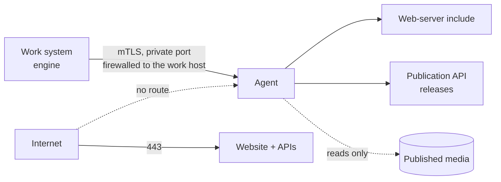

# Publication host agent

> See also: [Reverse proxy and TLS](reverse_proxy.md) · [Production install](production.md) · [Media protection](../core/system/media_protection.md) · [Installation](index.md)

Your public website, the Publication APIs and the published media can live on their own
server, away from the work system. This page installs the **publication host agent**:
the small service on that server that the work system controls. It explains what the
agent may and may not do, how it is provisioned and paired, and how to check the pairing.

!!! note "Driven from the maintenance panel"
    Once the agent is provisioned, [pair it with the work system](#pair-it-with-the-work-system).
    The work system's **Publication hosts** panel then shows its state and applies its
    media rules. You can still install the media rules by hand, as described in
    [media protection](../core/system/media_protection.md#a-separate-publication-server-with-shared-media-storage).

## When you need it

- **Two machines.** The work system stays internal, and a second, public server runs the
  website. The agent is how the work system reaches that server.
- **One machine, two hostnames.** A small institution runs the work system on
  `dedalo.museum.org` and the website on `www.museum.org` on the same server. The
  separate hostname is what keeps a website flaw from acting with a curator's login. The
  same agent then listens on a local socket instead of the network.

A single install that serves its website from the work system's own hostname does not
need it.

## What it does, and what it never does

The agent answers a fixed list of requests. There is no "run a command", no shell, and no
request that names a file on the server.

| Request | What happens on the publication host |
| --- | --- |
| status | reports the agent and API versions, the installed releases, the applied media-rule hash, the media mount and free disk |
| media probe | checks that the media mount is present, read-only and readable |
| apply media rules | writes the web-server include, runs the web server's configuration test, reloads; if the test fails, the previous include is put back and nothing is reloaded |
| install an API release | unpacks a release of Publication API v1 or v2, checks it, switches to it; if the new release is not healthy, the previous one keeps serving |
| roll back an API release | switches back to the previous release |

Every change is written to the agent's append-only audit log, with who asked for it and
the before and after state.

## How the work system reaches it



- **Direction is one way.** The work system connects to the publication host. The
  publication host never connects back, and holds no address or password of the work
  system. Make the firewall say the same thing.
- **Two machines: mutual TLS.** The provisioner creates a private certificate authority
  on the publication host. It issues the agent's server certificate and **one** client
  certificate for the work system, and the agent accepts no other client. If its
  certificate, key or client-certificate authority file is missing or unreadable, the
  agent refuses to start rather than serve unverified. Put the port on a private
  interface, firewalled to the work host's address. A WireGuard tunnel underneath is
  recommended as an extra layer.
- **One machine: a local socket.** The agent listens on a unix socket that only the
  engine's group can open. Nothing listens on the network.
- **Never plain, unencrypted TCP.** The agent has exactly two ways to listen, the two above.
- **And a shared secret.** Every request except the health check carries a bearer token
  of at least 32 characters. The health check publishes a **pairing fingerprint**
  computed from the instance name and the token, so both sides can prove they mean the
  same host. A wrong instance name and a wrong token look exactly alike from outside.

## What it may do as root: nothing

The agent runs as its own user and writes only under its own directories. The provisioner
grants it exactly two things:

| Grant | Allows | Why |
| --- | --- | --- |
| a sudo rule | the web server's configuration test (`apachectl -t` or `nginx -t`), nothing else | the test must read TLS keys only root can read |
| a polkit rule | reloading the web server's unit, restarting the Publication API v2 unit, starting and stopping a scratch copy of the v2 unit on a high local port | applying rules, testing and switching v2 releases need them |

Neither grant lets the work system reach root through the agent:

- The media rules the agent installs are checked against a closed list of web server
  directives before the configuration test reads them. They cannot load a module, include
  another file, start a piped log or name a path outside the media directory.
- A new API v2 release is tested in that scratch copy of the v2 unit, as the v2 user. It
  never runs as the agent's user, which holds the grants, the TLS key and the token.

!!! warning "The work system is trusted completely"
    Installing an API release runs code the work system sent. If the work system is
    compromised, the publication host is too. The reverse is not true: a compromised
    publication host gives no access to the work system. The agent checks the **shape** of
    what it receives (a checksum, a strict archive format, files that stay inside their
    directory, the closed list of media-rule directives), not whether the work system
    *meant* it. Protect the work system
    accordingly, and keep the publication host's port closed to everything else.

## Install

### 1. Prepare the code

The publication host never downloads packages. On the **work host**, in your Dédalo
checkout:

```bash
bun run hostagent:install
```

Then copy the `publication/host_agent/` directory, including `node_modules/`, to the
publication host. Root runs the provisioner from this copy and systemd starts the agent
from it, so step 4's `check` refuses a copy that anyone but root could change:

- **place it as root**, for example under `/opt/dedalo/publication/host_agent`. The
  directory, its entry point and **every parent directory** must be owned by root and not
  writable by group or others. A copy made by `scp` or `rsync` as a normal user is owned
  by that user; fix it with `chown -R root:root` and `chmod -R go-w`;
- **declare the real path**, not a symbolic link (a link can be repointed after the check);
- **leave out `.test-tmp/`**. It appears in a checkout where the agent's own test suite
  ran (`bun run hostagent:test`). Copy from a checkout where it did not, or delete it on
  the publication host.

### 2. Create the accounts

The provisioner never creates users or groups. Create, as system accounts without a login
shell:

- the agent's own user;
- the user and group of the Publication API v2 service;
- on one machine, make sure the work system's group exists (the agent's socket belongs to it).

If one is missing, step 4's `check` stops and prints the exact `useradd` or `groupadd`
command to run.

### 3. Declare the instance

The declaration is one JSON file, `/etc/dedalo_publication_host/<instance>.json`. It
states:

- the **instance** name: lowercase letters, digits and `_`, starting with a letter, 2 to
  32 characters;
- the **listener**: `{"kind": "unix"}` on one machine (the socket path is derived), or
  `{"kind": "tls", "host": …, "port": …}` on two machines. The host is the **private IPv4
  address** the agent binds, written as a literal such as `10.20.0.2`: no hostname, no
  wildcard (`0.0.0.0`). It also becomes the server certificate's name, so the work system
  connects to that address;
- the agent's user, and on one machine the work system's group;
- where the agent's code was copied (step 1);
- the **web server** (`apache` or `nginx`), its systemd unit, and the group it runs as
  (the configuration-test command, `apachectl -t` or `nginx -t`, follows from the server);
- the **state root**, the directory the agent owns;
- the **media mode** (`shared`, `copy` or `none`) and, unless `none`, the media root;
- the absolute paths of two runtimes: Bun, which runs the agent and the Publication API v2
  units, and the language runtime of the Publication API v1, which the agent calls only
  for its syntax check;
- the Publication API v2 unit, its user and group, its local port, and its health URL on
  `127.0.0.1` at that port.

Unknown keys are refused, and every mistake is named with its field. The complete list
of fields, with their rules, is in the agent's source: `src/provision/schema.ts`. Two
filled-in examples are `deploy/examples/instance.example.json` (two machines) and
`deploy/examples/instance.single_machine.example.json` (one machine), all under
`publication/host_agent/`.

### 4. Provision

As root, in the copied `publication/host_agent/` directory:

```bash
bun run provision check <instance>    # what would change; writes nothing
bun run provision apply <instance>    # directories, units, rules, certificates, the token
```

`bun run provision render <instance>` prints every file it would write, without writing
anything and without root. Every generated file carries a hash of its own content. If
someone edits one by hand, the next `check` refuses and names it instead of overwriting
it. A declaration at another path is passed with `--declaration <file>`.

### 5. Create the API configuration files

The provisioner does not write the configuration of the Publication APIs, and the agent
cannot: the `shared/` directories belong to root. Until each file exists, installing a
release of that API is refused with `shared_config_missing`. As root, for each API you
install:

- **v2**: `<state root>/publication_api/v2/shared/v2.env`, the environment the v2 unit
  reads. Owned by root, readable by the v2 service's group, not by others (for example
  `root:<v2 group>`, mode `0640`).
- **v1**: the v1 API configuration file in `<state root>/publication_api/v1/shared/`
  (the refusal names it). Start from the sample in the v1 release's `config_api/`
  directory. Owned by root, readable by the web server's group, not by others
  (`root:<web group>`, mode `0640`).

### 6. Carry the engine bundle to the work system (two machines only)

On one machine there is no bundle: the agent listens on a local socket and no
certificate is issued. Skip to step 7.

On two machines, `apply` writes the work system's half of the pairing as one root-only file,
`/etc/dedalo_publication_host/<instance>/engine_bundle/engine_bundle.pem`. It holds three
parts, in this order: the client certificate, its private key, and the certificate
authority. Copy it to the work host over a channel you trust, keep it `0600`, and delete
any other copy. If a later `apply` prints that the engine bundle changed, carry the new
one.

The bearer token is **not** in the bundle or in any generated file. It stays in a
root-only credential file on the publication host.

### 7. Check the pairing

From the work host (two machines), split the bundle once and ask for the health answer.
Use the listener's IPv4 address exactly as declared in step 3 (here the example's
`10.20.0.2`, port `8471`): the certificate names that address, not a hostname.

```bash
umask 077
sed -n '1,/-----END PRIVATE KEY-----/p' engine_bundle.pem > client.pem   # certificate + key
sed '1,/-----END PRIVATE KEY-----/d'    engine_bundle.pem > ca.pem       # the authority
curl --cacert ca.pem --cert client.pem \
  https://10.20.0.2:8471/publication/host_agent/health
```

On one machine, ask the socket instead:

```bash
curl --unix-socket <socket path> http://localhost/publication/host_agent/health
```

Then compute the fingerprint on the publication host as root. `<credential file>` is the
path on the agent unit's `LoadCredential=` line (`bun run provision render <instance>`
shows it):

```bash
printf 'dedalo-publication-host:%s\n%s' <instance> "$(cat <credential file>)" | sha256sum
```

The `instance_fingerprint` in the health answer must equal that value. The same value is
also written, as `DEDALO_PUBLICATION_HOST_FINGERPRINT`, in
`/etc/dedalo_publication_host/<instance>/engine.env.fragment`, a file `apply` generates
for the work system's [pairing](#pair-it-with-the-work-system). A request without
the client certificate must fail at the TLS handshake.

## Pair it with the work system

Pairing records the host in the work system once, from files the provisioner wrote. You
need root on the work host, but you run the pairing command as the user that runs Dédalo,
the owner of its private directory. The command refuses any other user, root included,
because the work system could not read credentials stored by root. The panel deliberately
has no form for pairing: an address typed into a web page would be a way to make the work
system send its credentials somewhere else.

1. **Carry the files to the work host**, over a channel you trust:
   `/etc/dedalo_publication_host/<instance>/engine.env.fragment` and, on two machines, the
   engine bundle from step 6 above. On one machine there is no bundle: the fragment names
   the socket instead. Make your copies owned by the Dédalo user and readable by it alone
   (`chown <engine user> <file>`, then `chmod 600 <file>`). A copy you carried as root or as
   another administrator is owned by that account, and the Dédalo user cannot read it. The
   command refuses a token or bundle file that group or others can read. When the Dédalo
   user cannot read a copy, fix its owner; never loosen its mode to make it readable.
2. **Give the command the token.** The fragment names the bearer token but never holds it.
   On the publication host, as root, read the token from the credential file the fragment's
   comment names. Then do one of these:
   - put it in place of `PASTE_THE_SERVICE_TOKEN_VALUE_HERE` on the
     `DEDALO_PUBLICATION_HOST_TOKEN` line of your copy of the fragment;
   - save it alone in a `0600` file and pass `--token-file <file>`;
   - pipe it in with `--token-stdin`.

   The token is never accepted as a command-line argument. If the fragment carries one
   token and you pass a different one, the command refuses.
3. **Pair**, from the work system's Dédalo directory. The host's name is yours to
   choose: lowercase letters, digits and `_`, starting with a letter, 2 to 32 characters.

    ```bash
    sudo -u <engine user> bun run dedalo:pair-publication-host add museum_pub --fragment ./engine.env.fragment --bundle ./engine_bundle.pem
    ```

    With the token in a file instead of the fragment:

    ```bash
    sudo -u <engine user> bun run dedalo:pair-publication-host add museum_pub --fragment ./engine.env.fragment --bundle ./engine_bundle.pem --token-file ./token
    ```

    On one machine, leave out `--bundle` (the command refuses it for a socket pairing),
    and you can pipe the token straight from the credential file:
    `sudo cat <credential file> | sudo -u <engine user> bun run dedalo:pair-publication-host add museum_pub --fragment ./engine.env.fragment --token-stdin`.

    First, the command checks that no placeholder is left in the fragment and that the
    fingerprint the fragment carries matches its instance and the token, so a mis-pasted
    token is named here. It then connects to the agent and checks that the agent publishes
    that same fingerprint, without sending the token. That connection check needs the
    token and the bundle on disk, so the command stores a temporary 0600 copy of them in
    the work system's private directory (`publication_hosts/pairing_<hex>/`) and removes
    it whatever the outcome. If the command is killed, the copy stays until a later run
    removes it, after an hour. Only when everything matches does the command record the
    host and store the token and the bundle under the host's name, readable by the work
    system alone. On any mismatch the command names it and keeps nothing. `--dry-run` runs
    every check, including the live connection, and keeps nothing: the temporary copy is
    removed, and no leftover from an earlier run is cleaned up either.
4. **Delete every copy you carried.** The work system keeps its own.

If the work system uses an outbound proxy (`HTTPS_PROXY`), list each publication host's
address in `NO_PROXY` for the Dédalo service. Otherwise the connection to the agent goes
through the proxy. It stays encrypted, but it is no longer private.

After the publication host has been re-provisioned with a new token or new certificates,
pair it again under the same name:

```bash
sudo -u <engine user> bun run dedalo:pair-publication-host replace museum_pub --fragment ./engine.env.fragment --bundle ./engine_bundle.pem
```

To forget a host, use **Remove host** in the panel, or:

```bash
sudo -u <engine user> bun run dedalo:pair-publication-host remove museum_pub
```

The token, the private key and the certificates are never shown in the panel, never
written to the activity log, and never sent to the browser.

## The Publication hosts panel

In **Maintenance**, the **Publication hosts** panel (group *Publication*) lists every
paired host. The **Media access control** panel links to it. For each host it shows:

| Check | What it tells you |
| --- | --- |
| Registry entry | the host's record in the work system is readable |
| Credentials | the token and the engine bundle are present and private to the Dédalo user (their values are never shown) |
| Reachable | the agent answered |
| Pairing | the agent still publishes the expected fingerprint; when it does not, the work system stops before sending its token |
| Agent version | which agent release runs there |
| Media mode | `shared`, `copy` or `none`, as declared on the publication host |
| Media mount, Media read-only | the shared media mount is present and read-only |
| Media rules | the media rules installed there are the ones the work system would generate now (expected and reported hash side by side) |
| API v1, API v2 | the current and the previous release of each Publication API |

Only the Dédalo **root** user can act. Other administrators see the checks read-only,
without the hosts' network addresses.

- **Apply media rules** renders the publication-host media rules for that host's web server
  and mount (as the host reports them) and its public quality folders (the host's own list,
  or the work system's), then sends them. The host runs its web server's configuration test
  before reloading, and keeps the previous rules if the test fails. On nginx, the one-time
  `http{}` map include stays manual: install it once as described in
  [media protection](../core/system/media_protection.md#a-separate-publication-server-with-shared-media-storage),
  step 4. Without it, `nginx -t` fails and the host keeps its previous rules.
- **Probe media** checks that the media mount is present, read-only and readable.
- **Roll back API** switches a Publication API (v1 or v2) back to its previous release.
- **Edit settings** changes the host's public website address, its public quality folders
  and the two probe files reserved for the public-address check. It never changes the
  address the work system connects to: that only changes by pairing again.
- **Remove host** forgets the host.

| The panel says | Cause | Fix |
| --- | --- | --- |
| the registry is invalid | the `publication_hosts.json` file in the work system's private directory is unreadable or was edited by hand, or it is not a regular file of mode `0600` owned by the Dédalo user (for example, a backup restored as root or with default permissions) | restore it from a backup, then `chown <engine user> publication_hosts.json` and `chmod 600 publication_hosts.json`; or remove it and pair each host again. The panel never treats a broken file as "no hosts" |
| Credentials is blocked with `bad_mode` or `bad_owner` | the host's secrets are not private to the Dédalo user: the `publication_hosts/` directory and the host's directory under it must be real directories of mode `0700`, and `token` and `engine_bundle.pem` regular files of mode `0600`, all owned by the Dédalo user, with no symlinks. The pairing command refuses such a directory too (it never repairs it silently) | `chown -R <engine user>` the directory, then `chmod 700` the directories and `chmod 600` the files; or `replace` the host once the directories are fixed |
| pairing mismatch | the publication host was re-provisioned (new token), or another host answers at that address | `replace` the host with its current fragment and bundle |
| rejected credentials | the agent refused the token | `replace` the host |
| unreachable, or did not answer in time | the agent is down, the firewall blocks the port, the address changed, or a proxy is in the way | check the agent's service, the firewall and `NO_PROXY`; nothing was applied |
| unreachable, on one machine, with the reason `socket_perms` | the work system refuses the agent's socket before connecting: its directory is writable by group or others, the socket or a directory above it is owned by an account other than root, the Dédalo user or the directory's owner, or it sits under a shared sticky directory such as `/tmp` | keep the socket where the provisioner puts it: the agent's runtime directory under `/run`. Never move it to `/tmp` or loosen a directory's mode |
| busy | another change is running on that host, or, on the work system, the pairing command or another panel action is editing the host list | try again when it finishes |
| refused | the host refused the request, for example a failed configuration test | the message names the reason; the previous state is still active |

## Publication API releases

Each API keeps its releases side by side, with its configuration outside them:

```
<state root>/publication_api/
  v1/shared/      the v1 API configuration      v1/releases/<release>/   v1/current → releases/<release>
  v2/shared/v2.env                              v2/releases/<release>/   v2/current → releases/<release>
```

- A release is named `<version>_<digest>` (for example `7.0.3_a1b2c3d`), so two builds of
  the same version stay distinguishable.
- Your web server and the v2 service point at `current`. Switching releases is one atomic
  rename, so a request never sees half a release.
- A release arrives complete: the v2 release carries its own libraries, so the host needs
  no package registry.
- Only the newest releases are kept (three by default). The current and the previous one
  are never removed, so a rollback is always possible.
- The configuration in `shared/` survives every release. A release that tries to ship its
  own copy of the v1 configuration is refused.

## Keeping the Publication APIs in step with the work system

After every confirmed code update of the work system, and after every restore, the work
system sends the matching Publication API releases to each paired publication host: v2
first, then v1. The two are independent. The publication hosts panel shows the work
system's own release beside each host's two API releases, and shows each failure in red
without hiding the API that succeeded.

- **What is sent is exactly what the update verified.** When the code updater installs a
  release, it records a checksum of every Publication API file. Before every push, each
  file is checked again. If any file changed on disk since then (a hand edit, a partial
  copy), the push is refused, the panel names the file, and nothing is sent.
- **A development checkout cannot push.** A work system that was not installed through
  the code updater has no verified release to send. Install a release with the updater
  first.
- **The publication host never downloads packages.** The work system assembles the v2
  libraries once per release in its code backup directory and sends them inside the
  release.
- **When a host was down during the update,** use **Push API releases** in the panel once
  it is back. A scheduled check reports any host whose APIs are behind, but it never sends
  code by itself.
- **Restoring an older version** of the work system sends the older APIs too, so the API
  always matches the data it publishes.

## Copy mode: a verified copy of the published media

Choose the `copy` media mode in the instance declaration when the publication host
cannot mount the work system's media storage. The agent then keeps its own copy:

- **Only what is public is copied.** That means files in the public quality folders,
  belonging to published records. Originals and working files never leave the work
  system. The rule is the same one the web server applies in shared mode, so both modes
  serve exactly the same files.
- **The copy is served through the same rules.** The agent keeps the publication markers
  beside the copy. Apply the media rules to a copy host exactly as you would to a shared
  one: the panel renders them for the copy's directory.
- **Publishing** sends new files shortly after the record is published. A periodic check
  (every ten minutes) compares the host's file list with what should be there and sends
  anything missed, as long as the reconcile scheduler is on
  (`DEDALO_RECONCILE_SCHEDULER_ENABLED`). Every file is verified by checksum before it
  replaces anything.
- **Unpublishing removes the bytes, and proves it:**
  1. The record's marker is removed first, so its files answer "not found" on the very
     next request, as soon as the publication server accepts the removal. While its agent
     cannot be reached the marker stays, and the files are **still public**.
  2. The files are deleted.
  3. The deletion is confirmed against the host's file list.

  Until it is confirmed, the panel shows the deletion as pending. If it is still not
  confirmed after one check period, the panel turns red. A deletion is never reported as
  done before it is confirmed.
- **Reconcile media copy** in the panel runs the comparison on demand.

## Checking the gate from the public side

Installed rules prove nothing until a visitor's request is refused. The work system
checks this through the public address, exactly as a visitor would.

1. In the publication hosts panel, use **Edit settings** to set the host's **public
   URL** (the site's origin only, such as `https://www.example.org`, with no path) and
   two **probe files**, written as they appear in a file's address after
   `/dedalo/<media folder>/`:
    - a file of a **published** record, in a public quality;
    - a file of an **unpublished** record, in a public quality.

   Choose records whose publication state you do not expect to change.
2. Before each check, the work system confirms the two files still mean what you said:
   the first record is still published, the second is not, and both are in a public
   quality. If they no longer do, the check says **unknown** and names the reason, and no
   request is sent. Choose new files.
3. The check passes only when the published file loads and the unpublished one answers
   404. A definite wrong answer from either file is a **failure** (red), with both answers
   shown, even when the other file could not be checked. Otherwise, a file that could not
   be reached or validated makes the check **unknown**, never a pass.

The check runs after every rules apply, after every batch of copy-mode changes, on demand
(**Probe public gate**), and on a schedule (every fifteen minutes, while the reconcile
scheduler is on). The panel's **Public gate** row shows the last answer and when it was
taken.

!!! note "A public address that points inside the network"
    If the public address resolves, from the work system, to an internal address (internal
    DNS, a NAT shortcut), the check refuses it and says **unknown**: *not a public host …
    a private address*. It never treats an internal address as public: a check that
    reached the site from inside would show what an insider sees, not what the public
    sees.

## Troubleshooting

| Symptom | Cause | Fix |
| --- | --- | --- |
| `provision check` stops, naming a user or group | the provisioner never creates accounts | run the `useradd` / `groupadd` line it prints, then `check` again |
| `provision check` refuses `agent_dir` or `agent entry`, or a directory above them, as not root-owned or writable | the code was copied as a normal user, or a parent directory is group- or world-writable | `chown -R root:root` the copy, `chmod go-w` it and every parent (step 1) |
| `provision check` refuses `agent_dir` as a symlink | the declaration names a link | declare the real path (`realpath <dir>`) |
| `provision check` refuses "a test scratch tree" `.test-tmp` | the copy came from a checkout where the agent suite ran | delete `.test-tmp/` from the copy on the publication host |
| `provision check` refuses `listen.host` | the host is a hostname, a wildcard or not a canonical IPv4 address | declare the private IPv4 address literal the agent binds (step 3) |
| `provision check` refuses a file "edited by hand" | a generated file no longer matches its own hash | move it aside or restore it; change the declaration instead and re-run `apply` |
| the agent does not start, naming the client certificate authority | the certificate, key or authority file is missing or unreadable | re-run `bun run provision apply <instance>`; never disable client verification |
| `curl` fails at the TLS handshake | the client certificate is missing, from another host's authority, or the server name does not match the certificate | use the bundle this host issued, split as in step 7, and the exact IPv4 address declared in the instance |
| every request answers 401 | the bearer token does not match | compare the pairing fingerprints (step 7) |
| the fingerprints differ | wrong instance name or wrong token; the two are indistinguishable by design | check both against the declaration and the credential file |
| applying media rules fails | the web server's configuration test rejected the new include | the previous include is still active and nothing was reloaded; read the error and re-render the rules |
| an API install is refused: `shared_config_missing` | the API's configuration file in `shared/` does not exist yet | create it as root (step 5), then install again |
| an API install fails its health check | the new release did not answer healthy | the previous release is still `current` and serving; the audit log names both releases |
| `dedalo:pair-publication-host` says to run it as the owner of the private directory | it was run as root or as another user, or the private directory is owned by root | run it as the Dédalo user, who must own the private directory: `sudo -u <engine user> bun run dedalo:pair-publication-host …` |
| `dedalo:pair-publication-host` refuses a placeholder | no token was given: the fragment line still holds the placeholder and no `--token-file` / `--token-stdin` was passed | give the token as in *Pair it with the work system*, step 2 |
| `dedalo:pair-publication-host` says a file is readable by group or others | the token file, the fragment holding the token, or the bundle copy is not `0600` | `chown <engine user>` it, then `chmod 600` it, and run the command again |
| `dedalo:pair-publication-host` says a file could not be read (`EACCES`) | the copy is owned by root or another account, so the Dédalo user cannot read it | `chown <engine user>` the copy and keep it `chmod 600`; never loosen the mode |
| `dedalo:pair-publication-host` names a fingerprint mismatch | the token or instance you gave is not this host's | copy the fragment and the token again from the publication host |
| an API push is refused, naming a file | a Publication API file changed on disk after the update was verified | reinstall the release with the code updater; never edit the API files in place |
| an API push is refused: no verified release | the work system runs from a development checkout, or was installed before this feature | install a release with the code updater |
| one API is up to date, the other is red | each API installs independently | read the error in the panel, fix it, push again |
| a pending deletion turns red: the agent could not be reached | the publication server's agent was down or unreachable when the record was unpublished | the marker may still be there, so the files may **STILL BE PUBLIC**; bring the host back and run **Reconcile media copy** in the panel. Until then, if consent was withdrawn, take the host or its media offline |
| a pending deletion turns red: the deletion was not confirmed | the marker was removed but the host's file list still lists the files | the files already answer "not found" (the marker is gone); bring the host back and the next check completes the deletion |
| the public check says **unknown**, naming a path | one of the two chosen files changed publication state, or is not in a public quality | choose two new files in the panel |
| the public check says **unknown**: *not a public host* | the public address resolves to an internal address from the work system, or does not resolve | use the address visitors use, resolvable from outside; the check never accepts an internal one |
| the public check fails: the unpublished file is publicly served | the gate is not active on the public site: rules not applied, the media folder under a document root, or another virtual host serving it | apply the rules from the panel, check the virtual host, and run the check again |
