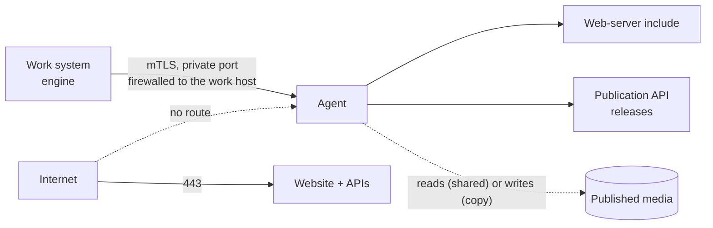

# Publication host agent

> See also: [Reverse proxy and TLS](reverse_proxy.md) · [Production install](production.md) · [Media protection](../core/system/media_protection.md) · [Installation](index.md)

Your public website, the Publication APIs and the published media can live on their own
server, away from the work system. This page installs the **publication host agent**:
the small service on that server that the work system controls. It explains what the
agent may and may not do, how it is provisioned and paired, and how to keep it running.

!!! note "Driven from the maintenance panel"
    Once the agent is provisioned, [pair it with the work system](#pair-it-with-the-work-system).
    The work system's **Publication hosts** panel then shows its state and applies its
    media rules. You can still install the media rules by hand, as described in
    [media protection](../core/system/media_protection.md#a-separate-publication-server-with-shared-media-storage).

## When you need it

- **Two machines.** The work system stays internal, and a second, public server runs the
  website. The agent is how the work system reaches that server.
- **One machine, two hostnames.** A small institution runs the work system on
  `dedalo.museum.org` and the website on `www.museum.org` on the same server. The
  separate hostname is what keeps a website flaw from acting with a curator's login. The
  same agent then listens on a local socket instead of the network.

A single install that serves its website from the work system's own hostname does not
need it.

## Who owns and runs what

The whole page follows one example site. Replace these names with your own:

| Example | What it is |
| --- | --- |
| `museum.org`, `www.museum.org` | the site, and the website's hostname |
| `dedalo.museum.org` | the work system |
| `/home/museum.org` | the site's home directory on the publication host |
| `museum_org` | the instance: the agent's name for this site, also used as the paired name |
| `museum_site` | the site's PHP-FPM pool user, which runs the Publication API v1 |
| `museum_org_agent` | the agent's own user |
| `museum_org_api` | the Publication API v2's user and group |
| `dedalo-publication-api-v2-museum_org`, port `3100` | the v2 service and its local port |
| `dedalo`, `/opt/dedalo/master_dedalo`, `/opt/dedalo/.bun/bin/bun`, `/opt/dedalo/private` | the user that runs Dédalo, its checkout, its pinned Bun and its private directory ([production layout](production.md#the-layout-this-guide-builds)) |
| `/srv/dedalo/media` | the work system's media directory |

**The machines.** The *work host* runs Dédalo. The *publication host* runs the website, the
Publication APIs v1 and v2, and the agent. On one machine, both names mean the same server:
every step still says which role the command plays.

**The accounts.** Every account has one job, and the reason for each one is a trust reason:

| Machine | Account | Runs, or owns | Why it is separate |
| --- | --- | --- | --- |
| publication host | `root` | runs `provision`; owns the declarations, `/etc/dedalo_publication_host/`, `/home/museum.org`, `host_agent/`, `.bun/` and the state root | whoever could replace one of these would inherit the agent's sudo and polkit grants |
| publication host | `museum_org_agent` | runs the agent service; holds the token, the TLS server key and the sudo and polkit grants | it never runs code the work system pushed. It only **reads** its own code, never owns it |
| publication host | `museum_site` | runs the site's PHP-FPM pool, and so the v1 API (`v1.user`); owns `httpdocs/` and the v1 configuration | it is the only account that can read the v1 configuration, which holds the site's database credentials |
| publication host | `museum_org_api` (user and group) | runs the v2 service and the scratch copy that tests each new v2 release | pushed v2 code runs here, never as the agent. Its group reads `v2.env` |
| publication host | `www-data` | the web server's group, shared by every site's pool | because every pool shares it, a group permission on a secret would let every site read it |
| work host | `dedalo` | runs Dédalo, owns its private directory, runs the pairing command | the work system stores the host's token and certificates as its own private files |

On one machine, the agent's service runs as `User=museum_org_agent` with `Group=dedalo`, the
work system's group (the declaration's `engine_group`). Its runtime directory (`0750`) and
its socket (`0660`) therefore carry the work system's group, and only `dedalo` can open the
socket, as long as `dedalo` is the only account in that group (see `engine_group` in step 2).
The agent and the work system stay two users, each with its own group: nobody is
added to anybody's group. `dedalo` is already a member of its own group, which is all the
fragment's comment *the engine's user must be a member of that group* asks for. The agent
also gets `museum_org_api` as a supplementary group, so that it can check that `v2.env`
exists.

`check` (step 4) refuses an `engine_group` that is certainly wrong: the agent's own group,
`museum_site`'s or `museum_org_api`'s primary group, or the v2 group itself. It cannot prove
the right one, because the declaration never names the work system's account: step 7's
request through the socket, made as `dedalo`, is that proof.

**The directories.** The agent runs as `museum_org_agent`, never as root, so it must be able
to traverse `/home/museum.org` and read `host_agent/` and `.bun/`. It owns none of them,
because code it could rewrite would run as root at the next `apply`. `museum_org_api` runs
the same Bun, and all three service accounts must traverse every directory above the state
root. `check` (step 4) tests each of these with the groups each service actually runs with,
and refuses the plan when one is missing, naming the account, the path and the `chmod` that
fixes it, instead of letting a service fail later with *Permission denied*.

| Path | Owner and mode | Created by | Why |
| --- | --- | --- | --- |
| `/etc/dedalo_publication_host/` | `root:root 0755` | you (step 2) | the declarations and every instance's secrets live here |
| `/etc/dedalo_publication_host/museum_org.json` | `root:root 0644` | you (step 2) | root grants permissions from it |
| `/etc/dedalo_publication_host/museum_org/credentials/SERVICE_TOKEN` | `root:root 0600`, in a `0700` directory | `apply` | the bearer token; systemd hands it to the agent |
| `/etc/dedalo_publication_host/museum_org/engine.env.fragment` | `root:root 0644` | `apply` | what the work system needs to pair; it holds no token |
| `/etc/dedalo_publication_host/museum_org/engine_bundle/` | `root:root 0700` | `apply` | two machines: the work system's client certificate and key |
| `/home/museum.org` | `root:root 0755` (`0751` at least) | you (step 0) | the agent must traverse it; Ubuntu creates homes `0750` |
| `/home/museum.org/httpdocs` | `museum_site:www-data 0750` | you (step 0) | the website, as before |
| `/home/museum.org/.bun/bin/bun` | `root:root 0755` | you (step 1) | the site's own Bun: it runs the agent |
| `/home/museum.org/host_agent/` | `root:root`, `u=rwX,go=rX` | you (step 1) | the agent's code: root runs `provision` from it |
| `/home/museum.org/dedalo/` (the state root) | `root:root 0755` | `apply` | the API releases, the media rules and the audit log |
| `…/dedalo/publication_api/v1/shared/` | `root:root 0711` | `apply` | `museum_site` reaches its file by name but cannot list or change the directory |
| `…/dedalo/publication_api/v2/shared/` | `root:museum_org_api 0750` | `apply` | `v2.env` is readable by the v2 group only |
| `/home/museum.org/logs/` | `root:root 0711` | you (step 0) | the web server's logs: root writes them. `museum_site` may pass through it to `logs/php/`, but cannot list it |
| `/home/museum.org/logs/php/` | `museum_site 0700` | you (step 0) | the site's PHP error log: the pool writes it |
| `/run/dedalo_publication_host/museum_org/` | `museum_org_agent:dedalo 0750`, `agent.sock` `0660` | systemd and the agent, at start | one machine: only the work system can connect |

## What it does, and what it never does

The agent answers a fixed list of requests. There is no "run a command", no shell, and no
request that names a file outside the agent's own directories and the copy media root.

| Request | What happens on the publication host |
| --- | --- |
| status | reports the agent and API versions, the installed releases, the applied media-rule hash, the media mount and free disk |
| media probe | checks that the media mount is present, read-only and readable |
| apply media rules | writes the web-server include, runs the web server's configuration test, reloads; if the test fails, the previous include is put back and nothing is reloaded |
| install an API release | unpacks a release of Publication API v1 or v2, checks it, switches to it. **v2:** tested in a scratch copy of the v2 service first, then switched; if it is unhealthy after the switch, the previous release is put back. **v1:** every PHP file is linted (`php -l`) and the shared configuration linked, then switched; v1 has no health check |
| roll back an API release | switches back to the previous release |
| copy media: put, delete, mark, list | copy mode only: the path is relative and confined under the copy media root |

Every change is written to the agent's append-only audit log, with who asked for it and
the before and after state.

## How the work system reaches it



- **Direction is one way.** The work system connects to the publication host. The
  publication host never connects back, and holds no address or password of the work
  system. Make the firewall say the same thing.
- **Two machines: mutual TLS.** The provisioner creates a private certificate authority
  on the publication host. It issues the agent's server certificate and **one** client
  certificate for the work system, and the agent accepts only certificates its own
  authority issued (see [Revoking a leaked engine bundle](#revoking-a-leaked-engine-bundle)).
  If its certificate, key or client-certificate authority file is missing, unreadable or
  not a PEM file of the right type, or the key is accessible to others, the agent refuses
  to start rather than serve unverified. Put the port on a private interface, firewalled
  to the work host's address. A WireGuard tunnel underneath is recommended as an extra
  layer.
- **One machine: a local socket.** The agent listens on a unix socket that only the
  work system's group can open. Nothing listens on the network.
- **Never plain, unencrypted TCP.** The agent has exactly two ways to listen, the two above.
- **And a shared secret.** Every request except the health check carries a bearer token
  of at least 32 characters. The health check publishes a **pairing fingerprint**
  computed from the instance name and the token, so both sides can prove they mean the
  same host. A wrong instance name and a wrong token look exactly alike from outside.

## Its only privileges

The agent never gets a root shell. It runs as its own user and writes only under its own
directories. The provisioner grants it exactly two things:

| Grant | Allows | Why |
| --- | --- | --- |
| a sudo rule | the web server's configuration test (`apache2ctl -t`, `apachectl -t` or `nginx -t`), nothing else | the test must read TLS keys only root can read |
| a polkit rule | reloading the web server's unit, restarting the Publication API v2 unit, starting and stopping a scratch copy of the v2 unit on a high local port | applying rules, testing and switching v2 releases need them |

Neither grant lets the work system reach root through the agent:

- The media rules the agent installs are checked against a closed list of web server
  directives before the configuration test reads them. They cannot load a module, include
  another file, start a piped log or name a path outside the media directory.
- A new API v2 release is tested in that scratch copy of the v2 unit, as the v2 user. It
  never runs as the agent's user, which holds the grants, the TLS key and the token.

!!! warning "The work system is trusted completely"
    Installing an API release runs code the work system sent. If the work system is
    compromised, the publication host is too. The reverse is not true: a compromised
    publication host gives no access to the work system. The agent checks the **shape** of
    what it receives (a checksum, a strict archive format, files that stay inside their
    directory, the closed list of media-rule directives), not whether the work system
    *meant* it. Protect the work system
    accordingly, and keep the publication host's port closed to everything else.

## Install

!!! note "Before you start"
    - An Ubuntu 24.04 or newer, or Debian 12 or newer, publication host with `apache2` (or
      `nginx`), `php8.3-fpm` **and** `php8.3-cli` of the same version, `sudo`, `curl` and
      `unzip`.
    - `polkitd` (the `polkitd` package), version 0.106 or newer: the agent's right to reload
      the web server and restart the v2 service is a JavaScript rules file in
      `/etc/polkit-1/rules.d/`. Ubuntu 22.04 ships 0.105, which does not read such files, and
      minimal images may have no polkit at all. Without it, provisioning succeeds and the
      panel's actions fail later (see [In the panel](#in-the-panel)). `pkaction --version`
      prints the version.
    - A filesystem for the state root that supports the append-only attribute (ext4, xfs):
      `apply` runs `chattr +a` on the agent's audit log.
    - A read-only MariaDB user for each site's Publication APIs.
    - For step 10, a work system installed through the code updater. A work system cloned
      from git can provision and pair a publication host, but it cannot push API releases
      (*no verified release*, see [Keeping the Publication APIs in step](#keeping-the-publication-apis-in-step-with-the-work-system)).

| Step | Machine | As | What it changes |
| --- | --- | --- | --- |
| 0. Prepare the site's home directory | publication host | `root` | `/home/museum.org`, the site user, the PHP-FPM pool, the log directories |
| 1. Prepare the code and the site's Bun | work host, then publication host | `dedalo`, then `root` | `publication/host_agent/node_modules/`; `/home/museum.org/host_agent/`, `/home/museum.org/.bun/` |
| 2. Declare the instance | publication host | `root` | `/etc/dedalo_publication_host/museum_org.json` |
| 3. Create the accounts | publication host | `root` | `museum_org_agent`, `museum_org_api` |
| 4. Provision | publication host | `root` | the state root, the units, the sudo and polkit rules, the token, the certificates |
| 5. Create the API configuration files | publication host | `root` | `v2.env`, `server_config_api.php` |
| 6. Carry the engine bundle (two machines only) | publication host, then work host | `root` | a private copy of the bundle on the work host |
| 7. Check the agent answers | work host (and publication host for the fingerprint) | `dedalo` (`root`) | nothing |
| 8. Pair it with the work system | work host | `dedalo` | the work system's registry and private directory |
| 9. Map the APIs into the site's virtual host | publication host | `root` | the site's virtual host |
| 10. First use | the work system's Maintenance panel | the Dédalo root user | media rules, API releases, the public check |

**A work system with several instances.** The commands name the
[production layout](production.md#the-layout-this-guide-builds). On a
[work system with several instances](multi_instance.md#layout-per-instance), replace, everywhere
on this page, `/opt/dedalo/master_dedalo` with that instance's checkout
`/home/ded_<site>/dedalo`, the user `dedalo` with `ded_<site>`, and
`/opt/dedalo/.bun/bin/bun` with `/home/ded_<site>/.bun/bin/bun`.

Steps 0 to 7 follow below; step 8 is [Pair it with the work system](#pair-it-with-the-work-system),
and steps 9 and 10 are under [Finish the install](#finish-the-install). On one machine, the
work host and the publication host are the same server. If a step refuses, its group in
[Troubleshooting](#troubleshooting) names the cause.

### 0. Prepare the site's home directory {#lay-out-each-site-in-its-home-directory}

**On:** the publication host · **As:** `root`

**Changes:** the owner of `/home/museum.org`, the site user's home, `httpdocs/`, `logs/`,
the site's PHP-FPM pool file.

Everything that belongs to one site lives in its home directory, and two sites never share
one. The state root (`/home/museum.org/dedalo`, created in step 4) and every directory above
it must belong to root, so the site user's home moves one level down, to `httpdocs/`.

```bash
# publication host, as root
chown root:root /home/museum.org
chmod 0755 /home/museum.org
```

Ubuntu creates home directories `0750`. The agent runs as `museum_org_agent` and must
traverse this one to reach its code and its Bun: `0751` is the minimum, `0755` also lets the
SFTP chroot and the PHP-FPM pool work as usual. The v2 and v1 accounts must traverse it too,
to reach the state root. If it stays `0750`, step 4's `check` refuses the plan with one line
per account, for example:

```text
'/home/museum.org' cannot be traversed by museum_org_agent (the agent) — chmod o+x /home/museum.org
```

The `chmod` it prints is the narrowest fix; the `chmod 0755` above covers it.

If the site user already exists, give it its document root as its home. `usermod` refuses
to change the home of a user that has running processes (*user museum_site is currently used
by process N*), and the site's pool workers and SFTP sessions run as that user. Stop them
first; the pool starts again with the reload after the pool file below:

```bash
# publication host, as root
systemctl stop php8.3-fpm        # or only the site's pool, if it runs in its own service
pkill -u museum_site             # ends the user's SFTP sessions
usermod -d /home/museum.org/httpdocs museum_site
systemctl start php8.3-fpm
```

If it does not exist yet, create it in the web server's group, with that home and nothing
else:

```bash
# publication host, as root
useradd --system --no-create-home --shell /usr/sbin/nologin -g www-data -d /home/museum.org/httpdocs museum_site
```

Never pass `-m` to `useradd` or `usermod` for the site user: it would create or move the
home and give it to the user. Create `httpdocs/` if the site does not have one yet:

```bash
# publication host, as root
install -d -o museum_site -g www-data -m 0750 /home/museum.org/httpdocs
```

The site user still owns `httpdocs/` and can change the website as before. It can read
`dedalo/`, `.bun/` and `host_agent/` but not change them. If a hosting panel or script later
gives `/home/museum.org` back to the site user, the agent refuses to start and `check` names
the directory: give it back to root.

**Logs.** The web server and the pool write different logs, and they must not share a
directory the site user can write. Apache opens its logs as root, so a user who can replace
a log file with a link could make root write into any file on the system. Keep the web
server's logs in a root-owned directory and the PHP error log in one the pool owns:

```bash
# publication host, as root
install -d -o root -g root -m 0711 /home/museum.org/logs
install -d -o museum_site -m 0700 /home/museum.org/logs/php
```

`logs/` is `0711`: the pool writes its error log as `museum_site`, so that user must be able
to pass through `logs/` to reach `logs/php/`, but it cannot list `logs/` or change anything in
it. With `0750`, PHP cannot open the pool's error log and the site's PHP errors go to the main
PHP-FPM log instead.

If the site user must read the web server's logs, give that one user read access
(`setfacl -m u:museum_site:rX /home/museum.org/logs` and
`setfacl -d -m u:museum_site:r /home/museum.org/logs`), never the shared `www-data` group,
which every site's pool runs in. The v2 API and the agent log to the systemd journal
(`journalctl -u <unit>`); the agent's audit trail is in `dedalo/audit/`.

**The site's pool.** The v1 API runs in the site's own PHP-FPM pool, as `museum_site`. If the
pool limits PHP with `open_basedir`, the limit must cover the whole home directory: a limit to
`httpdocs/` alone would stop the v1 API from reading its own code.

```ini
; /etc/php/8.3/fpm/pool.d/museum.org.conf
[museum.org]
user = museum_site
group = www-data
listen = /run/php/php8.3-fpm-museum.org.sock
listen.owner = www-data
listen.group = www-data
pm = ondemand
pm.max_children = 5
php_admin_value[open_basedir] = /home/museum.org/:/tmp/
php_admin_flag[log_errors] = on
php_admin_value[error_log] = /home/museum.org/logs/php/error.log
```

```bash
# publication host, as root
systemctl reload php8.3-fpm
```

Keep your own process settings (`pm…`) if the pool already exists. Note the `listen =`
socket: the virtual host uses it in step 9.

#### SFTP chroot

If the site user uploads the website over SFTP, `/home/museum.org` is its chroot. `sshd`
already requires a chroot to be owned by root, so the same layout serves both:

```
# /etc/ssh/sshd_config
Match User museum_site
    ChrootDirectory /home/museum.org
    AuthorizedKeysFile /etc/ssh/authorized_keys/%u
    ForceCommand internal-sftp -d /httpdocs
    AllowTcpForwarding no
    X11Forwarding no
```

The user lands in `httpdocs/`, sees `dedalo/` read-only, and can read only its own site's v1
configuration.

**SFTP keys.** `sshd` looks for the user's keys in its home, and the home is now `httpdocs/`,
the public document root. The keys in `/home/museum.org/.ssh/` are no longer used, and a
`.ssh/` inside `httpdocs/` would be served by the website. The `AuthorizedKeysFile` line above
keeps them outside both. Move the existing keys there, then reload `sshd`:

```bash
# publication host, as root
install -d -o root -g root -m 0755 /etc/ssh/authorized_keys
install -o root -g root -m 0644 /home/museum.org/.ssh/authorized_keys /etc/ssh/authorized_keys/museum_site
sshd -t && systemctl reload ssh
```

**Success:** `stat -c '%U:%G %a %n' /home/museum.org /home/museum.org/httpdocs /home/museum.org/logs`
prints `root:root 755 /home/museum.org`, `museum_site:www-data 750 /home/museum.org/httpdocs`
(`755` on an existing site is fine too: the website is public anyway) and
`root:root 711 /home/museum.org/logs`.

### 1. Prepare the code and the site's Bun {#1-prepare-the-code}

**On:** the work host, then the publication host · **As:** `dedalo`, then `root`

**Changes:** `publication/host_agent/node_modules/` in the work system's checkout;
`/home/museum.org/host_agent/` and `/home/museum.org/.bun/` on the publication host.

The publication host never downloads the agent's packages. They are installed once, in the
work system's checkout.

**On the work host, as `dedalo`.** If `bun run hostagent:install:dev` or the agent's own test
suite (`bun run hostagent:test`) ever ran in this checkout, delete
`publication/host_agent/node_modules/` first: a production install over a development one
does **not** remove the development packages, and `check` refuses them. Then:

```bash
# work host, as root (the command runs as dedalo)
sudo -u dedalo bash -c 'cd /opt/dedalo/master_dedalo && /opt/dedalo/.bun/bin/bun run hostagent:install'
```

On a [work system with several instances](multi_instance.md#layout-per-instance), use that
instance's user, `/home/ded_<site>/dedalo` and `/home/ded_<site>/.bun/bin/bun`.

This runs `bun install --frozen-lockfile --production` in `publication/host_agent/`, the
same locked install as the [work system's own](production.md#6-get-the-code):

- it installs exactly the versions in the committed `publication/host_agent/bun.lock` and
  never rewrites it. If `package.json` and the lock disagree, it stops with *lockfile had
  changes, but lockfile is frozen*: fix the checkout, never install without the lock;
- it installs the runtime dependencies only. The development tools (TypeScript and the
  type definitions) never reach the publication host.

**On the publication host, as `root`.** Copy the `publication/host_agent/` directory,
including `node_modules/` and leaving out `.test-tmp/`, into the site's home directory. On one
machine:

```bash
# publication host, as root
rsync -a --delete --exclude .test-tmp /opt/dedalo/master_dedalo/publication/host_agent/ /home/museum.org/host_agent/
chown -R root:root /home/museum.org/host_agent
chmod -R u=rwX,go=rX /home/museum.org/host_agent
```

On two machines, carry the tree over a channel you trust (for example the same `rsync`
over SSH from the work host, to the same destination path), then run the `chown` and
`chmod` above on the publication host. `chown` gives the copy to root; `chmod` removes
every group and other write bit **and** adds the read the agent needs: the service runs as
`museum_org_agent` and only reads this tree.

Not even `museum_org_agent` owns it. The agent holds the sudo and polkit grants and the
token, and root runs `provision` from this copy, so code the agent could rewrite would run as
root at the next `apply`. Step 4's `check` therefore requires:

- the directory, its entry point (`src/index.ts`) and **every parent directory** above them
  owned by root and not writable by group or others;
- the real path in the declaration, **not a symbolic link**: a link can be repointed after
  the check;
- no `.test-tmp/` (*a test scratch tree*, left where the agent's suite ran) and no
  development dependency in `node_modules/`.

`check` also walks the whole tree, without following symbolic links, and tests that the
agent, with the groups its service runs with, can traverse every directory above
`agent_dir`, list and enter every directory in it and read every file. A tree copied
without the `chmod` above is refused with one line that counts the entries and names up to
three (more are shown as `…`):

```text
agent_dir '/home/museum.org/host_agent' holds 2 entries not readable by museum_org_agent (the agent) ('/home/museum.org/host_agent/package.json', '/home/museum.org/host_agent/src/index.ts') — chmod -R u=rwX,go=rX /home/museum.org/host_agent
```

The fix is the `chmod` it prints, the same one as above. A problem on `agent_dir` itself gets
its own line (*'/home/museum.org/host_agent' is not readable by …* or *cannot be traversed
by …*), with the same fix. The walk stops at 20000 entries, and a directory it cannot list
stops it too. Either way `check` refuses rather than skip the rest: *agent_dir … could not
be walked whole (…) — whether museum_org_agent (the agent) can read every file of it is
unproven*. `agent_dir` must hold the agent's code only.

#### The site's Bun {#one-bun-per-site}

Each instance runs its own copy of Bun, at exactly the version the work system pins (the
`.bun-version` file at the root of its checkout), as each Dédalo instance does on the work
system (see [Multiple instances on one server](multi_instance.md#layout-per-instance)). This
one binary runs three services: the agent (as `museum_org_agent`), and the v2 API and its
scratch copy (as `museum_org_api`). No `bun install` ever runs on this host.

Install it as root, into the site's home directory. Download the release archive and Bun's
checksum list, check the archive against the list, and only then install it. Never pipe a
download into a root shell: nothing would check what runs.

```bash
# publication host, as root (needs curl and unzip)
# One machine: read the pin from the work system's checkout. Two machines: run
# `cat /opt/dedalo/master_dedalo/.bun-version` on the work host and set V to what it prints.
V=$(cat /opt/dedalo/master_dedalo/.bun-version)
A=bun-linux-x64     # see the list below for other CPUs
D=$(mktemp -d) && cd "$D"
curl -fsSLO "https://github.com/oven-sh/bun/releases/download/bun-v$V/$A.zip"
curl -fsSLO "https://github.com/oven-sh/bun/releases/download/bun-v$V/SHASUMS256.txt"
sha256sum -c --ignore-missing SHASUMS256.txt     # must print "<A>.zip: OK"
unzip -q "$A.zip"
install -d -o root -g root -m 0755 /home/museum.org/.bun /home/museum.org/.bun/bin
install -o root -g root -m 0755 "$A/bun" /home/museum.org/.bun/bin/bun
cd / && rm -rf "$D"
stat -c '%U:%G %a %n' /home/museum.org/.bun /home/museum.org/.bun/bin /home/museum.org/.bun/bin/bun
/home/museum.org/.bun/bin/bun --version
```

Pick `A` for the CPU:

- `bun-linux-x64`: an x86-64 CPU with AVX2;
- `bun-linux-x64-baseline`: an x86-64 CPU without AVX2, as on older hardware and some virtual
  machines (`grep -c avx2 /proc/cpuinfo` prints `0`). The other build stops at once with
  *Illegal instruction*;
- `bun-linux-aarch64`: an ARM 64-bit CPU.

`sha256sum -c` must answer `OK` for the archive; stop on anything else. Bun also publishes a
signed `SHASUMS256.txt.asc` with each release: if your policy requires a signature and not
only a checksum, verify it with `gpg --verify SHASUMS256.txt.asc SHASUMS256.txt` against
Bun's release key, obtained through a channel you trust, before `sha256sum -c`.

A publication host without internet access: download and check the archive the same way
on a machine that has it, copy the `.zip` **and** `SHASUMS256.txt` to the publication host,
run `sha256sum -c --ignore-missing SHASUMS256.txt` there again, then unzip and `install` as
above. Never copy an unpacked `.bun/` tree: nothing on the host could then check it.

The work system's own installer form
(`curl … | BUN_INSTALL=/home/museum.org/.bun bash`) also produces a working copy when run as
root with `umask 022` into a root-owned home, but nothing checks the bytes it runs. The
checksum form above is the documented one.

Unlike on the work system, this copy belongs to **root**, not to the site's user: it runs
the agent, which holds the sudo and polkit grants, so whoever could replace it would inherit
them. `check` refuses a Bun binary, or a directory above it, that anyone but root owns or can
write. It also refuses one that an account running it cannot read and execute, the agent or
`museum_org_api`, or a directory above it that account cannot traverse. Installed with mode
`0755` as above it passes. The refusal names the account and the fix, for example
*bun_bin '/home/museum.org/.bun/bin/bun' is not executable by museum_org_api (v2) — chmod o+x
/home/museum.org/.bun/bin/bun*. `php_bin` is judged the same way for the agent, which runs it
to check v1 releases.

The panel's Bun version row compares the version the binary reports with the pin. It shows
version drift, not integrity: the checksum step above is what checks the bytes. To upgrade
later, see [Upgrading a site's Bun](#upgrading-a-sites-bun).

**Success:** `stat` shows `root:root` and no group or other write bit on all three, and
`--version` prints the pinned version.

### 2. Declare the instance

**On:** the publication host · **As:** `root`

**Changes:** `/etc/dedalo_publication_host/museum_org.json`.

The declaration is one JSON file, `/etc/dedalo_publication_host/<instance>.json`. Write it
first: it names the accounts that step 3 creates. Create its directory:

```bash
# publication host, as root
install -d -o root -g root -m 0755 /etc/dedalo_publication_host
```

A complete declaration for **one machine** (the work system and the website `museum.org` on
the same server):

```json
{
  "instance": "museum_org",
  "listen": { "kind": "unix" },
  "agent_user": "museum_org_agent",
  "engine_group": "dedalo",
  "agent_dir": "/home/museum.org/host_agent",
  "web": { "server": "apache", "unit": "apache2" },
  "v1": { "user": "museum_site" },
  "state_root": "/home/museum.org/dedalo",
  "media": { "mode": "shared", "root": "/srv/dedalo/media" },
  "php_bin": "/usr/bin/php8.3",
  "bun_bin": "/home/museum.org/.bun/bin/bun",
  "v2": {
    "unit": "dedalo-publication-api-v2-museum_org",
    "user": "museum_org_api",
    "group": "museum_org_api",
    "port": 3100,
    "health_url": "http://127.0.0.1:3100/health"
  }
}
```

Write it as root, then make sure root alone can change it:

```bash
# publication host, as root
chown root:root /etc/dedalo_publication_host/museum_org.json
chmod 0644 /etc/dedalo_publication_host/museum_org.json
```

Root grants permissions from this file (step 4 explains the rule). Keep it in
`/etc/dedalo_publication_host/`: the check against the other instances reads only that
directory, and the instance's secrets live there. `render` can review a draft anywhere
(step 4).

On **two machines**, the listener is the private address the agent binds, and there is no
`engine_group`:

```json
  "listen": { "kind": "tls", "host": "10.20.0.2", "port": 8471 },
```

| Field | What to put |
| --- | --- |
| `instance` | a name for this publication host: lowercase letters, digits and `_`, starting with a letter, 2 to 32 characters. The file is named after it. Name it after the site's domain, with each `.` and `-` replaced by `_`: `museum.org` becomes `museum_org`, its declaration `/etc/dedalo_publication_host/museum_org.json` and its agent service `dedalo-publication-host-museum_org` (a hyphenated `my-hosts.org` becomes `my_hosts_org`). Shorten a longer domain, and prefix one that starts with a digit |
| `listen` | `{"kind": "unix"}` on one machine (the socket path is derived). On two machines `{"kind": "tls", "host": …, "port": …}`: the host is the **private IPv4 address** the agent binds, written as a literal such as `10.20.0.2`: no hostname, no wildcard (`0.0.0.0`). It also becomes the server certificate's name, so the work system connects to that address. The provisioner does not check that the address is private: choosing a private interface and firewalling it is yours |
| `agent_user` | a new account for the agent alone (step 3 creates it), named after the site |
| `engine_group` | one machine only: the group the work system's **process** runs with, never the agent's. Find it with `systemctl show -p Group --value dedalo-ts` (on a work system with several instances, `dedalo-ts@<site>`); when that prints nothing, the service runs with its user's primary group, `id -gn dedalo`. The agent's service runs with this group (`Group=`), and every member of it can open the agent's socket, so it must hold the work system's user **alone**: never `www-data` or any PHP-FPM pool's group. On a host upgraded from an older install, the work system's user often has `www-data` as its primary group: give it a group of its own first (see the comment in `deploy/dedalo-ts.service`). Check with `getent group <group>`: it must list no members, and its third field is the group id; then `awk -F: '$4 == <group id> {print $1}' /etc/passwd` must print `dedalo` alone. `check` refuses a group that is certainly wrong: the primary group of `agent_user`, of `v1.user` (so `www-data` in this example) or of `v2.user`, or `v2.group` itself, with `engine_group '<group>' is the agent's own group — it must be the work system's group: id -gn <the account that runs Dédalo>` (or *the v1 user's group*, *the v2 group*, *the v2 user's group*). It cannot tell whether `dedalo` is in the group, or whether another account is: get it right here, and step 7 proves it |
| `agent_dir` | where you copied the agent's code in step 1: `/home/museum.org/host_agent`. Beside the state root, never inside it: the two may not contain each other |
| `web` | the web server (`apache` or `nginx`) and its systemd unit (`apache2` on Debian and Ubuntu, `httpd` on RHEL, `nginx`). You do not declare the configuration-test command: the provisioner picks it on the host, `/usr/sbin/apache2ctl` on Debian and Ubuntu (where `apachectl` is only a link to it), `/usr/sbin/apachectl` on RHEL, `/usr/sbin/nginx` for nginx |
| `v1.user` | the site's PHP-FPM pool user (step 0), which runs the Publication API v1 and alone can read its configuration ([why](#who-owns-and-runs-what)). With Apache's `mod_php` instead, the web server's user (`www-data` on Debian and Ubuntu), on a server with a single site only (see [Several instances on one server](#several-instances-on-one-server)) |
| `state_root` | a new directory for the agent: the API releases, the media rules, the audit log. It and **every directory above it** must be owned by root and writable by no one else: `/home/museum.org/dedalo` ([why](#who-owns-and-runs-what)) |
| `media` | `shared` (the publication host reads the work system's media), `copy` (the agent keeps its own copy of the published files) or `none`; unless `none`, the media `root`. One machine: `shared`, with the work system's media directory (`/srv/dedalo/media` in the production layout), or, stronger, a read-only bind mount of only the public quality folders and `.publication/pub`. Two machines, `shared`: a read-only mount of the work system's media (see [media protection](../core/system/media_protection.md#a-separate-publication-server-with-shared-media-storage)) |
| `php_bin` | the PHP command-line binary of the same version the pool runs (`apt install php8.3-cli`), which checks v1 releases. Never `php-fpm8.3`, never a link (see below) |
| `bun_bin` | the site's own Bun from step 1, `/home/museum.org/.bun/bin/bun`, never a link |
| `v2` | the v2 API's systemd unit name, its own new user and group (step 3 creates them), its local port, and its health URL: `http://127.0.0.1:<port>/health`. The v2 API answers `/health` whatever URL prefix it is published under, so keep that form. Name the unit after the site, so that a second site's never collides |
| `releases_retained` | optional, an integer from 2 to 20, default 3: how many releases each API keeps |
| `paths` | test-only directory overrides; leave it out |

The agent, v1 and v2 accounts must be three different accounts, none of them `root`.
Unknown keys are refused. Structural mistakes (a wrong type, a bad name, a missing field)
are all listed at once; cross-field ones (the three distinct users, the health URL's port,
overlapping directories, `engine_group` against `listen`, the v2 unit name) one at a time.
The rules are in the agent's source: `src/provision/schema.ts` (the shape) and `derive()` in
`src/provision/layout.ts` (the cross-field rules). The JSON files in
`publication/host_agent/deploy/examples/` are the agent's test fixtures, not templates: they
use one shared code directory, generic account and unit names, and `php_bin` `/usr/bin/php`
(the `update-alternatives` link, which `check` refuses). Start from the declaration above.

**The two runtimes.** `check` refuses a runtime path that is a symbolic link, because a link
can be repointed after the check. When it refuses one, it prints the real path to declare.
The PHP command-line package must be installed (`php8.3-cli`, of the same version as
`php8.3-fpm`). You can then find the real path yourself:

```bash
# publication host
realpath /usr/bin/php     # on Ubuntu, for example /usr/bin/php8.3
```

Declare the version-named file (`/usr/bin/php8.3`) on purpose: it is the version that checks
your v1 releases, so it should be the version your web server runs the v1 API with. A later
`update-alternatives` switch then cannot change it silently.

**Success:** from `/home/museum.org/host_agent`,
`/home/museum.org/.bun/bin/bun run provision render museum_org` prints the generated files
with no refusal.

### 3. Create the accounts

**On:** the publication host · **As:** `root`

**Changes:** the users `museum_org_agent` and `museum_org_api`, and the group
`museum_org_api`.

The provisioner never creates accounts. Create the ones your declaration names. Name every
per-instance account after the site, so that a second site never collides:

```bash
# publication host, as root
# agent_user: its own group (museum_org_agent) is not engine_group
useradd --system --no-create-home --shell /usr/sbin/nologin --user-group museum_org_agent

# v2.group, then v2.user in it
groupadd --system museum_org_api
useradd --system --no-create-home --shell /usr/sbin/nologin -g museum_org_api museum_org_api
```

The other two exist already:

- **`v1.user`** is the site's pool user from step 0 (created there if it was new). To list
  the pool users on the server:

    ```bash
    # publication host
    grep -H '^user *=' /etc/php/*/fpm/pool.d/*.conf
    ```

- **`engine_group`** (one machine) is the work system's group (step 2 says how to find it and
  how to check that `dedalo` is alone in it). Never use the agent's group or a group the web
  server or a pool shares, and never add a user to it. If `check` says it does not exist, or
  that it *is the agent's own group* (or another of this instance's accounts' group), the
  declaration names the wrong group.

If any account is missing, step 4's `check` stops and names each one with its field and the
exact command, in the order to run them.

**Success:** step 4's `check` no longer names a missing user or group.

### 4. Provision

**On:** the publication host · **As:** `root`

**Changes:** the state root, the agent's settings, the two services, the sudo and polkit
rules, the token, the certificates (two machines), the engine fragment.

Root has no `bun` of its own when each site has its own Bun: run every `provision` command
with the site's Bun, from the site's copy of the code. The `cd` is part of the command.

```bash
# publication host, as root
cd /home/museum.org/host_agent
/home/museum.org/.bun/bin/bun run provision check museum_org    # what would change; writes nothing
/home/museum.org/.bun/bin/bun run provision apply museum_org    # directories, units, sudo and polkit rules, certificates, the token (not the media rules: the panel applies those)
```

On a fresh host, `check` lists one `would: …` line per change and ends with *N action(s)
would change instance … — run 'apply' to make them*. That is its normal answer, not a
failure, and it exits 0. Each `would:` line is a preview of what `apply` does: do none of
them by hand. Run `apply`, then `check` again.

| Exit code | Meaning |
| --- | --- |
| 0 | `check`: the report is printed (with or without changes to make); `apply`: finished; `render`: printed |
| 1 | `check --exit-code` only: the host does not match the declaration yet, for scripts that need to tell; nothing was written |
| 2 | the command line is wrong; the usage is printed |
| 3 | refused: the declaration, the host or the caller (not root). The reasons are printed after *plan refused for instance …* or *declaration … refused:*, or on one *provision: …* line |
| 4 | the work failed: `apply` stops at the named action and runs no later one. Any verb prints *provision: FAILED: …* on an unexpected error |

**What `check` proves about access.** `check` (and `apply`, which plans first) judges each path a
service runs from with that service's own user and groups, the way systemd starts it: the
agent with `Group=` `engine_group` on one machine (its own primary group on two) plus its
supplementary groups, v2 with `v2.group`, v1 with its user's groups as `id -G` lists them.
The agent must traverse every directory above `agent_dir` and read its whole tree (step 1);
the agent and v2 must read and execute `bun_bin`, and the agent `php_bin`; all three must
traverse every directory above the state root (step 0). Each refusal names the account, the
path and the narrowest `chmod`, applied to the permission class the kernel checks for that
account (owner, group or other). Only the mode bits count: an ACL that would grant access is
not read, so `check` may refuse a path that would work, never accept one that would not. If
the groups of an account cannot be read, `check` refuses with *the groups of user … could not
be read (id -G …)*.

**What `apply` starts.** It enables and starts the agent's service,
`dedalo-publication-host-museum_org`. It enables the v2 service,
`dedalo-publication-api-v2-museum_org`, but leaves it stopped until the first v2 release
arrives (step 10). A later `apply` restarts the agent when its settings, its unit, the
certificate authority or its server certificate change, and v2 when its unit changes; a
panel action in progress is cut off. The sudo rule is validated with `visudo` before it is
kept. `apply` never reloads the web server.

**Success:** `check` ends with *matches its declaration*, and
`systemctl status dedalo-publication-host-museum_org` shows `active (running)`.

**If the agent does not start**, read its own last lines:

```bash
# publication host, as root
journalctl -u dedalo-publication-host-museum_org --since -2min -o cat
```

A line starting `[preflight]`, `[boot]` or `Invalid configuration` names the cause. systemd
gives up after 5 starts in 300 seconds (*Start request repeated too quickly*). After the fix:

```bash
# publication host, as root
systemctl reset-failed dedalo-publication-host-museum_org && systemctl restart dedalo-publication-host-museum_org
```

The same applies to the v2 service once it runs.

**Only a declaration that root alone can change is acted on.** Root grants permissions
from the declaration (the sudo and polkit rules, the units, the accounts they name), so
whoever could edit or replace it could make the next `apply` grant root-reachable
permissions to an account of their choice. Before reading the declaration, `check` and
`apply` refuse it unless:

- it is a **regular file**, not a symbolic link (a link can be repointed after the check);
- it is **owned by root** and **not writable by group or others** (`0644` or `0600`);
- **every directory above it**, up to and including `/`, is a real directory owned by root
  and not writable by group or others.

A draft such as `--declaration /home/alice/museum_org.json` is refused because `/home/alice`
belongs to alice: a declaration and every directory above it must be root's. Keep it in
`/etc/dedalo_publication_host/` (step 2).

`bun run provision render museum_org` prints every generated configuration file: the agent's
settings, the units, the sudo and polkit rules and the engine fragment. It does not print
directories, the token or the certificates. It needs no root and writes nothing; without
root, the fragment shows a pending fingerprint. A declaration at another path is passed with
`--declaration <file>`, from anywhere. Every generated file carries a hash of its own
content: if someone edits one by hand, the next `check` refuses and names it instead of
overwriting it.

### 5. Create the API configuration files

**On:** the publication host · **As:** `root`, after step 4 (the `shared/` directories exist
only after `apply`)

**Changes:** `/home/museum.org/dedalo/publication_api/v2/shared/v2.env` and
`/home/museum.org/dedalo/publication_api/v1/shared/server_config_api.php`.

The provisioner does not write the configuration of the Publication APIs, and the agent
cannot: the `shared/` directories belong to root. Until each file exists, installing a
release of that API is refused with `shared_config_missing`. Create the file of each API you
install. On two machines, copy the sample files from the work system's checkout first.

**v2.** The environment the v2 service reads, owned by root and readable by the v2 group
only:

```bash
# publication host, as root
install -o root -g museum_org_api -m 0640 \
  /opt/dedalo/master_dedalo/publication/server_api/v2/.env.example \
  /home/museum.org/dedalo/publication_api/v2/shared/v2.env
```

Edit `publication_api/v2/shared/v2.env`: the `DB_*` keys name the site's read-only MariaDB
user; the other keys are in the
[environment reference](../diffusion/publication_api/v2/deployment.md#environment-reference).
`HOST`, `PORT` and `NODE_ENV` are set by the service after the file is read, so their values
here are ignored. The agent only checks that the file exists, and a release may not ship its
own `.env`.

**v1.** `shared/` is `root:root 0711`: `museum_site` reaches its file by name but cannot list
or change the directory. The file holds the site's database credentials, and the pools share
the web server's group, so it belongs to `museum_site` and is readable by it alone:

```bash
# publication host, as root
install -o museum_site -m 0400 \
  /opt/dedalo/master_dedalo/publication/server_api/v1/config_api/sample.server_config_api.php \
  /home/museum.org/dedalo/publication_api/v1/shared/server_config_api.php
```

Then edit it as root with the site's read-only MariaDB credentials. An editor that saves by
replacing the file gives it back to root: the `stat` below shows it, and the fix is the same
`chown museum_site` and `chmod 0400`. Installing a v1 release is refused with
`shared_config_exposed` while the file is readable by its group or by others, or still owned
by root. The agent never reads the file: it only checks it and links it into each release.

The v1 API also needs a `server_config_headers.php`. Every v1 release the work system sends
ships one, so leave it out of `shared/`. A headers file in `shared/` is accepted only with a
release that ships none: while it is there, the agent refuses every release that ships one
(`bundle_refused`, `reserved_path`), which is every release from the work system. With
neither, the install is refused with `shared_config_missing`.

**Success:**

```bash
# publication host, as root
stat -c '%U:%G %a %n' /home/museum.org/dedalo/publication_api/v2/shared/v2.env \
  /home/museum.org/dedalo/publication_api/v1/shared/server_config_api.php
# root:museum_org_api 640 …/v2.env
# museum_site:root 400 …/server_config_api.php
```

### 6. Carry the engine bundle to the work system (two machines only)

**On:** the publication host, then the work host · **As:** `root`

**Changes:** a private copy of the bundle on the work host.

On one machine there is no bundle: the agent listens on a local socket and no
certificate is issued. Skip to step 7.

On two machines, `apply` writes the work system's half of the pairing as one root-only file,
`/etc/dedalo_publication_host/museum_org/engine_bundle/engine_bundle.pem`. It holds three
parts, in this order: the client certificate, its private key, and the certificate
authority. Carry it, with `/etc/dedalo_publication_host/museum_org/engine.env.fragment`, to
the work host over a channel you trust, into a directory that belongs to `dedalo`, outside
the checkout:

```bash
# work host, as root
install -d -o dedalo -g dedalo -m 0700 /opt/dedalo/pairing
# … carry engine_bundle.pem and engine.env.fragment into /opt/dedalo/pairing/, then:
chown dedalo /opt/dedalo/pairing/engine_bundle.pem /opt/dedalo/pairing/engine.env.fragment
chmod 600 /opt/dedalo/pairing/engine_bundle.pem
```

Delete every other copy. A copy you carried as root or as another administrator is owned by
that account and `dedalo` cannot read it: fix its owner, never loosen its mode.

The bearer token is **not** in the bundle or in any generated file. It stays in a
root-only credential file on the publication host (step 8).

If a later `apply` prints *THE ENGINE BUNDLE CHANGED*, carry the new one the same way and
run `replace` (step 8): the work system presents the old certificate until then. After a
rotation of the certificate authority the old bundle stops working at once.

**Success:** `stat -c '%U %a %n' /opt/dedalo/pairing/engine_bundle.pem` prints
`dedalo 600 …`.

### 7. Check the agent answers

**On:** the work host, and the publication host for the fingerprint · **As:** `dedalo`, and
`root`

**Changes:** nothing.

**One machine.** Ask the socket as the work system's user. That is the only test that proves
the group access: root always succeeds, and `check` never knows the work system's account,
so it can refuse a wrong `engine_group` but never prove that `dedalo` is in the right one.

```bash
# work host (the same server), as root (the request runs as dedalo)
sudo -u dedalo curl --unix-socket /run/dedalo_publication_host/museum_org/agent.sock \
  http://localhost/publication/host_agent/health
```

The answer is `{"status":"ok","service":"dedalo-publication-host-agent","instance_fingerprint":"<64 hex characters>"}`.
The socket path is also the fragment's `DEDALO_PUBLICATION_HOST_SOCKET`.

**Two machines.** Split the bundle once and ask for the health answer. Use the listener's
IPv4 address exactly as declared in step 2 (here the example's `10.20.0.2`, port `8471`): the
certificate names that address, not a hostname.

```bash
# work host, as dedalo (sudo -u dedalo bash), in /opt/dedalo/pairing
umask 077
sed -n '1,/-----END PRIVATE KEY-----/p' engine_bundle.pem > client.pem   # certificate + key
sed '1,/-----END PRIVATE KEY-----/d'    engine_bundle.pem > ca.pem       # the authority
curl --cacert ca.pem --cert client.pem \
  https://10.20.0.2:8471/publication/host_agent/health
```

The same request without `--cert client.pem` must fail at the TLS handshake.

**The fingerprint.** Compute it on the publication host. The credential file is root-only;
its path is also on the `LoadCredential=SERVICE_TOKEN:` line that `render` prints for the
agent's unit.

```bash
# publication host, as root
printf 'dedalo-publication-host:%s\n%s' museum_org "$(cat /etc/dedalo_publication_host/museum_org/credentials/SERVICE_TOKEN)" | sha256sum
```

**Success:** the `instance_fingerprint` of the health answer equals that value, and so does
`DEDALO_PUBLICATION_HOST_FINGERPRINT` in
`/etc/dedalo_publication_host/museum_org/engine.env.fragment`. Next: step 8.

## Pair it with the work system

**Step 8** · **On:** the work host · **As:** `root`, or an administrator with `sudo`; the
command itself runs as `dedalo` through `sudo -u dedalo`

**Changes:** the work system's publication-host registry, and the host's token and bundle
in its private directory.

Pairing records the host in the work system once, from files the provisioner wrote. You run
the pairing command as the user that runs Dédalo, the owner of its private directory. The
command refuses any other user, root included, because the work system could not read
credentials stored by root. The panel deliberately has no form for pairing: an address typed
into a web page would be a way to make the work system send its credentials somewhere else.

The host's name in the work system is yours to choose: lowercase letters, digits and `_`,
starting with a letter, 2 to 32 characters. It is the work system's label for the host,
independent of the instance (the fingerprint carries the instance); reusing the instance
name, `museum_org`, is simplest. Names starting with `pairing_` are reserved.

**How to run it.** Run every command below from an administrator's shell, not from a shell
as `dedalo` (that user has no login and no `sudo` rights). Each one:

- starts with `cd /opt/dedalo/master_dedalo`, the work system's checkout: `sudo` keeps the
  directory, and `bun run` finds the `dedalo:pair-publication-host` script there;
- runs as `dedalo` through `sudo -u dedalo`;
- names the work system's pinned Bun in full, `/opt/dedalo/.bun/bin/bun`. `sudo` resets
  `PATH`, so a bare `bun` answers *command not found*.

As an administrator other than root, run `sudo -v` first: the one-machine commands call
`sudo` twice in one pipeline, and two password prompts at once garble each other. When the
command refuses because of its user, its message prints the same form, with the Bun that ran
it. On a work system with several instances, use that instance's user, checkout and Bun
([as above](#install)).

**One machine.** Nothing is copied: the command reads the fragment where `apply` wrote it
(it holds no token, so its `0644` mode is accepted), and the token comes from the credential
file through standard input. Never pass `--bundle` for a socket pairing.

```bash
# work host (the same server), as root or an administrator; the command runs as dedalo
cd /opt/dedalo/master_dedalo
sudo cat /etc/dedalo_publication_host/museum_org/credentials/SERVICE_TOKEN | sudo -u dedalo /opt/dedalo/.bun/bin/bun run dedalo:pair-publication-host add museum_org --fragment /etc/dedalo_publication_host/museum_org/engine.env.fragment --token-stdin
```

**Two machines.** The fragment and the bundle are in `/opt/dedalo/pairing/` from step 6,
owned by `dedalo` (`chown <engine user> <file>`, then `chmod 600 <file>`). A copy carried
as root or as another administrator is owned by that account, and the Dédalo user cannot
read it: fix its owner, never loosen its mode.

1.  **Give the command the token.** The fragment names the bearer token but never holds it.
    On the publication host, read it from
    `/etc/dedalo_publication_host/museum_org/credentials/SERVICE_TOKEN` (root only). Then
    do one of these:

    - save it alone in `/opt/dedalo/pairing/token`, owned by `dedalo`, mode `0600`, and pass
      `--token-file /opt/dedalo/pairing/token`;
    - pipe it in with `--token-stdin`;
    - put it in place of `PASTE_THE_SERVICE_TOKEN_VALUE_HERE` on the
      `DEDALO_PUBLICATION_HOST_TOKEN` line of your copy of the fragment, which must then be
      `0600`.

    The token is never accepted as a command-line argument. If the fragment carries one
    token and you pass a different one, the command refuses.

2.  **Pair:**

    ```bash
    # work host, as root or an administrator; the command runs as dedalo
    cd /opt/dedalo/master_dedalo
    sudo -u dedalo /opt/dedalo/.bun/bin/bun run dedalo:pair-publication-host add museum_org --fragment /opt/dedalo/pairing/engine.env.fragment --bundle /opt/dedalo/pairing/engine_bundle.pem --token-file /opt/dedalo/pairing/token
    ```

    The fragment's `DEDALO_PUBLICATION_HOST_TLS_BUNDLE` line keeps its placeholder:
    `--bundle` supplies the path.

3.  **Delete every copy you carried**, including `client.pem` and `ca.pem` from step 7. The
    work system keeps its own.

**What the command checks.** First, without connecting: that a token is given (in the
fragment, or with `--token-file` or `--token-stdin`), that the fingerprint is not still
pending, and that it matches the instance and the token, so a mis-pasted token is named
here. It also refuses an agent already registered under another name (*this agent is
already registered as …*): one agent, one name. It then connects to the agent and checks
that the agent publishes that same fingerprint, without sending the token. That connection
check needs the token and the bundle on disk, so the command stores a temporary 0600 copy of
them in the work system's private directory (`publication_hosts/pairing_<hex>/`) and removes
it whatever the outcome. If the command is killed, the copy stays until a later run removes
it, after an hour. Only when everything matches does the command record the host and store
the token and the bundle under the host's name, readable by the work system alone. On any
mismatch the command names it and keeps nothing. `--dry-run` runs every check, including the
live connection, and keeps nothing: the temporary copy is removed, and no leftover from an
earlier run is cleaned up either.

Exit codes: 0 done · 2 the command line is wrong · 3 refused (input, owner, pairing,
registry state) · 4 failed (the agent unreachable, the registry locked).

The fragment is the pairing command's input. Never append it to the work system's `.env`.

If the work system uses an outbound proxy (`HTTPS_PROXY`), list each publication host's
address in `NO_PROXY` for the Dédalo service. Otherwise the connection to the agent goes
through the proxy. It stays encrypted, but it is no longer private.

After the publication host has a new token or new certificates (see
[Maintaining a publication host](#maintaining-a-publication-host)), pair it again under the
same name with `replace` and the same options as `add`. `replace` keeps the host's public URL,
quality folders and probe files:

```bash
# work host, as root or an administrator; the command runs as dedalo (one machine shown)
cd /opt/dedalo/master_dedalo
sudo cat /etc/dedalo_publication_host/museum_org/credentials/SERVICE_TOKEN | sudo -u dedalo /opt/dedalo/.bun/bin/bun run dedalo:pair-publication-host replace museum_org --fragment /etc/dedalo_publication_host/museum_org/engine.env.fragment --token-stdin
```

To forget a host, use **Remove host** in the panel, or:

```bash
# work host, as root or an administrator; the command runs as dedalo
cd /opt/dedalo/master_dedalo
sudo -u dedalo /opt/dedalo/.bun/bin/bun run dedalo:pair-publication-host remove museum_org
```

The token, the private key and the certificates are never shown in the panel, never
written to the activity log, and never sent to the browser.

**Success:** the command ends without an error, and the host appears in **Maintenance ›
Publication hosts** with *Reachable* and *Pairing* green.

## Finish the install

Two steps remain once the host is paired: the site's virtual host, then the first use from
the panel.

### 9. Map the APIs into the site's virtual host

**On:** the publication host · **As:** `root`

**Changes:** the site's virtual host.

The document root stays the website. The virtual host adds three things: the agent's media
rules, the v1 API and the v2 API. Enable the modules it needs:

```bash
# publication host, as root
a2enmod ssl proxy proxy_http proxy_fcgi
```

```apache
<VirtualHost *:443>
    ServerName  www.museum.org
    ServerAlias museum.org
    DocumentRoot /home/museum.org/httpdocs
    ErrorLog  /home/museum.org/logs/error.log
    CustomLog /home/museum.org/logs/access.log combined

    # The agent's media rules: before any other /dedalo alias.
    IncludeOptional /home/museum.org/dedalo/rules/dedalo_media_publication.apache.conf

    # Publication API v1, in the site's pool (the pool's listen = socket, step 0).
    Alias /dedalo/publication/server_api/v1 /home/museum.org/dedalo/publication_api/v1/current
    <Directory /home/museum.org/dedalo/publication_api/v1>
        Options FollowSymLinks
        Require all granted
        <FilesMatch "\.php$">
            SetHandler "proxy:unix:/run/php/php8.3-fpm-museum.org.sock|fcgi://localhost"
        </FilesMatch>
    </Directory>

    # Publication API v2, on 127.0.0.1 at v2.port.
    <Location /dedalo/publication/server_api/v2/>
        ProxyPass        http://127.0.0.1:3100/
        ProxyPassReverse http://127.0.0.1:3100/
    </Location>
</VirtualHost>
```

The TLS directives (`SSLEngine`, the certificates) are left out of the excerpt.

- **The media rules.** The agent writes them to that file when the panel applies them.
  Without the `IncludeOptional` line, the panel shows the rules applied and green while
  Apache never reads them. It is `IncludeOptional` because the file exists only after the
  first **Apply media rules**. The line is yours to add, once. On nginx, the rules are
  `/home/museum.org/dedalo/rules/dedalo_media_publication.nginx.conf`, included in the site's
  `server{}`: nginx has no optional include, so add the line after the first **Apply media
  rules** (step 10), then `nginx -t && systemctl reload nginx`. The one-time `http{}` map
  include stays manual
  ([media protection](../core/system/media_protection.md#a-separate-publication-server-with-shared-media-storage),
  step 4).
- **v1.** The `<Directory>` names the `v1` directory, not `current`: `current` is a link that
  moves to each new release. Use the URL path your website already calls.
- **v2.** The simplest proxy removes the public prefix before passing the request on, and the
  v2 API then serves it whatever its `BASE_PATH` is. The
  [Publication API v2 deployment](../diffusion/publication_api/v2/deployment.md) page covers
  the rest of the proxy (the MCP endpoint, headers, timeouts).

```bash
# publication host, as root
apache2ctl configtest && systemctl reload apache2
```

**Success:** `configtest` prints *Syntax OK*. The APIs answer only after step 10's first
push: until then the v2 proxy answers 503 and `v1/current` does not exist.

### 10. First use: rules, releases, public check

**On:** the work system, **Maintenance › Publication hosts** · **As:** the Dédalo root user

**Changes:** the media rules and the API releases on the publication host, and the host's
settings in the work system.

The work system must have been installed through the code updater, or **Push API releases**
is refused with no verified release
([why](#keeping-the-publication-apis-in-step-with-the-work-system)). In the host's row, in
this order:

1. **Apply media rules.** Success: the *Media rules* row is green, with the expected and the
   reported hash equal.
2. **Push API releases.** Success: the *API v1* and *API v2* rows show the release, and
   `systemctl status dedalo-publication-api-v2-museum_org` shows the v2 service running.
3. **Edit settings.** Set the public URL, `https://www.museum.org`, and the two probe files
   (see [Checking the gate from the public side](#checking-the-gate-from-the-public-side)).
4. **Probe public gate.** Success: the *Public gate* row passes.

[The Publication hosts panel](#the-publication-hosts-panel) describes every row and action.

## Several instances on one server

One server can host several publication hosts, for example one per website, each paired
with the work system under its own name. Each instance is a declaration of its own,
`/etc/dedalo_publication_host/<instance>.json`, and a home directory of its own (step 0),
provisioned on its own (`bun run provision apply <instance>`). Name every per-instance
account after its site.

The provisioner names these after the instance, so two instances never share them:

| Separate per instance | Where |
| --- | --- |
| the declaration | `/etc/dedalo_publication_host/<instance>.json` |
| the token, the TLS files, the agent's settings | `/etc/dedalo_publication_host/<instance>/` |
| the agent's service | `dedalo-publication-host-<instance>` |
| the local socket (one machine) | `/run/dedalo_publication_host/<instance>/` |
| the sudo rule and the polkit rule | one file each, named after the instance |

You choose the rest, and each instance needs its own:

| Field | Why it cannot be shared |
| --- | --- |
| `agent_user`, `v1.user`, `v2.user` | permissions are granted by user, and the v1 user is the only one that can read its site's v1 configuration ([who owns what](#who-owns-and-runs-what)). Two instances sharing a user could each change the other's media rules and API releases, so a flaw in one would reach the other |
| `v2.group` | it reads the v2 API configuration, which holds that API's settings |
| `v2.unit`, `v2.port` and its `health_url` | two v2 services cannot have one name or listen on one port. The v2 unit name must not be another instance's web-server or agent unit name either: the instance's v2 unit file would replace that unit |
| `listen` port (two machines) | two agents cannot listen on one address and port |
| `state_root`, and a `copy` media root | each instance writes only its own directories |

These can be shared: the web server and its group (every site's pool may run under it), the
PHP path, the work system's group (`engine_group`, as long as it is not another
instance's v2 group), and a `shared` media root (it is mounted read-only).

**The agent's code.** Recommended: one copy per site, in its home directory (step 1), so that
each site upgrades on its own. Allowed: one shared copy outside every state root; every
instance then upgrades together. The Bun path could be shared too, but give each site
[its own](#one-bun-per-site) for the same reason.

!!! note "One web server, one PHP-FPM pool per site"
    The web server is shared, but the v1 API of each site runs in its own PHP-FPM pool, under
    its own user. The pools may share the web server's group (`www-data`). That pool user is
    the instance's `v1.user`, and it alone can read the site's v1 configuration. With
    `mod_php` instead, every site's v1 API runs as the web server's user, so every site could
    read every other site's database credentials. `check` therefore refuses two instances with
    the same `v1.user`. A server with a single instance may use `mod_php`.

`check` and `apply` read every other declaration in `/etc/dedalo_publication_host/` and refuse
any field above that two instances share, naming the other instance and its file. A
declaration there that cannot be read is also refused, because isolation that cannot be
checked is not assumed: fix it, or move it out of that directory. The other declarations
follow the same ownership rule as this one ([step 4](#4-provision)), and so do
`/etc/dedalo_publication_host/` and every directory above it, even when this instance's
declaration lives elsewhere: whoever could edit another declaration could hide a clash or
invent one, and whoever could write to the directory could remove a declaration and hide
a clash.

## Maintaining a publication host

Unless a step names the work host, every command below runs on the publication host as
root, from the site's copy of the code (`cd /home/museum.org/host_agent`), with the site's
Bun, as in step 4.

### Upgrading the agent's code

1. On the work host, run step 1's `hostagent:install` again (delete `node_modules/` first if a
   development install ever ran there).
2. On the publication host, copy the tree again with the same `rsync`, `chown` and `chmod`
   as in step 1.
3. Run `provision check museum_org`, then `provision apply museum_org`.
4. Restart the agent: `systemctl restart dedalo-publication-host-museum_org`. `apply`
   restarts it only when a generated file changed, and the code is not a generated file.

### Upgrading a site's Bun

Repeat the download, check and `install` of [the site's Bun](#one-bun-per-site) with the new
version, run `provision apply museum_org`, then restart the site's two Bun services, which keep
the old binary until then:

```bash
# publication host, as root
systemctl restart dedalo-publication-host-museum_org dedalo-publication-api-v2-museum_org
```

The other sites keep their own Bun until you upgrade them. The **Publication hosts** panel
shows a site whose Bun differs from the work system's pin in red
([Bun version](#the-publication-hosts-panel)).

### Renewing the certificates

Two machines only. The agent's server certificate and the work system's client certificate
are valid for 397 days, and are reissued when an `apply` runs within 30 days of their expiry.
The certificate authority is valid for 3650 days, and is reissued within 365 days of its
expiry, which reissues both certificates with it. Only `apply` renews them: nothing does it by
itself.

Run `provision check --exit-code museum_org` monthly (from cron or a systemd timer). Exit
code 1 means something is to do; it prints `would: issue the … certificate (tls)`. Then run
`apply`. When it prints *THE ENGINE BUNDLE CHANGED*, carry the new bundle (step 6) and run
`replace` (step 8).

### Rotating the token

1. Remove `/etc/dedalo_publication_host/museum_org/credentials/SERVICE_TOKEN`.
2. Run `provision apply museum_org`: it mints a new token and rewrites the fragment with the
   new fingerprint.
3. Restart the agent: `systemctl restart dedalo-publication-host-museum_org`. `apply` does
   not, and the running agent keeps the old token and fingerprint, so `replace` would fail
   with *pairing_mismatch*.
4. Run `replace` (step 8) with the new token and fragment.

### Revoking a leaked engine bundle

The agent trusts its certificate authority, not one client certificate, so reissuing only the
client certificate leaves the leaked one valid until it expires. Rotate the authority
instead:

1. Remove `/etc/dedalo_publication_host/museum_org/tls/ca.pem` and
   `/etc/dedalo_publication_host/museum_org/tls/ca.key`.
2. Run `provision apply museum_org`: a new authority, new certificates, and the agent
   restarted.
3. Carry the new bundle (step 6) and run `replace` (step 8).

## The Publication hosts panel

In **Maintenance**, the **Publication hosts** panel (group *Publication*) lists every
paired host. The **Media access control** panel links to it. For each host it shows:

| Check | What it tells you |
| --- | --- |
| Registry entry | the host's record in the work system is readable |
| Credentials | the token and the engine bundle are present and private to the Dédalo user (their values are never shown) |
| Reachable | the agent answered |
| Pairing | the agent still publishes the expected fingerprint; when it does not, the work system stops before sending its token |
| Agent version | which agent release runs there |
| Bun version | the publication host runs exactly the Bun version the work system pins (its `.bun-version` file, see [the site's Bun](#one-bun-per-site)). Green when they are equal; red when they differ in any way, even a patch or a prerelease tail, with the two versions shown (for example `1.4.1 != 1.4.2`); unknown (with a dash) when the host cannot be reached or proved, reports no version, or the work system pins none. The panel shows the expected version (this work system) and the reported one (the host) beside the media rule hashes |
| Media mode | `shared`, `copy` or `none`, as declared on the publication host |
| Media mount, Media read-only | the shared media mount is present, and the agent cannot write to it. Read-only is measured by trying to write as the agent, whose sandbox alone forbids it in shared mode, so green does not prove the mount itself is read-only: check its `ro` flag with `findmnt` on the media root |
| Media rules | the media rules installed there are the ones the work system would generate now (expected and reported hash side by side) |
| API v1, API v2 | the current and the previous release of each Publication API |

Only the Dédalo **root** user can act. Other administrators see the checks read-only,
without the hosts' network addresses.

- **Apply media rules** renders the publication-host media rules for that host's web server
  and mount (as the host reports them) and its public quality folders (the host's own list,
  or the work system's), then sends them. The host runs its web server's configuration test
  before reloading, and keeps the previous rules if the test fails. The site's virtual host
  must include the rules file (step 9). On nginx, the one-time `http{}` map include stays
  manual: install it once as described in
  [media protection](../core/system/media_protection.md#a-separate-publication-server-with-shared-media-storage),
  step 4. Without it, `nginx -t` fails and the host keeps its previous rules.
- **Probe media** checks that the media mount is present, readable, and not writable by the
  agent (see *Media read-only* above).
- **Push API releases** sends the work system's Publication API releases to the host (see
  [Keeping the Publication APIs in step](#keeping-the-publication-apis-in-step-with-the-work-system)).
- **Roll back API** switches a Publication API (v1 or v2) back to its previous release.
- **Edit settings** changes the host's public website address, its public quality folders
  and the two probe files reserved for the public-address check. It never changes the
  address the work system connects to: that only changes by pairing again.
- **Remove host** forgets the host.

When a row is red, [Troubleshooting › In the panel](#in-the-panel) names the cause and the
fix.

## Publication API releases

Each API keeps its releases side by side, with its configuration outside them:

```
<state root>/publication_api/
  v1/shared/      the v1 API configuration      v1/releases/<release>/   v1/current → releases/<release>
  v2/shared/v2.env                              v2/releases/<release>/   v2/current → releases/<release>
```

- A release is named `<version>_<digest>` (for example `7.0.3_a1b2c3d`), so two builds of
  the same version stay distinguishable.
- Your web server and the v2 service point at `current`. Switching releases is one atomic
  rename, so a request never sees half a release.
- A release arrives complete: the v2 release carries its own libraries, so the host needs
  no package registry.
- Only the newest releases are kept (three by default, `releases_retained` in step 2). The
  current and the previous one are never removed, so a rollback is always possible.
- The configuration in `shared/` survives every release. A release that tries to ship its
  own copy of the v1 configuration is refused.

## Keeping the Publication APIs in step with the work system

After every confirmed code update or code restore (a rollback to an earlier version) of
the work system, the work system sends the matching Publication API releases to each paired publication host: v2
first, then v1. The two are independent. The publication hosts panel shows the work
system's own release beside each host's two API releases, and shows each failure in red
without hiding the API that succeeded.

A database restore does not change the code, so it sends nothing: the panel shows any lag,
and **Push API releases** realigns it.

- **What is sent is exactly what the update verified.** When the code updater installs a
  release, it records a checksum of every Publication API file. Before every push, each
  file is checked again. If any file changed on disk since then (a hand edit, a partial
  copy), the push is refused, the panel names the file, and nothing is sent.
- **A development checkout cannot push.** A work system that was not installed through
  the code updater has no verified release to send. Install a release with the updater
  first (see [step 10](#10-first-use-rules-releases-public-check)).
- **The publication host never downloads packages.** The work system assembles the v2
  libraries once per release in its code backup directory and sends them inside the
  release.
- **When a host was down during the update,** use **Push API releases** in the panel once
  it is back. A scheduled check reports any host whose APIs are behind, but it never sends
  code by itself.
- **Restoring an older version** of the work system sends the older APIs too, so the API
  always matches the data it publishes.

## Copy mode: a verified copy of the published media

Choose the `copy` media mode in the instance declaration when the publication host
cannot mount the work system's media storage. The agent then keeps its own copy:

- **Only what is public is copied.** That means files in the public quality folders,
  belonging to published records. Originals and working files never leave the work
  system. The rule is the same one the web server applies in shared mode, so both modes
  serve exactly the same files.
- **The copy is served through the same rules.** The agent keeps the publication markers
  beside the copy. Apply the media rules to a copy host exactly as you would to a shared
  one: the panel renders them for the copy's directory.
- **Publishing** sends new files shortly after the record is published. A periodic check
  (every ten minutes) compares the host's file list with what should be there and sends
  anything missed, as long as the reconcile scheduler is on
  (`DEDALO_RECONCILE_SCHEDULER_ENABLED`). Every file is verified by checksum before it
  replaces anything.
- **Unpublishing removes the bytes, and proves it:**

    1. The record's marker is removed first, so its files answer "not found" on the very
       next request, as soon as the publication server accepts the removal. While its agent
       cannot be reached the marker stays, and the files are **still public**.
    2. The files are deleted.
    3. The deletion is confirmed against the host's file list.

    Until it is confirmed, the panel shows the deletion as pending. If it is still not
    confirmed after one check period, the panel turns red. A deletion is never reported as
    done before it is confirmed.

- **Reconcile media copy** in the panel runs the comparison on demand.

## Checking the gate from the public side

Installed rules prove nothing until a visitor's request is refused. The work system
checks this through the public address, exactly as a visitor would.

1.  In the publication hosts panel, use **Edit settings** to set the host's **public
    URL** (the site's origin only, such as `https://www.museum.org`, with no path) and
    two **probe files**, written as they appear in a file's address after
    `/dedalo/<media folder>/`:

    - a file of a **published** record, in a public quality;
    - a file of an **unpublished** record, in a public quality.

    Choose records whose publication state you do not expect to change.

2.  Before each check, the work system confirms the two files still mean what you said:
    the first record is still published, the second is not, and both are in a public
    quality. If they no longer do, the check says **unknown** and names the reason, and no
    request is sent. Choose new files.

3.  The check passes only when the published file loads and the unpublished one answers
    404. A definite wrong answer from either file is a **failure** (red), with both answers
    shown, even when the other file could not be checked. Otherwise, a file that could not
    be reached or validated makes the check **unknown**, never a pass. On a **copy** server
    the unpublished file is normally not there at all, so its "not found" proves nothing:
    the check then says **unknown** (see [Troubleshooting](#public-check)).

The check runs after every rules apply, after every batch of copy-mode changes, on demand
(**Probe public gate**), and on a schedule (every fifteen minutes, while the reconcile
scheduler is on). The panel's **Public gate** row shows the last answer and when it was
taken.

!!! note "A public address that points inside the network"
    If the public address resolves, from the work system, to an internal address (internal
    DNS, a NAT shortcut), the check refuses it and says **unknown**: *not a public host …
    a private address*. It never treats an internal address as public: a check that
    reached the site from inside would show what an insider sees, not what the public
    sees.

## Troubleshooting

The commands below use the example names; `provision` runs as in step 4.

### Home directory and code

| Symptom | Cause | Fix |
| --- | --- | --- |
| `provision check` says *'/home/museum.org' cannot be traversed by museum_org_agent (the agent)* (or by `museum_org_api` (v2), or `museum_site` (v1)) | the home directory is still Ubuntu's `0750`, or another directory above `agent_dir`, `bun_bin` or the state root lacks the execute bit for that account | run the `chmod` the line prints (for the home directory, `chmod 0755 /home/museum.org`, step 0), then `check` again |
| `provision check` says *agent_dir … holds N entries not readable by museum_org_agent (the agent)*, or that `agent_dir` itself *is not readable* or *cannot be traversed* | the code was copied without the `chmod` of step 1, so some files or directories are readable by root alone | `chmod -R u=rwX,go=rX /home/museum.org/host_agent`, then `check` again |
| `provision check` says *agent_dir … could not be walked whole* | `agent_dir` holds more than 20000 entries, or a directory in it that cannot be listed: it is not the agent's code alone | copy the agent's code alone again (step 1), into its own directory |
| `provision check` says *bun_bin … is not readable*, *not executable* or *not readable and executable by …*, or the same for `php_bin` | the binary's mode does not let the account that runs it read and execute it | run the `chmod` the line prints; the site's Bun is installed `0755` (step 1) |
| the agent's service fails with *Changing to the requested working directory failed: Permission denied* (`status=200/CHDIR`), or `status=203/EXEC` | something changed a mode after `check` passed, or an ACL denies what the mode bits allow (`check` reads only the mode bits) | run `provision check museum_org`: it names the path and the fix. Then `systemctl reset-failed` and `systemctl restart` the service (step 4) |
| `provision check` refuses `agent_dir` or `agent entry`, or a directory above them, as not root-owned or writable | the code was copied as a normal user, or a parent directory is group- or world-writable | `chown -R root:root /home/museum.org/host_agent` and `chmod -R u=rwX,go=rX` it, and `chmod go-w` every parent it names (step 1) |
| `provision check` refuses `bun_bin`, or a directory above it, as not root-owned or writable | Bun was installed by the site's user, or into a home directory that user owns | install the site's Bun as root (step 1, [the site's Bun](#one-bun-per-site)), and give the home directory to root (step 0) |
| `provision check` refuses `agent_dir`, `php_bin` or `bun_bin` as a symlink | the declaration names a link | declare the path the refusal prints in brackets (the same as `realpath <path>`) |
| `provision check` refuses "a test scratch tree" `.test-tmp` | the copy came from a checkout where the agent suite ran | delete `.test-tmp/` from the copy on the publication host |
| `provision check` refuses "agent_dir holds development dependencies" | the copy came from a checkout prepared with `hostagent:install:dev`, or where the agent suite ran | on the work host, delete `publication/host_agent/node_modules/`, run `hostagent:install` (step 1), and copy that tree again |

### Declaration and runtimes

| Symptom | Cause | Fix |
| --- | --- | --- |
| `provision check` or `apply` stops with "plan refused" naming the declaration: owned by uid N, group- or world-writable, or a symlink | the declaration is not a root-owned regular file | `chown root:root` and `chmod go-w` it, replace a link with the file itself, and keep it in `/etc/dedalo_publication_host/` (step 2) |
| `provision check` names a directory "above the declaration" or "above the config base" | a directory above the declaration, or above `/etc/dedalo_publication_host/`, is not owned by root, is writable by others, or is a symbolic link | `chown root:root` and `chmod go-w` the directory it names (`0755`); keep declarations under real, root-owned directories |
| `provision check` says a field is "also used by instance …" | another declaration in `/etc/dedalo_publication_host/` uses the same user, group, unit, port or directory | give this instance its own (see [Several instances on one server](#several-instances-on-one-server)) |
| `provision check` says "cannot check isolation against …" | another declaration in `/etc/dedalo_publication_host/` is not valid JSON, is not a valid declaration, is a symbolic link, or is not owned by root or writable by others | fix that file (replace a link with the file itself, `chown root:root` and `chmod go-w` it), or move it out of the directory |
| `provision check` says another file "declares instance … too" | two declarations name the same instance, for example a copy kept as `museum_org.old.json` | remove one, or move the copy out of `/etc/dedalo_publication_host/` |
| `provision check` refuses `listen.host` | the host is a hostname, a wildcard or not a canonical IPv4 address | declare the private IPv4 address literal the agent binds (step 2) |
| `provision check` refuses `php_bin` as not an executable file | the PHP command-line package is not installed | `apt install php8.3-cli` and declare `/usr/bin/php8.3` (step 2) |
| `check` accepts the declaration, but the first v1 install fails (`php_lint_failed`) on every file | `php_bin` names the FastCGI server, `/usr/sbin/php-fpm8.3`: it is a real root-owned program, so `check` accepts it, but it cannot check PHP files | declare the command-line PHP, `/usr/bin/php8.3`, run `provision apply museum_org`, and push again |
| `provision check` says none of the `web.configtest_bin` candidates is a real file | the web server is not installed, or installed outside the standard `/usr/sbin` paths | install the distribution's `apache2` / `httpd` / `nginx` package, then `check` again |

### Accounts

| Symptom | Cause | Fix |
| --- | --- | --- |
| `provision check` stops, naming a user or group | the provisioner never creates accounts | run the command it prints for each, in the order printed (step 3), then `check` again. For `engine_group`, correct the declaration instead |
| `provision check` says *engine_group … is the agent's own group* (or *the v1 user's group*, *the v2 group*, *the v2 user's group*) | the declaration names one of this instance's own groups, not the work system's | declare the group the work system's process runs with (step 2: `systemctl show -p Group --value dedalo-ts`, or `id -gn dedalo`) |
| `provision check` says *the groups of user … could not be read* | `id -G` did not answer for that account: the user database (for example a directory service) is unreachable | make `id -G <user>` answer on the host, then `check` again |

### Provision and agent start

| Symptom | Cause | Fix |
| --- | --- | --- |
| `systemctl status` says *Start request repeated too quickly* | the service failed 5 times in 300 seconds | read `journalctl -u dedalo-publication-host-museum_org --since -2min -o cat` (or the v2 unit), fix the cause it names, then `systemctl reset-failed` and `systemctl restart` the unit |
| the agent's journal says the audit trail can be opened for writing without `O_APPEND` | the audit log lost its append-only attribute: a restored or copied state root, or a filesystem without it | `lsattr /home/museum.org/dedalo/audit/audit.jsonl` must show `a`; run `provision apply museum_org` again on ext4 or xfs |
| the agent's journal says `STATE_ROOT` "belongs to another instance" | `state_root` names another instance's tree | give this instance its own state root (step 2) |
| the agent's journal says its socket or address "is already accepting connections" | another agent already serves this instance or that address | stop the other agent; two instances never share a `listen` port |
| the agent does not start, naming the client certificate authority, the certificate or the key | the file is missing, unreadable, not a PEM file of the right type, or the key is accessible to others | run `provision apply museum_org` again; never disable client verification |
| `provision check` says a file "exists and was not written by this provisioner (no stamp) — move it aside", or "is stamped for …" | a file is already at a path the provisioner owns: for example `v2.unit` names an existing service, or an older sudo or polkit file sits there | choose another name in the declaration, or move the file aside |
| `provision check` refuses a file "edited by hand" | a generated file no longer matches its own hash | move it aside or restore it; change the declaration instead and run `apply` again |

### API configuration

| Symptom | Cause | Fix |
| --- | --- | --- |
| a v1 install is refused: `bundle_refused` (`reserved_path`), naming `config_api/server_config_headers.php` | a `server_config_headers.php` sits in `v1/shared/`, and the release ships its own | remove it from `/home/museum.org/dedalo/publication_api/v1/shared/` (step 5), then push again |
| an API install is refused: `shared_config_missing` | the API's configuration file in `shared/` does not exist yet (for v1, also the headers file when the release ships none) | create it as root (step 5), then install again |
| a v1 install is refused: `shared_config_exposed` | the v1 configuration file is readable by its group or by others, is owned by root (created as root and never given to the v1 user), or is not a regular file | `chown museum_site` it and `chmod 0400` it (step 5), then install again |

### Health and fingerprint

| Symptom | Cause | Fix |
| --- | --- | --- |
| `curl` fails at the TLS handshake | the client certificate is missing, from another host's authority, or the server name does not match the certificate | use the bundle this host issued, split as in step 7, and the exact IPv4 address declared in the instance |
| the fingerprints differ | wrong instance name or wrong token; the two are indistinguishable by design | check both against the declaration and the credential file (step 7) |
| every request answers 401 | the bearer token the work system holds does not match | compute the work side's fingerprint: `sudo -u dedalo sh -c 'printf "dedalo-publication-host:%s\n%s" museum_org "$(cat /opt/dedalo/private/publication_hosts/museum_org/token)" | sha256sum'`. It must equal the health answer's; otherwise run `replace` (step 8) |

### Pairing

| Symptom | Cause | Fix |
| --- | --- | --- |
| the pairing command prints `bun: command not found` (exit 127) | `sudo` reset `PATH`, so a bare `bun` is not found | name the work system's pinned Bun in full, as in [step 8](#pair-it-with-the-work-system) |
| the pairing command says to run it as the owner of the private directory | it was run as root or as another user, or the private directory is owned by root | run it as `dedalo`, who must own the private directory (step 8) |
| the pairing command refuses a placeholder | no token was given: the fragment line still holds the placeholder and no `--token-file` / `--token-stdin` was passed | give the token as in step 8 |
| the pairing command says the fingerprint "is still pending" | the fragment was rendered before the token existed | run `provision apply museum_org` and use the new fragment |
| the pairing command says "this agent is already registered as …" | the same agent is paired under another name | `remove` that name, or `replace` it instead |
| the pairing command says a file is readable by group or others | the token file, the fragment holding the token, or the bundle copy is not `0600` | `chown dedalo` it, then `chmod 600` it, and run the command again |
| the pairing command says the token file, the engine bundle or the fragment could not be read (`EACCES`) | the copy is owned by root or another account, so `dedalo` cannot read it | `chown dedalo` the copy and keep it `chmod 600`; never loosen the mode |
| the pairing command names a fingerprint mismatch | the token or instance you gave is not this host's | read the fragment and the token again from the publication host |
| the pairing command says "unreachable", on one machine | the command does not say why. The agent may be stopped (then there is no socket). A missing socket and an unsafe one both read as unreachable, and so does a wrong `engine_group`. `check` refuses one of this instance's own groups, but cannot tell whether `dedalo` is in the declared one | first `systemctl is-active dedalo-publication-host-museum_org` (step 4 if it is not `active`). Then, as `dedalo` (root can always open it, so only this proves anything), `sudo -u dedalo stat -c '%U:%G %a %n' /run/dedalo_publication_host/museum_org /run/dedalo_publication_host/museum_org/agent.sock` (expect `museum_org_agent:dedalo 750` and a socket `660`), run step 7's `curl`, and compare the fragment's `DEDALO_PUBLICATION_HOST_SOCKET` |
| the pairing command says "unreachable", on two machines | the agent is down, the firewall blocks the port, the address changed, or a proxy is in the way | run step 7's `curl` from the work host; check the agent's service, the firewall and `NO_PROXY` |

### In the panel

| The panel says | Cause | Fix |
| --- | --- | --- |
| the registry is invalid | the `publication_hosts.json` file in the work system's private directory is unreadable or was edited by hand, or it is not a regular file of mode `0600` owned by the Dédalo user (for example, a backup restored as root or with default permissions) | restore it from a backup, then, in `/opt/dedalo/private/`, `chown <engine user> publication_hosts.json` (here `dedalo`) and `chmod 600 publication_hosts.json`; or remove it and pair each host again. The panel never treats a broken file as "no hosts" |
| Credentials is blocked with `bad_mode` or `bad_owner` | the host's secrets are not private to the Dédalo user: the `publication_hosts/` directory and the host's directory under it must be real directories of mode `0700`, and `token` and `engine_bundle.pem` regular files of mode `0600`, all owned by the Dédalo user, with no symlinks. The pairing command refuses such a directory too (it never repairs it silently) | `chown -R <engine user> /opt/dedalo/private/publication_hosts` (here `dedalo`), then `chmod 700` the directories and `chmod 600` the files; or `replace` the host once the directories are fixed |
| Bun version is red | the publication host's Bun differs from the version the work system pins. The engine and the agent rely on the same Bun behaviour, so only the exact version is supported (the work system itself warns at start on any drift from its own pin) | [upgrade that site's Bun](#upgrading-a-sites-bun) to the pinned version, then reload the panel |
| Bun version is red with `malformed` | the agent reported something that is not a Bun version | check that `bun_bin` in the declaration is a real Bun binary, then `apply` again |
| pairing mismatch | the publication host was re-provisioned (new token), or another host answers at that address | `replace` the host with its current fragment and token (step 8) |
| rejected credentials | the agent refused the token | `replace` the host (step 8) |
| unreachable, or did not answer in time | the agent is down, the firewall blocks the port, the address changed, or a proxy is in the way | check the agent's service, the firewall and `NO_PROXY`; nothing was applied |
| unreachable, on one machine, with the reason `socket_perms` | the work system refuses the agent's socket before connecting: its directory is writable by group or others, the socket or a directory above it is owned by an account other than root, the Dédalo user or the directory's owner, or it sits under a shared sticky directory such as `/tmp` | keep the socket where the provisioner puts it: the agent's runtime directory under `/run`. Never move it to `/tmp` or loosen a directory's mode |
| Media rules green, but the site still serves unpublished files | the virtual host does not include the rules file | add the `IncludeOptional` line (step 9) and reload the web server |
| **Apply media rules** or **Push API releases** fails with *Interactive authentication required* or *Access denied* | the web server reload or the v2 restart was not authorised: `polkitd` is missing or older than 0.106, so it ignores the agent's rules file (`/etc/polkit-1/rules.d/60-dedalo-publication-host-museum_org.rules`) | install `polkitd` (Ubuntu 24.04 or Debian 12 and newer; see [Before you start](#install)), check `systemctl is-active polkit`, then try again |
| busy | another change is running on that host, or, on the work system, the pairing command or another panel action is editing the host list | try again when it finishes |
| refused | the host refused the request, for example a failed configuration test | the message names the reason; the previous state is still active |
| applying media rules fails | the web server's configuration test rejected the new include | the previous include is still active and nothing was reloaded; read the error and re-render the rules |

### API releases and push

| Symptom | Cause | Fix |
| --- | --- | --- |
| a v2 install fails with `scratch_health_failed` | the new release did not answer healthy in its scratch copy | nothing was switched: the release that was current still serves. Read `journalctl -u 'dedalo-publication-api-v2-museum_org-scratch@*'` (often `v2.env`), fix it, push again |
| a v2 install fails its health check (`health_failed`), with a previous release | the new release did not answer healthy after the switch | the previous release is `current` again and serving; the audit log names both releases |
| a v2 install fails its health check (`health_failed`), on the first release (*there was no previous release*) | the first release did not answer healthy after the switch, and there was nothing to go back to | `current` was removed and v2 is not serving. Read `journalctl -u dedalo-publication-api-v2-museum_org` (often `v2.env`), fix it, and push again |
| a v2 install fails with `rollback_unhealthy` | the new release failed its health check, and the previous one, put back, failed too: v2 may be down | read `journalctl -u dedalo-publication-api-v2-museum_org` and fix the service (often `v2.env`) |
| an API push is refused, naming a file | a Publication API file changed on disk after the update was verified | reinstall the release with the code updater; never edit the API files in place |
| an API push is refused: no verified release | the work system runs from a development checkout, or was installed before this feature | install a release with the code updater |
| one API is up to date, the other is red | each API installs independently | read the error in the panel, fix it, push again |

### Copy mode

| Symptom | Cause | Fix |
| --- | --- | --- |
| a pending deletion turns red: the agent could not be reached | the publication server's agent was down or unreachable when the record was unpublished | the marker may still be there, so the files may **STILL BE PUBLIC**; bring the host back and run **Reconcile media copy** in the panel. Until then, if consent was withdrawn, take the host or its media offline |
| a pending deletion turns red: the deletion was not confirmed | the marker was removed but the host's file list still lists the files | the files already answer "not found" (the marker is gone); bring the host back and the next check completes the deletion |

### Public check

| Symptom | Cause | Fix |
| --- | --- | --- |
| the public check says **unknown**, naming a path | one of the two chosen files changed publication state, or is not in a public quality | choose two new files in the panel |
| the public check says **unknown**: *the copy host does not hold the unpublished probe file* | the publication server is in **copy** mode: it only ever receives published files, so the unpublished one is not there and its "not found" proves nothing about the rules | expected on a copy host: the check can prove the rules there only while the server still holds an unpublished file waiting for deletion. It never reports a pass it cannot prove |
| the public check says **unknown**: *not a public host* | the public address resolves to an internal address from the work system, or does not resolve | use the address visitors use, resolvable from outside; the check never accepts an internal one |
| the public check fails: the unpublished file is publicly served | the gate is not active on the public site: rules not applied, the rules file not included by the virtual host (step 9), the media folder under a document root, or another virtual host serving it | apply the rules from the panel, check the virtual host, and run the check again |
