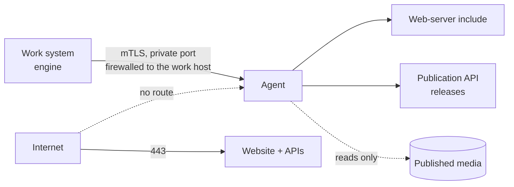

# Publication host agent

> See also: [Reverse proxy and TLS](reverse_proxy.md) · [Production install](production.md) · [Media protection](../core/system/media_protection.md) · [Installation](index.md)

Your public website, the Publication APIs and the published media can live on their own
server, away from the work system. This page installs the **publication host agent**:
the small service on that server that the work system controls. It explains what the
agent may and may not do, how it is provisioned and paired, and how to check the pairing.

!!! note "Driven by the panel in a later release"
    This release ships the agent, its provisioner and the pairing check. The work
    system's maintenance panel learns to list publication hosts and drive them in a later
    release. Until then you can provision the host, check the pairing, and install the
    media rules by hand as described in [media protection](../core/system/media_protection.md#a-separate-publication-server-with-shared-media-storage).

## When you need it

- **Two machines.** The work system stays internal, and a second, public server runs the
  website. The agent is how the work system reaches that server.
- **One machine, two hostnames.** A small institution runs the work system on
  `dedalo.museum.org` and the website on `www.museum.org` on the same server. The
  separate hostname is what keeps a website flaw from acting with a curator's login. The
  same agent then listens on a local socket instead of the network.

A single install that serves its website from the work system's own hostname does not
need it.

## What it does, and what it never does

The agent answers a fixed list of requests. There is no "run a command", no shell, and no
request that names a file on the server.

| Request | What happens on the publication host |
| --- | --- |
| status | reports the agent and API versions, the installed releases, the applied media-rule hash, the media mount and free disk |
| media probe | checks that the media mount is present, read-only and readable |
| apply media rules | writes the web-server include, runs the web server's configuration test, reloads; if the test fails, the previous include is put back and nothing is reloaded |
| install an API release | unpacks a release of Publication API v1 or v2, checks it, switches to it; if the new release is not healthy, the previous one keeps serving |
| roll back an API release | switches back to the previous release |

Every change is written to the agent's append-only audit log, with who asked for it and
the before and after state.

## How the work system reaches it



- **Direction is one way.** The work system connects to the publication host. The
  publication host never connects back, and holds no address or password of the work
  system. Make the firewall say the same thing.
- **Two machines: mutual TLS.** The provisioner creates a private certificate authority
  on the publication host. It issues the agent's server certificate and **one** client
  certificate for the work system, and the agent accepts no other client. If its
  certificate, key or client-certificate authority file is missing or unreadable, the
  agent refuses to start rather than serve unverified. Put the port on a private
  interface, firewalled to the work host's address. A WireGuard tunnel underneath is
  recommended as an extra layer.
- **One machine: a local socket.** The agent listens on a unix socket that only the
  engine's group can open. Nothing listens on the network.
- **Never plain, unencrypted TCP.** The agent has exactly two ways to listen, the two above.
- **And a shared secret.** Every request except the health check carries a bearer token
  of at least 32 characters. The health check publishes a **pairing fingerprint**
  computed from the instance name and the token, so both sides can prove they mean the
  same host. A wrong instance name and a wrong token look exactly alike from outside.

## What it may do as root: nothing

The agent runs as its own user and writes only under its own directories. The provisioner
grants it exactly two things:

| Grant | Allows | Why |
| --- | --- | --- |
| a sudo rule | the web server's configuration test (`apachectl -t` or `nginx -t`), nothing else | the test must read TLS keys only root can read |
| a polkit rule | reloading the web server's unit, restarting the Publication API v2 unit, starting and stopping a scratch copy of the v2 unit on a high local port | applying rules, testing and switching v2 releases need them |

Neither grant lets the work system reach root through the agent:

- The media rules the agent installs are checked against a closed list of web server
  directives before the configuration test reads them. They cannot load a module, include
  another file, start a piped log or name a path outside the media directory.
- A new API v2 release is tested in that scratch copy of the v2 unit, as the v2 user. It
  never runs as the agent's user, which holds the grants, the TLS key and the token.

!!! warning "The work system is trusted completely"
    Installing an API release runs code the work system sent. If the work system is
    compromised, the publication host is too. The reverse is not true: a compromised
    publication host gives no access to the work system. The agent checks the **shape** of
    what it receives (a checksum, a strict archive format, files that stay inside their
    directory, the closed list of media-rule directives), not whether the work system
    *meant* it. Protect the work system
    accordingly, and keep the publication host's port closed to everything else.

## Install

### 1. Prepare the code

The publication host never downloads packages. On the **work host**, in your Dédalo
checkout:

```bash
bun run hostagent:install
```

Then copy the `publication/host_agent/` directory, including `node_modules/`, to the
publication host.

### 2. Create the accounts

The provisioner never creates users or groups. Create, as system accounts without a login
shell:

- the agent's own user;
- the user and group of the Publication API v2 service;
- on one machine, make sure the work system's group exists (the agent's socket belongs to it).

If one is missing, step 4's `check` stops and prints the exact `useradd` or `groupadd`
command to run.

### 3. Declare the instance

The declaration is one JSON file, `/etc/dedalo_publication_host/<instance>.json`. It
states:

- the **instance** name: lowercase letters, digits and `_`, starting with a letter, 2 to
  32 characters;
- the **listener**: `{"kind": "unix"}` on one machine (the socket path is derived), or
  `{"kind": "tls", "host": …, "port": …}` on two machines (the host becomes the server
  certificate's name);
- the agent's user, and on one machine the work system's group;
- where the agent's code was copied (step 1);
- the **web server** (`apache` or `nginx`), its systemd unit, and the group it runs as
  (the configuration-test command, `apachectl -t` or `nginx -t`, follows from the server);
- the **state root**, the directory the agent owns;
- the **media mode** (`shared`, `copy` or `none`) and, unless `none`, the media root;
- the absolute paths of the two runtimes the agent calls: Bun, and the language runtime of
  the Publication API v1 (used only for its syntax check);
- the Publication API v2 unit, its user and group, its local port, and its health URL on
  `127.0.0.1` at that port.

Unknown keys are refused, and every mistake is named with its field. The complete list
of fields, with their rules, is in the agent's source: `src/provision/schema.ts`. Two
filled-in examples are `deploy/examples/instance.example.json` (two machines) and
`deploy/examples/instance.single_machine.example.json` (one machine), all under
`publication/host_agent/`.

### 4. Provision

As root, in the copied `publication/host_agent/` directory:

```bash
bun run provision check <instance>    # what would change; writes nothing
bun run provision apply <instance>    # directories, units, rules, certificates, the token
```

`bun run provision render <instance>` prints every file it would write, without writing
anything and without root. Every generated file carries a hash of its own content. If
someone edits one by hand, the next `check` refuses and names it instead of overwriting
it. A declaration at another path is passed with `--declaration <file>`.

### 5. Carry the engine bundle to the work system

`apply` writes the work system's half of the pairing as one root-only file,
`/etc/dedalo_publication_host/<instance>/engine_bundle/engine_bundle.pem`. It holds three
parts, in this order: the client certificate, its private key, and the certificate
authority. Copy it to the work host over a channel you trust, keep it `0600`, and delete
any other copy. If a later `apply` prints that the engine bundle changed, carry the new
one.

The bearer token is **not** in the bundle or in any generated file. It stays in a
root-only credential file on the publication host.

### 6. Check the pairing

From the work host (two machines), split the bundle once and ask for the health answer:

```bash
umask 077
sed -n '1,/-----END PRIVATE KEY-----/p' engine_bundle.pem > client.pem   # certificate + key
sed '1,/-----END PRIVATE KEY-----/d'    engine_bundle.pem > ca.pem       # the authority
curl --cacert ca.pem --cert client.pem \
  https://pub.example.org:9443/publication/host_agent/health
```

On one machine, ask the socket instead:

```bash
curl --unix-socket <socket path> http://localhost/publication/host_agent/health
```

Then compute the fingerprint on the publication host as root. `<credential file>` is the
path on the agent unit's `LoadCredential=` line (`bun run provision render <instance>`
shows it):

```bash
printf 'dedalo-publication-host:%s\n%s' <instance> "$(cat <credential file>)" | sha256sum
```

The `instance_fingerprint` in the health answer must equal that value. The same value is
also written, as `DEDALO_PUBLICATION_HOST_FINGERPRINT`, in
`/etc/dedalo_publication_host/<instance>/engine.env.fragment`, a file `apply` generates
for the work system's later pairing settings. A request without
the client certificate must fail at the TLS handshake.

## Publication API releases

Each API keeps its releases side by side, with its configuration outside them:

```
<state root>/publication_api/
  v1/shared/      the v1 API configuration      v1/releases/<release>/   v1/current → releases/<release>
  v2/shared/v2.env                              v2/releases/<release>/   v2/current → releases/<release>
```

- A release is named `<version>_<digest>` (for example `7.0.3_a1b2c3d`), so two builds of
  the same version stay distinguishable.
- Your web server and the v2 service point at `current`. Switching releases is one atomic
  rename, so a request never sees half a release.
- A release arrives complete: the v2 release carries its own libraries, so the host needs
  no package registry.
- Only the newest releases are kept (three by default). The current and the previous one
  are never removed, so a rollback is always possible.
- The configuration in `shared/` survives every release. A release that tries to ship its
  own copy of the v1 configuration is refused.

## Troubleshooting

| Symptom | Cause | Fix |
| --- | --- | --- |
| `provision check` stops, naming a user or group | the provisioner never creates accounts | run the `useradd` / `groupadd` line it prints, then `check` again |
| `provision check` refuses a file "edited by hand" | a generated file no longer matches its own hash | move it aside or restore it; change the declaration instead and re-run `apply` |
| the agent does not start, naming the client certificate authority | the certificate, key or authority file is missing or unreadable | re-run `bun run provision apply <instance>`; never disable client verification |
| `curl` fails at the TLS handshake | the client certificate is missing, from another host's authority, or the server name does not match the certificate | use the bundle this host issued, split as in step 6, and the exact address declared in the instance |
| every request answers 401 | the bearer token does not match | compare the pairing fingerprints (step 6) |
| the fingerprints differ | wrong instance name or wrong token; the two are indistinguishable by design | check both against the declaration and the credential file |
| applying media rules fails | the web server's configuration test rejected the new include | the previous include is still active and nothing was reloaded; read the error and re-render the rules |
| an API install fails its health check | the new release did not answer healthy | the previous release is still `current` and serving; the audit log names both releases |
