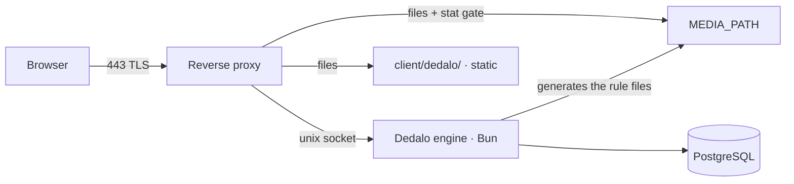

# Reverse proxy and TLS

> See also: [Production install](production.md) · [Media protection](../config/media_protection.md) · [Troubleshooting](troubleshooting.md) · [H.264 streaming module](install_h264_module.md)

Dédalo's engine listens on a **unix socket and nothing else**. The reverse proxy
is not an optional performance layer: it owns TCP and TLS, it serves the client
static files, and — most importantly — **it is what enforces media access
control**. This page wires it, for nginx and for Apache.

## What the proxy is responsible for



| URL space | Served by | Notes |
| --- | --- | --- |
| `/api/v1/…`, `/dedalo/core/api/…` | **proxy → socket** | the JSON API, uploads, the raw/environment/counters views |
| `/dedalo/lib/…` | **proxy → socket** | third-party browser libraries; **there is no `client/dedalo/lib/` directory** |
| `/dedalo/tools/…`, `/dedalo/core/tools_common/…` | **proxy → socket** | tool assets live in the repo's tool trees, outside `client/` |
| `/dedalo/core/component_text_area/tag/` | **proxy → socket** | the inline-tag image factory |
| `/dedalo/install/import/ontology/…` | **proxy → socket** | only when this instance is an ontology master |
| `/dedalo/media/…` | **proxy, from `MEDIA_PATH`** | gated by the generated rules — see below |
| everything else under `/dedalo/…` | **proxy, from `client/dedalo/`** | static files |

!!! warning "Never proxy media through the engine"
    Media files reach tens of gigabytes. Authorisation is one `stat()` performed
    by the web server itself, which is why `sendfile`, HTTP `Range` and the
    H.264 `?start=` clipping keep working. Put the engine in the byte path and
    you break streaming, seeking and memory headroom in one move. (There *is* a
    media route inside the engine, for developers with no web server in front. It
    applies **no per-record access control**, and it answers only on the TCP dev
    listener while protection is unconfigured — so behind this proxy, on the unix
    socket, it never runs. Leave `MEDIA_DEV_ROUTE_ENABLED` unset; setting it to
    `true` would force the engine into the byte path on *every* listener.)

## The three generated rule files

The **engine generates** the web-server rules; the **proxy enforces** them. The
files are written into `MEDIA_PATH` at boot, at every login, and by the
`media_control` maintenance widget — idempotently, guarded by a config hash
embedded in each file.

| Generated file (in `MEDIA_PATH`) | Web server | What you must do |
| --- | --- | --- |
| `.htaccess` | Apache | nothing — honoured automatically, **provided the directory has `AllowOverride`** |
| `dedalo_media_protection.nginx.conf` | nginx | **`include` it in the media `server{}`** |
| `dedalo_media_protection_map.nginx.conf` | nginx | **`include` it at `http{}` scope** |

!!! danger "Both nginx includes, or none"
    The map file defines `$dedalo_auth_key`, and a `map` cannot live inside
    `server{}`. Include the server file without the map and **nginx refuses to
    start** (`unknown "dedalo_auth_key" variable`). That is deliberate: a
    half-wired gate must never boot half-open.

!!! note "Reloads: what needs one and what does not"
    - **A mode change needs an nginx reload** (`nginx -t && nginx -s reload`).
      nginx reads its configuration at reload; Apache re-reads `.htaccess` on
      every request, so Apache needs nothing.
    - **The daily cookie rotation needs no reload, ever.** That is precisely why
      the cookie *name* (`dedalo_media_auth`) is fixed and only its *value*
      rotates: the rules never name a value, they only test whether the file
      named by the cookie exists.

## The root rule

**The generated nginx locations carry no `root` and no `alias`.** They inherit
the server's `root`. So the server `root` must satisfy:

```text
<root> + /dedalo/<DEDALO_MEDIA_DIR>/…   ==   MEDIA_PATH/…
```

With this manual's canonical layout (`MEDIA_PATH=/srv/dedalo/media`, media
directory `media`), that is exactly `root /srv;`.

!!! warning "Get this wrong and the symptom lies to you"
    A mismatched root produces a `404` on every media file *while the access gate
    itself is working perfectly*. It looks like a permissions problem and it is
    not. Test it against a file you know exists.

Apache has no such subtlety: an `Alias` maps the URL onto `MEDIA_PATH` directly.

## nginx

Install nginx first:

```shell
apt install -y nginx      # RHEL family: dnf install -y nginx
```

The reference configuration is `deploy/nginx.conf` in the repo — copy it to
`/etc/nginx/conf.d/dedalo.conf` and substitute the four paths named in its header.

!!! warning "Bring it up in THIS order — the two media `include` lines are commented on purpose"
    The `include` lines below point at files the engine only writes on its **first
    boot**. Install with them **commented out** or nginx refuses to start against
    missing files. In order:

    1. Install this config **as shown** (both `include` lines commented). nginx
       starts; media is simply not served yet — the safe failure.
    2. Confirm the engine has run once ([step 10](production.md#10-run-the-engine-under-systemd)) —
       it writes the rule files into `MEDIA_PATH` at boot.
    3. **Uncomment both `include` lines**, then `nginx -t && systemctl reload nginx`.

The config is reproduced here with the load-bearing lines called out.

```nginx
# --- http{} scope (a conf.d file is already inside http{}) -------------------
# include /srv/dedalo/media/dedalo_media_protection_map.nginx.conf;   # ← uncomment after step 10

upstream dedalo_ts {
	server unix:/run/dedalo/dedalo_ts.sock;
}

server {
	listen 80;
	server_name dedalo.example.org;
	return 301 https://$host$request_uri;
}

server {
	listen 443 ssl;
	http2 on;                       # multiplexes the ~100-module client boot graph
	server_name dedalo.example.org;

	ssl_certificate     /etc/letsencrypt/live/dedalo.example.org/fullchain.pem;
	ssl_certificate_key /etc/letsencrypt/live/dedalo.example.org/privkey.pem;
	ssl_protocols       TLSv1.2 TLSv1.3;

	root /srv;                      # THE ROOT RULE — see above
	client_max_body_size 300m;      # nginx defaults to 1m; every upload would 413

	add_header Strict-Transport-Security "max-age=31536000; includeSubDomains" always;
	add_header X-Content-Type-Options    "nosniff"    always;
	add_header X-Frame-Options           "SAMEORIGIN" always;
	add_header Referrer-Policy           "strict-origin-when-cross-origin" always;

	# Media — the GENERATED gate (written on first boot). Uncomment after step 10.
	# include /srv/dedalo/media/dedalo_media_protection.nginx.conf;
	open_file_cache off;            # a stat() cache delays an unpublish

	# API + dynamic routes. A regex location outranks every prefix location, so
	# this keeps precedence over the /dedalo/ static alias below.
	location ~ ^/(api/v1/|dedalo/core/api/) {
		proxy_pass http://dedalo_ts;
		proxy_http_version 1.1;
		proxy_set_header Host              $host;
		proxy_set_header X-Forwarded-For   $proxy_add_x_forwarded_for;
		proxy_set_header X-Forwarded-Proto $scheme;
		proxy_read_timeout 300s;    # >= SERVER_IDLE_TIMEOUT_S (255)
		proxy_send_timeout 300s;
		proxy_buffering off;        # SSE + NDJSON streaming
	}

	# Dynamic routes that live under /dedalo/ but are NOT static files.
	location /dedalo/lib/                            { proxy_pass http://dedalo_ts; }
	location /dedalo/tools/                          { proxy_pass http://dedalo_ts; }
	location /dedalo/core/tools_common/              { proxy_pass http://dedalo_ts; }
	location = /dedalo/core/component_text_area/tag/ { proxy_pass http://dedalo_ts; }
	location /dedalo/install/import/ontology/        { proxy_pass http://dedalo_ts; }

	# Client static files. Served IN PLACE (not content-hashed) — they must
	# revalidate, so they are NEVER immutable.
	location /dedalo/ {
		alias /opt/dedalo/master_dedalo/client/dedalo/;
		etag on;
		add_header Cache-Control "no-cache";
		gzip on;
		gzip_types text/css application/javascript application/json image/svg+xml;
		gzip_min_length 1024;
		location ~* \.(png|jpe?g|gif|webp|ico|woff2?|ttf|otf)$ {
			add_header Cache-Control "public, max-age=3600";
		}
	}

	location = / { return 302 /dedalo/core/page/; }
	location   / { return 404; }
}
```

!!! note "Several domains on one box"
    This is a single-domain vhost. To serve more domains, add one `upstream` and
    one `server{}` per domain, each pointing at that instance's socket and
    `MEDIA_PATH` — see [Multiple instances on one server](multi_instance.md).

!!! warning "Known defect: quote the rule-B location regex"
    In `publication` mode the generated `dedalo_media_protection.nginx.conf`
    emits its rule-B location as an **unquoted** regex, and that regex contains
    `{2,12}`. nginx's configuration lexer treats `{` and `}` as block delimiters,
    so it truncates the token and refuses to start:

    ```text
    nginx: [emerg] pcre2_compile() failed: missing closing parenthesis in "^/dedalo/media/(?:…"
    ```

    Until the generator is fixed, wrap that one regex in double quotes:

    ```nginx title="fix"
    location ~ "^/dedalo/media/(?:av/404|…)…$" {
    ```

    The edit survives: the file is only rewritten when the embedded
    `# config-hash:` line stops matching the current configuration, and quoting
    does not change the hash. Re-apply it after any change to the media mode or
    the public quality list. `private` mode is unaffected — it generates no
    regex location.

## Apache

Install Apache, enable the modules, then use an `Alias`-based vhost:

```shell
apt install -y apache2      # RHEL family: dnf install -y httpd
```

The `ProxyPass` rules must
come **before** the aliases, and `Alias /dedalo/media` must come before
`Alias /dedalo`: the first match wins.

```shell
a2enmod ssl headers http2 rewrite proxy proxy_http
```

```apache
<VirtualHost *:80>
    ServerName dedalo.example.org
    Redirect permanent / https://dedalo.example.org/
</VirtualHost>

<VirtualHost *:443>
    ServerName dedalo.example.org
    Protocols h2 http/1.1

    SSLEngine on
    SSLCertificateFile    /etc/letsencrypt/live/dedalo.example.org/fullchain.pem
    SSLCertificateKeyFile /etc/letsencrypt/live/dedalo.example.org/privkey.pem
    Include /etc/letsencrypt/options-ssl-apache.conf

    ProxyPreserveHost On
    ProxyTimeout 300                # >= SERVER_IDLE_TIMEOUT_S (255)

    # --- API + dynamic routes → the unix socket ---------------------------
    ProxyPass /api/v1/                              unix:/run/dedalo/dedalo_ts.sock|http://localhost/api/v1/
    ProxyPass /dedalo/core/api/                     unix:/run/dedalo/dedalo_ts.sock|http://localhost/dedalo/core/api/
    ProxyPass /dedalo/lib/                          unix:/run/dedalo/dedalo_ts.sock|http://localhost/dedalo/lib/
    ProxyPass /dedalo/tools/                        unix:/run/dedalo/dedalo_ts.sock|http://localhost/dedalo/tools/
    ProxyPass /dedalo/core/tools_common/            unix:/run/dedalo/dedalo_ts.sock|http://localhost/dedalo/core/tools_common/
    ProxyPass /dedalo/core/component_text_area/tag/ unix:/run/dedalo/dedalo_ts.sock|http://localhost/dedalo/core/component_text_area/tag/
    ProxyPass /dedalo/install/import/ontology/      unix:/run/dedalo/dedalo_ts.sock|http://localhost/dedalo/install/import/ontology/

    # --- Media: the generated .htaccess lives inside MEDIA_PATH -----------
    Alias /dedalo/media /srv/dedalo/media
    <Directory /srv/dedalo/media>
        # WITHOUT AllowOverride the generated .htaccess is ignored — silently,
        # and OPEN. This single line is the whole media gate on Apache.
        AllowOverride All
        Options -Indexes -ExecCGI
        Require all granted
    </Directory>

    # --- Client static files ----------------------------------------------
    Alias /dedalo /opt/dedalo/master_dedalo/client/dedalo
    <Directory /opt/dedalo/master_dedalo/client/dedalo>
        Options -Indexes
        AllowOverride None
        Require all granted
    </Directory>

    Header always set Strict-Transport-Security "max-age=31536000; includeSubDomains"
    Header always set X-Content-Type-Options "nosniff"
    Header always set X-Frame-Options "SAMEORIGIN"
</VirtualHost>
```

!!! danger "`AllowOverride All` is not a style choice"
    Apache reads the generated `.htaccess` only if the directory allows
    overrides. Without it the file is ignored **silently**, and the whole media
    tree — originals included — is world-readable. `mod_rewrite` must be enabled
    for the same reason.

Serving audiovisual fragments by time range needs an extra Apache module; nginx
has the equivalent built in. See
[H.264 streaming module](install_h264_module.md).

## TLS with Let's Encrypt

```shell
snap install --classic certbot
ln -sf /snap/bin/certbot /usr/bin/certbot

certbot --nginx -d dedalo.example.org      # or: certbot --apache -d …
certbot renew --dry-run                    # the snap installs the renewal timer
```

!!! warning "TLS is a hard requirement, not a recommendation"
    `SESSION_COOKIE_SECURE` defaults to **true**, so a browser will not store the
    session cookie over plain HTTP and **nobody can log in**. The media-auth
    cookie carries the same attributes by construction — a `Secure` session
    cookie next to a cleartext media cookie would leak an authorisation value on
    a single plaintext hop.

## The settings that bite

| Setting | Value | What breaks otherwise |
| --- | --- | --- |
| proxy read timeout | **≥ `SERVER_IDLE_TIMEOUT_S`** (255 s; use 300 s) | a large export or a long tool action is killed by the proxy one hop before the engine would have finished it |
| response buffering | **off** on the API location | the assistant chat (SSE), diffusion progress and NDJSON exports stall or die; the engine sends `X-Accel-Buffering: no` and 15-second heartbeats, but a buffering proxy defeats them |
| max request body | **≥ 256 MiB** (nginx `client_max_body_size`; Apache's default is unlimited) | every upload fails with `413` — nginx's default is **1 MB**, and the client uploads in ~4 MB chunks |
| `TRUSTED_PROXY_HOPS` | **the number of proxies that append `X-Forwarded-For`** (default `1`) | the login throttle keys on the wrong address: too low and an attacker forges a fresh throttle bucket per request; too high and every user shares one bucket |
| `open_file_cache` | **off** (or `_valid` ≤ 2 s) on the media locations | unpublishing a record does not take effect until the cache expires |
| socket permissions | see [production](production.md#10-run-the-engine-under-systemd) | `502` on every request — connecting to a unix socket needs **write** permission on it |

## Verify

```shell
# The engine answers over the socket, and Postgres is reachable.
curl --fail --unix-socket /run/dedalo/dedalo_ts.sock http://localhost/health

# The proxy serves the client over TLS.
curl -I https://dedalo.example.org/dedalo/core/page/

# A media file honours Range (206 — proof that nothing is in the byte path).
curl -I -H 'Range: bytes=0-99' https://dedalo.example.org/dedalo/media/image/thumb/<a-real-file>.jpg

# The marker store is never served (404).
curl -I https://dedalo.example.org/dedalo/media/.publication/auth/
```

A `Range` request that answers `200` with a full body — instead of `206` — means
something has been put in the media byte path. Find it and take it out.
