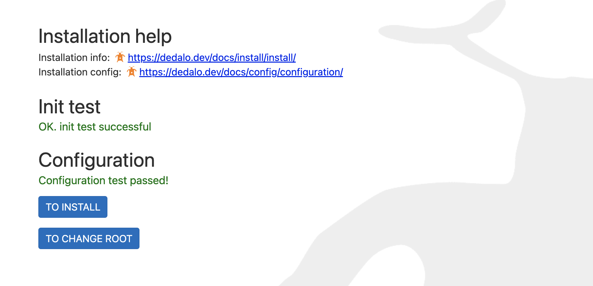
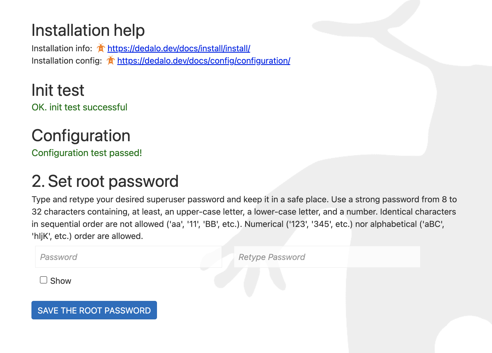

# Changing root password

> See also: [Management and maintenance](index.md) · [Users, profiles and permissions](users_and_permissions.md)

## Introduction

The Dédalo root user is the most powerful administrative account, granting complete and unrestricted access to all system data and functions. Reserve this account exclusively for critical operations like installation, system updates, maintenance procedures, and diagnostic debugging.

The root user password is established during the initial installation process and is generally intended to remain permanent. There are specific scenarios, however, that may necessitate a password change, for example, during server migration or when administrative duties are reassigned to a new administrator.

## Procedure: Root Password Reset

For security reasons, the root user is not accessible via the Dédalo web interface. Modifying this account requires direct access to your Dédalo server and can only be performed manually by users with GNU/Linux system administration privileges.

!!! danger "TS gap: no installer, no password-hashing-on-save — a database operation only"
    The procedure below (steps 1–5) is the **PHP** flow: it flips the PHP
    install into installer mode so its browser wizard can set a fresh Argon2id
    hash. The TS/Bun server has **no installer at all** — there is no `install`
    action, only a UI-shell `get_install_context` (see
    `src/core/api/dispatch.ts`), and no `DEDALO_INSTALL_STATUS`-style toggle to
    flip. More importantly, the TS server can only **verify** Argon2id hashes
    on login (`src/core/security/auth.ts`, via `Bun.password.verify`); nothing
    in the ordinary component-save path **hashes** a new password on write yet
    (`component_password`'s descriptor, `src/core/components/component_password/descriptor.ts`,
    is a plain string column — there is no save-time hashing hook ported). So
    on a TS-only server, changing root's (or any user's) password cannot be
    done through the web UI at all today; it must be done directly against
    PostgreSQL with a pre-computed hash:

    ```ts
    // one-off: compute a fresh Argon2id hash with the SAME algorithm the
    // server verifies against (Bun.password, no external tooling needed)
    console.log(await Bun.password.hash('my-new-root-password'));
    // => $argon2id$v=19$m=65536,t=2,p=1$...
    ```

    ```sql
    -- matrix_users.string is keyed by tipo; dd133 is the password component.
    -- Root is section_id = -1. This OVERWRITES the first stored item's value
    -- with the freshly computed hash (see src/core/security/auth.ts
    -- findUserByUsername, which reads string->'dd133'->0->'value').
    UPDATE matrix_users
    SET string = jsonb_set(string, '{dd133,0,value}', '"$argon2id$v=19$m=65536,t=2,p=1$..."'::jsonb)
    WHERE section_tipo = 'dd128' AND section_id = -1;
    ```

    Until the write-side hashing hook is ported, treat this as a manual DB
    maintenance task, same spirit as the PHP procedure below but without a
    browser round-trip. On a **coexisting** install (PHP and TS sharing the
    same database), the PHP flow below still works and the new hash is picked
    up by both engines immediately, since `auth.ts` reads the live row on every
    login.

## Requirements (PHP-managed installations)

!!! warning "Secure Environment Required"
    Isolate Installation During Procedure.
    Before beginning this sensitive operation, ensure your Dédalo installation is not publicly accessible.
    This critical security procedure requires that you temporarily remove public access to Dédalo to prevent unauthorized access during the password change process.

1. Server access using the GNU/Linux account created for Dédalo installation
2. Privileged user access to the Dédalo PostgreSQL database

### Steps

1. **Update the Dédalo Installation Status**

    Navigate to the Dédalo configuration directory:

    ```shell
    cd ./dedalo/config
    nano config_core.php
    ```

    Locate the DEDALO_INSTALL_STATUS constant and modify its value from:

    ```php
    define('DEDALO_INSTALL_STATUS', 'installed');
    ```

    to:

    ```php
    define('DEDALO_INSTALL_STATUS', false);
    ```

    This change will reactivate installation mode for your Dédalo instance.

2. **Remove the Existing Root Password in PostgreSQL**

    Execute the following SQL command to clear the root password:

    ```sql
    UPDATE matrix_users SET datos = jsonb_set(datos, '{components, dd133, dato, lg-nolan}', 'null') WHERE section_id = -1;
    ```

3. Access Dédalo via Web Browser

    Open your web browser and navigate to your Dédalo instance. Changing the installation status will trigger the installation process, and Dédalo will display the option to set a new root password.

    

    Click the "To change root" button and follow the prompts to establish your new password.

    

    Click the "Save the root password" button.

4. Restore the Dédalo Installation Status

    Return to the configuration directory and open the core configuration file:

    ```shell
    cd ./dedalo/config
    nano config_core.php
    ```
    from

    ```php
    define('DEDALO_INSTALL_STATUS', false);
    ```

    to:

    ```php
    define('DEDALO_INSTALL_STATUS', 'installed');
    ```

5. Access Dédalo via Web Browser and login as usually using the new password

