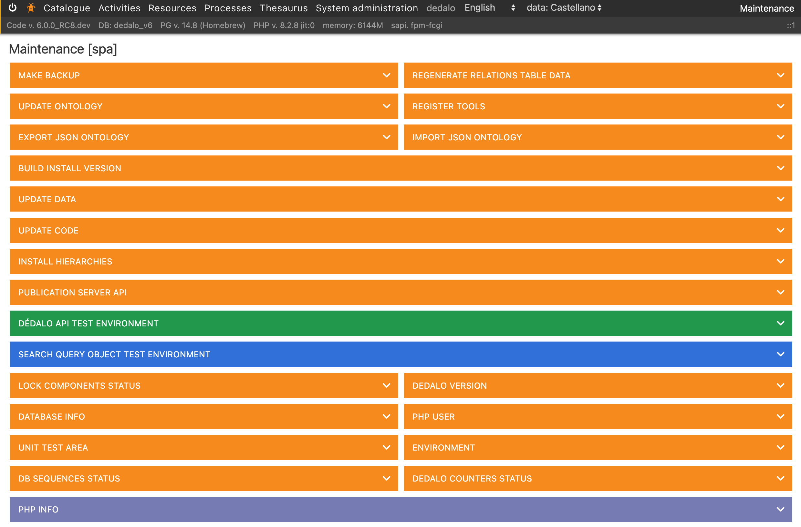

# Management and maintenance

## Introduction

Dédalo project is focused to manage cultural heritage data. Dédalo Projects preserve data about memory and cultural heritage, his data could be sensitive, his treatment need to respect the legacy deposited by informants, interviewees, etc and also all work done by researches, curators, etc. Data in Dédalo projects is very important, preserving data is the center of the management and maintenance.

## Work environments

Dédalo has two different environments, work system and publication system. Work system is used to manage the full catalog, it manage all project data, all information of the memory interviews, tangible/intangible heritage, documents, images, audiovisual, publications, etc. besides work system has the tools to research and analyze the catalog items. Work system is a private space with users control and full activity control.

Publication system is the open and free public access to the data, publication system it is a reduced copy of the catalog, it store and manage only the data that can be public. Publication system is a separate system controlled by the administrators.

Both systems are connected but only in one way, work system can add, change or remove data of the publication system, but publication system does not have way back to work system. Any change done in publication system is totally isolated of the work system, so any non authorized access to the publication system has not affection to the work system.

### Work system

Work system is the principal system. Work system was builded with flexibility in mind, in this system data has not totally defined, it depends of the ontology resolution and relations and data values need to be resolved in real time.

Data is stored in JSON format and Dédalo use PostgreSQL as main database system.

#### root user

In Dédalo installation process you were asked to create the root user account with a password.
The root user is the top maintenance user account with the full access to the system, this account activate the debugger and do not have any restriction to access data.

Dédalo root user is identified with `section_id = -1` (it is the only `-1` section_id allowed in the database.)

!!! note "root account"
    Dédalo root user is independent of the GNU/Linux root account.

When a user login with root account, Dédalo activate the debugger and all actions done will be logged into the php_error_log file, monitoring the php_error_log file is possible to detect errors. But this situation only is necessary when something was wrong, and only in few cases the full access to data is necessary, so do not use this account in normal administration. The most common daily administration tasks can be performed using a general administrator account.

To monitoring the php_error_log you can use the `tail` command in this way:

```sh
tail -f /var/log/php-fpm/php_error_log
```

And reproduce the failing task in the browser.

##### Changing Root Password

For security reasons, the root user cannot be managed through the Dédalo web interface. To change the root password, follow [this procedure](./changing_root_password.md).

#### General admin

General admin account is the every day administration account, the user is set in the users section and it has the global access to the installation, this account can manage the users, it has full data access, and it can perform daily administrative tasks.

The first general admin user is create by root user, but this account can create other general admin users. Any general admin account can create other general admin, developers and users, assign profiles and projects  to them but it can not change his own configuration, only root and other general users can modified it.

This accounts does not activate the debugger.
This accounts does not have restrictions to data access. They have full data access.

#### GNU/Linux account

To admin a Dédalo installation you will need a user with administrative rights to access to GNU/Linux server.

You will need to install, update and perform management tasks. Dédalo system depends of PostgreSQL, PHP, Apache, MariaDB (or MySQL), etc. and any Dédalo project will need a GNU/Linux expert.

#### Maintenance panel

The most daily task are performed into the Maintenance panel. It is locate inside the "System administration" menu.



The panel is only accessible by; general administration, developers users and root user.

General administrators and developers need have a profile that allowed to access to the panel, if the general admin or developer user has a profile with not access to the panel it will not allowed to access and perform maintenance tasks.

Normal users with a profile with access to maintenance panel will not able to enter and perform any maintenance task. To be allowed the user need to be General administrator or developer user.

#### Maintenance tasks

Before preform any critical maintenance task as a data update you will change Dédalo state to maintenance.

- [Changing to maintenance state.](maintenace_status.md)

Previous task is common in multiple scenarios.

- [Backup](backup_best_practises.md)
    - [backup and restore tasks](backup.md)

- [Updates](updates/index.md)
    - [Updating ontology](updates/updating_ontology.md)
    - [Updating code](updates/updating_code.md)
    - [Updating data](updates/updating_data.md)

- [Installing new hierarchies](install_new_hierarchies.md)

- DDBB maintenance
    - Vacuum
    - reindexes
    - counters
