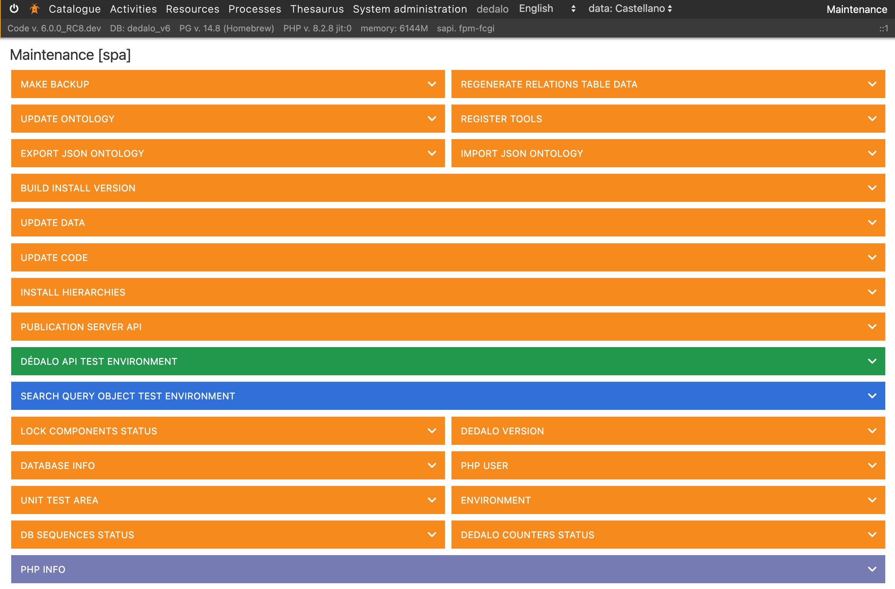

# Management and maintenance

> See also: [Users, profiles and permissions](users_and_permissions.md) · [Backup best practices](backup_best_practises.md) · [Updates](updates/index.md)

## Introduction

A Dédalo project is focused on managing cultural heritage data. Dédalo projects preserve data about memory and cultural heritage; that data can be sensitive, and its treatment must respect the legacy entrusted by informants and interviewees, as well as all the work done by researchers, curators and others. Data in Dédalo projects is very important, and preserving it is the heart of management and maintenance.

## Work environments

Dédalo has two environments: the work system and the publication system. The work system manages the full catalogue — all project data: memory interviews, tangible and intangible heritage, documents, images, audiovisual, publications and so on — and it provides the tools to research and analyze the catalogue items. The work system is a private space with user control and full activity logging.

The publication system is the open, free public access to the data. It is a reduced copy of the catalogue and stores only the data that can be public. The publication system is a separate system controlled by the administrators.

The two systems are connected in one direction only: the work system can add, change or remove data in the publication system, but the publication system has no way back to the work system. Any change made in the publication system is fully isolated from the work system, so an unauthorized access to the publication system has no effect on the work system.

### Work system

The work system is the main system. It was built with flexibility in mind: its data is not fully defined up front but depends on ontology resolution, and relations and data values are resolved in real time.

Data is stored in JSON format, and Dédalo uses PostgreSQL as its main database system.

#### root user

In Dédalo installation process you were asked to create the root user account with a password.
The root user is the top maintenance user account with the full access to the system, this account activate the debugger and do not have any restriction to access data.

Dédalo root user is identified with `section_id = -1` (it is the only `-1` section_id allowed in the database.)

!!! note "root account"
    Dédalo root user is independent of the GNU/Linux root account.

This situation is only necessary when something was wrong, and only in few cases the full access to data is necessary, so do not use this account in normal administration. The most common daily administration tasks can be performed using a general administrator account.

The TS server (`src/server.ts`) is a single long-lived Bun process. It writes
activity to its own process output (stdout/stderr) for every principal,
including root — monitor it through whatever runs the process (e.g.
`journalctl -u <service> -f`, your process manager's log tail, or the
terminal running `bun run`).

##### Changing Root Password

For security reasons, the root user cannot be managed through the Dédalo web interface. To change the root password, follow [this procedure](./changing_root_password.md).

#### General admin

General admin account is the every day administration account, the user is set in the users section and it has the global access to the installation, this account can manage the users, it has full data access, and it can perform daily administrative tasks.

The first general admin user is created by the root user, but a general admin account can then create other general admin users. Any general admin account can create other general admins, developers and users, and assign profiles and projects to them — but it cannot change its own configuration; only root and other general admins can modify it.

These accounts do not activate the debugger. They have no restrictions on data access — they have full data access.

#### Users, profiles and permissions

Day-to-day access control — creating users and profiles, the four permission levels (`0`–`3`), and how those permissions are computed and enforced on every read and save — is covered in its own guide.

See [Users, profiles and permissions](users_and_permissions.md) for:

- Where users and profiles live (the Users and Profiles sections, no bespoke tables)
- The two roles above a profile (global admin, developer) and the root super-user
- Step-by-step: create a profile, create a user, build a read-only profile for one section
- How the type/schema permission (layer 1) and the per-record project scope (layer 2) are enforced server-side

#### GNU/Linux account

To administer a Dédalo installation you will need a user with administrative rights on the GNU/Linux server.

You will need to install, update and perform management tasks. The Dédalo system depends on PostgreSQL, the Bun runtime, a reverse proxy (Apache or nginx), optionally MariaDB (for diffusion) and others, so any Dédalo project will need a GNU/Linux expert.

#### Maintenance panel

Most daily tasks are performed in the Maintenance panel, located inside the "System administration" menu.

The panel is only accessible to general administrators, developer users and the root user.

General administrators and developers also need a profile that grants access to the panel: if their profile does not grant access to the panel, they cannot enter it or perform maintenance tasks.

A normal user, even with a profile that grants access to the maintenance panel, cannot enter it or perform any maintenance task. To be allowed, the user must be a general administrator or a developer.

The maintenance widget catalog is a fixed set of TS modules
(`src/core/area_maintenance/widgets/`), each declaring its own dashboard
metadata and gated actions. Most widgets are native TS implementations —
backup, server state, ontology and code updates (see [Updates](updates/index.md))
all run for real. A small number of widgets have no equivalent on the Bun
engine and answer with a named, explicit error instead of silently doing
nothing.

#### Maintenance tasks

Before performing any critical maintenance task, such as a data update, change the Dédalo state to maintenance.

- [Changing to maintenance state.](maintenace_status.md)

Previous task is common in multiple scenarios.

- [Backup](backup_best_practises.md)
    - [backup and restore tasks](backup.md)

- [Updates](updates/index.md)
    - [Updating ontology](updates/updating_ontology.md)
    - [Updating code](updates/updating_code.md)
    - [Updating data](updates/updating_data.md)

- [Installing new hierarchies](install_new_hierarchies.md)

- [Site builder](site_builder.md) — agent-built public websites over the published data
    - [Site builder cookbook](site_builder_cookbook.md) — configuration and prompt examples

- DDBB maintenance
    - Vacuum
    - reindexes
    - counters
