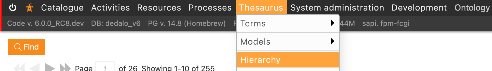
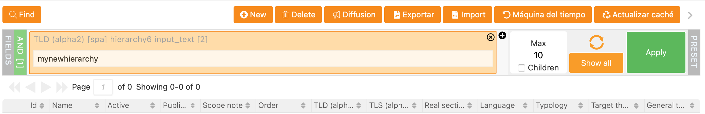
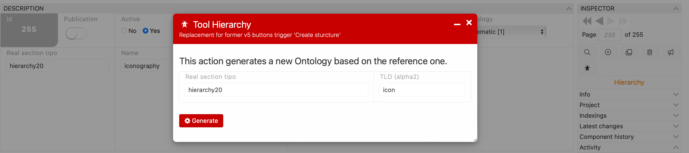
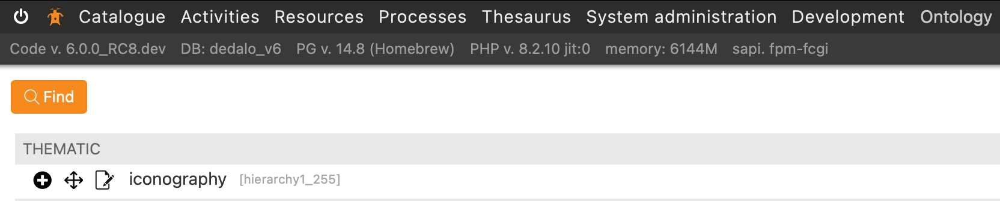
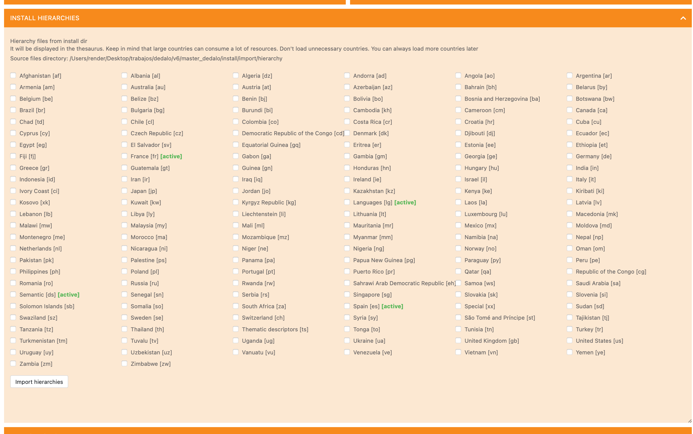

# Adding or installing new hierarchies

Hierarchies as thesaurus are an important area of Dédalo system. Dédalo use hierarchies in multiple scenarios, as normalized toponymy, languages, thematic, materials, techniques, etc. Adding or installing new hierarchies is and will be a important maintenance process.

## Defining hierarchy

Hierarchies are a complex structure of data with multiple relations formats, as his name defines, data will structure hierarchically with parent-children relation, Dédalo support more relations types as equality, change to, equivalence, or other relation types.

By default all hierarchies sections are a clone of the [hierarchy20](https://dedalo.dev/ontology/hierarchy20) section. But is possible use any other section adding the relations and definition to create a hierarchy with any flat section.

Hierarchies are showed inside the Thesaurus area and they are viewed with a tree representation.

What is the difference between hierarchy and thesaurus?

Hierarchies are the structure of the data and the thesaurus will be the data itself, the data entered by users or imported. Any thesaurus has a main controlled that is defined into Dédalo ontology (as an expansion of the ontology) and this definition is named hierarchy.

In other words; Hierarchies are the meta information of the thesaurus.

### Creating new hierarchies

Is necessary to identify two different hierarchies types:

- Common and shared hierarchies
- Private hierarchies.

#### Common or shared hierarchies

Every hierarchy has a unique TLD that identify it and is used into Dédalo [ontology](../core/index.md#dédalo-ontology) as a specific section with his own configuration. To create or import a common or shared hierarchies you will need to know the TLD before open the new hierarchy.

In some hierarchies this TLD use a standard denomination, as toponymy hierarchies, that use the [ISO 3166-1](https://www.iso.org/iso-3166-country-codes.html) definition to identify the countries.

Some common and shared TLD's: (list ordered by type and antiquity)

| Hierarchy | Description | type | section | TLD |
| --- | --- | --- | --- | --- |
| Thematic | Themes used to analyze heritage | Thematic (1) | hierarchy20 | ts |
| Onomastic | Names of people and places | Thematic (1) | hierarchy20 | on |
| Chronological | Periods and time events | Thematic (1) | hierarchy20 | cr |
| Deposition type | Defines the different Deposition types of donations in register | Thematic (1) | hierarchy20 | deposit |
| Object name | Defines the different names for objects | Thematic (1) | hierarchy20 | object |
| Inscriptions and measures | Defines typologies of inscriptions and his ubication into the object | Thematic (1) | hierarchy20 | pieces |
| Culture | Defines different cultures and his space and time | Thematic (1)  | hierarchy20 | cult |
| Material | Defines the composition materials used in objects | Thematic (1) | hierarchy20 | material |
| Technique | Defines the techniques used to build objects | Thematic (1) | hierarchy20 | technique |
| Iconography | Defines iconography | Thematic (1) | hierarchy20 | icon |
| Languages | Languages families and dialects | languages (3) | hierarchy20 | lg |
| Users roles | Defines the different roles of Dédalo users | Semantic (4) | hierarchy20 | roleusr |
| Users jobs | Defines the different jobs for people | Semantic (4) | hierarchy20 | rolejob |
| Position role | Defines the different position role for persons | Semantic (4) | hierarchy20 | rolepos |
| Northern Paleo Hispanic | Defines Iberian symbols not defined into Unicode | Epigraphy (7) | hierarchy20 | scxibo |
| Southern Paleo Hispanic | Defines Iberian symbols not defined into Unicode | Epigraphy (7) | hierarchy20 | scxibm |
| South-Western Paleo Hispanic | Defines Iberian symbols not defined into Unicode | Epigraphy (7) | hierarchy20 | sctxr |
| Greek | Defines especial symbols not defined into Unicode | Epigraphy (7) | hierarchy20 | scell |
| Latin | Defines especial symbols not defined into Unicode | Epigraphy (7) | hierarchy20 | sclat |
| Punic | Defines especial symbols not defined into Unicode | Epigraphy (7) | hierarchy20 | scxpu |
| Symbols | Defines symbols | Epigraphy (7) | hierarchy20 | scsym |
| Countermark | Defines symbols used as countermarks | Epigraphy (7) | hierarchy20 | icon |
| Special | Defines a restrictions for indexation | Special (5) | hierarchy20 | special |
| Ubication | Topographic, to identify the location of objects | Ubications (9) | hierarchy20 | ubication |
| Places | Defines places as findspots | Ubications (9) | hierarchy20 | place |
| Web sites | Website structure, menus, etc | websites (6) | hierarchy20 | ww |

!!! info "TLD's names"

    The first hierarchies created were toponyms, and this hierarchies followed the ISO TLD's Alpha 2 to use as Dédalo ontology TLD. Some of the first common hierarchies follow the ISO Alpha 2 rule, as thematic hierarchy, that use `ts` as TLD, by the time, it became impossible to create new ontologies following the Alpha 2 rule, so, the Alpha2 rule was removed and now Dédalo can use a longs TLD's, but following some rules: For this historical reasons no spaces, especial characters, numbers, points, commas or any other characters outside ASCII characters are valid (as accents, ç, ñ, etc.). To create hierarchies TLD's, only \[a-z\] characters are accepted.

#### Private hierarchies

Is possible to create hierarchies by your own, alone for other Dédalo installations. In this case you will need to use a specific TLD following the rule of use only letters, without spaces or special characters.

Normally, the hierarchy reference will be [hierarchy20](https://dedalo.dev/ontology/hierarchy20), the normalized section used as thesaurus model.

### Process to create new hierarchy

Both, common and private, hierarchies has the same process to be created.

1. Go to Hierarchy section in the Thesaurus menu.

    

2. Review if the TLD exists previously doing a search.

    

3. If not exists, create new record as any other section.
4. Add the new TLD into the TLD (Alpha2) field.
5. Add the main language of the hierarchy
6. **Mandatory** Set the Typology of the new hierarchy
7. **Mandatory** Set the real section tipo (normally hierarchy20)
8. **Mandatory** Add the name of the hierarchy
9. Change the state of the field "Active" to "Yes"

    

10. Open the tool to create the new hierarchy, the tool is locate into the inspector.

    

11. Build it clicking in the "Generate" button.

    

12. Check in Thesaurus that this hierarchy is ready and set the permissions to users as you need.

    

#### Toponyms

For simplified the creation and load toponymy hierarchies is possible use the Maintenance panel to control the all toponyms hierarchies.

Dédalo installations will pre-configure all counties, but their are not active and his data is not loaded by default. Only countries loaded in the install process will be accesible to users. To activate new one follow this steps:

1. Go to "Maintenance" panel in "System administration" menu.
2. Locate the "Install hierarchies" block

    

3. Check the country that you want to load. (Is possible check more than one)
4. Click the "Import hierarchy" button and wait. (Some countries may have a large dataset)
5. Check in Thesaurus view that this hierarchy is ready and set the permissions to users as you need.