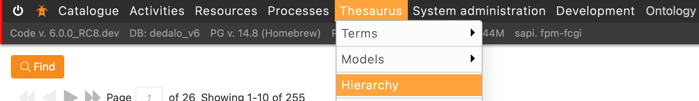
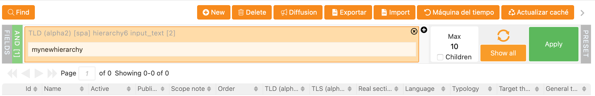
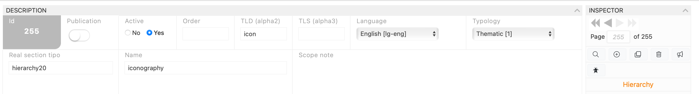
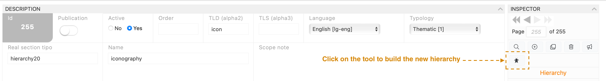
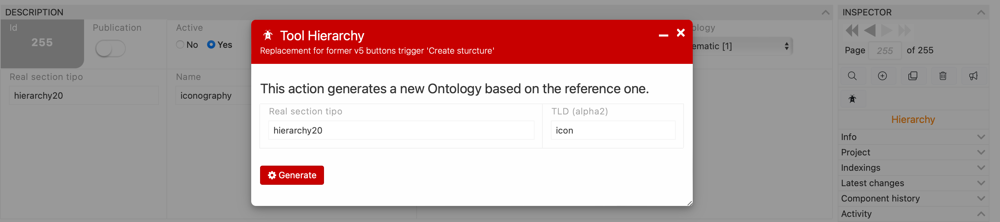
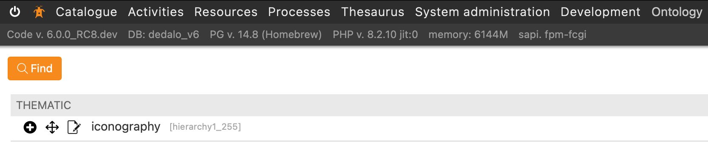

# Adding or installing new hierarchies

> See also: [Management and maintenance](index.md) · [Thesaurus dependencies](../config/thesaurus_dependencies.md)

Hierarchies (thesauri) are an important part of the Dédalo system. Dédalo uses hierarchies in many scenarios: normalized toponymy, languages, themes, materials, techniques and more. Adding or installing new hierarchies is an important maintenance task.

## Defining a hierarchy

Hierarchies are a complex data structure with several relation formats. As the name suggests, the data is structured hierarchically through parent-child relations; Dédalo also supports other relation types such as equality, change-to and equivalence.

By default all hierarchies sections are a clone of the [hierarchy20](https://dedalo.dev/ontology/hierarchy20) section. But is possible use any other section adding the relations and definition to create a hierarchy with any flat section.

Hierarchies are showed inside the Thesaurus area and they are viewed with a tree representation.

What is the difference between a hierarchy and a thesaurus?

A hierarchy is the structure of the data; the thesaurus is the data itself — the data entered by users or imported. Every thesaurus has a controlled definition in the Dédalo ontology (as an expansion of the ontology), and that definition is called a hierarchy.

In other words, hierarchies are the meta information of the thesaurus.

### Creating new hierarchies

Is necessary to identify two different hierarchies types:

- Common and shared hierarchies
- Private hierarchies.

#### Common or shared hierarchies

Every hierarchy has a unique TLD that identify it and is used into Dédalo [ontology](../core/index.md#dédalo-ontology) as a specific section with his own configuration. To create or import a common or shared hierarchies you will need to know the TLD before open the new hierarchy.

In some hierarchies this TLD use a standard denomination, as toponymy hierarchies, that use the [ISO 3166-1](https://www.iso.org/iso-3166-country-codes.html) definition to identify the countries.

Some common and shared TLD's: (list ordered by type and name)

| Hierarchy | Description | type | section | TLD |
| --- | --- | --- | --- | --- |
| Chronological  | Periods and time events  | Thematic (1)  | hierarchy20  | dc |
| Culture  | Defines different cultures and his space and time  | Thematic (1)  | hierarchy20  | culture |
| Deposition type  | Defines the different Deposition types of donations in register  | Thematic (1)  | hierarchy20  | depositiontype |
| Iconography  | Defines iconography  | Thematic (1)  | hierarchy20  | icon |
| Immovable  | Defines places as archeological sites, findspots  | Thematic (1)  | hierarchy20  | tchi |
| Inscriptions and measures  | Defines typologies of inscriptions and his ubication into the object  | Thematic (1)  | hierarchy20  | pieces |
| Material  | Defines the composition materials used in objects  | Thematic (1)  | hierarchy20  | material |
| Object name  | Defines the different names for objects  | Thematic (1)  | hierarchy20  | object |
| Onomastic  | Names of people and places  | Thematic (1)  | hierarchy20  | on |
| Technique  | Defines the techniques used to build objects  | Thematic (1)  | hierarchy20  | technique |
| Thematic  | Themes used to analyze heritage  | Thematic (1)  | hierarchy20  | ts |
| ISAD(g)  | Defines the hierarchy related to the ISAD(g)  | Catalog (8)  | isad1  | isad |
| Languages  | Languages families and dialects  | languages (3)  | hierarchy20  | lg |
| Cause of uncertainty  | Defines the reasons of the uncertainty  | Semantic (4)  | hierarchy20  | uncertainty |
| Position role  | Defines the different position role for persons  | Semantic (4)  | hierarchy20  | rolepos |
| Semantic  | Defines context for data, relations between concepts  | Semantic (4)  | hierarchy20  | ds |
| Users jobs  | Defines the different jobs for people  | Semantic (4)  | hierarchy20  | rolejob |
| Users roles  | Defines the different roles of Dédalo users  | Semantic (4)  | hierarchy20  | roleusr |
| Special  | Defines a restrictions for indexation  | Special (5)  | hierarchy20  | special |
| Analysis  | Defines the different analysis techniques applied to objects.  | Restoration (10)  | hierarchy20  | resanalysis |
| Cause  | Defines the reasons of the affectation  | Restoration (10)  | hierarchy20  | rescause |
| Countermark  | Defines symbols used as countermarks  | Epigraphy (7)  | hierarchy20  | sccmk |
| Greek  | Defines especial symbols not defined into Unicode  | Epigraphy (7)  | hierarchy20  | scell |
| Job material  | Defines the work materials to be used in the restoration process  | Restoration (10)  | hierarchy20  | resmaterial |
| Latin  | Defines especial symbols not defined into Unicode  | Epigraphy (7)  | hierarchy20  | sclat |
| Northern Paleo Hispanic  | Defines Iberian symbols not defined into Unicode  | Epigraphy (7)  | hierarchy20  | scxibo |
| Pathology  | Defines the affectations in the objects  | Restoration (10)  | hierarchy20  | respathology |
| Punic  | Defines especial symbols not defined into Unicode  | Epigraphy (7)  | hierarchy20  | scxpu |
| South-Western Paleo Hispanic  | Defines Iberian symbols not defined into Unicode  | Epigraphy (7)  | hierarchy20  | sctxr |
| Southern Paleo Hispanic  | Defines Iberian symbols not defined into Unicode  | Epigraphy (7)  | hierarchy20  | scxibm |
| Symbols  | Defines symbols  | Epigraphy (7)  | hierarchy20  | scsym |
| Treatment  | Defines the processes that can be applied into the restoration process  | Restoration (10)  | hierarchy20  | restreatment |
| Web sites  | Website structure, menus, etc  | Websites (6)  | ww10  | ww |
| Ubication  | Topographic, to identify the location of objects  | Ubications (9)  | hierarchy20  | ubication |

!!! info "TLD's names"
    The first hierarchies created were toponyms, and this hierarchies followed the ISO TLD's Alpha 2 to use as Dédalo ontology TLD. Some of the first common hierarchies follow the ISO Alpha 2 rule, as thematic hierarchy, that use `ts` as TLD, by the time, it became impossible to create new ontologies following the Alpha 2 rule, so, the Alpha2 rule was removed and now Dédalo can use a longs TLD's, but following some rules: For this historical reasons no spaces, especial characters, numbers, points, commas or any other characters outside ASCII characters are valid (as accents á, è, ç, ñ, etc.). To create hierarchies TLD's, only \[a-z\] characters are accepted.

#### Private hierarchies

Is possible to create hierarchies by your own, alone for other Dédalo installations. In this case you will need to use a specific TLD following the rule of use only letters, without spaces, numbers or any special characters.

Usually, the hierarchy reference will be [hierarchy20](https://dedalo.dev/ontology/hierarchy20), the normalized section used as thesaurus model.

### Process to create new hierarchy

Both, common and private, hierarchies has the same process to be created.

1. Go to Hierarchy section in the Thesaurus menu.

    

2. Review if the TLD exists previously doing a search.

    

3. If not exists, create new record as any other section.
4. **Mandatory** Add the new TLD into the TLD (Alpha2) field.
5. Add the main language of the hierarchy
6. **Mandatory** Set the Typology of the new hierarchy
7. **Mandatory** Set the real section tipo (usually hierarchy20)
8. **Mandatory** Add the name of the hierarchy
9. You do **not** need to set "Active" yourself — the tool does it. (Setting it to "Yes"
   first is harmless.)

    

10. Open the tool to create the new hierarchy, the tool is locate into the inspector.

    

11. Read the **status panel**, then press **Activate / repair**.

    

    The panel lists the ten conditions a usable hierarchy must meet and marks each ✓ or ✗,
    so you can see what is missing *before* you press anything — and afterwards, exactly
    what changed.

    !!! note "How this works"
        The button is `tool_hierarchy`'s `generate_virtual_section` action
        (`tools/tool_hierarchy/server/tool_hierarchy.ts`), which converges the record to
        that invariant via `ensureHierarchy()` in
        `src/core/ontology/hierarchy_state.ts`: it provisions the `<tld>1`/`<tld>2` virtual
        sections and their `dd_ontology` nodes, flags the hierarchy active, and roots the
        tree at a general term **named after the hierarchy**. The write gate (section
        permission ≥ 2) is enforced the same way as any other write. It also grants **your
        own profile** level `2` over the two new sections and everything inside them, so
        the hierarchy is usable immediately; other users still need their permissions set
        in step 12.

        The action is **idempotent and non-destructive**: it creates only what is missing.
        Pressing it on a healthy hierarchy reports *"Already consistent — nothing to do"*,
        so it is also the way to **repair** a hierarchy that is half-built — read the panel
        for the reason. The **Rebuild the ontology** checkbox is the destructive variant: it
        deletes the TLD's ontology and re-creates it, and your thesaurus **terms are kept**.

12. Check in Thesaurus that this hierarchy is ready and set the permissions to users as you need.

    

#### Toponyms or other standardized hierarchies

Dédalo ships around 150 standardized hierarchies — the ISO country toponymies and
the common thematic ones — as vendored dump files in `install/import/hierarchy/`.
You do not create these by hand:

- **During the install**, the wizard's hierarchy step offers them as a checkbox
  list and imports the ones you tick.
- **Afterwards**, Maintenance → **Install hierarchies** (`add_hierarchy`) offers
  the same list, minus the ones already installed, and imports on demand.

Either way the import is the same operation: the terms are copied into
`matrix_hierarchy`, the record counter is re-consolidated, and the hierarchy is
**activated**. Activation is not optional — imported terms with no ontology and no
active registry record are unreachable, so an import whose activation fails is
reported as a failure for that TLD, not as a partial success.

A hierarchy already present is **skipped**, never merged: the import is additive and
will not touch a TLD that has rows. To replace one with the shipped version, use the
panel's **reset** action — it deletes that TLD's rows first, so anything your
editors added to it is lost.

## Moving a hierarchy between installations

The vendored set is not the only source. A hierarchy curated in one install — a
private thesaurus, or a shared one you have extended — travels to another install
as the same kind of dump file, produced by the Maintenance area's **Export
hierarchy** panel.

The two halves meet in **one directory**: `install/import/hierarchy/`, inside the
engine's own tree. Export writes there; import reads from there. There is no path
to configure — the destination is derived from the engine's location, so a file
exported on a machine is immediately offered by that machine's own import panel.

!!! note "Coming from v6"
    v6 had an `EXPORT_HIERARCHY_PATH` constant for this destination. It is gone,
    and the [config migration](../install/migrating_from_v6.md) drops it: the only
    useful destination is the directory the import half already reads.

### 1. Export, on the source install

Maintenance → **Export hierarchy**. Two scopes:

| Scope | Produces | Use it for |
| --- | --- | --- |
| A list of section tipos (`es1`, `ts1`, …) | one `<section_tipo>.copy.gz` per tipo | moving specific hierarchies — **this is the importable form** |
| Everything | one timestamped `all_2026-08-22_142530.copy.gz` | a whole-thesaurus snapshot, for archive or manual restore |

Each file is a gzip-compressed psql `COPY` of the hierarchy rows. The panel lists
what it produced, with a download link per file
(`/dedalo/install/import/hierarchy/<file>`), and prints the manual re-import
command underneath.

!!! warning "The `all_…` file is not importable by the panel"
    The import side recognises `<tld>1.copy.gz` and nothing else. A whole-table
    snapshot has to be restored with the manual `psql` command the panel prints —
    and that command loads *every* hierarchy in the file, which is rarely what you
    want on a populated install.

### 2. Carry the files across

Copy the `.copy.gz` files into the target install's `install/import/hierarchy/`
directory, as the service user. A hierarchy is at most two files:

| File | Holds |
| --- | --- |
| `<tld>1.copy.gz` | the thesaurus terms — **required** |
| `<tld>2.copy.gz` | the hierarchy's models, when it has them — optional |

### 3. Declare it, or the panel will not offer it

The import panel offers **the intersection** of the data files present and the
descriptors in `install/import/hierarchy/hierarchies.json`. A `.copy.gz` with no
descriptor entry is invisible — the panel does not guess a label or a typology.
Add one entry per TLD you carried over:

```json
{
	"tld": "mytld",
	"label": "My hierarchy",
	"typology": 1,
	"active_in_thesaurus": true
}
```

The typology numbers are the ones in the table above (`1` thematic, `2` toponymy,
`3` languages, `4` semantic, …); the full list the panel renders lives in
`hierarchies_typologies.json` beside it.

!!! danger "An empty *Install hierarchies* list means a missing descriptor"
    Files present and nothing offered is almost always `hierarchies.json` — a
    missing entry, a TLD spelled differently there than in the file name, or
    invalid JSON, which is read fail-soft and yields an empty list rather than an
    error. Check the file before suspecting the import.

### 4. Import and activate, on the target install

Maintenance → **Install hierarchies**, tick the TLD, import. This is the same code
path as the vendored hierarchies: copy into `matrix_hierarchy`, re-consolidate the
counter, activate. The TLD then appears in the Thesaurus area.

Two things the import does **not** do for you:

- **Permissions.** Grant the profiles that need it access to the new sections, as
  in step 12 above.
- **Ontology dependencies.** A hierarchy whose terms are referenced by components of
  another TLD needs that ontology present too. See [thesaurus
  dependencies](../config/thesaurus_dependencies.md).

### Verify the round trip

- [ ] The file is listed by the panel on the source install, and downloads.
- [ ] On the target, the TLD appears in the *Install hierarchies* list.
- [ ] After import, the Thesaurus area shows the tree with its terms.
- [ ] A portal or autocomplete pointing at that hierarchy resolves terms.

!!! warning "Ids are carried, not re-assigned"
    The dump preserves `section_id`. Importing into a TLD that already holds terms
    is refused as *already installed* rather than merged, precisely because the two
    id spaces would collide. Merging two populated copies of the same hierarchy is
    not what this tool does — export from one, import into an install that does not
    have it.
