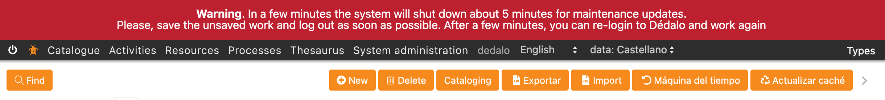
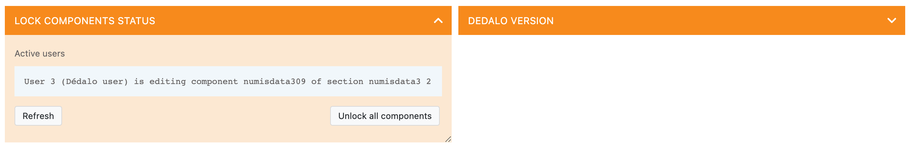
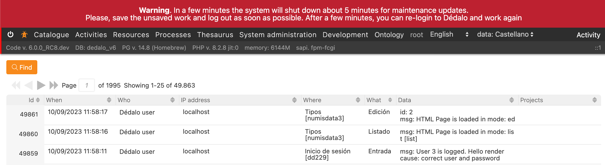
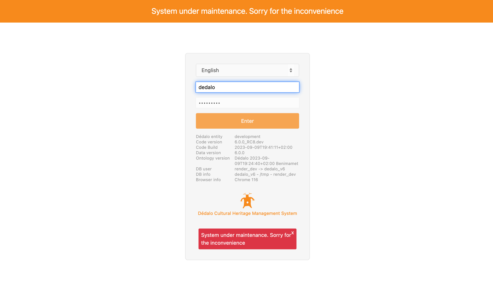

# Maintenance mode

### Temporarily disable Dédalo access to the user interface

Before a new installation or database upgrade of Dédalo server, it is highly recommended to change the Dédalo state to "maintenance" to prevent data changes, conflicts or user interaction with the new features before it is ready.

Maintenance state close the login to all user including general administrator and it is only possible to enter the working system using the root user.

## Alert to users

When Dédalo switches to maintenance, all user sessions will be deleted and if the system has any registered users, the user will not be able to save their work. To avoid losing your work, you will need to alert all users before switching to maintenance mode.

To alert to users follow this steps:

1. Locate the config.php file in your Dédalo installation, it is stored in the `/config` directory

    ```shell
    cd /httpdocs/dedalo/config/
    ```

2. Edit the config.php file, you can use a vim, nano or other text editor.

    ```shell
    nano config.php
    ```

3. Locate the [`notice_to_active_user`](../config/config.md#notice-to-active-users) at the end of the config file and change the `$notice` variable with the message:

    ```php
    $notice = '<b>Warning</b>. In a few minutes the system will shut down about 5 minutes for maintenance updates. <br>
    Please, save the unsaved work and log out as soon as possible.
    After a few minutes, you can re-login to Dédalo and work again';
    // notice_to_active_users(array('msg'=>$notice, 'mode'=>'warning'));
    ```

4. Uncomment the call to activate the notification

    ```php
    $notice = '<b>Warning</b>. In a few minutes the system will shut down about 5 minutes for maintenance updates. <br>
    Please, save the unsaved work and log out as soon as possible.
    After a few minutes, you can re-login to Dédalo and work again';
    notice_to_active_users(array('msg'=>$notice, 'mode'=>'warning'));
    ```

    Save the config file and Dédalo will show the notice.

All users will see the message in all Dédalo pages:



When the user see this alert the user can save his work and logout. Dédalo will work normally.

You can check what users are active in the Maintenance panel "lock components status" (press the `Refresh` button to show changes)



and we recommended check the activity section:



The first rows will be the last users actions.

## Changing to maintenance mode

To change the Dédalo status to maintenance follow this steps:

1. Locate the config.php file in your Dédalo installation, it is stored in the `/config` directory

    ```shell
    cd /httpdocs/dedalo/config/
    ```

2. Edit the config.php file, you can use a vim, nano or other text editor.

    ```shell
    nano config.php
    ```

3. Locate the [`DEDALO_MAINTENANCE_MODE`](../config/config.md#defining-maintenance-mode) constant at the end of the config file and chagne it to `true`

    ```php
    define('DEDALO_MAINTENANCE_MODE', true);
    ```

    ??? note "Returning to normal state"
        To revert to normal state set the DEDALO_MAINTENANCE_MODE to `false`.

    Save the config file and Dédalo will enter in maintenance mode.

    When DEDALO_MAINTENANCE_MODE is active, all user sessions will be deleted and users will be automatically logged out and unable to log in. Only the root user will be able to log in.

    
