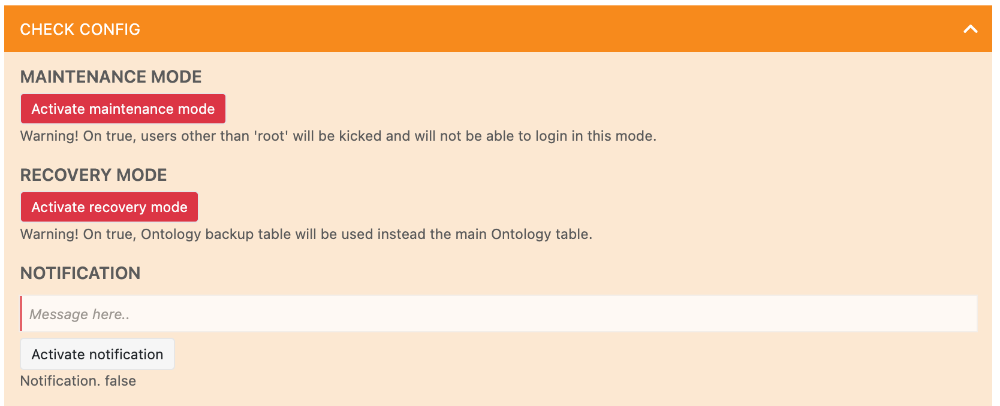
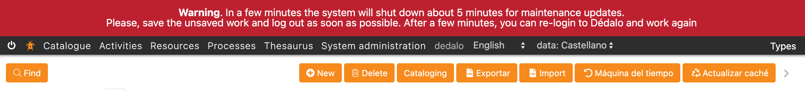
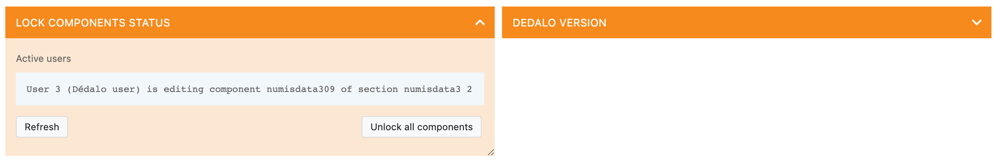
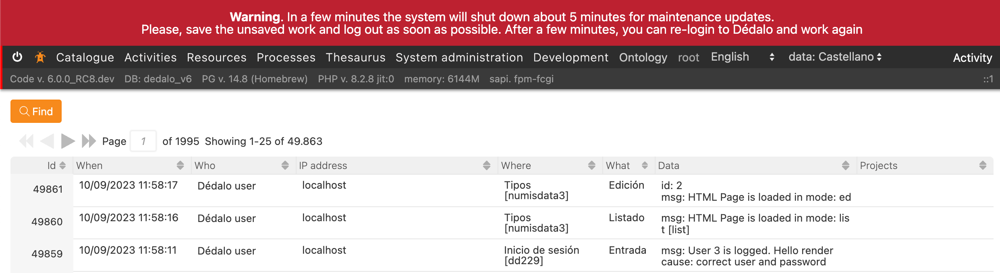
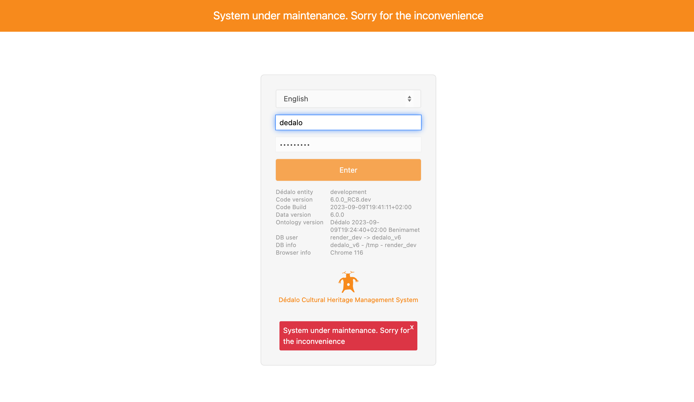

# Maintenance mode

> See also: [Management and maintenance](index.md) · [Updates](updates/index.md)

Before a new installation or a database upgrade of the Dédalo server, it is highly recommended to change the Dédalo state to "maintenance". This prevents data changes, conflicts and user interaction with new features before they are ready.

Maintenance state closes login to all users, including general administrators; only the root user can enter the work system.

The `set_maintenance_mode` and `set_notification` actions (`check_config`
widget, `src/core/area_maintenance/widgets/check_config.ts`) persist to the
server's own `../private/ts_state.json` (`setServerState()` in
`src/core/resolve/server_state.ts`). Enforcement lives in `login()`
(`src/core/security/auth.ts`): while `maintenance_mode` is `true` in
`ts_state.json`, every non-superuser login is refused with "Server under
maintenance. Please try again later." — only `section_id = -1` (root)
passes. The server does not actively delete existing sessions when
maintenance mode is switched on; already-logged-in non-root users keep their
session until it expires or they log out.

## Alert to users

Switching to maintenance mode does not force-close existing sessions today: any logged-in user keeps working until their session ends. To avoid a user losing work when a session does end mid-maintenance, alert all users before switching to maintenance mode.

The `set_notification` action works the same way as maintenance mode: it
writes the `check_config` widget's `notification` field to `ts_state.json`
— a string message, or `false`/empty to disable it.

To alert users, follow these steps:

1. Log in as `root`

2. Go to the maintenance, and locate the `Check config` panel.

    

3. Set an alert notification for the users.

    Write something like:
    "The system will shut down in a few minutes for maintenance updates. Please save any unsaved work and log out as soon as possible."

4. Click `Activate notification` to set the alert.

??? note "Doing it without the UI (advanced)"

    The user notification is runtime **state**, not configuration. The
    `Activate notification` button writes to `../private/ts_state.json` for
    you (and clears the field when you deactivate it), via `setServerState()`
    in `src/core/resolve/server_state.ts`.

    If you must set it headlessly (e.g. recovery, no UI access), you can edit
    the file directly — but note it is normally machine-written, so the UI is
    the supported path. The notification value is a plain string (or `false`
    to disable it):

    ```json
    // ../private/ts_state.json
    { "notification": "The system will shut down shortly for maintenance updates — please save your work and log out." }
    ```

All users will see the message in all Dédalo pages:



When the user see this alert the user can save his work and logout. Dédalo will work normally.

You can check what users are active in the Maintenance panel "lock components status" (press the `Refresh` button to show changes) — served by `dispatchLockComponentsActions` (`get_active_users`/`force_unlock_all_components`) in `src/core/area_maintenance/widgets/lock_components.ts`.



and we recommended check the activity section:



The first rows will be the last users actions.

## Changing to maintenance mode

To change the Dédalo status to maintenance follow this steps:

1. log in as root.

2. Go to the maintenance panel, and locate the `Check config` panel.

    

3. Click the `Activate maintenance mode` button.

    This writes `maintenance_mode: true` to `../private/ts_state.json`.

??? note "Doing it without the UI (advanced)"

    Maintenance mode is runtime **state**, not configuration. The `Activate
    maintenance mode` button writes to `../private/ts_state.json` for you
    (and sets it back when you deactivate).

    If you must toggle it headlessly (e.g. recovery, no UI access), you can
    edit the file directly — but note it is normally machine-written, so the
    UI is the supported path:

    ```json
    // ../private/ts_state.json
    { "maintenance_mode": true }
    ```

While maintenance mode is active, non-superuser logins are refused and users are unable to log in. Only the root user is able to log in. Sessions already open when maintenance mode is switched on are not force-closed — only new login attempts are gated.



