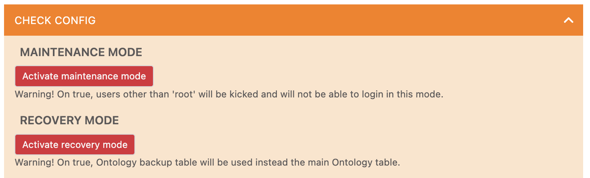
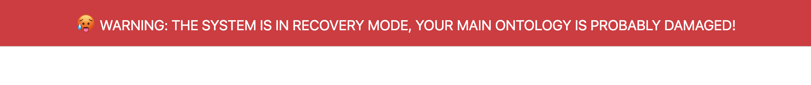
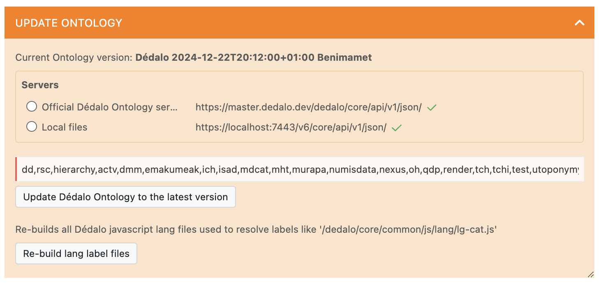
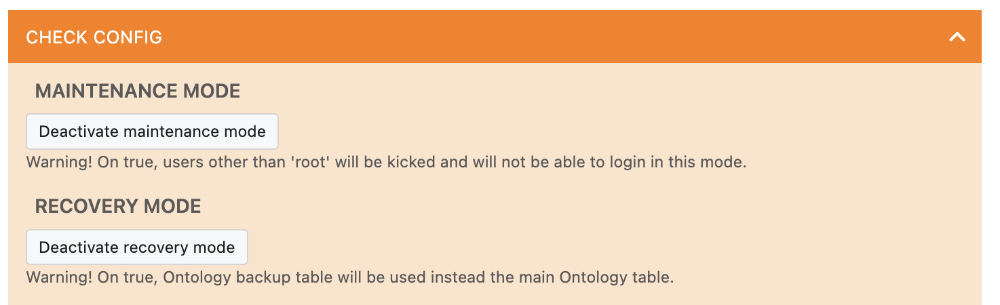

# Recovery mode

The Dédalo Ontology is the core of the application. If it is damaged or misconfigured for any reason, it can cause the application to crash and the administrator will not have the working interface to fix it.
For these cases, Dédalo implements a special mode called "recovery mode" that bypasses the current ontology definition with a minimal emergency version that is enough to accomplish technical administrative tasks.

## Activate recovery mode

!!! The Recovery status is saved in config_core file as: `define('DEDALO_RECOVERY_MODE', true);`

#### 1. From area maintenance
If you have access to area maintenance panel, you can activate recovery mode from `Check config' tab.



#### 2. Forcing from URL
If yo do not have access to Area admin panel, you can force the recovery mode building a URL with the recovery key as parameter, like:

`https://mydomain/dedalo/core/page/?tipo=dd88&recovery=MyRecoveryKey`

To allow force recovery mode, you must have access to the configuration file and set the DEDALO_RECOVERY_KEY to a safe value like:
```php
    // recovery
	// DEDALO_RECOVERY_KEY. If a URL recovery param is received as ?recovery=XXX
	// will be matched whit this value (do not use '?' symbol in value)
	define('DEDALO_RECOVERY_KEY', '8W#er7S4-!ujdkP45pief*Ojd4@9QwaG');
	// DEDALO_RECOVERY_MODE. boolean
	$_ENV['DEDALO_RECOVERY_MODE'] = defined('DEDALO_RECOVERY_MODE')
		? DEDALO_RECOVERY_MODE
		: false;
```

If the URL code matches the config DEDALO_RECOVERY_KEY, or you press the button 'Activate recovery mode' from the panel, the browser will show the recovery mode warning at top:



## Using recovery mode

In this mode, a special table `jer_dd_recovery` is used instead default table (`jer_dd`) to define the Ontology with a basic configuration for administration tasks.
Use it only to access the area maintenance and not to access working areas or to make changes in sections.
In this area, you can view the current status of the Ontology and code and fix the problems, probably by updating the damaged Ontology from a master server such as:



## Deactivate recovery mode

Once your ontology is fixed and secure, you must deactivate the recovery mode using the button in the 'Check configuration' zone of the 'Maintenance' area, and log out and log in again to Dédalo.


