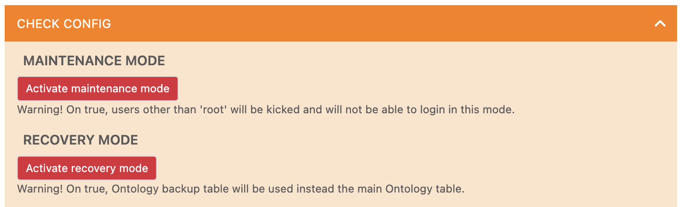
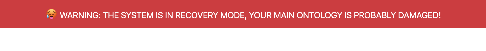
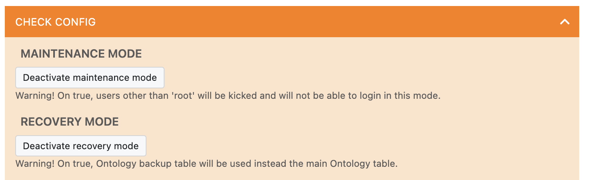

# Recovery mode

> See also: [Management and maintenance](index.md) · [Updating ontology](updates/updating_ontology.md)

The Dédalo Ontology is the core of the application. If it is damaged or misconfigured for any reason, it can cause the application to crash and the administrator will not have the working interface to fix it.

Dédalo has a `recovery_mode` flag (`set_recovery_mode` in the `check_config`
widget, persisted to `../private/ts_state.json` via `setServerState()` in
`src/core/resolve/server_state.ts`) that, when set, shows a recovery-mode
banner across the interface so administrators know the installation is in a
degraded state.

!!! warning "Gap: the flag does not swap the served ontology"
    Setting `recovery_mode` shows the banner, but nothing on the read path
    currently swaps ontology serving over to a minimal emergency table —
    there is no live "boot into a bare ontology" mode today. What does exist
    is a separate **snapshot safety net**: `build_recovery_version_file` and
    `restore_dd_ontology_recovery_from_file` (the `build_database_version`
    widget, `src/core/ontology/recovery_file.ts`) dump a whitelisted-TLD slice
    of `dd_ontology` to `install/db/dd_ontology_recovery.sql.gz` and can
    restore it into a `dd_ontology_recovery` table — a snapshot the
    [ontology update](updates/updating_ontology.md) flow leans on, not a table
    the server ever reads from directly. Merging a restored snapshot back into
    the live `dd_ontology` is a manual database operation.

## Activate recovery mode

If you have access to the area maintenance panel, you can activate recovery mode from the `Check config` tab.

Press the button to toggle `recovery_mode` in `../private/ts_state.json`; the
recovery-mode banner appears immediately for every user:

## Deactivate recovery mode

Once your ontology is fixed and secure, deactivate the recovery mode using the button in the 'Check configuration' zone of the 'Maintenance' area, and log out and log in again to Dédalo.

