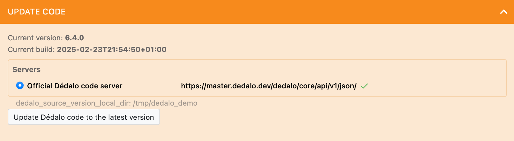
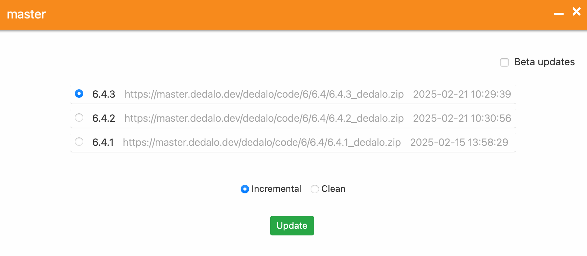
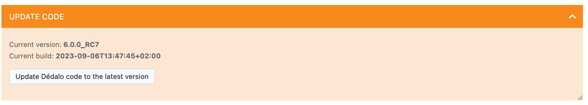
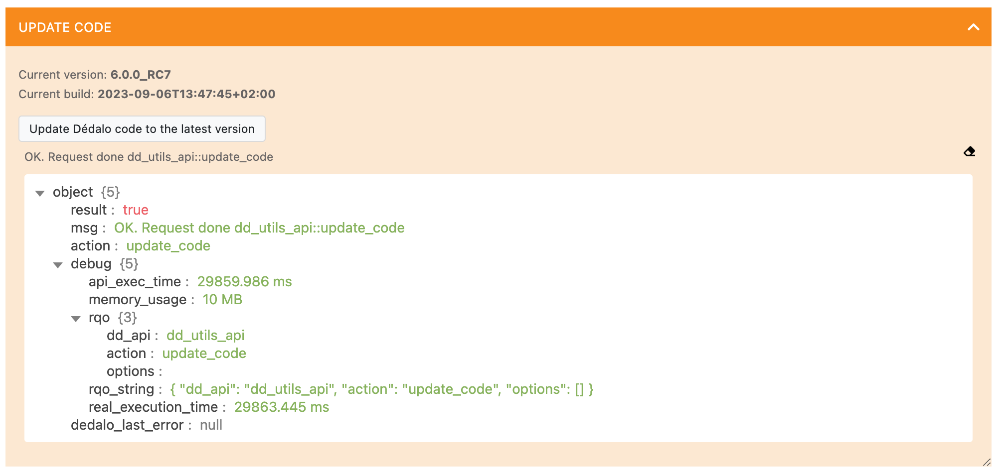
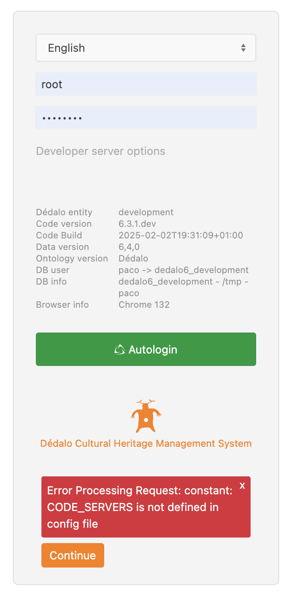

# Updating code

Dédalo v6 is an active, rapidly developing software project. It is, therefore, important to keep it updated and in best condition for stability and safety reasons.

This guide is focused into update process of minor, fixes and patches of version 6. Major updates v4 to v5, v5 to v6 has his own dedicate guides.

!!! info "Migration from Dédalo v5"
    If you want to switch to Dédalo v6 from previous release, Dédalo v5, please refer to the dedicated [migration guide](../../update_v5/update_from_v5.md) that will explain all the differences between these two releases and help you make the switch.

The update process is based in the Dédalo cadence numeration, it's a incremental process and sometimes it depends of the ontology version. Update the ontology previously to update Dédalo code following this [guide](updating_ontology.md).

Update Dédalo code will need a control by IT team. The update is automatic but some changes as changes into config files will need changed manually because the update process can not change your specific configuration.

!!! warning "Update pre-production system and test before update new versions into production system"
    Is highly recommended to test your new Dédalo installation before deploying the changes into the production environment. This will help ensure that the update will not have a negative impact on your catalogue.

Dédalo could be updated using the integrated update code widget that update [automatic](#automatic-update-tasks) or you can do it [manually](#updating-manually).

## Automatic update tasks

1. Closing the access to work system.

    Before update the code, is highly recommended change Dédalo status to maintenance. Follow [this guide](../maintenace_status.md) to change the Dédalo status and disable Dédalo access.

2. Enter into maintenance panel.

    Login as root user and go to Maintenance panel, it is located into:
    > System administration -> Maintenance

    1. **Optional** make a backup of the database

        Is highly recommended to create a backup before update Dédalo code. You can follow [this guide](../backup.md#backup-the-work-system) to create a backup of the database

3. Locate "Update code" control panel"

    1. Version >= 6.4.0
        In the panel, choose the server to obtain the code, by default, the panel show official Dédalo server, but is possible configure other mirrors or providers in [CODE_SERVERS](../../config/config.md#defining-server-code-provider) in `config.php`

        

        Press the "Update Dédalo code"

        and choose the version that you want.

        

        and select if you want [Incremental](updating_code_options.md/#incremental) or [clean](updating_code_options.md/#clean)
        press the `Update` button

    2. Version < 6.4.0
        In previous version to 6.4.0 the panel update directly to the latest version and the code is obtained from the server provider configured in [DEDALO_SOURCE_VERSION_URL](../../config/config.md#defining-source-version-uri) in `config.php`

        

        Press the button "Update Dédalo code to the latest version", wait and when the process will finessed will show the result.

        

    !!! warning "Re-login after update"
        Is important after updating the code, log out and log in to Dédalo to safely refresh the browser's cache files.

4. Check the changes into sample.config files

    Some code updates can change the config necessities and is necessary to add or remove manually. It will indicate into the "Check config" control panel.

    If you config need to be updated, open the sample.config and your equivalent config file that was indicated and add the new variable/s.

5. Follow the update instructions and update data.

    Locate the update code panel and check if the panel indicate some instructions to do. Some code updates has data process or changes into the files and configuration.

    Follow the specific instructions and [update data](updating_data.md)

6. Open the access to work system.

    Revert the maintenance status to `false`

7. Logout and re-login with a normal user.

## Updating manually

A typical Dédalo installation use a vhost of a GNU/Linux user with a directory structure similar to:

```bash
├── home
│    ├── dedalo_user
│    │    ├── sessions
│    │    ├── httpdocs
│    │    │    ├── dedalo
│    │    │    │    ├── config/
│    │    │    │    ├── core/
│    │    │    │    ├── docs/
│    │    │    │    ├── .editorconfig
│    │    │    │    ├── favicon.ico
│    │    │    │    ├── .gitignore
│    │    │    │    ├── .htaccess
│    │    │    │    ├── index.php
│    │    │    │    ├── install/
│    │    │    │    ├── .jshintrc
│    │    │    │    ├── lib/
│    │    │    │    ├── License.md
│    │    │    │    ├── media/
│    │    │    │    ├── publication/
│    │    │    │    ├── Readme.md
│    │    │    │    ├── shared/
│    │    │    │    ├── stub.php
│    │    │    │    ├── test/
│    │    │    │    ├── tools/
│    │    │    │    └── Updates.md
│    │    ├── backups
│    │    │    ├── code/
│    │    │    ├── db/
│    │    │    ├── mysql/
│    │    │    ├── ontology/
│    │    │    └── temp/
│    │    └── logs/
```

**Where:**

* `dedalo_user` is the GNU/Linux user home directory and the PHP user (defined in the PHP-FPM pool).
* `httpdocs` is the Document directory of the Apache HTTP server (the public virtual host).
* `dedalo` is the Dedalo code directory.

Please note that `sessions`, `backup`, and `logs` are located outside of `httpdocs` and are not accessible to Apache.

Adapt the following tasks to your own virtual host directory structure.

1. Close Dédalo installation and put it in maintenance mode.

    Before update the code, is highly recommended change Dédalo status to maintenance. Follow [this guide](../maintenace_status.md) to change the Dédalo status and disable Dédalo access.

2. Move your current installation. You can use the `backups/code` directory.

    ```bash
    cd /home/dedalo_user
    mv httpdocs/dedalo backups/code/dedalo_old
    ```

3. Download the latest stable version:

    ```shell
    sudo wget https://github.com/renderpci/dedalo/archive/master.zip
    ```

    Or you can choose another release from [GitHub releases list](https://github.com/renderpci/dedalo/releases)

4. Copy the release files into the **dedalo** directory inside **httpdocs** and unzip and rename it

    ```shell
    sudo unzip master.zip
    sudo mv dedalo-master dedalo
    ```

5. Set the permissions of the 'dedalo' directory according to your Apache and PHP-FPM settings.

6. Copy your config files into the new installation

    ```shell
    cd /home/dedalo_user
    cp backups/code/dedalo_old/config/config.php httpdocs/dedalo/config/config.php
    cp backups/code/dedalo_old/config/config_db.php httpdocs/dedalo/config/config_db.php
    cp backups/code/dedalo_old/config/config_core.php httpdocs/dedalo/config/config_core.php
    cp backups/code/dedalo_old/config/config_areas.php httpdocs/dedalo/config/config_areas.php
    ```

7. Copy your **media** directory to the new installation

    ```shell
    cd /home/dedalo_user
    cp backups/code/dedalo_old/media httpdocs/dedalo/media
    ```

    **Optional:**, If you don't have too much space, you can move `media` directory:

    ```shell
    cd /home/dedalo_user
    mv backups/code/dedalo_old/media httpdocs/dedalo/media
    ```

8. Check the changes into sample.config files

    Some code updates can change the config necessities and is necessary to add or remove manually. It will indicate into the "Check config" control panel.

    If you config need to be updated, open the sample.config and your equivalent config file that was indicated and add the new variable/s.

9. Follow the update instructions and update data.

    Log-in with root user into Dédalo and go to maintenance panel.

    Locate the update code panel and check if the panel indicate some instructions to do. Some code updates has data process or changes into the files and configuration.
    Follow the specific instructions and [update data](updating_data.md)

10. Open the access to work system.

    Revert the maintenance status to `false`

11. Logout and re-login with a normal user.

## Issues

Some times the update process will ask you to log-out and log-in to set the correct files and update the browser cache. In some cases the update is unfinished and some config variables are not assigned, in those cases the login can show an alert as error.



Don't panic and press `continue` button. Navigate to the area maintenance and check the messages in the `Update data` or `Check config` panels about the errors.