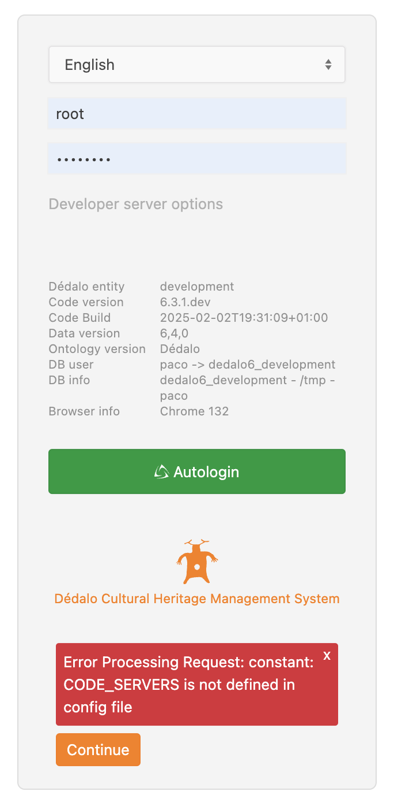

# Updating code

> See also: [Updating ontology](updating_ontology.md) · [Updating data](updating_data.md) · [How a code update works](updating_code_options.md)

Dédalo is an active, rapidly developing software project. It is therefore important to keep it updated and in good condition for stability and security reasons.

There are two ways to update the server's code: the maintenance-panel **self-update** (below), driven by a configured code server, and a **manual** `git pull` (see [Updating manually](#updating-manually)). Both operate on this install's own tree — there is no separate install they delegate to.

The update process is based on the Dédalo cadence numbering. Versions are installed step by step — the updater refuses to skip **any** version, patch releases included: the only target it accepts is the very next rung — and a code version sometimes depends on the ontology version. Update the ontology before updating the Dédalo code, following [this guide](updating_ontology.md).

Updating the Dédalo code should be supervised by the IT team. Some changes — such as **new configuration settings** — must be applied manually in `../private/.env`, because neither update path touches your configuration.

!!! warning "Update pre-production system and test before update new versions into production system"
    Is highly recommended to test your new Dédalo installation before deploying the changes into the production environment. This will help ensure that the update will not have a negative impact on your catalogue.

## Panel self-update

The "Update code" maintenance panel (`update_code` widget,
`src/core/area_maintenance/widgets/update_code.ts`) downloads a release
archive from a configured code server, verifies its sha256 checksum,
pre-validates every archive entry, extracts it into a quarantine directory,
installs its dependencies and boot-tests it **there**, and only then swaps it
onto the live tree — never over the live tree directly. The swap is always a
clean, rename-based replacement with the previous tree kept as a backup; see
[How a code update works](updating_code_options.md) for the phases, the
safety gates and the rollback contract.

!!! info "A release is installed only against a declared checksum"
    Every release the code server advertises carries the sha256 of its archive,
    and the update refuses outright if that checksum is missing, malformed, or
    does not match the bytes received. An archive that cannot be verified is
    never extracted.

It requires a process supervisor (systemd, Docker, pm2, …) so the
server can restart itself onto the new code: set `DEDALO_SUPERVISED=true`, or
run under a supervisor that sets `INVOCATION_ID`/`JOURNAL_STREAM`
(systemd does this for you). Without a detected supervisor the update
refuses rather than risk a self-exit with nothing to restart it.

The update **refuses to start** — it does not merely warn — unless the operator
is the superuser (`root`), the server is in **maintenance mode**, and a
**recent database backup** exists. The backup requirement can be waived only by
an explicit `waive_backup: true` in the update request (there is no panel
control for it), and every waiver is logged loudly in the server log. It also
refuses, without changing anything, on a number of unsafe situations — runtime
data inside the code tree, an unaccounted file at the tree root, a
containerised (image) deployment, a Bun version mismatch, a failed dependency
install or pre-flight boot of the new tree; see
[How a code update works](updating_code_options.md#what-else-makes-the-update-refuse).

### What the panel tells you before you start

Opening the panel shows the installation's own status, so the answer to "can
this install take an update?" comes **before** the button, not from a failed
run:

- **This installation** — the running version, whether it is a release build
  or a development checkout, the release's build date and commit, the code
  tree and the backup root.
- **Update readiness** — one line per condition the update actually refuses
  on, each marked *ok*, *warning* or *blocked*, with the reason: supervisor
  detected, deployment channel, maintenance mode, superuser identity, recent
  database backup, backup root outside the code tree, runtime data outside the
  code tree, the archive tools, the Bun version pin, a leftover staging
  directory, and the free disk space where the update stages. The panel is *ready* only when nothing is blocked.
- **Last code update** — which version replaced which, when, and whether the
  new tree confirmed itself at boot. A status still reading *pending
  confirmation* means the update did not complete its own health check.
- **Restore points** — the code backups on disk, each marked *bootable* or
  *incomplete* (a backup without its dependencies cannot be started again).

Some readiness lines cannot be decided in advance and say so rather than
guessing: the release's own root file list and its Bun pin are only known once
the archive has been downloaded, and how much disk an update needs is measured
when it starts (walking the whole tree is too slow for a panel). For those the
panel reports the inputs — the count of root entries in the live tree, the
running Bun and this tree's pin, and the bytes free where the update stages.

!!! warning "When a release changes the Bun version"

    The update **refuses** — without changing anything — if the release pins a
    different Bun than the one this server is running. Install the pinned Bun on
    the machine first, restart Dédalo onto it, and only then apply the update:

    ```bash
    # the version the release pins is shown in the panel's readiness list
    curl -fsSL https://bun.sh/install | BUN_INSTALL=$HOME/.bun bash -s bun-v1.4.0
    ```

    Then point the service at that binary (`ExecStart`, see the production
    guide), restart, and confirm the boot line reads
    `starting on Bun 1.4.0 (pinned: 1.4.0)` with no mismatch warning.

1. Close access to the work system.

    Change the Dédalo status to maintenance — the update refuses to run otherwise. Follow [this guide](../maintenance_status.md) to change the Dédalo status and disable Dédalo access.

2. Enter the maintenance panel.

    Log in as root user and go to the Maintenance panel, located in:
    > System administration -> Maintenance

    Make a backup of the database first — the update refuses without a recent one. Follow [this guide](../backup.md#backup-the-work-system).

3. Locate the "Update code" control panel.

    Choose the server to obtain the code. By default, the panel shows the official Dédalo server, but you can configure other mirrors or providers via `CODE_SERVERS`, set in `../private/.env` (see the [Configuration Administrator Guide](../../config/administration.md)).

    Press "Check available updates", choose the version you want, and press `Update`. The panel then shows the pipeline's phase track (download → verify → extract → deps → preflight → swap → restart → health) while the update runs; the server restarts itself during the `restart` phase and the panel polls its health endpoint until the new version answers.

    Confirm success by **both** the engine version and the build stamp changing in the panel's readout — the build stamp is the release's commit date, so an unchanged stamp means old code is still running.

    !!! warning "Re-login after update"
        After the update the panel prompts for a reload: the browser still holds the previous client code, and only logging in again loads the new one. If you dismiss the prompt, a persistent "Reload required" note with its own button remains.

4. Check for new settings.

    Some code updates add or change configuration settings; the "Check config" control panel flags these. Settings live in `../private/.env` — compare it against `../private/sample.env` and add any new key(s). See the [Configuration Administrator Guide](../../config/administration.md).

5. Follow the update instructions and update data.

    Locate the update code panel and check if it indicates further instructions. Some code updates require a data process; follow [update data](updating_data.md).

6. Open access to the work system.

    Revert the maintenance status to `false`.

7. Log out and re-login with a normal user.

## Running a code server

A Dédalo install can publish releases for other installs — the official server,
or an institution's own mirror. Set in `../private/.env` (see the
[Configuration Administrator Guide](../../config/administration.md)):

| Setting | Purpose |
|---|---|
| `IS_A_CODE_SERVER` | Answer release manifests at all. Without it every request is refused. |
| `DEDALO_CODE_FILES_DIR` | Where release archives are stored, `<major>/<major.minor>/<version>.zip`. |
| `DEDALO_CODE_SERVER_GIT_DIR` | A git checkout of the engine, only needed to BUILD releases. A pure mirror does not need it. |
| `CODE_SERVERS` | Must include this server's own entry: the `code` in it is the shared secret a caller has to present. |
| `DEDALO_CORS_ALLOWED_ORIGINS` | The origins allowed to read the manifest. Each client fetches it **from the browser**, so without this the update panel of every remote install fails with a network error. Use `*` for a public master. |

### What the panel tells a code server

On a code server the panel adds a second status block, answering whether this
instance can publish at all:

- **Code server** — the role flag, the two directories, and whether the build
  itself would be accepted, checked through the same planner the Build buttons
  use. Also whether a `master` ref exists (only a `master` build claims the
  published release name), whether the worktree is clean, and whether an
  archive of it carries symbolic links.
- **Build source** — the commit, its date and the branch currently checked
  out, plus the checkout's Bun pin.
- **Release ref** — the ref a *published* release is actually built from
  (`master`), its own commit and date, and how many commits the checked-out
  branch has that it does not. Every check in the first block reads this ref,
  not the checked-out branch, and each says so ("checked against master").
- **Published releases** — every archive already on disk with its size and
  date, marked *published* or *developer*, and flagged when its `.sha256`
  sidecar is missing (without it a remote install has no digest to verify).
- **Offered to an installation at this version** — the release list a remote
  install would actually receive. This is not the same as the archives on
  disk: a version is offered only when it is the next step of the upgrade
  path, so a perfectly good archive can be present and still not be offered.
  The panel shows both so the difference is visible rather than inferred.

!!! warning "A dirty worktree does not stop a build"
    A release archives the **committed** `HEAD` of the configured checkout.
    Uncommitted changes are simply absent from the archive, which is why the
    panel marks a dirty worktree as a warning before you press Build.

!!! warning "The checks read the release ref, not your branch"
    Work committed on a working branch is not in a release until it is merged
    into the release ref. Until then the publish checks keep reporting the old
    state — correctly, because that is what a release built now would contain.
    The panel names the ref on every such line, and counts the commits the
    release ref is missing, so a check that looks like a false alarm can be
    told apart from a real one.

!!! warning "An archive with symbolic links cannot be installed"
    The installer refuses an entire archive that contains a symbolic-link
    entry. If the panel marks this blocked, releases built from this checkout
    will be refused by every install that downloads them — exclude those paths
    from the archive (`export-ignore` in `.gitattributes`) before publishing.

### Building a release

On a code server, the "Update code" panel shows two extra buttons, "Build
master release" and "Build developer release". Each archives a branch of the
configured git checkout at the engine's **current version**. A build of the
`master` branch writes the published release name; a build of any other branch
gets a `-dev` suffix, so it can never overwrite the published master release
of the same version:

```
<DEDALO_CODE_FILES_DIR>/<major>/<major.minor>/<version>.zip        (master)
<DEDALO_CODE_FILES_DIR>/<major>/<major.minor>/<version>-dev.zip    (any other branch)
```

Each archive is written together with its `.sha256` sidecar — that sidecar is
what remote installs verify against; keep the two files together, because an
archive without its sidecar cannot be installed.

!!! note "Developer builds are only offered when both sides ask for them"
    A `-dev` archive is never offered to an install that did not ask for one.
    Two switches must be on: this code server must set
    `DEDALO_CODE_SERVER_DEV_CHANNEL=true`, and the receiving install must tick
    **Developer builds** in its own "Update code" panel. A code server that
    leaves the setting unset answers a developer-channel request exactly as it
    answers a normal one. The archive is served at its own URL either way
    (`/dedalo/install/code/<version>/<version>-dev.zip`).

### Testing branch work on a real installation

A developer build carries **no version bump** — it is the same version as the
release it was branched from. That is deliberate: a version number that moves
without a release stops naming a release. So a developer build is installed
*over* the same version, and it can be installed again as often as the branch
moves.

The receiving install ticks **Developer builds**, checks for updates, and picks
the build (marked as a developer build, and listed first). Everything else is
the ordinary update: superuser, maintenance mode, a recent backup, the same
`.sha256` verification, the same backup, smoke boot, swap and rollback.

Because the version cannot move, the panel does **not** use it to tell you the
update landed. Each installed tree records the archive it came from, and the
panel shows it as **Installed archive** — that value changing is the proof, and
it is also what the rollback machinery compares. An install running a developer
build says so everywhere: its version reads `<version>.dev` and its build
posture is *Developer build (unreleased branch code)*.

!!! warning "Not for production installations"
    A developer build is unreleased branch code. Use it to test development
    work on an installation you can afford to break — never on a production
    one.

### Serving a release

The server publishes each archive at
`/dedalo/install/code/<version>/<version>.zip` (and its digest at the same URL
plus `.sha256`), mapping the request back to `DEDALO_CODE_FILES_DIR`. Only that
release's own files are reachable, and only while `IS_A_CODE_SERVER` is set —
so the storage directory does not have to sit in the web root, and should not.

!!! note "A built release is not automatically offered"
    A release is advertised only when the engine's update catalogue knows the
    target version, and only to callers for which it is the next step on the
    upgrade path. Building an archive publishes the file; it does not make every
    install eligible for it.

## Updating manually

For most installs, the simplest and most predictable update is manual:

```bash
git pull
bun install --frozen-lockfile
# restart the server (however your process supervisor does it), e.g.:
systemctl restart dedalo
```

Boot migrations (`install/db/migrations/`) run automatically at startup — there
is nothing extra to run for schema changes to `dedalo_ts_*` tables. Your
per-install configuration and secrets live in `../private/`, a sibling of the
install tree, so a `git pull` never touches it.

The Bun runtime itself is pinned per install (`.bun-version`); a code update
does not upgrade it. Upgrading Bun is a deliberate, separately-tested change.

1. Close access to the work system (maintenance mode, as above).
2. `git pull` (or check out the release tag you want) and
   `bun install --frozen-lockfile`.
3. Restart the server process.
4. Check for new settings: compare `../private/.env` against the shipped
   `../private/sample.env` and add any new key(s). See the
   [Configuration Administrator Guide](../../config/administration.md).
5. Follow any update instructions and [update data](updating_data.md) if the
   release requires it.
6. Open access to the work system again.
7. Log out and re-login with a normal user.

## Issues

Sometimes the update process asks you to log out and log in to set the correct files and refresh the browser cache. In some cases the update is left unfinished and some config variables are not assigned; the login may then show an alert as an error.



Don't panic and press `continue` button. Navigate to the area maintenance and check the messages in the `Update data` or `Check config` panels about the errors.
