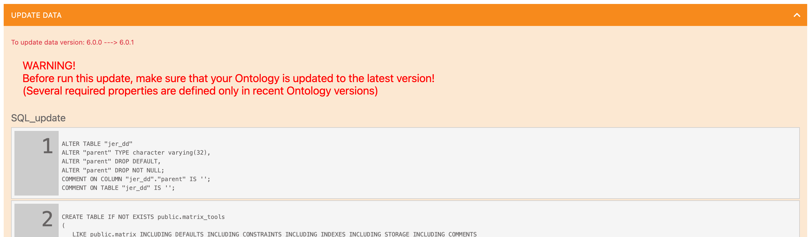
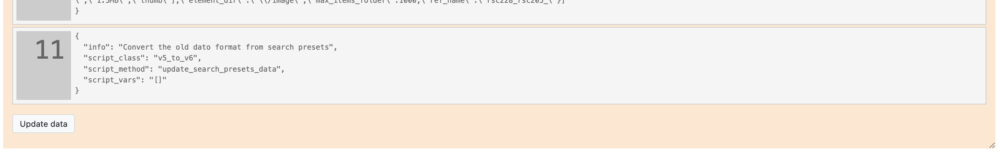
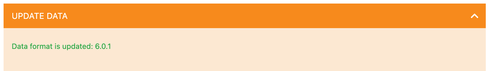

# Updating data

Data is the most important part of the Dédalo projects. Data, in Dédalo, has a abstraction layer and it depend of the Ontology definition. Some times the abstraction layer change or the global definitions need add some new or change the data structures. In those cases data need to be to be updated. Besides, some times the database schema need to be updated or the indexes need to be adjusted. All these changes are in the same update data process.

Updating data is the most delicate update process and it's mandatory to create a backup of your database before update it.

Not all code updates has implicit a data update. They updates process are independent, but data has a global dependency of Ontology and code version, so, some code updates will has a data update.

## Updating tasks

1. Closing the access to work system.

    Before update the data, is mandatory change Dédalo status to maintenance.
    Follow [this guide](../maintenace_status.md) to change the Dédalo status and disable Dédalo access.

    !!! danger "Inconsistences"
        If the work system is in a normal state instead a maintenance status and users change data when the data update process is running, data inconsistencies may arise.

2. Enter into maintenance panel.

    Login as root user and go to Maintenance panel, it is located into:
    > System administration -> Maintenance

3. Make a backup of the database

    Is mandatory to create a backup before update Dédalo data. You can follow [this guide](../backup.md#backup-the-work-system) to create a backup of the database.

    !!! danger "Corruption"
        The update process will change the database, any problem with the database, server or memory of HD failure can corrupt the database. A backup is mandatory to prevent data loses.

4. Update Ontology and Code

    Previous to update data is mandatory to update the ontology and code to the last versions:

    Follow [this guide](updating_ontology.md) to update ontology
    Follow [this guide](updating_code.md) to update code

5. Locate "Update data" control panel"

    If the code need a change in the database the update data control panel will show the task that is required:

    

    Read the list, and locate the last process

    

    When the system will ready press the button "Update data", wait and when the process will finessed will show the result.

    

6. Open the access to work system.

   Revert the maintenance status to `false`

7. Logout and re-login with a normal user.

Data updates could take time, specially in large installations.
