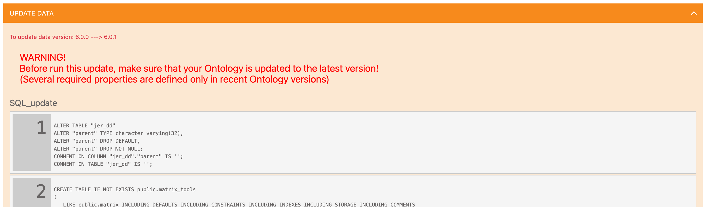
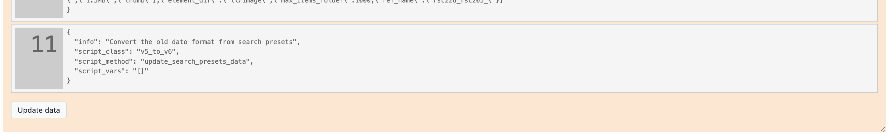
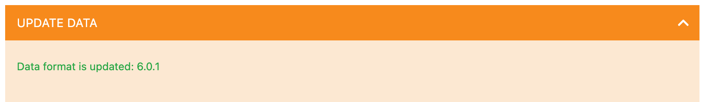

# Updating data

> See also: [Updating ontology](updating_ontology.md) · [Updating code](updating_code.md) · [Backup and restore](../backup.md)

Data is the most important part of a Dédalo project. In Dédalo, data has an abstraction layer and depends on the ontology definition. Sometimes the abstraction layer changes, or the global definitions need to add or change data structures; in those cases the data must be updated. The database schema may also need updating, or the indexes adjusting. All these changes happen in the same update-data process.

The "Update data" panel (`update_data_version` widget,
`src/core/update/engine.ts`) reports the real state: `current_version_in_db`
comes straight from the shared `matrix_updates` table, and the pending
`updates` list comes from this engine's own migration catalog
(`src/core/update/catalog.ts`) — currently empty for the 7.x line, so the
panel shows no pending migration today. When a release does ship a 7.x
migration, pressing "Update data" runs it for real against this server's own
database.

Updating data is the most delicate update process, and it is mandatory to back up your database before running it.

Not every code update implies a data update — the two processes are independent — but data depends on the ontology and code version, so some code updates do require a data update.

## Updating tasks

1. Close access to the work system.

    Before updating the data, it is mandatory to change the Dédalo status to maintenance.
    Follow [this guide](../maintenace_status.md) to change the Dédalo status and disable Dédalo access.

    !!! danger "Inconsistencies"
        If the work system is in a normal state instead of maintenance status and users change data while the data-update process is running, data inconsistencies may arise.

2. Enter the maintenance panel.

    Log in as root user and go to the Maintenance panel, located in:
    > System administration -> Maintenance

3. Make a backup of the database.

    It is mandatory to create a backup before updating Dédalo data. Follow [this guide](../backup.md#backup-the-work-system) to create a backup of the database.

    !!! danger "Corruption"
        The update process will change the database; any problem with the database, server, memory or disk can corrupt the database during the process. A backup is mandatory to prevent data loss.

4. Update ontology and code.

    Before updating data, update the ontology and code to their latest versions:

    Follow [this guide](updating_ontology.md) to update the ontology.
    Follow [this guide](updating_code.md) to update the code.

5. Locate the "Update data" control panel.

    If a migration is pending, the update data control panel shows the task that is required:

    

    Read the list, and locate the last process:

    

    When ready, press the "Update data" button, wait, and the result is shown when the process finishes.

    

6. Open access to the work system.

    Revert the maintenance status to `false`.

7. Log out and re-login with a normal user.

Data updates could take time, especially in large installations.
