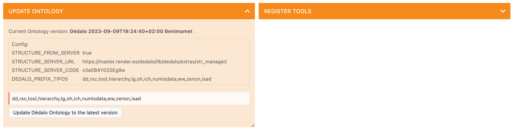
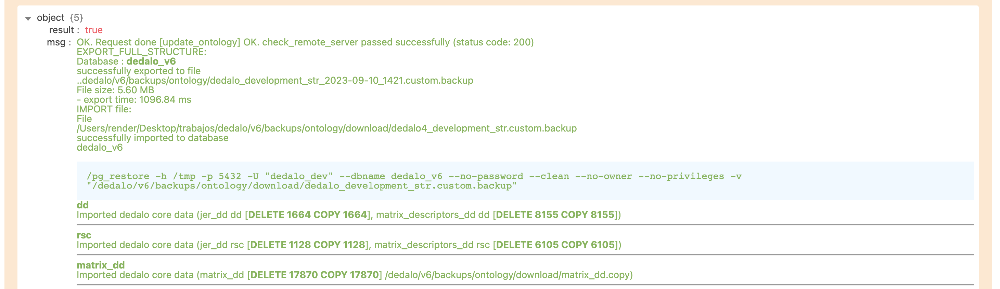

# Updating ontology

Dédalo ontology is the core of the application. Ontology control the data definition and how this data is interpreted. The ontology change some times every day. Updating ontology will ensure you that your Dédalo installation has the last definition.

In Dédalo v6 the ontology has been expanded with more rich definitions and the Dédalo behavior is more dependent of it.

The version of the ontology is controlled by the timestamp and construction location of the definition.

> Dédalo 2023-09-10T13:38:47+02:00 Benimamet

Ontology is build by different tld's. This tld's identify with part of the ontology is loaded and which parts will be updated.

## Shared and private ontologies

In your installation you could have a public and/or private tld's. Public tld's are common and shared definitions and it's updated by the main developer/users community.

Private tld's are not common or shared ontology parts and their are not maintained by main developers/ users community, but it can maintained by a specific institution or developer and shared by itself. Or it could be you own definition.

Some examples of common and shared tld's: `dd, rsc, oh, ich, tch, hierarchy, etc.`

Some examples of private tld's: `mupreva, qdp, muvaet, etc.`

The update process will replace all ontology definition to the last version, tld by tld, so the automatic process will see your configuration to update only the shared tld's.

Private tld will need to update manually.

Common and shared tld's are defined into the [config.php](../../config/config.md#defining-prefix-tipos) file.

## Update process

To update the shared ontology enter into the Maintenance panel in the System administration -> Maintenance and locate the update ontology control:

The control panel will show the ontology configuration and the tld's to be updated, it's possible change the tld's to be update changing the input field to add or remove the tld.

When you ready, press the "Update Dédalo Ontology to the latest version" button, and the process will executed.

Dédalo will erase all definition of the tld's specified and import the new definition.

All ontology updates will be backup into the directory:

> ../backups/ontology

!!! warning "Legacy Ontology versions considerations"
    Since 26-02-2024, master server returns freeze versions for the previous Dédalo code versions calls:   
    `>=6.1 -> Ontology (live) version path: / `  
    `Others -> Ontology (freeze) version path: /5 `
    
### doing the update process manually

Ontology is save tld by tld and you can update it coping the files located [here](https://github.com/renderpci/dedalo/tree/V5.8.0/install/import/ontology).
