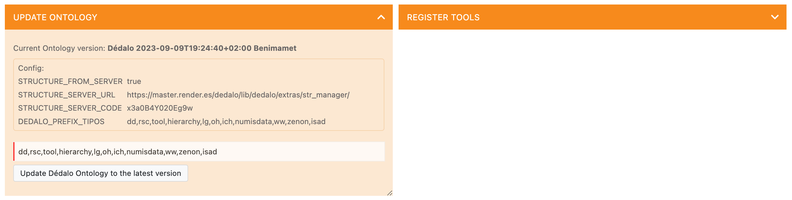
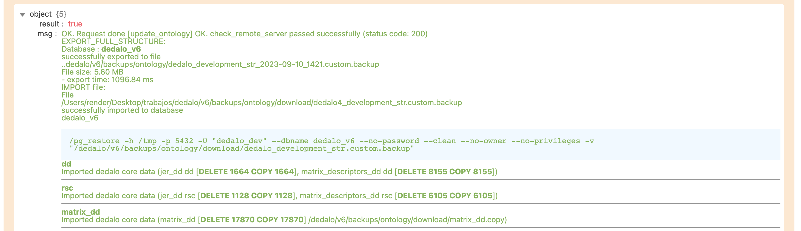

# Updating ontology

> See also: [Updating code](updating_code.md) · [Updating data](updating_data.md) · [Active ontology TLDs](../../config/config.md#defining-active-ontology-tlds)

The Dédalo ontology is the core of the application. It controls the data definition and how the data is interpreted. The ontology changes several times a day. Updating the ontology ensures that your Dédalo installation has the latest definition.

The ontology version is identified by the timestamp and the build location of the definition.

> Dédalo 2023-09-10T13:38:47+02:00 Benimamet

The ontology is built from different tlds. These tlds identify which part of the ontology is loaded and which parts will be updated.

## Shared and private ontologies

In your installation you could have public and/or private tlds. Public tlds are common and shared definitions and are updated by the main developer/user community.

Private tlds are not common or shared ontology parts and are not maintained by the main developer/user community, but can be maintained by a specific institution or developer and shared by itself, or be your own definition.

Some examples of common and shared tlds: `dd, rsc, oh, ich, tch, hierarchy, etc.`

Some examples of private tlds: `mupreva, qdp, muvaet, etc.`

The update process replaces the whole ontology definition with the latest version, tld by tld; the automatic process reads your configuration and updates only the shared tlds.

Private tlds must be updated manually.

Common and shared tlds are defined by `ACTIVE_ONTOLOGY_TLDS` (set in `../private/.env`). See the [Configuration Administrator Guide](../../config/administration.md).

## Update process

To update the shared ontology enter into the Maintenance panel in the System administration -> Maintenance and locate the update ontology control:

The control panel will show the ontology configuration and the tlds to be updated; it's possible to change the tlds to be updated by editing the input field to add or remove one.

When ready, press the "Update Dédalo Ontology to the latest version" button, and the process will execute.

Dédalo will erase all definitions of the specified tlds and import the new definition.

The import pipeline (`update_ontology` widget, `src/core/ontology/ontology_update.ts`) stages and validates every downloaded file before making any destructive change, takes a per-table recovery snapshot before importing each tld, and auto-restores that snapshot if the import fails partway through — an import either fully succeeds or fully rolls back, tld by tld. A schema-changes snapshot of the update is written under `../private/backups/ontology/changes/`.

### Doing the update process manually

The ontology is saved tld by tld; you can update it by copying the files located [here](https://github.com/renderpci/dedalo/tree/master/install/import/ontology).
