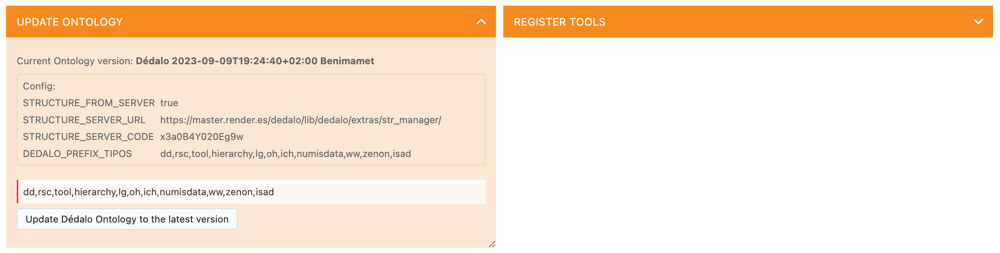
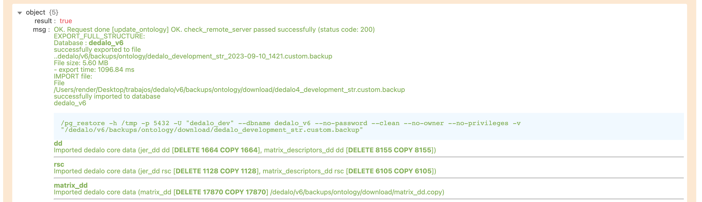

# Updating ontology

> See also: [Updating code](updating_code.md) · [Updating data](updating_data.md) · [Active ontology TLDs](../../config/config.md#defining-active-ontology-tlds)

The Dédalo ontology is the core of the application. It controls the data definition and how the data is interpreted. The ontology changes several times a day. Updating the ontology ensures that your Dédalo installation has the latest definition.

The ontology version is identified by the timestamp and the build location of the definition.

> Dédalo 2023-09-10T13:38:47+02:00 Benimamet

The ontology is built from different tlds. These tlds identify which part of the ontology is loaded and which parts will be updated.

## Shared and private ontologies

In your installation you could have public and/or private tlds. Public tlds are common and shared definitions and are updated by the main developer/user community.

Private tlds are not common or shared ontology parts and are not maintained by the main developer/user community, but can be maintained by a specific institution or developer and shared by itself, or be your own definition.

Some examples of common and shared tlds: `dd, rsc, oh, ich, tch, hierarchy, etc.`

Some examples of private tlds: `mupreva, qdp, muvaet, etc.`

The update process replaces the whole ontology definition with the latest version, tld by tld; the automatic process reads your configuration and updates only the shared tlds.

Private tlds must be updated manually.

Common and shared tlds are defined by `ACTIVE_ONTOLOGY_TLDS` (set in `../private/.env`). See the [Configuration Administrator Guide](../../config/administration.md).

## Serving other installations (ontology master)

If your installation is the one **serving** the ontology (`IS_AN_ONTOLOGY_SERVER=true`), each client's update panel asks it for the update manifest **from the browser**, not from the client's server. The master must therefore accept the client's origin in [`DEDALO_CORS_ALLOWED_ORIGINS`](../../config/config.md#cross-origin-api-callers-cors) or the client's browser blocks the call and the panel fails with a network error.

Which value depends on who you serve:

* **A known set of installations** — list every client origin, as exact `scheme://host[:port]` strings (no partial wildcards, no trailing slash): `DEDALO_CORS_ALLOWED_ORIGINS=["https://archive.example.org","https://museum.example.org"]`.
* **A public master**, serving installations you do not know in advance — their origins cannot be enumerated, so set the single entry `*`: `DEDALO_CORS_ALLOWED_ORIGINS=["*"]`. This opens only the **anonymous** API, the same surface any `curl` on the internet already reaches; clients still present the `ONTOLOGY_SERVER_CODE` access code, and no cross-origin caller ever carries a session.

### On the client side

The client's own engine must also allow the connection: the browser's Content-Security-Policy has to name the master in `connect-src`, or the fetch is refused before it leaves. The engine derives this automatically from the master URLs in [`ONTOLOGY_SERVERS`](../../config/config.md#ontology-servers) — there is no second setting — but the policy is built at **boot**, so a client that has just added or changed a master must be **restarted** before the panel can reach it.

!!! warning "The panel can report a master as *ready* and still fail on submit"
    The reachability check beside the button is made server to server, so neither CORS nor the CSP applies to it. Two separate browser-side gates can still refuse the update, and they fail with different messages in the browser console:

    * `violates the following Content Security Policy directive: "connect-src …"` — the **client** does not list the master. Check `ONTOLOGY_SERVERS` on the client, and restart it.
    * a CORS or network error naming the master — the **master** does not accept the client's origin. Check `DEDALO_CORS_ALLOWED_ORIGINS` on the master.

    Both surface in the panel as the same unhelpful `Max retries reached, request failed`, so read the console, not the panel.

## Update process

To update the shared ontology enter into the Maintenance panel in the System administration -> Maintenance and locate the update ontology control:



The control panel will show the ontology configuration and the tlds to be updated; it's possible to change the tlds to be updated by editing the input field to add or remove one.

The prefilled list is `ACTIVE_ONTOLOGY_TLDS` unioned with the core pair `ontology` / `ontologytype` (always imported, whatever the configuration says). When the key is not set in `../private/.env`, it falls back to the mandatory core set every installation needs:

```
dd, rsc, ontology, ontologytype, hierarchy, lg, utoponymy, nexus
```

Domain tlds (`oh`, `ich`, `tch`, `numisdata`, …) are per-installation: add them to `ACTIVE_ONTOLOGY_TLDS` so they are offered here on every update.

When ready, press the "Update Dédalo Ontology to the latest version" button, and the process will execute.

Dédalo will erase all definitions of the specified tlds and import the new definition.



The import pipeline (`update_ontology` widget, `src/core/ontology/ontology_update.ts`) stages and validates every downloaded file before making any destructive change, takes a per-table recovery snapshot before importing each tld, and auto-restores that snapshot if the import fails partway through — an import either fully succeeds or fully rolls back, tld by tld. A schema-changes snapshot of the update is written under `../private/backups/ontology/changes/`.

### Doing the update process manually

The ontology is saved tld by tld; you can update it by copying the files located [here](https://github.com/renderpci/dedalo/tree/master/install/import/ontology).
