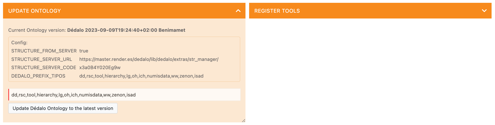
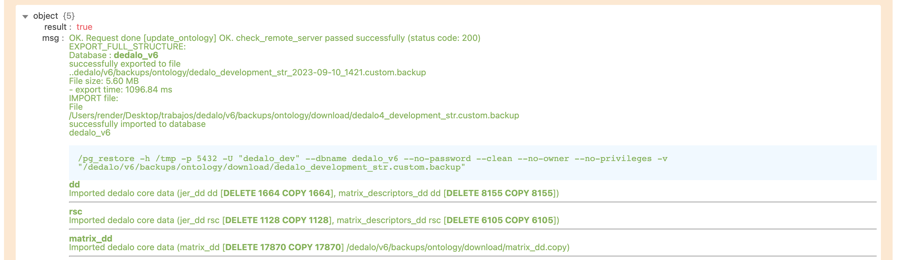

# Updating ontology

> See also: [Updating code](updating_code.md) · [Updating data](updating_data.md) · [Active ontology TLDs](../../config/config.md#defining-active-ontology-tlds)

The Dédalo ontology is the core of the application. It controls the data definition and how the data is interpreted. The ontology changes several times a day. Updating the ontology ensures that your Dédalo installation has the latest definition.

The ontology version is identified by the timestamp and the build location of the definition.

> Dédalo 2023-09-10T13:38:47+02:00 Benimamet

The ontology is built from different tlds. These tlds identify which part of the ontology is loaded and which parts will be updated.

## Shared and private ontologies

In your installation you could have public and/or private tlds. Public tlds are common and shared definitions and are updated by the main developer/user community.

Private tlds are not common or shared ontology parts and are not maintained by the main developer/user community, but can be maintained by a specific institution or developer and shared by itself, or be your own definition.

Some examples of common and shared tlds: `dd, rsc, oh, ich, tch, hierarchy, etc.`

Some examples of private tlds: `mupreva, qdp, muvaet, etc.`

The update process replaces the whole ontology definition with the latest version, tld by tld; the automatic process reads your configuration and updates only the shared tlds.

Private tlds must be updated manually.

Common and shared tlds are defined by `ACTIVE_ONTOLOGY_TLDS` (set in `../private/.env`). The installer writes it: the core ontologies, the domain ontologies chosen at install time and the ontologies they declare as dependencies (see [Domain ontologies](../../install/installer_reference.md#domain-ontologies)). See the [Configuration Administrator Guide](../../config/administration.md).

## What the panel tells you

Under the master-server list, a collapsed note, **Connect to a remote ontology server**, shows
the [`ONTOLOGY_SERVERS`](../../config/config.md#ontology-servers) entry that puts a master in the
list, field by field. When the picker is empty this is why, and the pill beside the title reads
*None configured*.

Whether THIS installation can serve its ontology to others is a separate maintenance panel,
**Serve Ontology** (see below). It reads the LIVE configuration, so it doubles as a check: each
`../private/.env` key is shown with its current state (`CONFIGURED` / `NOT SET`), never with its
value — the access code itself is never sent to the browser.

## Serving other installations (ontology master)

If your installation is the one **serving** the ontology (`IS_AN_ONTOLOGY_SERVER=true`), each client's update panel asks it for the update manifest **from the browser**, not from the client's server. The master must therefore accept the client's origin in [`DEDALO_CORS_ALLOWED_ORIGINS`](../../config/config.md#cross-origin-api-callers-cors) or the client's browser blocks the call and the panel fails with a network error.

The minimum configuration for an installation that serves its ontology is three keys:

```bash
IS_AN_ONTOLOGY_SERVER=true
ONTOLOGY_SERVER_CODE=xx-myspecialcode-xxx
DEDALO_CORS_ALLOWED_ORIGINS=["*"]
```

[`IS_AN_ONTOLOGY_SERVER`](../../config/config.md#is-an-ontology-master-server) opens the ontology JSON
endpoint (and adds a *Local files* source to this installation's own panel);
[`ONTOLOGY_SERVER_CODE`](../../config/config.md#defining-the-ontology-master-server-code) is the access code every
client must present — pick your own, and give it to the installations you authorize. The
endpoint clients register is `<your origin>/dedalo/core/api/v1/json/`, printed in the
**Serve Ontology** panel, which also shows the three keys as a live checklist.

Which value of `DEDALO_CORS_ALLOWED_ORIGINS` depends on who you serve:

* **A known set of installations** — list every client origin, as exact `scheme://host[:port]` strings (no partial wildcards, no trailing slash): `DEDALO_CORS_ALLOWED_ORIGINS=["https://archive.example.org","https://museum.example.org"]`.
* **A public master**, serving installations you do not know in advance — their origins cannot be enumerated, so set the single entry `*`: `DEDALO_CORS_ALLOWED_ORIGINS=["*"]`. This opens only the **anonymous** API, the same surface any `curl` on the internet already reaches; clients still present the `ONTOLOGY_SERVER_CODE` access code, and no cross-origin caller ever carries a session.

### Declaring what an ontology requires

A master also tells installers **which ontologies each ontology needs** — the
ones whose nodes it uses as models, or links to. An installer installs those too,
before the ontology itself. The installer reads this declaration and nothing
else; it never works out dependencies on its own.

The declaration is ordinary Dédalo data on the master:

1. Open **Ontology › Ontologies main** (`ontology35`) and edit the record of the
   ontology, for example the `tch` record.
2. In the *Relations* group (`hierarchy60`), fill **Required ontologies**
   (`ddengine11`) with every ontology it needs. Include the core ones it uses
   (every domain ontology takes its models from `dd`). An installer skips core
   ontologies, because every installation already has them.
3. Export the ontology files again (the **Export** action of the
   [ontology parser](../../tools/using_ontology_parser.md)). The export writes the
   list as `dependencies` on that ontology's entry in `ontology.json`, and the
   update manifest serves it unchanged.

An **empty** field means *not declared*, not *needs nothing*. The ontology is
exported with no `dependencies`, and an installer that is asked for it warns
that the server declares no dependencies, then installs it alone. A field that
names only core ontologies is a complete declaration: *needs nothing beyond the
core*.

*Required ontologies* is an engine-owned field, part of every installation. It
also appears on thesaurus records (*Thesaurus › Hierarchy*, which share the
same form), but only the Ontologies main records are exported.

**Importing keeps the declaration.** When an installation imports an ontology
whose master declares its requirements (with this panel or at install time), the
import fills *Required ontologies* on that ontology's record here, replacing what
the field held. A master that gets its ontologies from another master (a local
master for an institution's network, for example) therefore publishes the same
declarations with its next export. An ontology the source does not declare
leaves the field as it is. A required ontology that this installation has no
record for is left out of the field, and the import's message names it.

### On the client side

A client needs one key — the master it may pull from:

```bash
ONTOLOGY_SERVERS=[{"name":"Dédalo Ontology server","url":"https://myserverdomain.org/dedalo/core/api/v1/json/","code":"xx-myspecialcode-xxx"}]
```

`code` is the `ONTOLOGY_SERVER_CODE` configured on **that** server; a wrong or missing one makes
the master answer as *Unreachable* in the picker. Add one object per master.

A master is identified by its `url`, never by its `code`: several masters may share the same
access code (the official one and a local copy of it, for example), and the update downloads
only from the address of the master you picked. A file whose address is on any other host is
refused before it is written.

The client's own engine must also allow the connection: the browser's Content-Security-Policy has to name the master in `connect-src`, or the fetch is refused before it leaves. The engine derives this automatically from the master URLs in [`ONTOLOGY_SERVERS`](../../config/config.md#ontology-servers) — there is no second setting — but the policy is built at **boot**, so a client that has just added or changed a master must be **restarted** before the panel can reach it.

!!! warning "The panel can report a master as *ready* and still fail on submit"
    The reachability check beside the button is made server to server, so neither CORS nor the CSP applies to it. Two separate browser-side gates can still refuse the update, and they fail with different messages in the browser console:

    * `violates the following Content Security Policy directive: "connect-src …"` — the **client** does not list the master. Check `ONTOLOGY_SERVERS` on the client, and restart it.
    * a CORS or network error naming the master — the **master** does not accept the client's origin. Check `DEDALO_CORS_ALLOWED_ORIGINS` on the master.

    Both surface in the panel as the same unhelpful `Max retries reached, request failed`, so read the console for these two.

A refusal that comes **from the server** — a download refused, a file that fails validation, an
import rolled back — is shown in the panel under the button: the error, the server's explanation
(for example `origin mismatch: <file host> != <picked master>`) and a `request_id` that finds the
same request in the server log.

## Update process

To update the shared ontology enter into the Maintenance panel in the System administration -> Maintenance and locate the update ontology control:



The control panel will show the ontology configuration and the tlds to be updated; it's possible to change the tlds to be updated by editing the input field to add or remove one.

### Which tlds are updated

The prefilled list is `ACTIVE_ONTOLOGY_TLDS` unioned with the core pair `ontology` / `ontologytype` (always imported, whatever the configuration says). When the key is not set in `../private/.env`, it falls back to the core ontologies every installation carries — exactly what the install database ships:

```
dd, rsc, ontology, ontologytype, hierarchy, lg
```

Domain tlds (`oh`, `ich`, `tch`, `numisdata`, `utoponymy`, `nexus`, …) are per-installation: the installer writes the ones it installed into `ACTIVE_ONTOLOGY_TLDS`; add any you import later so they are offered here on every update — that is the only place to change the default for everybody. They are never part of the fallback above.

!!! note "Adding a domain ontology later does not add its dependencies"
    The installer installs the dependencies an ontology server declares; this panel imports exactly the tlds in the line. When you add a domain ontology here, check the master's catalog (*Fetch list*) for what it requires and add those tlds too.

The panel tells you which of the two you are looking at: when the key is set the reference list is headed **Configured in this installation**, and when it is not it reads **Engine fallback (not configured)** and the note says so. An empty value counts as unset.

The master server you pick is also remembered in your browser (by URL) and restored the next
time the panel renders — after a reload or after navigating away and back — so the update is one
click when you come back to it. If that server later disappears from `ONTOLOGY_SERVERS` or is
unreachable, nothing is restored and you simply pick again.

**The input line is yours.** What you type there is remembered in your browser and is *never* rewritten when you select a master server, so you can prepare the list first and pick the server after. Two reference lists sit above it, and neither touches the input unless you click:

* **Configured in this installation** — the prefilled list above. *Use this list* puts it back, which is how you undo an edit.
* **Offered by the selected master** — the master's own manifest, fetched on demand with *Fetch list* (it costs one request, so it is not fetched just by selecting). It has no *Use this list* button on purpose: a master publishes the **whole** ontology, 200+ tlds including every language pack, and importing all of it is never what you mean.

Clicking any tld chip adds it to the line, or removes it if it is already there. A chip is **highlighted while its tld is in the line**, in both lists — including when you type in the field by hand — so the reference lists double as a readout of what the update will import.

When ready, press the "Update Dédalo Ontology to the latest version" button, and the process will execute.

Dédalo will erase all definitions of the specified tlds and import the new definition.



The import pipeline (`update_ontology` widget, `src/core/ontology/ontology_update.ts`) stages and validates every downloaded file before making any destructive change, takes a per-table recovery snapshot before importing each tld, and auto-restores that snapshot if the import fails partway through — an import either fully succeeds or fully rolls back, tld by tld. A schema-changes snapshot of the update is written under `../private/backups/ontology/changes/`.

### Doing the update process manually

The ontology is saved tld by tld; you can update it by copying the files located [here](https://github.com/renderpci/dedalo/tree/master/install/import/ontology).
