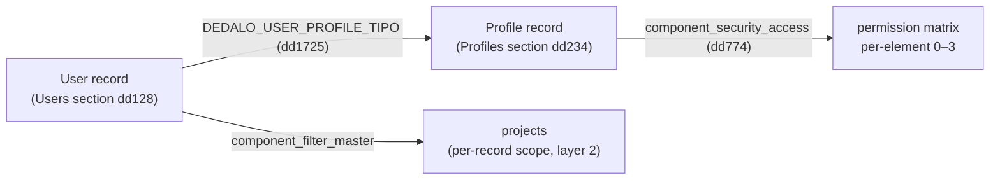

# Users, profiles and permissions

## Introduction

Access control in Dédalo answers two separate questions for every request:
*"who are you?"* (**authentication**) and *"what may you do?"*
(**authorization**). The two are handled by two different classes and this guide
ties them together into the everyday administration workflow: how to create a
user, how a profile turns into a per-element permission map, and how those
permissions are computed and enforced on every read and save.

This is a **workflow** page. The exact mechanics live in the reference docs and
are not repeated here at length — read them alongside this guide:

- [security](../core/system/security.md) — the authorization core (resolves and enforces the 0–3 levels).
- [login](../core/system/login.md) — authentication: credentials, session, the users section.
- [component_security_access](../core/components/component_security_access.md) — the stored per-profile permission matrix.
- [API gate](../core/system/api.md) — where the login check, CSRF and permission gates run at the request boundary.

!!! note "On the TS/Bun server"
    The mechanics below are ported to TS in `src/core/security/permissions.ts`
    (the matrix + `getPermissions`), `src/core/security/auth.ts` (login,
    Argon2id via `Bun.password`) and `src/core/security/session_store.ts`
    (session issuance/rotation). The concepts — no bespoke tables, the four
    levels, the two-tier resolution — carry over unchanged; only the
    mechanism is native TS. See `rewrite/STATUS.md` ("permissions matrix") for
    the current coverage.

!!! note "The Dédalo way: no bespoke tables"
    There is no `users` table and no `permissions` table. Users are ordinary
    records in the **Users** section, profiles are ordinary records in the
    **Profiles** section, and a profile's permission map is an ordinary
    component datum. Everything is versioned in Time Machine, importable and
    propagable like any other data.

## The four permission levels

A permission is a single integer; a higher level always includes the lower ones.

| value | level | meaning |
| --- | --- | --- |
| `0` | no access | the element is not returned and may not be read |
| `1` | read only | read, but every write is refused |
| `2` | read / write | read and save |
| `3` | admin | full control (structure edits, debug) |

The absence of a stored row means level `0`. Rows whose value is `0` are **never
persisted** — the editor builds a full tree for the UI but strips every
`value <= 0` on save, so "no access" is simply the absence of a grant.

See [Components — Permissions](../core/components/index.md#permissions) for the
levels from a component's point of view.

## Where users and profiles live

| concept | section | tipo | notes |
| --- | --- | --- | --- |
| User | **Users** | `dd128` (`DEDALO_SECTION_USERS_TIPO`) | login name, password, active flag, profile, projects |
| Profile | **Profiles** | `dd234` (`DEDALO_SECTION_PROFILES_TIPO`) | carries the `component_security_access` matrix (`dd774`) |

A user record links to a profile through its `DEDALO_USER_PROFILE_TIPO`
(`dd1725`) component, and to one or more projects through its
`component_filter_master` (`dd170`). The profile, in turn, owns the **permissions
matrix** (`component_security_access`, tipo `dd774`). When the user logs in, that
matrix is flattened into the fast lookup table that gates the rest of the
session — on the TS server this is `getPermissionsTable()` in
`src/core/security/permissions.ts`, cached per `user_id` in a module `Map`
(see the cache warning below).



The super-user **root** (`section_id = -1`) is outside this model: it is always a
global admin, bypasses the profile/projects checks, and cannot be managed from
the web interface (see [root user](index.md#root-user) and
[changing the root password](changing_root_password.md)).

### Two roles above the profile

Two flags promote a user beyond their profile's grants. They are stored on the
user record and read back from the session for the current user:

- **Global admin** (`DEDALO_SECURITY_ADMINISTRATOR_TIPO`, `dd244`) — resolves the
  level to `3` everywhere and bypasses the per-record project scope. This is the
  "general admin" account described in the
  [management index](index.md#general-admin). On the TS server this is the
  `isGlobalAdmin` flag on the request's `Principal`, resolved by
  `resolvePrincipal()` in `src/core/security/permissions.ts` (PHP
  `security::is_global_admin()`).
- **Developer** (`DEDALO_USER_DEVELOPER_TIPO`, `dd515`) — grants access to
  development/structure surfaces; the `isDeveloper` flag on the same
  `Principal` (PHP `security::is_developer()`).

Both, plus a profile that grants the maintenance area, are required to use the
[Maintenance panel](index.md#maintenance-panel).

## Workflow: create a profile

1. Go to the **Profiles** section (under System administration).
2. Create a new record and name it (e.g. *Cataloguer*, *Read-only reviewer*).
3. Open the **Permissions** component (`component_security_access`). It renders
   the whole ontology as an expandable tree — areas → sections → elements — with
   four radio buttons per node for the levels 0–3.
4. Set the level on each node you want to grant. Areas and sections **derive**
   their level from their children (a parent shows a level only when all its
   children share it), so you normally set leaf elements (components, buttons)
   and let the parents follow. Selecting a value propagates up the parent chain.
5. Save. Only non-zero rows are written; absent rows mean no access.

See [component_security_access](../core/components/component_security_access.md)
for the tree shape, the structural exclusions (the Admin area and its children
are never shown for permissioning), and the per-profile data format.

!!! warning "TS gap: the permission-tree editor"
    The TS server has a `component_security_access` descriptor
    (`src/core/components/component_security_access/descriptor.ts`) and serves
    the dd774 datum for read/authorization purposes (`getPermissionsTable()` in
    `permissions.ts`, plus the datalist resolver in
    `src/core/resolve/security_access_datalist.ts`). The specialized editor
    that builds/derives the whole ontology tree with the four radio buttons —
    steps 3–4 above — is **not yet ported**; profiles must currently be edited
    on a PHP install sharing the same database (see `rewrite/STATUS.md`,
    "permission-tree EDITOR is not ported to TS"). Once a level is stored, the
    TS server enforces it identically regardless of which engine wrote it.

## Workflow: create a user

1. Go to the **Users** section.
2. Create a new record and fill the login name (`dd132`) and password (`dd133` —
   hashed with Argon2id on save by `component_password`; min length 8).
3. Set **Active account** (`dd131`) to *Yes* — an inactive account is refused at
   login.
4. Assign a **profile** (`DEDALO_USER_PROFILE_TIPO`). A user with no profile is
   refused at login (*User without profile*).
5. Assign at least one **project** (`component_filter_master`). A user with no
   project is refused at login (*User without projects*) and, at runtime, sees
   only the records inside their projects (layer-2 scope, below).
6. Optionally promote to global admin and/or developer (above).

!!! warning "TS gap: password hashing on save is not ported"
    Step 2's "hashed with Argon2id on save" is the PHP `component_password`
    behavior. The TS `component_password` descriptor
    (`src/core/components/component_password/descriptor.ts`) is currently a
    plain string column with no save-time hashing hook — the TS server can
    only **verify** an existing `$argon2id$…` hash at login
    (`src/core/security/auth.ts`), it cannot **create** one through the
    ordinary Users-section save path yet. Until this is ported, create/reset
    user passwords from a PHP install sharing the same database (same
    `matrix_users` row, same `dd133` component), or set the hash directly in
    SQL the way [changing the root password](changing_root_password.md)
    describes for root.

!!! note "Who can create whom"
    Per the [management index](index.md), root creates the first general admin;
    general admins can then create other admins, developers and ordinary users
    and assign their profiles/projects — but an account cannot edit its own
    admin/developer configuration.

## How permissions are computed and enforced

All authorization is resolved and enforced **server-side**, never trusting the
client. There are two independent tiers:

1. **Type / schema permission (layer 1).** *"What may this profile do with this
   section or component type?"* — resolved from the flattened permission table.
   In PHP: `security::get_security_permissions()`, reached through the
   recommended entry point `common::get_permissions($parent_tipo, $tipo)`
   (which adds the not-logged `0` clamp and Time-Machine clamps). `0` when not
   logged. In TS: a single function reproduces the whole decision order —
   `getPermissions(principal, parentTipo, tipo)` in
   `src/core/security/permissions.ts` — including the Time-Machine admin-only
   clamp, the superuser/tools-register/temp-preset shortcuts, the maintenance
   area block, and the public list/dd/notes read fallback.
2. **Per-record / project scope (layer 2).** *"Is this specific record inside the
   user's project scope?"* — in PHP, `security::user_can_access_record()`
   intersects the record's `component_filter` with the user's projects,
   mirroring the `filter_by_projects` WHERE clause that `search` applies to
   every list/search. In TS, `getUserProjects(userId)` (same file) resolves the
   user's `dd170` project locators, and `src/core/search/sql_assembler.ts`
   folds them into the generated WHERE clause the same way.

The level is resolved in one place but **checked at several chokepoints**. TS
does not centralize these behind named `assert_*` helpers the way PHP does;
each dispatch entry point calls `getPermissions`/`getUserProjects` inline at
its own gate — same shape, different call sites:

- **Read** — `src/core/api/dispatch.ts` resolves a read permission (level ≥ 1)
  per action before serving it (PHP `dd_core_api` resolves it per response
  row).
- **Create / save** — the save paths in `dispatch.ts` and
  `src/core/relations/save.ts` refuse when `getPermissions(...) < 2` (PHP:
  `common::get_permissions(section_tipo, section_tipo) < 2` plus
  `component_common::save()`'s own write-level refusal).
- **API gates** — tool actions gate inline in `src/core/tools/security.ts`
  (project-scope check, PHP `assert_record_in_user_scope`) and
  `dispatch.ts` (section-permission check, PHP `assert_section_permission`). A
  failed gate returns the same uniform `{result:false, errors:[...]}` shape PHP's
  `permission_exception` produces via `dd_manager` — there is no separate
  exception type on the TS side, just an early `return`.

The full enforcement diagram and method list are in
[security](../core/system/security.md#how-permissions-are-enforced).

!!! warning "Invalidate the cache after editing permissions"
    The permission table is cached three deep in PHP (per-process static →
    per-user disk file → the component itself). On the TS server it is a
    single per-`user_id` module `Map` (`permissionsTableCache` in
    `permissions.ts`) — simpler, but still a cache: after editing a profile's
    permissions, the next request must see the new matrix. Call
    `clearPermissionsCache(userId)` (or with no argument, to clear every user)
    after a profile's dd774 data or a user's profile assignment changes; the
    companion `clearUserProjectsCache()` does the same for layer-2 project
    grants. Because the TS process is request-scoped via `AsyncLocalStorage`
    (see `rewrite/REWRITE_SPEC.md`), there is no cross-request identity bleed to
    worry about — but these two caches are long-lived across requests by
    design and still need explicit invalidation, exactly like PHP's per-user
    disk cache.

### The no-login allowlist

Authentication is enforced at the [API gate](../core/system/api.md) for every
action **except** a small allowlist of bootstrap actions that must run before a
session exists. In PHP, `dd_manager` (`$no_login_needed_actions`) lists:

`start`, `change_lang`, `login`, `get_login_context`, `install`,
`get_install_context`, `get_environment`, `get_ontology_update_info`,
`get_code_update_info`, `get_server_ready_status`.

On the TS server the equivalent list is `NO_LOGIN_ACTIONS` in
`src/core/api/dispatch.ts`, deliberately **trimmed to what is implemented**:

`login`, `get_environment`, `start`, `get_login_context`.

Two differences from PHP, both intentional: `install`/`get_install_context` and
the `*_update_info` actions are absent because the [installer and code/ontology
update flows are not ported](updates/index.md) — there is nothing to bootstrap
without a session. And `change_lang` is **not** in the TS allowlist (unlike
PHP), so on the TS server it requires a logged-in session; see
[Request-scoped langs](../core/system/login.md) for why. Everything else
requires a valid session, checked the same way conceptually (PHP
`login::is_logged() === true`, TS `context.session !== null`); both compare the
action name as a strict string so a non-string/hostile `action` cannot slip
through type coercion (PHP's loose juggling; TS has no such coercion to begin
with, since actions are looked up by exact string key in a `Record`).

!!! danger "Server-only read grant"
    `security::$read_only_scope` is a server-only flag that grants a fixed read
    (`1`) to *target* sections (for label/autocomplete resolution), excluding the
    Users and Profiles sections. It MUST be set only by trusted server code and
    reset in a `finally` block — never derived from client input. See
    [security › read_only_scope](../core/system/security.md#read_only_scope--the-server-only-read-grant)
    for the PHP mechanics; this specific server-only escape hatch has not been
    ported to `permissions.ts` yet — treat it as an open item if a TS resolver
    needs to read a target section purely for label/autocomplete purposes
    outside the caller's own grant.

## Worked example: a read-only profile for one section

Goal: a profile that can **read** the *Archaeological objects* section (say
`rsc197`) and its fields, but cannot edit anything, and has no access to the rest.

1. **Create the profile.** Profiles section → new record → name it
   *Objects reader*.
2. **Open Permissions** (`component_security_access`) and expand the tree to the
   *Archaeological objects* section.
3. **Set the section to level `1` (read only).** Set the section node — and its
   description fields — to `1`. Because parents derive from children, set the
   leaf components to `1` and the section node follows. Leave everything outside
   that section untouched (absent = `0` = no access).
4. *(Optional)* grant `1` on linked **Thesaurus** sections so the reader can see
   the controlled terms referenced by the records, but not edit the vocabulary.
5. **Do not grant the `button_new`** of the section — without write (`2`) on the
   section the create gate refuses new records anyway (PHP
   `security::get_section_new_permissions()`; on the TS server the create/save
   path in `src/core/api/dispatch.ts` refuses below level `2` the same way, and
   the thesaurus tree's own button-level check is
   `getPermissionsElement(sectionTipo, 'button_new', principal)` in
   `src/core/ts_object/ts_object.ts`).
6. **Save.** Only the non-zero rows persist, e.g.:

    ```json
    [
        {"id": 1, "tipo": "rsc197", "section_tipo": "rsc197", "value": 1},
        {"id": 2, "tipo": "rsc85",  "section_tipo": "rsc197", "value": 1}
    ]
    ```

7. **Assign the profile** to a user (Users section → user → profile = *Objects
   reader*), with a project so layer-2 scope is satisfied.
8. **Verify.** Log in as that user: the *Archaeological objects* records appear
   read-only, save buttons are refused (`< 2`), and other sections do not appear
   at all (`0`). The user only sees records inside their assigned projects.

!!! note "Programmatic grant (dev)"
    In PHP, to grant a profile read+write over a list of sections *and all
    their children* in code — e.g. when generating hierarchies — use
    `component_security_access::set_section_permissions()` (default level `2`,
    accepts `0`), which merges into the existing matrix and resets the
    permissions table.

    **TS gap:** this programmatic grant has **no TS write path**. The TS
    hierarchy provisioner (`generateVirtualSection()` in
    `src/core/resolve/hierarchy_provision.ts`) logs a non-fatal warning instead
    of granting permissions on the new `<tld>1`/`<tld>2` sections — a freshly
    provisioned hierarchy on the TS server needs its permissions granted
    manually (or via a PHP install sharing the database) until this is ported.
    See [install new hierarchies](install_new_hierarchies.md) for the
    surrounding workflow.

## Related

- [security](../core/system/security.md) — authorization core, the 0–3 levels, the enforcement gates and caching.
- [login](../core/system/login.md) — authentication, the session `auth` block, the users section as credential store.
- [component_security_access](../core/components/component_security_access.md) — the stored per-profile permission matrix and its editor.
- [API gate](../core/system/api.md) — the request-boundary gates (login, CSRF, permission).
- [Management index](index.md) — root vs general admin, the maintenance panel, the access policy in prose.
- [Installing new hierarchies](install_new_hierarchies.md) — setting permissions on freshly created sections.
