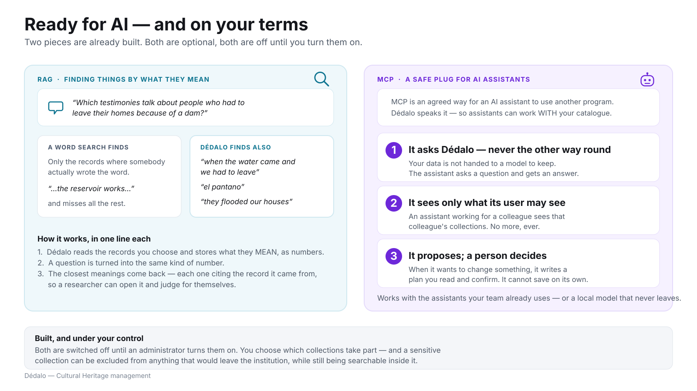

# Ready for AI — on your terms

> Part of [Dédalo in plain language](index.md) · Previous:
> [Three doors into the same collection](the_three_doors.md) · Next:
> [The ideas behind Dédalo](the_ideas_behind_dedalo.md)

Two pieces are already built into Dédalo. Both are **optional**, and both are
**switched off** until an administrator turns them on.

*Click the diagram to open it full size.*

## Semantic search: finding things by what they mean

A researcher asks: *which testimonies talk about people who had to leave their
homes because of a dam?*

A word search finds only the records where somebody actually wrote the word —
*"…the reservoir works…"* — and misses everything else. Dédalo can also find
*"when the water came and we had to leave"*, *"el pantano"*, *"they flooded our
houses"*, because those phrases **mean** almost the same thing.

How it works, in one line each:

1. Dédalo reads the records you choose and stores what they *mean*, as numbers.
2. A question is turned into the same kind of number.
3. The closest meanings come back — each one **citing the record it came
   from**, so a researcher can open it and judge for themselves.

This matters for cultural heritage more than for most data, because heritage
data is multilingual, historical, dialectal and paraphrastic: the same idea
arrives in Spanish, Català, English, in archaic spelling, in the vocabulary of
one decade or one trade. A string search asks *where does this word appear?*
Semantic search asks *what is about this idea?*

!!! note "It does not replace your structured search"
    Dédalo's precise, field-by-field search stays exactly as it is, and remains
    the right tool for *"every coin minted before 100 BC"*. Semantic search is
    an additional way in, not a substitute — and the two are used together.

## MCP: a safe plug for AI assistants

MCP is an agreed way for an AI assistant to use another program. Dédalo speaks
it, so assistants can work **with** your catalogue instead of being handed a
copy of it. Three promises hold:

**1 · It asks Dédalo — never the other way round.** Your data is not handed
over to a model to keep. The assistant asks a question and gets an answer.

**2 · It sees only what its user may see.** An assistant working for a
colleague sees that colleague's collections, at that colleague's permission
level. No more, ever — the same checks as the staff door.

**3 · It proposes; a person decides.** When it wants to change something it
writes a plan you read, op by op, and confirm. It cannot save on its own; the
part of the system that talks to the model is structurally unable to write.

## Keeping sensitive material in the building

!!! warning "Decide this before you switch anything on"
    Some collections may not leave the institution — testimony given under
    condition, personal data of living people, sacred or restricted material.

Dédalo lets you name those collections, and:

- they can be **excluded from anything that would reach an external model**,
  while remaining fully searchable inside the institution;
- an assistant can be pointed at a **local model** running on your own
  hardware, so no record leaves the building at all;
- both features share one classification, so a collection you restrict for
  search is restricted for the assistant too.

## Where to read more

- **[RAG and semantic search](../core/ai/rag.md)** — written for two readers:
  humanities researchers (parts I–IV, no programming) and developers.
- **[Talk to your catalogue](../core/ai/assistant/use_cases.md)** — worked
  examples of the assistant in day-to-day curatorial work.
- **[Privacy and the egress gate](../core/ai/assistant/privacy_and_security.md)**
  — what may reach an external provider, and how it is enforced.
- **[Installing and enabling the assistant](../core/ai/assistant/install.md)**.
