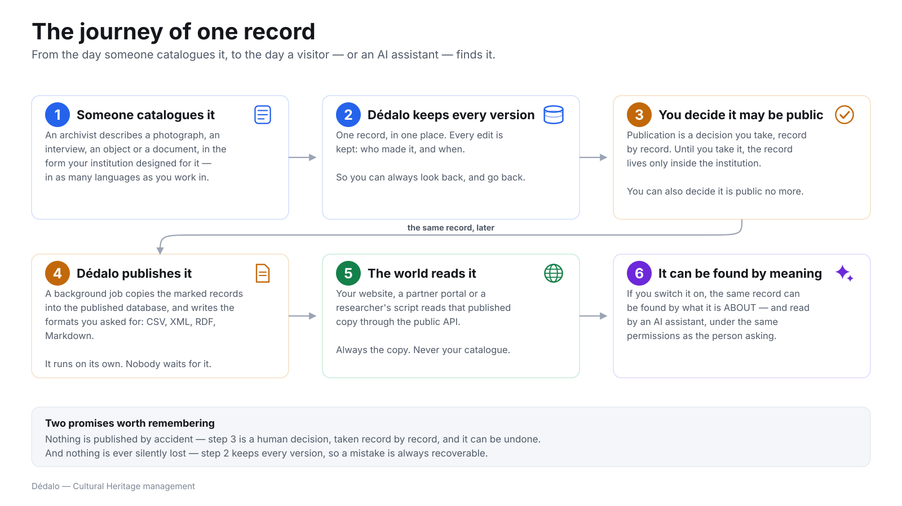

# The journey of one record

> Part of [Dédalo in plain language](index.md) · Previous:
> [Where everything lives](where_it_lives.md) · Next:
> [Three doors into the same collection](the_three_doors.md)

One photograph, one interview, one coin, one folder of correspondence. This is
what happens to it, from the day somebody catalogues it to the day a visitor —
or an AI assistant — finds it.

*Click the diagram to open it full size.*

## The six steps

**1 · Someone catalogues it.** An archivist describes the item in the form your
institution designed — not a form the software imposed. Fields, their order,
their vocabularies and their languages are yours; see
[The ideas behind Dédalo](the_ideas_behind_dedalo.md#the-shape-of-your-catalogue-is-data).

**2 · Dédalo keeps it, and keeps every change.** One record, in one place.
Every edit is stored with its author and its date, so you can read the history
of a record and restore an earlier state. The
[time machine tool](../tools/using_time_machine.md) is where you do that.

**3 · You decide it may be public.** Publication is a *decision*, taken record
by record. Until it is taken, the record exists only inside the institution.
Un-marking a record is equally a decision: the next run removes it from the
published copy.

**4 · Dédalo publishes it.** A background job copies the marked records into
the published database and writes the file formats you asked for. It runs on
its own; nobody has to sit and wait for it, and a run that is interrupted
resumes where it stopped rather than starting over.

**5 · The world reads it.** Your website, a partner portal or a researcher's
script reads that published copy through the public service — always the copy,
never your catalogue.

**6 · And it can be found by meaning.** If you switch it on, the same record
becomes reachable by *what it is about*, and readable by an AI assistant under
the same permissions as the person asking. See
[Ready for AI](ai_ready.md).

## The two promises

!!! note "Nothing is published by accident"
    Step 3 is a human decision, taken per record, and it is reversible. There
    is no setting that makes a whole collection public because somebody
    imported it.

!!! note "Nothing is silently lost"
    Step 2 keeps every version. A wrong edit, a bad bulk change or an
    accidental deletion is recoverable, and the record shows who did what and
    when.

## What this changes for a project

- **Cataloguing and publishing are not the same act**, and they do not have to
  happen at the same speed. A collection can be catalogued for years and
  published in one afternoon.
- **Partial publication is normal.** A record can be public while some of its
  fields are not — donor names, sensitive locations, personal data of living
  people, restricted testimony.
- **Reprocessing is cheap.** Because the published copy is generated, changing
  the shape of the output — a new format for an aggregator, a new field, a
  different vocabulary — means publishing again, not re-entering data.

## Where to read more

- **[Diffusion data flow](../diffusion/diffusion_data_flow.md)** — deciding
  what is published, and how it is transformed on the way out.
- **[Importing data](../core/importing_data.md)** and
  **[Exporting data](../core/exporting_data.md)** — getting material in and out.
- **[Tools user guide](../tools/index.md)** — the day-to-day toolbox behind
  steps 1 to 4.
