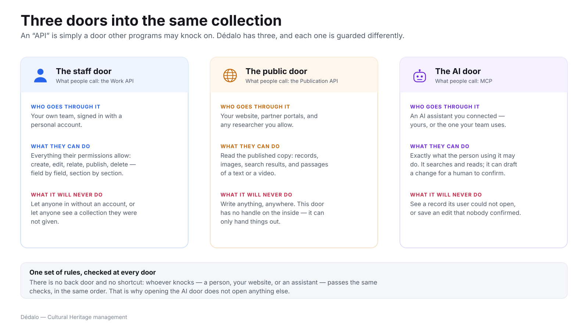

# Three doors into the same collection

> Part of [Dédalo in plain language](index.md) · Previous:
> [The journey of one record](journey_of_a_record.md) · Next:
> [Ready for AI — on your terms](ai_ready.md)

You will hear the word **API** in every technical conversation about Dédalo. An
API is simply **a door other programs may knock on**. Dédalo has three, and
each one is guarded differently.

*Click the diagram to open it full size.*

## The staff door

Your own team, signed in with a personal account. Through it they do everything
their permissions allow: create, edit, relate, publish, delete — and those
permissions are set **field by field and section by section**, not merely
"editor" or "reader".

It will never let anyone in without an account, and never show anyone a
collection they were not given. Technical name: the **work API**.

## The public door

Your website, partner portals and any researcher you allow. Through it they
read the published copy: records, images, search results, and passages of a
long text or a recording — with the page reference or the timecode where the
passage sits.

It will never write anything, anywhere. This door has no handle on the inside;
it can only hand things out. Technical name: the **publication API**.

## The AI door

An AI assistant you connected — one your team already uses, or one running on
your own hardware. Through it the assistant does **exactly what the person
using it may do**: it searches and reads, and when it wants to change
something it writes a plan for a human to confirm.

It will never see a record its user could not open, and never save an edit that
nobody confirmed. Technical name: **MCP**.

## Why three doors and not one

!!! info "One set of rules, checked at every door"
    Whoever knocks — a person, your website or an assistant — passes the same
    checks, in the same order, against the same permissions. There is no back
    door and no shortcut. That is why opening the AI door does not open
    anything else: it is the same lock, asked the same question.

The doors differ in **who** may knock and **what the answer may contain**, not
in how carefully the question is checked. A door that could skip the checks
would be a second implementation of your institution's rules — and the second
implementation is always the one that turns out to be wrong.

## What a director usually wants to know

**Can we let a partner harvest our data automatically?** Yes — that is exactly
what the public door is for, and it speaks the conventions aggregators expect.

**Can we give someone access to part of the collection only?** Yes, through the
staff door, with permissions per section and per field.

**If we connect an AI assistant, does our whole archive become visible to it?**
No. It sees what its user sees, and you can additionally exclude entire
collections from anything that would leave the institution.

## Where to read more

- **[The work API](../api/index.md)** — the staff door, in technical terms.
- **[Publication API v2](../diffusion/publication_api/v2/index.md)** — the
  public door: endpoints, search, formats.
- **[The AI Assistant](../core/ai/assistant/index.md)** — the AI door, and how
  to install and secure it.
- **[Users, profiles and permissions](../management/users_and_permissions.md)**
  — how access is defined and computed.
