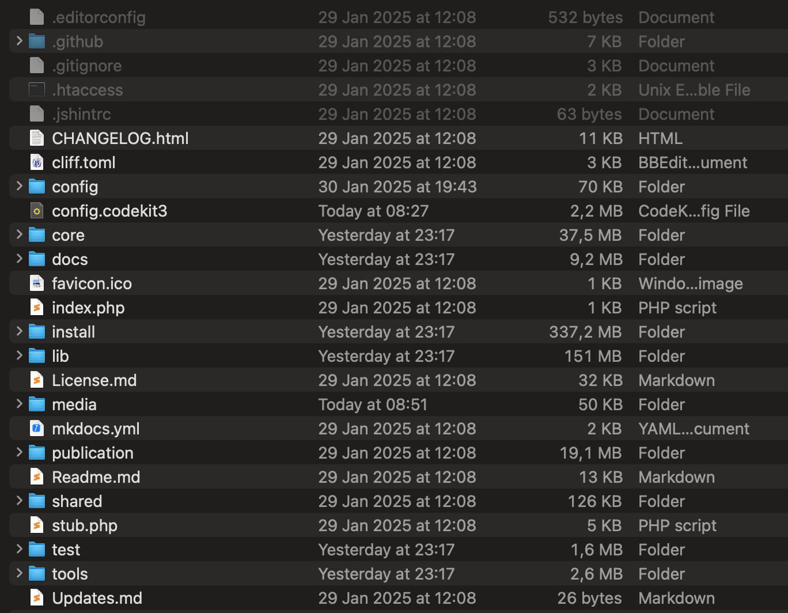
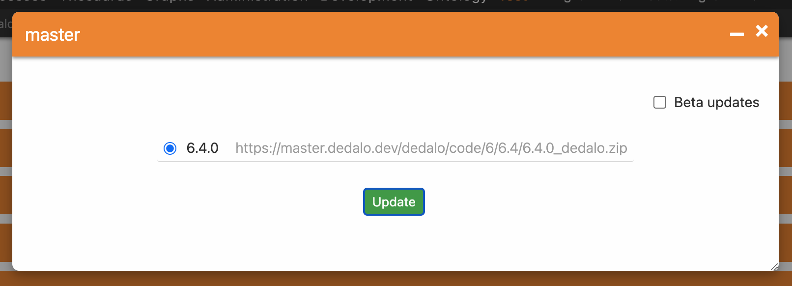
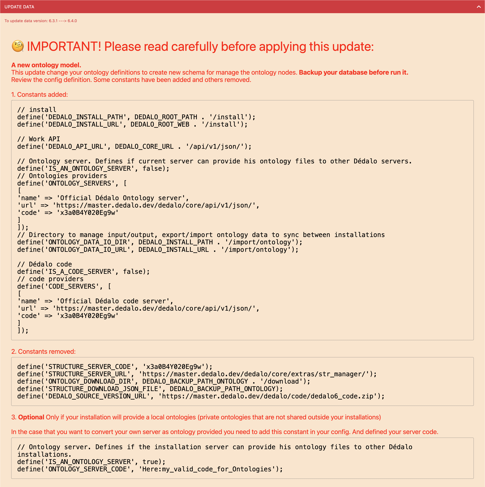
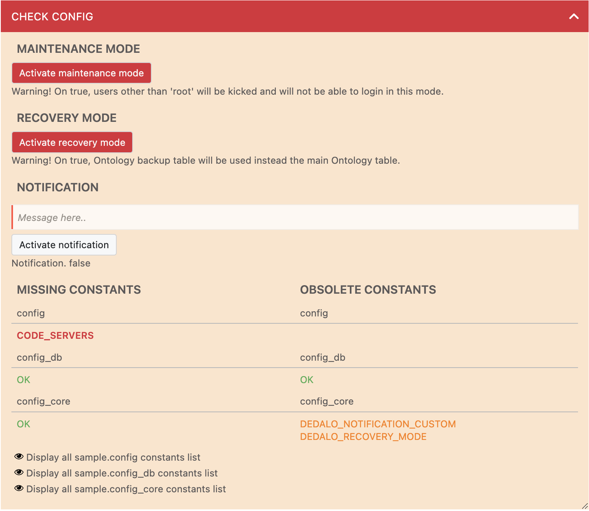

# Update

Dédalo could be updated manually, or using the integrated update code widget.
[manual](#updating-manually)
[automatic](#automatic-update)
[issues](#issues)

## Updating manually
##### 1. Make a copy of your current installation (excluding media, if you don't have too much space)
##### 2. Download the desired release:

From Dédalo master server:
>[Version 6.3.0](https://master.dedalo.dev/dedalo/code/6/6.3/6.3.0_dedalo.zip)
>[Version 6.3.1](https://master.dedalo.dev/dedalo/code/6/6.3/6.3.1_dedalo.zip)
>[Version 6.4.0](https://master.dedalo.dev/dedalo/code/6/6.4/6.4.0_dedalo.zip)

or from GitHub server:

>[GitHub releases list](https://github.com/renderpci/dedalo/releases)

and copy the release files (except 'config' directory)

## Automatic update
##### 1. Enter area_maintenance and go to the `Update code` panel:

>[Administration -> Area maintenance](https://mydomain.org/dedalo/core/page/?tipo=dd88)

##### 2. Select your code server (usually https://master.dedalo.dev) and Update Dédalo to the version you want.

!!! warning "After updating the code, always log out and log in to Dédalo to safely refresh the browser's cache files."

# Issues
After a code update, you may sometimes receive a login error like this:

Don't panic and press `continue` button. Navigate to the area maintenance and check the messages in the `Update data` or `Check config` panels about the errors.

